# Full Detailled Report

## 1\. Context and Objectives

ShopizerApp represents an e-commerce platform operated by "Customer Name", serving as the backbone for multi-store retail operations across diverse market segments. This comprehensive audit was conducted in June 2025 by the CAST analysis team, with the primary objective of assessing the application's structural quality, security posture, and readiness for modernization initiatives. The project stakeholders include Joe M. as Project Manager and Alina V. as Expert Analyst, both of whom have been instrumental in defining the scope and priorities for this assessment.

The audit approach employed CAST Imaging technology to perform deep structural analysis of the application codebase, examining 178,854 lines of code distributed across 15,252 distinct software elements with 97,228 recorded interactions between them. This level of granularity enables identification of architectural patterns, quality violations, security vulnerabilities, and technical debt that would otherwise remain hidden in traditional code reviews. The CAST methodology provides objective, repeatable measurements that can be tracked over time to validate remediation progress.

The stakes surrounding ShopizerApp are significant. As an e-commerce platform handling customer transactions, payment processing, and sensitive personal data, any degradation in reliability, security, or performance directly impacts business revenue and customer trust. Known challenges prior to this audit included concerns about legacy code maintainability, third-party component vulnerabilities, and the application's ability to scale in cloud environments. This audit addresses these concerns systematically, providing actionable insights organized across seven key dimensions: development practices, architecture, open-source exposure, cloud readiness, transaction risk, Green IT compliance, and security standards adherence.

The measurement process involved configuring CAST Imaging to analyze the complete application portfolio, including Java backend services, Spring framework components, Hibernate persistence layer, JSP presentation tier, JavaScript frontend assets, and integrations with external services such as AWS S3, GCP Storage, Elasticsearch, and multiple payment gateways. Notable observations during measurement included the discovery of extensive coupling between business logic and presentation layers, significant reliance on deprecated jQuery APIs, and a substantial number of unreferenced code artifacts suggesting accumulated technical debt from previous development cycles.

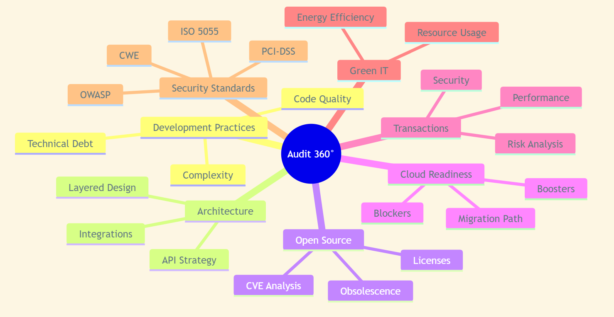

## 2\. Audit Results - System Identity Card

ShopizerApp operates within the “Customer name“ environment, with the most recent analysis delivery dated July 1, 2025. The application encompasses a substantial codebase of 178,854 lines of code, organized into 15,252 software elements that interact through 97,228 documented relationships. This density of interactions indicates a tightly coupled architecture that, while functional, presents challenges for maintenance and evolution.

The technology stack reflects a mature Java enterprise application built on proven frameworks. The backend relies on Java as the primary programming language, with Spring providing the foundational framework for dependency injection, web MVC patterns, and security controls. Data persistence is handled through Hibernate and JPA, enabling object-relational mapping to the underlying database. The presentation layer combines server-side rendering through Java Server Pages with Apache Tiles for template composition, augmented by JavaScript and jQuery for client-side interactivity. Search functionality leverages Elasticsearch for high-performance full-text queries, while cloud storage integrations utilize both AWS S3 and GCP Storage APIs.

The functional scope of ShopizerApp covers the complete e-commerce lifecycle. Product catalog management enables merchants to define, categorize, and present their offerings. Pricing and inventory systems track stock levels and support dynamic pricing strategies. Promotional capabilities allow configuration of discounts, coupons, and special offers. The checkout process guides customers through cart review, shipping selection, and payment completion, with integrations to Stripe, PayPal, and Braintree payment gateways. Order management tracks fulfillment from placement through delivery, while customer services handle account management, preferences, and support interactions. An administrative console provides merchants and operators with tools for configuration, reporting, and system management. Finally, REST APIs expose core functionality for headless commerce scenarios and third-party integrations.

The current deployment context positions ShopizerApp as an on-premises or VM-based monolithic application. While cloud storage connectors are present for AWS S3 and GCP Storage, the core application architecture relies on stateful sessions and local file system operations that complicate migration to containerized or serverless environments. This hybrid state represents both an opportunity and a challenge: the existing cloud integrations demonstrate capability for modernization, but the legacy patterns require systematic refactoring before full cloud-native deployment becomes feasible.

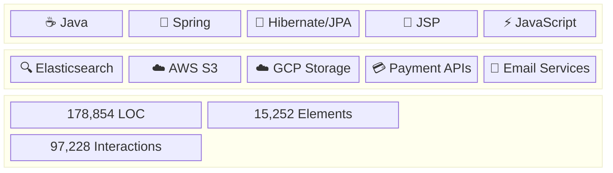

## 3\. Audit Results - Development Practices

The analysis of development practices reveals an application with high functional coverage but substantial accumulated technical debt. CAST Imaging identified 3,008 maintainability violations, 424 reliability violations, 337 performance efficiency violations, and 268 security violations according to ISO 5055 standards. These metrics indicate that while the application successfully delivers its business functionality, the underlying code quality requires significant attention to ensure long-term sustainability.

Maintainability concerns dominate the violation landscape. The analysis identified 727 artifacts with high fan-in, meaning these components are referenced by an unusually large number of other elements. Such high fan-in creates fragility: any change to these central components risks cascading impacts across the codebase. Conversely, 1,432 artifacts exhibit high fan-out, referencing many other components and thereby creating complex dependency chains that complicate understanding and modification. Additionally, 136 classes exceed recommended size thresholds, indicating opportunities for decomposition into smaller, more focused units. The presence of 272 unreferenced elements, comprising 242 methods and 30 JavaScript functions, suggests dead code that should be removed to reduce cognitive load and maintenance burden.

Complexity hotspots further compound maintainability challenges. The analysis identified 39 artifacts with cyclomatic complexity exceeding acceptable thresholds. High cyclomatic complexity correlates with increased defect rates and testing difficulty, as each additional decision path multiplies the number of scenarios requiring validation. These complex artifacts should be prioritized for refactoring to reduce branch density and improve testability.

Operational risks manifest primarily in reliability and efficiency dimensions. Reliability degradation stems from 223 JSP pages lacking proper error handling mechanisms, leaving users vulnerable to uninformative error states when exceptions occur. Additionally, 61 empty catch blocks suppress exceptions without appropriate logging or recovery actions, masking potential failures and complicating debugging efforts. The structural flaws analysis identified 3 methods with empty catch blocks that have high fan-in, meaning these error-handling gaps affect widely-used components.

Efficiency concerns center on algorithmic patterns that waste computational resources. The analysis found 79 jQuery selectors used without caching, causing repeated DOM traversals that degrade page performance. String concatenation within loops appears in 51 locations, creating unnecessary object allocations that stress garbage collection. Most significantly, 438 object instantiations occur within loop bodies, generating substantial memory pressure and CPU overhead. These patterns not only impact user experience through slower response times but also increase infrastructure costs and energy consumption.

Security weaknesses in development practices include reliance on deprecated jQuery APIs that lack modern security protections, inadequate input sanitization across form handlers and API endpoints, and inconsistent application of security controls. The structural flaws analysis identified 134 instances of cross-site scripting vulnerabilities through API requests, 7 instances of reflected XSS, and 11 cases of Ajax calls without proper dataType specification in jQuery versions older than 3.0.0.

Critical non-conformities requiring immediate attention include: first, cross-site scripting exposure across both UI and API layers, representing the most prevalent security vulnerability class; second, 79 CVE vulnerabilities in third-party components, including 3 critical and 12 high severity issues; third, the absence of centralized error handling, leaving exception management fragmented and inconsistent; and fourth, inefficient algorithmic patterns that impact both Green IT compliance and runtime performance.

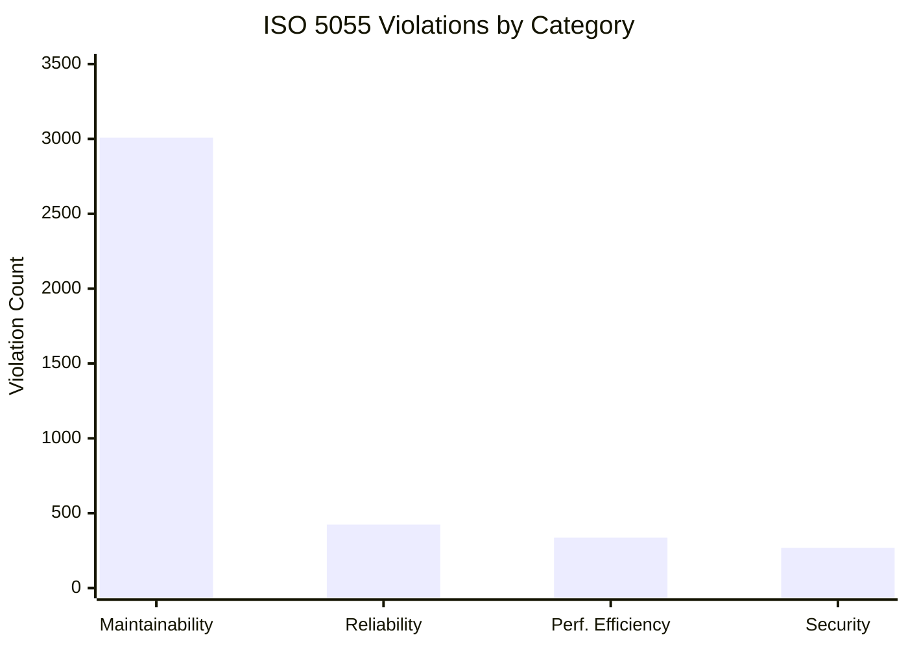

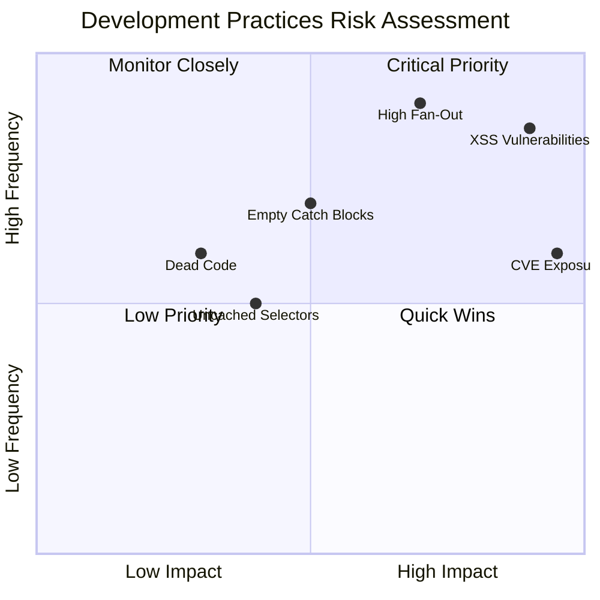

## 4\. Audit Results - Architecture

The architectural analysis reveals a layered topology organized into seven distinct component strata. Web Interaction encompasses 428 objects handling HTTP request processing and response generation. Screen Interaction contains 9 objects managing UI state and navigation. Mobile Interaction includes a single object providing mobile-specific adaptations. Logic Services dominate the architecture with 2,240 objects implementing business rules and workflows. Communication Services comprise 872 objects managing external integrations and messaging. Database Services contain 83 objects handling persistence operations. Data File Services include 5 objects managing file-based data access.

The dominance of Logic Services indicates significant business rule concentration without clear domain boundaries. This monolithic business layer pattern, while common in enterprise applications of this vintage, creates challenges for team scaling and independent deployment. The Communication Services layer integrates diverse external systems including AWS S3 for object storage, GCP Storage for cloud file management, Elasticsearch for search indexing, payment gateways for transaction processing, and email/notification services for customer communication. This integration breadth demonstrates the application's connectivity requirements but also expands the attack surface and dependency chain.

Persistence architecture relies on JPA and Hibernate for object-relational mapping, providing a standardized approach to database interaction. However, the analysis detected instances of direct SQL execution, including queries embedded within loop constructs. Such patterns bypass the benefits of the ORM layer and risk performance degradation through excessive database round-trips. The application should consolidate all data access through the JPA layer and optimize query patterns to minimize database load.

The REST API strategy exposes over 300 Spring MVC endpoints organized across storefront, admin, and versioned API namespaces. This API breadth supports headless commerce scenarios where frontend applications consume backend services independently. However, the analysis identified 446 API endpoints that lack frontend callers, suggesting either incomplete client implementation, deprecated functionality, or inconsistent alignment between API design and actual usage patterns. These unused endpoints represent both maintenance burden and potential security exposure, as they expand the attack surface without delivering business value.

Security architecture relies on Spring Security for role-based access control, providing authentication and authorization capabilities. However, hardening opportunities exist in input validation, session management, and security header configuration. The analysis found that configurations are partially externalized through Spring profiles, supporting environment-specific customization, but legacy hard-coded URLs remain embedded in the codebase, complicating deployment flexibility and creating potential security risks if these URLs reference non-production environments.

Frontend architecture combines server-side rendering through JSP and Apache Tiles with client-side interactivity via jQuery. This approach, while functional, relies on deprecated plugins and lacks the componentization benefits of modern frontend frameworks. The tight coupling between server-rendered markup and client-side scripts complicates maintenance and limits opportunities for progressive enhancement or mobile optimization.

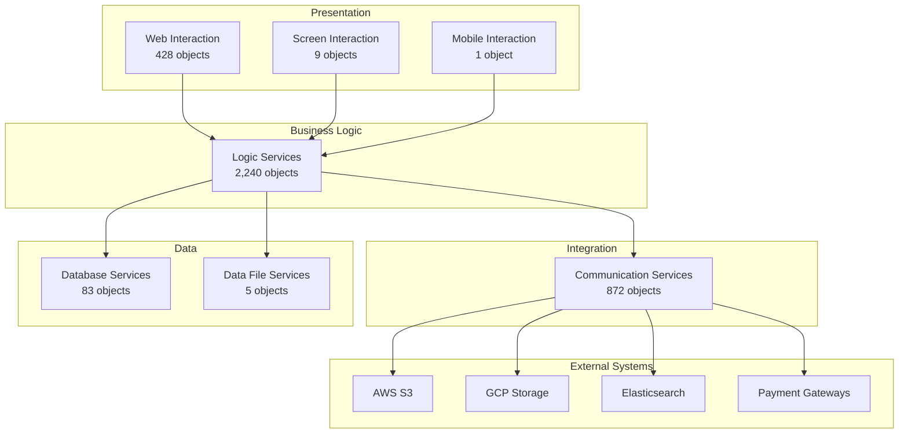

## 5\. Audit Results - Open Source Components

The software composition analysis identified 40 open source packages integrated into ShopizerApp, representing a typical dependency footprint for a Java enterprise application. However, the security posture of these components presents significant risk, with 79 documented CVE vulnerabilities distributed across the dependency tree. Of these vulnerabilities, 3 are classified as critical severity, 12 as high severity, and the remainder as medium or low severity. This vulnerability density requires immediate attention through a structured upgrade program.

Critical vulnerabilities demand urgent remediation. CVE-2019-17495 affects Swagger UI through a CSS injection vulnerability that could enable cross-site scripting attacks against API documentation consumers. CVE-2019-10158 impacts Infinispan caching library through improper session handling that could allow authentication bypass. CVE-2023-49093 affects HtmlUnit with a remote code execution vulnerability that could enable attackers to execute arbitrary code on the server. CVE-2021-41411 impacts Drools rules engine through an XML External Entity vulnerability that could expose sensitive data or enable server-side request forgery. These critical issues represent the highest priority for remediation, as successful exploitation could result in complete system compromise.

High severity vulnerabilities span multiple component categories. Jackson Databind versions 2.10.x contain multiple deserialization vulnerabilities including CVE-2020-25649, CVE-2020-36518, CVE-2021-46877, CVE-2022-42003, and CVE-2022-42004 that could enable denial of service or potentially remote code execution. Bootstrap versions prior to 4.1.2 contain multiple XSS vulnerabilities including CVE-2018-14040, CVE-2018-14041, and CVE-2018-14042 affecting tooltip, scrollspy, and collapse components. Elasticsearch 7.5.2 contains privilege escalation vulnerabilities CVE-2020-7009 and CVE-2020-7014 that could allow unauthorized access to cluster resources. CKEditor contains XSS vulnerabilities CVE-2021-37695 and CVE-2021-41165 affecting content editing functionality.

Component obsolescence compounds security concerns. Commons-IO version 2.5 lags the current release by approximately 8 years, missing security fixes and performance improvements accumulated over multiple major versions. Commons-lang3 version 3.5 similarly trails modern releases by nearly a decade. Antisamy version 1.5.11 predates critical security fixes for XSS bypass techniques. Guava version 27.1-jre misses patches for CVE-2020-8908 and CVE-2023-2976 affecting temporary file handling. These outdated components not only present security risks but also limit access to bug fixes, performance optimizations, and new features that could benefit the application.

The risk summary prioritizes immediate upgrades for UI libraries including Bootstrap and jQuery dependencies, JSON processors including Jackson Databind and Jackson Core, search infrastructure including Elasticsearch client libraries, caching components including Infinispan, and security sanitizers including Antisamy. A phased upgrade approach should address critical and high severity vulnerabilities first, followed by medium severity issues, and finally obsolescence remediation for components without known vulnerabilities but significant version lag.

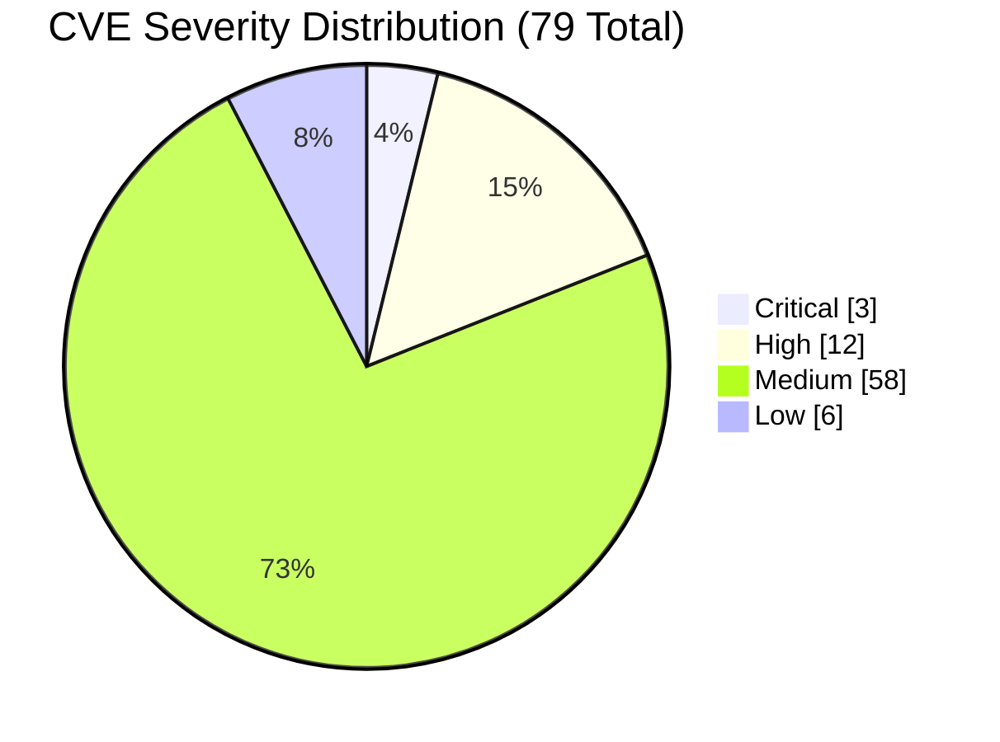

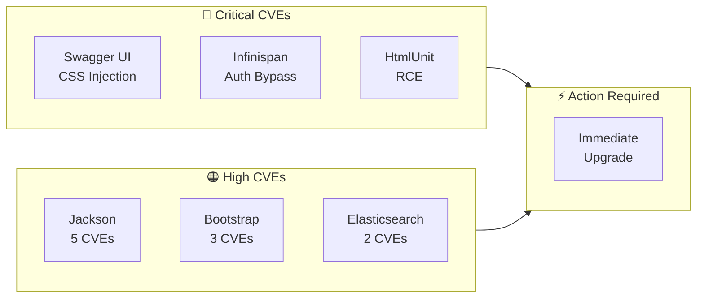

## 6\. Audit Results - Cloud Level

The cloud readiness assessment identifies both blockers preventing immediate cloud migration and boosters that facilitate the transition. The analysis detected 153 cloud migration blockers distributed across multiple categories, indicating that significant refactoring is required before the application can operate effectively in containerized or cloud-native environments.

File system dependencies represent the largest blocker category with 95 instances of direct file system usage. These patterns assume local disk availability, which conflicts with the ephemeral storage model of containers and the distributed nature of cloud deployments. Additionally, 6 instances of direct directory manipulation and 4 instances of file manipulation operations further entrench local storage assumptions. Remediation requires migrating file operations to cloud storage APIs, leveraging the existing AWS S3 and GCP Storage integrations as patterns for broader adoption.

Stateful session management presents a high-criticality blocker with 46 instances of socket or servlet-based session state. Stateful sessions assume server affinity, preventing horizontal scaling and complicating failover scenarios. Cloud-native applications should externalize session state to distributed caches such as Redis or Infinispan HotRod, enabling any instance to serve any request without session loss.

Security-related blockers include 4 instances of hard-coded HTTP URLs that should be externalized to configuration and updated to HTTPS, plus 2 instances of unsecured network protocol usage that violate cloud security best practices requiring TLS encryption for all communications.

Cloud boosters demonstrate existing capabilities that support migration. The application already integrates with AWS S3 and GCP Storage through 8 documented connection points, proving the development team's familiarity with cloud storage patterns. The RESTful service architecture supports gradual decomposition into independently deployable services. Spring profiles enable environment-specific configuration, partially aligning with twelve-factor application principles for configuration externalization.

Recommendations for cloud readiness improvement include: replacing stateful sessions with distributed cache backed by Redis or Infinispan HotRod; refactoring all file I/O operations to use cloud storage APIs exclusively; eliminating hard-coded endpoints in favor of environment variables or configuration services; enforcing TLS-only communication across all network interactions; and introducing container-friendly configuration patterns using secrets management and environment variable injection.

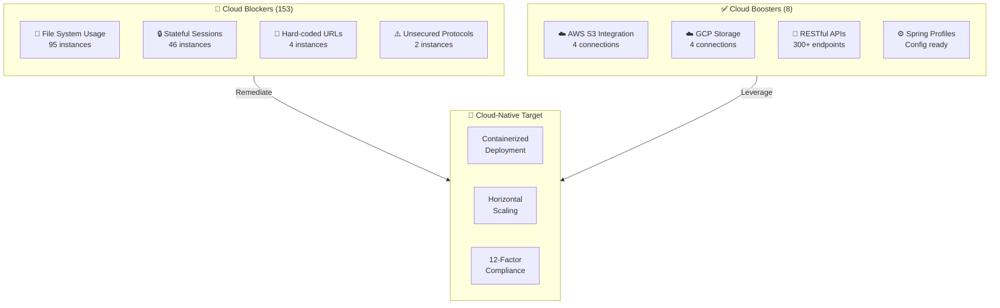

## 7\. Audit Results - Risky Transactions

Transaction analysis identifies high-risk execution paths that warrant focused attention for security hardening and performance optimization. The checkout flows represent the most critical transaction category, encompassing billing and shipping state changes, cart validation, and order submission actions. These transactions traverse over 2,300 objects and contain XSS vulnerabilities that could enable attackers to inject malicious scripts into the checkout process, potentially capturing payment credentials or redirecting transactions.

Payment processing transactions in the administrative console, including payment capture and update operations, handle sensitive financial data and require rigorous input validation and audit logging. The REST Order API chain, spanning cart checkout initiation, payment processing, and shipping calculation, involves complex dependencies across multiple service layers that amplify the impact of any single component failure.

Security risks concentrate around authentication and authorization endpoints. Login functionality exposed through UI elements including the generic login button and standard login button lacks adequate protection against XSS and CSRF attacks due to weak input sanitization and inconsistent session handling. Administrative actions including store creation and user management similarly require hardening to prevent privilege escalation or unauthorized access.

Efficiency risks manifest in checkout scripts that perform repeated AJAX calls with uncached jQuery selectors, generating multiple round-trips to server and database resources. Search and product catalog APIs rely on Elasticsearch queries that, while performant under normal load, may degrade under traffic spikes without proper caching and query optimization. The analysis recommends implementing rigorous input validation across all transaction entry points, enforcing CSRF tokens for state-changing operations, optimizing checkout scripts through selector caching and DOM query reduction, and profiling API transactions to identify and address performance bottlenecks.

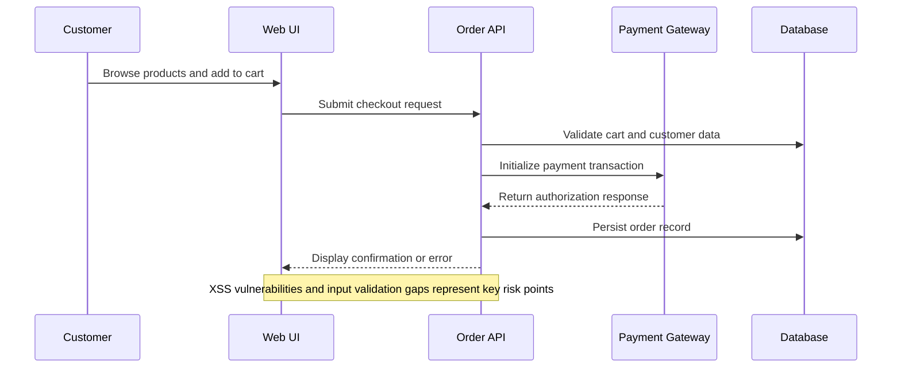

## 8\. Audit Results - Green IT

The Green IT assessment evaluates the application's environmental impact through analysis of code patterns that affect energy consumption and resource efficiency. CAST Imaging identified 1,042 Green IT blockers across nine violation categories, indicating substantial opportunity for optimization that would reduce both environmental footprint and operational costs.

Instantiations inside loops represent the largest violation category with 438 occurrences. Creating new objects within loop bodies generates excessive memory allocations that stress garbage collection and consume CPU cycles for object initialization and eventual cleanup. Remediation involves moving object creation outside loops where possible, implementing object pooling for frequently instantiated types, and reusing existing objects rather than creating new instances.

Nested loops account for 194 violations, representing algorithmic complexity that scales poorly with input size. Deeply nested iteration structures consume disproportionate CPU resources and should be refactored to reduce nesting depth through algorithm redesign or data structure optimization.

String concatenation in loops appears in 116 locations, a pattern particularly wasteful in Java where string immutability causes each concatenation to allocate a new string object. Replacing concatenation with StringBuilder or StringBuffer within loops dramatically reduces memory allocation overhead.

Empty catch blocks contribute 115 violations that, while primarily a reliability concern, also impact Green IT by allowing failed operations to silently continue, potentially triggering retry loops or redundant processing that wastes resources.

Loop condition inefficiencies include 61 violations for non-optimal comparison patterns and 36 violations for function calls within loop conditions. Evaluating functions on each iteration rather than pre-computing invariant values wastes CPU cycles proportional to iteration count.

Literal initialization misses account for 57 violations where compile-time constants could replace runtime computations. Virtualization and infrastructure patterns contribute 22 violations related to resource sharing and containerization opportunities.

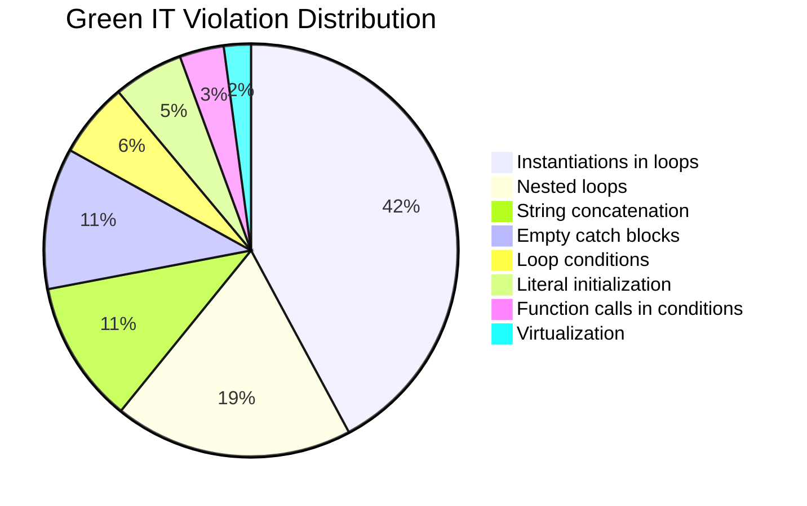

## 9\. Audit Results - Security Standards Compliance

The security standards compliance assessment evaluates ShopizerApp against industry-recognized frameworks including OWASP Top 10, CWE Top 25, PCI-DSS, and ISO 5055 Security characteristics. The analysis reveals multiple compliance gaps requiring remediation to meet security best practices and regulatory requirements.

OWASP Top 10 2021 compliance analysis identifies violations across multiple categories. A03 Injection is breached through 152 cross-site scripting instances where user input reaches output without proper encoding or sanitization. A05 Security Misconfiguration manifests through deprecated API usage and missing security headers that leave the application vulnerable to various attack vectors. A02 Cryptographic Failures risk arises from outdated libraries that may use weak cryptographic algorithms or contain implementation flaws. A06 Vulnerable and Outdated Components is directly evidenced by the 79 CVE vulnerabilities identified in the software composition analysis (OWASP Foundation, 2021).

CWE Top 25 2023 compliance analysis shows CWE-79 Cross-site Scripting as the dominant weakness with 152 occurrences, representing the most prevalent vulnerability class in the application. CWE-20 Improper Input Validation and CWE-200 Exposure of Sensitive Information to an Unauthorized Actor appear in checkout and API transaction flows where input handling lacks rigor. CWE-391 Unchecked Error Condition correlates with the empty catch block violations, while CWE-1050 Excessive Platform Resource Consumption During Web Page Rendering aligns with the inefficient loop patterns identified in Green IT analysis (MITRE Corporation, 2023).

PCI-DSS compliance is compromised by several factors. Unpatched payment-related libraries, including the Shopizer-specific CVE-2022-23063 affecting session expiration, violate requirements for secure software development. Insufficient session expiration controls fail to meet requirements for automatic session timeout. Incomplete logging across exception handlers prevents the audit trail required for security monitoring and incident response (PCI Security Standards Council, 2022).

ISO 5055 Security characteristic analysis identified 268 violations, with the structural flaws breakdown showing 134 instances of XSS through API requests, 11 instances of Ajax calls without dataType specification, and 7 instances of reflected XSS. These violations indicate systematic gaps in input validation and output encoding practices.

Priority fixes for security compliance include: deploying updated sanitization libraries and configuring them for comprehensive input filtering; enforcing Content Security Policy headers to mitigate XSS impact; enabling server-side validation for all user inputs regardless of client-side validation presence; and establishing automated dependency scanning in the CI/CD pipeline to prevent introduction of vulnerable components.

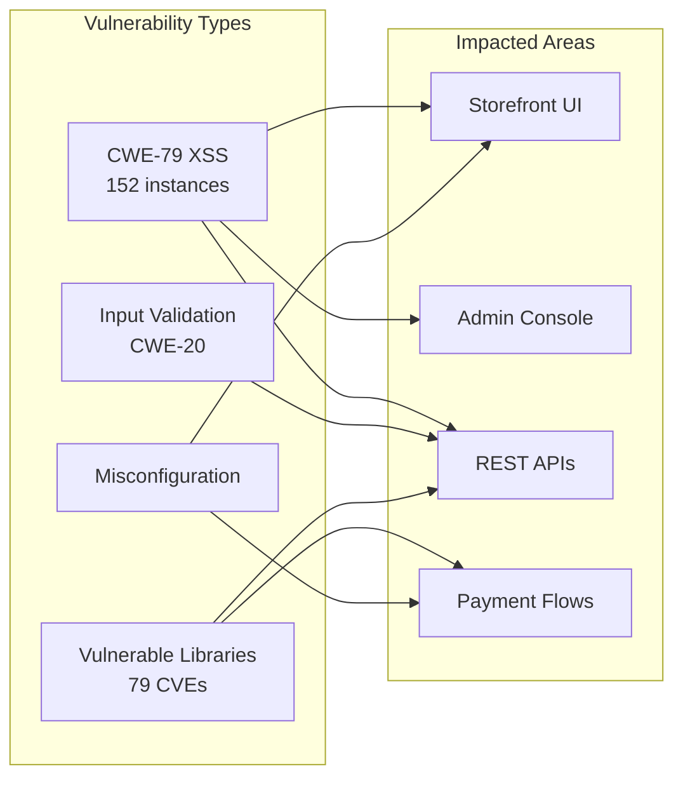

## 10\. Audit Results - ISO 5055 Compliance

ISO 5055 establishes an international standard for measuring software structural quality through four characteristics: Reliability, Security, Performance Efficiency, and Maintainability. Each characteristic is assessed through detection of specific code patterns that correlate with quality outcomes. The standard provides objective, automated measurement that enables consistent quality assessment across projects and organizations (ISO/IEC, 2021).

Reliability characteristic analysis identified 424 violations affecting the application's ability to perform its required functions under stated conditions. Error handling gaps dominate this category, including JSP pages without exception handling, empty catch blocks that suppress errors without appropriate response, and JSON parsing operations lacking try-catch protection. These patterns create fragile execution paths where failures propagate unpredictably rather than being contained and handled gracefully.

Security characteristic analysis identified 268 violations affecting the application's protection of information and data. Cross-site scripting vulnerabilities represent the primary concern, with deprecated jQuery APIs and Ajax misconfiguration contributing additional exposure. The security violations correlate strongly with the OWASP and CWE findings, confirming that input validation and output encoding represent the most critical security improvement areas.

Performance Efficiency characteristic analysis identified 337 violations affecting the application's resource utilization relative to performance delivered. Uncached jQuery selectors force repeated DOM traversals that degrade page responsiveness. String concatenation within loops creates unnecessary object allocations. SQL queries executed within loops generate excessive database round-trips. These patterns collectively impact user experience through slower response times while increasing infrastructure resource consumption.

Maintainability characteristic analysis identified 3,008 violations affecting the ease with which the application can be modified for corrections, improvements, or adaptations. High fan-in and fan-out metrics indicate excessive coupling that complicates change impact analysis. Large artifacts exceed size thresholds that correlate with comprehension difficulty and defect rates. Unreferenced code represents dead weight that increases cognitive load without delivering value. High inheritance depth creates fragile class hierarchies where changes to base classes risk unintended impacts on derived classes.

Representative violation examples illustrate the patterns requiring remediation. Checkout JSP pages contain XSS vulnerabilities where user input is rendered without encoding. PaymentController methods contain empty catch blocks that suppress payment processing errors. ProductApi classes exceed complexity thresholds through accumulated feature additions without refactoring. Shipping state change scripts perform repeated DOM queries that could be optimized through selector caching.

The overall conformance level falls below acceptable thresholds across all four characteristics, mandating a structured remediation program. Priority should focus on security and reliability violations that present immediate risk, followed by performance efficiency improvements that enhance user experience, and finally maintainability investments that reduce long-term technical debt accumulation.

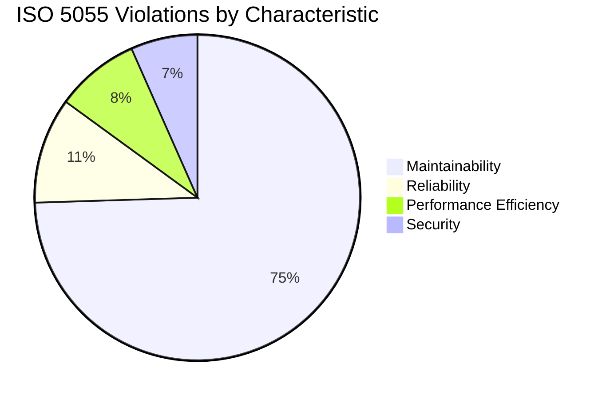

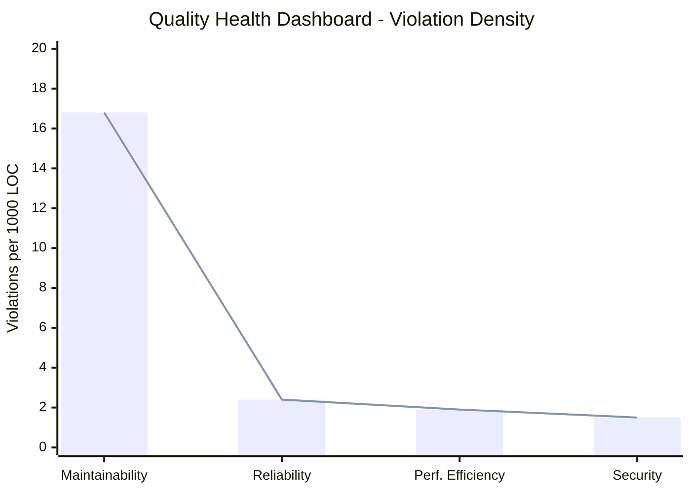

## 11\. Assessment, Recommendations, and Action Plan

The comprehensive assessment reveals that ShopizerApp successfully delivers its e-commerce functionality but carries significant technical debt across security, reliability, and maintainability dimensions. Without systematic remediation, operational risk will continue to accumulate, compliance gaps will widen as standards evolve, and the cost of future enhancements will escalate. The application's current state represents a critical juncture where investment in quality improvement will yield substantial returns in reduced incident rates, improved developer productivity, and enhanced customer trust.

The action plan organizes remediation into three phases aligned with risk severity and implementation complexity. Effort estimates are provided in person-days to support resource planning and prioritization decisions.

**Immediate Phase (0-3 months, estimated 120-150 person-days):** The immediate phase addresses critical security defects and stabilizes operations. Resolving the 152 XSS vulnerabilities requires implementing comprehensive input validation and output encoding across all user-facing interfaces, estimated at 40-50 person-days. Upgrading critical CVE packages including Bootstrap, Jackson, Infinispan, Elasticsearch, Antisamy, and Swagger UI requires dependency analysis, compatibility testing, and deployment coordination, estimated at 30-40 person-days. Hardening input handling through centralized validation and sanitization libraries, enforcing content security policies, and adding structured error handling across JSPs and controllers requires 30-35 person-days. Stabilizing performance hotspots by caching jQuery selectors, refactoring string concatenations, and addressing SQL-in-loop patterns requires 20-25 person-days.

**Medium Phase (3-9 months, estimated 200-250 person-days):** The medium phase addresses architectural improvements and cloud readiness. Modularizing business domains to reduce fan-in and fan-out metrics, eliminating dead code, and rationalizing unused API endpoints requires 80-100 person-days of analysis and refactoring. Replacing stateful sessions with distributed cache and migrating file I/O to cloud storage APIs requires 60-80 person-days including infrastructure setup and testing. Implementing DevSecOps pipeline with automated SCA scanning and CAST quality gates requires 40-50 person-days for tooling integration and process establishment. Addressing remaining medium-severity CVEs requires 20-30 person-days.

**Long-Term Phase (9-18 months, estimated 400-500 person-days):** The long-term phase enables architectural modernization. Transitioning toward microservice or modular monolith architecture for catalog, order, and payment domains requires 150-200 person-days of design, implementation, and migration. Modernizing the frontend through SPA or headless architecture leveraging existing REST APIs requires 120-150 person-days. Adopting containerization, infrastructure as code, and observability tooling to support SRE practices requires 80-100 person-days. Addressing remaining maintainability violations and technical debt requires 50-80 person-days of ongoing refactoring.

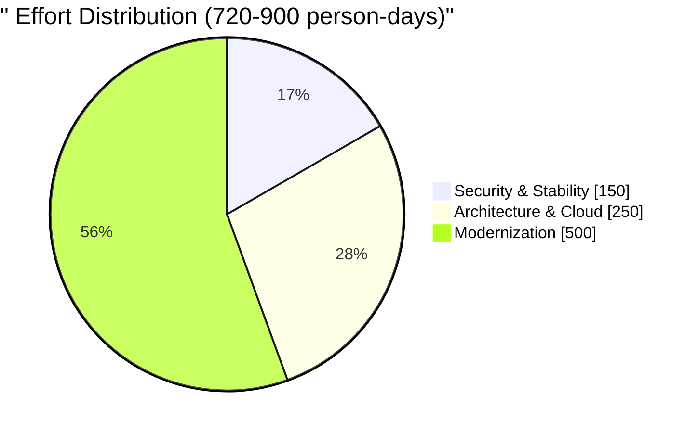

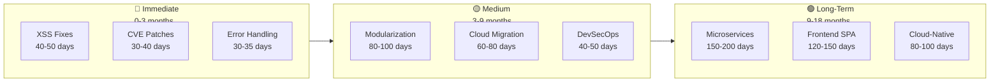

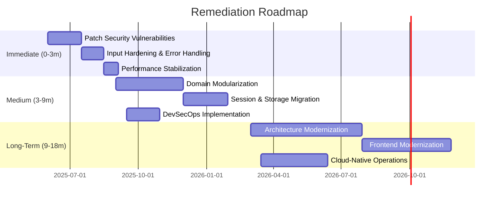

## 12\. Support Proposal

CAST offers comprehensive support services to accelerate remediation and establish sustainable quality practices. The support engagement model combines tooling, expertise, and process guidance to maximize the value of audit findings and ensure successful implementation of the action plan.

Dashboard deployment provides continuous visibility into remediation progress through CAST Highlight and CAST Imaging dashboards configured for ShopizerApp. These dashboards track key performance indicators including violation counts by category, CVE exposure trends, and quality characteristic scores over time. Regular automated analysis ensures that improvements are captured and regressions are detected promptly.

Architecture coaching engages CAST consultants with deep experience in application modernization to guide domain decomposition, cloud migration patterns, and API rationalization strategies. This coaching accelerates decision-making by providing proven patterns and avoiding common pitfalls encountered in similar transformation initiatives.

Embedded consulting places CAST specialists within the development team to implement automated dependency governance, configure CI/CD quality gates, and lead refactoring sprints targeting high-impact violations. This hands-on engagement transfers knowledge to the internal team while delivering immediate remediation progress.

Periodic health checks schedule quarterly reassessments to validate improvement trajectories, identify emerging risks, and adjust roadmap priorities based on business context changes. These checkpoints ensure that the remediation program remains aligned with organizational objectives and adapts to evolving requirements.

## 13\. Appendices

### A. ISO 5055 Violation Summary

| Characteristic | Violations | Top Patterns |
| --- | --- | --- |
| Maintainability | 3,008 | High fan-in (727), High fan-out (1,432), Large artifacts (136), Unreferenced code (272) |
| Reliability | 424 | Empty catch blocks (115), Missing error handling (223), Unchecked status codes |
| Performance Efficiency | 337 | Uncached selectors (79), String concatenation (51), Instantiations in loops (438) |
| Security | 268 | XSS through APIs (134), Reflected XSS (7), Ajax without dataType (11) |

### B. CVE Summary by Severity

| Severity | Count | Key Components |
| --- | --- | --- |
| Critical | 3   | Swagger UI (CVE-2019-17495), Infinispan (CVE-2019-10158), HtmlUnit (CVE-2023-49093) |
| High | 12  | Jackson Databind (5 CVEs), Bootstrap (3 CVEs), Elasticsearch (2 CVEs), Drools, CKEditor |
| Medium | 58  | Commons-IO, Guava, MySQL Connector, Antisamy, various Elasticsearch and Infinispan |
| Low | 6   | Elasticsearch disclosure, Guava temp directory |

### C. Cloud Blockers Summary

| Category | Count | Impact |
| --- | --- | --- |
| File system usage | 95  | Prevents containerization |
| Stateful sessions | 46  | Prevents horizontal scaling |
| Directory manipulation | 2   | Requires cloud storage migration |
| File manipulation | 4   | Requires cloud storage migration |
| Hard-coded HTTP URLs | 4   | Security and configuration risk |
| Unsecured protocols | 2   | Security compliance violation |

### D. Green IT Violations Summary

| Pattern | Count | Remediation Approach |
| --- | --- | --- |
| Instantiations in loops | 438 | Object pooling, move creation outside loops |
| Nested loops | 194 | Algorithm redesign, data structure optimization |
| String concatenation | 116 | StringBuilder replacement |
| Empty catch blocks | 115 | Proper exception handling |
| Loop condition issues | 61  | Pre-compute invariants |
| Literal initialization | 57  | Compile-time constants |
| Function calls in conditions | 36  | Cache function results |
| Virtualization | 22  | Container adoption |

### E. References

MITRE Corporation. (2023). CWE Top 25 Most Dangerous Software Weaknesses. https://cwe.mitre.org/top25/archive/2023/2023_top25_list.html

OWASP Foundation. (2021). OWASP Top 10:2021. https://owasp.org/Top10/

PCI Security Standards Council. (2022). Payment Card Industry Data Security Standard v4.0. https://www.pcisecuritystandards.org/document_library/

ISO/IEC. (2021). ISO/IEC 5055:2021 Information technology — Software measurement — Software quality measurement — Automated source code quality measures. https://www.iso.org/standard/80623.html

National Vulnerability Database. (2024). CVE Database. https://nvd.nist.gov/

CAST Software. (2025). CAST Imaging Analysis Results for ShopizerApp. Internal analysis report.

### F. Visual Index

| Section | Diagram Type | Description |
| --- | --- | --- |
| 1\. Context | Mindmap | Audit 360° scope showing seven assessment dimensions |
| 2\. Identity Card | Block Diagram | Technology stack and key metrics overview |
| 3\. Development Practices | XY Chart | ISO 5055 violations by category bar chart |
| 3\. Development Practices | Quadrant Chart | Risk assessment matrix for prioritization |
| 4\. Architecture | Graph TD | Layered architecture with external integrations |
| 5\. Open Source | Pie Chart | CVE severity distribution |
| 5\. Open Source | Flowchart | Critical/High CVE components requiring action |
| 6\. Cloud Level | Flowchart | Blockers vs Boosters comparison diagram |
| 7\. Transactions | Sequence Diagram | Checkout transaction flow with risk points |
| 8\. Green IT | Pie Chart | Violation distribution by pattern type |
| 9\. Security | Graph LR | Vulnerability types mapped to impacted areas |
| 10\. ISO 5055 | Pie Chart | Violations by characteristic |
| 10\. ISO 5055 | XY Chart | Quality health dashboard - violation density |
| 11\. Action Plan | Pie Chart | Total effort distribution by phase |
| 11\. Action Plan | Flowchart | Three-phase remediation breakdown |
| 11\. Action Plan | Gantt Chart | 18-month remediation roadmap timeline |