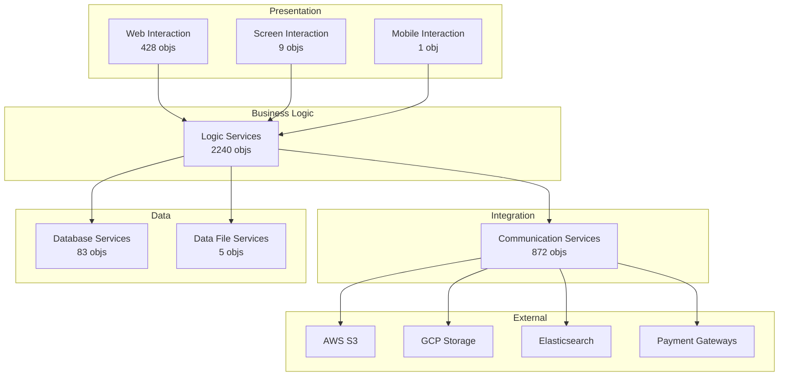
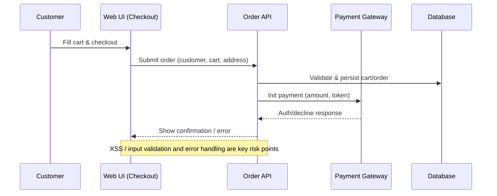
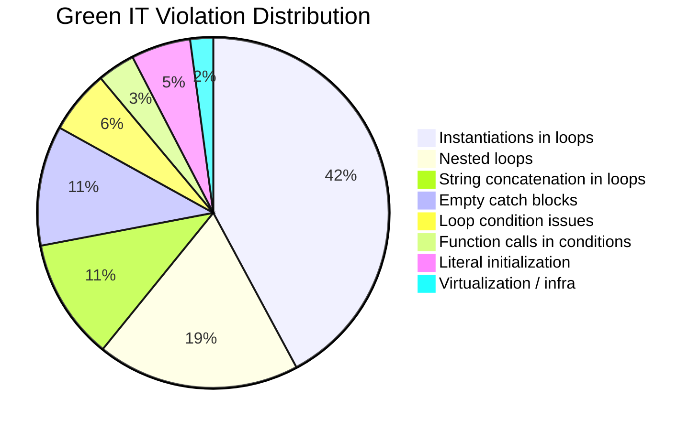
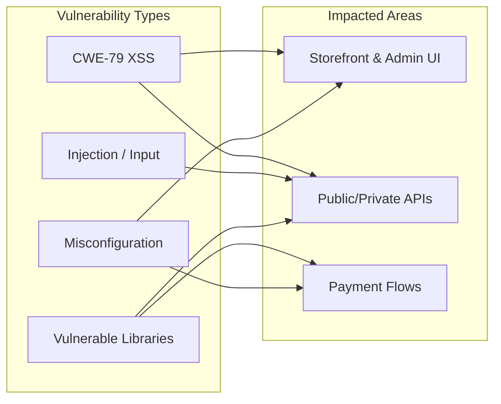
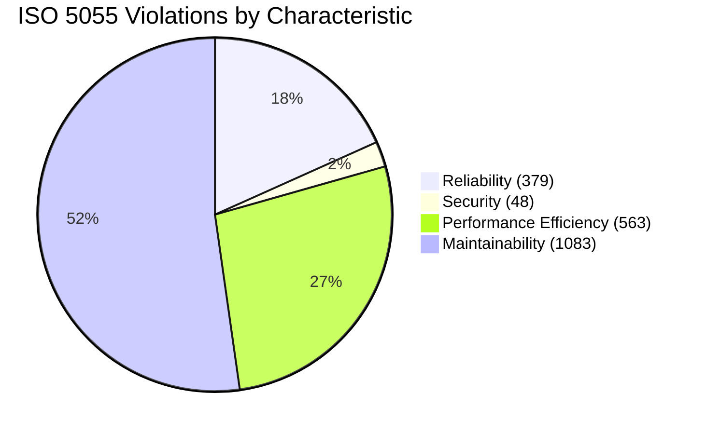
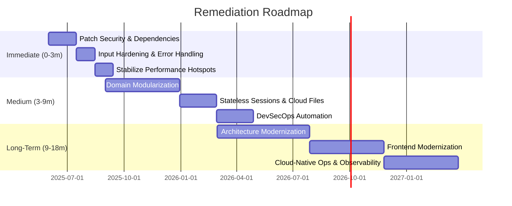

# Short Audit Report

## 1\. Context and Objectives

ShopizerApp, operated by "Customer", is an e-commerce platform supporting multi-store retail operations. The June 2025 CAST audit assessed its structural quality, security posture, and modernization readiness. Project stakeholders include Project Manager Joe M and Expert Analyst. The CAST team conducted a comprehensive review covering development practices, architecture, open-source exposure, cloud readiness, transactions, Green IT metrics, and compliance with security standards. The objective is to provide actionable insights, highlight risks, and chart a remediation path that secures business continuity while enabling modernization.

## 2\. Audit Results - System Identity Card

- **Application:** ShopizerApp (Shopizer tenant, CAST Imaging default)
- **LOC / Elements / Interactions:** 178,854 lines, 15,252 elements, 97,228 interactions
- **Technologies:** Java, Spring (Core, WebMVC, Security), Hibernate/JPA, JSP, Apache Tiles, JavaScript/jQuery, Elasticsearch, AWS S3, GCP Storage
- **Functional Scope:** Product catalog, pricing, inventory, promotions, checkout, payments (Stripe, PayPal, Braintree), order management, customer services, admin console, REST APIs
- **Deployment Context:** On-prem/VM-based monolith with cloud connectors for storage and search; relies on legacy stateful sessions and file-system operations

## 3\. Audit Results - Development Practices

- **Overall Quality:** High functional coverage but substantial technical debt. Maintainability issues stem from 727 high fan-in and 1,432 high fan-out artifacts, 136 oversized classes, and 272 unreferenced elements (242 methods, 30 JS functions). Complexity hotspots include 39 high-cyclomatic artifacts.
- **Operational Risks:** Reliability degraded by 223 JSPs without error handling and 61 empty catch blocks. Efficiency impacted by 79 uncached selectors, 51 string concatenations in loops, and 438 instantiations in loops. Security weakened by deprecated jQuery APIs and inadequate sanitization.
- **Maintainability Risks:** 446 APIs unused by frontend callers, extensive coupling, and legacy coding patterns increase change cost.
- **Critical Non-Conformities:** (1) Cross-site scripting exposure across UI/API layers, (2) Vulnerable third-party components (79 CVEs), (3) Lack of centralized error handling, (4) Inefficient algorithmic patterns affecting both Green IT and performance.

## 4\. Audit Results - Architecture

- **Layered Topology:** CAST Imaging identifies seven component strata—Web Interaction (428 objects), Screen Interaction (9), Mobile Interaction (1), Logic Services (2,240), Communication Services (872), Database Services (83), Data File Services (5).
- **Architecture Observations:** Logic Services dominate, signaling business rule concentration without clear domain boundaries. Communication layer integrates AWS S3/GCP Storage, Elasticsearch, payment gateways, and email/notification services. Persistence handled via JPA/Hibernate; some direct SQL detected (queries in loops).
- **REST Strategy:** 300+ Spring MVC endpoints (storefront, admin, API v0/v1). API breadth supports headless commerce but suffers from 446 unused endpoints, suggesting inconsistent client alignment.
- **Security & Config:** Spring Security provides RBAC but needs hardening (input validation, session controls). Configurations partially externalized; legacy hard-coded URLs remain.
- **Frontend:** Server-side JSP/Tiles with jQuery. Deprecated plugins and limited componentization hinder maintainability.

## 5\. Audit Results - Open Source Components

- **Inventory:** 40 OSS packages. Key risers: Jackson 2.10.2, Bootstrap <4.1.2, Elasticsearch 7.5.2, Infinispan 9.4.18, Antisamy 1.5.11, HtmlUnit, Drools, AWS SDK 1.11.x.
- **CVE Exposure:** 79 vulnerabilities (3 Critical, 12 High, 64 Medium/Low). Critical issues include Swagger UI CSS injection (CVE-2019-17495), Infinispan auth flaws (CVE-2019-10158), HtmlUnit RCE (CVE-2023-49093), Drools XXE (CVE-2021-41411). Multiple Bootstrap and Elasticsearch CVEs amplify the attack surface.
- **Obsolescence:** Commons-IO 2.5 and commons-lang3 3.5 lag modern releases by ~8–9 years. Antisamy 1.5.11 predates security fixes. Guava 27.1-jre misses recent CVE patches.
- **Risk Summary:** Immediate upgrades required for UI libraries (Bootstrap, jQuery dependencies), JSON processors (Jackson), search (Elasticsearch), caching (Infinispan), and security sanitizers (Antisamy).

## 6\. Audit Results - Cloud Level

- **Blockers:** 95 file-system usages, 46 stateful sessions, 6 direct file/directory manipulations, 4 hard-coded HTTP URLs, and 2 unsecured protocol usages hinder cloud/container adoption.
- **Boosters:** Existing AWS S3/GCP Storage connectors and RESTful service decomposition support gradual migration. Configuration externalization via Spring profiles partially ready for 12-factor alignment.
- **Recommendations:** Replace stateful sessions with distributed cache (Redis/Infinispan HotRod), refactor file I/O to cloud storage APIs, eliminate hard-coded endpoints, enforce TLS-only communication, and introduce container-friendly configuration (secrets/env vars).

## 7\. Audit Results - Risky Transactions

- **High-Risk Areas:** Checkout flows (billing/shipping state changes, submitOrder actions) with 2,300+ objects and XSS vulnerabilities; payment capture/update operations in admin console; REST Order API chain (cart checkout, payment initiation, shipping calculation) with complex dependencies.
- **Security Risks:** Login endpoints (#genericLogin-button, #login-button) and admin actions (#create-store-link, #user-link) exposed to XSS/CSRF due to weak sanitization and session handling.
- **Efficiency Risks:** Checkout loops with AJAX selectors and multiple round trips to server/database. Search and product APIs rely on Elasticsearch queries susceptible to performance degradation under load.
- **Actions:** Implement rigorous input validation, enforce CSRF tokens, optimize checkout scripts (caching selectors, reducing DOM queries), and profile API transactions for bottlenecks.

## 8\. Audit Results - Green IT

- **Violations:** 1,042 blockers spanning instantiations in loops (438), nested loops (194), string concatenations (116), inefficient loop conditions (61), function calls in loop conditions (36), literal initialization misses (57), empty catch blocks (115), and lack of virtualization (22).
- **Impact:** Elevated CPU/memory consumption, excessive garbage creation, and reduced energy efficiency. These patterns align with performance hotspots noted in transactional analysis.
- **Remediation:** Adopt object pooling/reuse, replace string concatenation with StringBuilder, restructure algorithms to lower complexity, pre-compute loop invariants, enforce virtualization/containerization for shared resources.

## 9\. Audit Results - Security Standards Compliance

- **OWASP Top 10:** A03 (Injection) breached via XSS (152 cases); A05 (Security Misconfiguration) via deprecated APIs and missing headers; A02 (Cryptographic Failures) risk from outdated libraries; A06 (Vulnerable Components) via 79 CVEs.
- **CWE Top 25:** CWE-79 dominates (152), CWE-20/CWE-200 (input validation/info leaks) evident in checkouts/APIs, CWE-391 (empty catch) and CWE-1050 (inefficient loops) also present.
- **PCI-DSS:** Non-compliance due to unpatched payment libraries, insufficient session expiration (CVE-2022-23063), and incomplete logging.
- **ISO 5055 Security:** 48 rule breaches (jQuery deprecations, Ajax without dataType, API XSS).
- **Priority Fixes:** Deploy sanitization library updates, enforce CSP/secure headers, enable server-side validation, and establish automated dependency scanning.

## 10\. Audit Results - ISO 5055 Compliance

- **Reliability:** 379 violations (error handling gaps, empty catch blocks, JSON parse without try/catch).
- **Security:** 48 violations (XSS, deprecated APIs, Ajax misconfiguration).
- **Performance Efficiency:** 563 violations (selectors without caching, string concatenation, SQL in loops, uncached DOM operations).
- **Maintainability:** 1,083 violations (high fan-in/out, large artifacts, unreferenced code, high inheritance depth).
- **Representative Examples:** checkout.jsp XSS, PaymentController empty catch, ProductApi complex class, shipping state change script with repeated DOM queries. Conformance level: below acceptable threshold; mandates remediation program.

## 11\. Assessment, Recommendations, and Action Plan

**Assessment:** ShopizerApp delivers comprehensive commerce capabilities but carries critical security and maintainability debt. Without remediation, operational risk and compliance exposure remain high.

**Action Plan:**

1.  **Immediate (0–3 months)**
    - Patch security defects: resolve 152 XSS sites, upgrade critical CVE packages (Bootstrap, Jackson, Infinispan, Elasticsearch, Antisamy, Swagger UI).
    - Harden inputs: centralized validation/sanitization, enforce content security policies, add structured error handling across JSPs/controllers.
    - Stabilize operations: cache jQuery selectors, refactor string concatenations, address SQL-in-loop cases.
2.  **Medium (3–9 months)**
    - Modularize business domains to reduce fan-in/out; eliminate dead code and unused endpoints.
    - Replace stateful sessions with distributed cache; migrate file I/O to cloud storage APIs.
    - Implement DevSecOps pipeline with automated SCA and CAST Highlight quality gates.
3.  **Long-Term (9–18 months)**
    - Transition toward microservice or modular monolith architecture for catalog, order, payment domains.
    - Modernize frontend (SPA/headless) leveraging existing REST APIs.
    - Adopt containerization, infrastructure as code, and observability (metrics, tracing) to support SRE practices.

## 12\. Support Proposal

CAST can assist by:

- Deploying CAST Highlight/Imaging dashboards for continuous tracking of remediation KPIs.
- Providing architecture coaching to guide modularization, cloud migration, and API rationalization.
- Embedding consultants to implement automated dependency governance, CI/CD quality gates, and refactoring sprints.
- Scheduling periodic health checks to validate improvements and adjust roadmap priorities.

## 13\. Appendices

- **Metrics Tables:** Detailed lists of ISO 5055 violations, CVE mapping by component, Green IT infractions, and cloud blockers.
- **Code Examples:** Before/after snippets for XSS fixes, exception handling, and performance optimizations.
- **Architecture Diagrams:** CAST Imaging exports showing component interactions, transaction graphs, and data flows.
- **Reference Documents:** OWASP Top 10 2021, CWE Top 25 2023, ISO 5055 standard summary, PCI-DSS guidelines, CAST methodology notes.