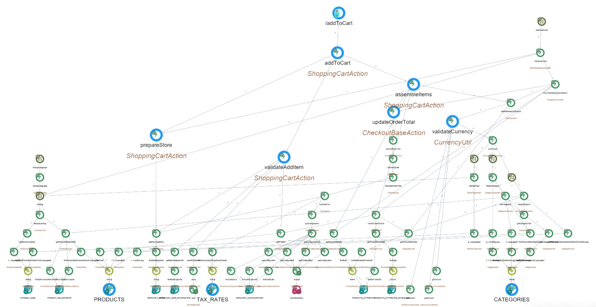

# Transaction : addToCart

# 1\. Functional Overview

Below is a concise, developer‑oriented functional description of the "addToCart" transaction (how the application handles the user action “Add to cart”), based on the repository files related to the cart flow (front‑end JS/JSP and server actions / shopping cart entities).

## 1.1 Purpose

- Let a storefront user add a product (specific SKU + options) and quantity to their current shopping cart (session cart), validate the request (stock/options/pricing), update the cart state, and return an updated view or status to the client (page redirect or AJAX response).

## 1.2 Actors

- Shopper (browser / client)
- Front-end JavaScript / JSP UI (product page, category page, mini‑cart)
- Server-side Struts actions / cart services (ShoppingCartAction, StoreShoppingCartAction, MiniShoppingCartAction)
- Domain entities / services (ShoppingCart, ShoppingCartItem, Product/SKU services, PricingService, StockService)

## 1.3 Preconditions

- Storefront session exists (anonymous or authenticated user).
- Product and SKU referenced must exist and be enabled for the current store.
- Selected product options/attributes must meet required constraints.

## 1.4 Typical input (request parameters / payload)

- productId (or skuId)
- sku (SKU code) — if applicable
- quantity (integer)
- selected attributes/options (map of attribute code -> value)
- storeCode / currency / locale (usually derived from session/store context)
- ajax flag (to indicate AJAX add vs full page submit)  
    Notes: exact parameter names vary in UI code; front-end bundles product info before calling the add endpoint.

## 1.5 High-level transaction flow (step-by-step)

1.  **Client action**
    - Shopper clicks "Add to cart" on a product or product list.
    - Front-end collects product id/sku, quantity and any selected attributes.
    - Depending on template, the front-end either submits a form to a Struts action or calls an AJAX function in client JS (scripts.jsp / cart.js) to request the add operation.
2.  **Request routed to server action**
    - Struts maps the add cart URL to a server action (ShoppingCartAction or StoreShoppingCartAction / MiniShoppingCartAction for mini cart updates).
    - The action extracts parameters from the request (productId/skuId, quantity, attributes).
3.  **Server-side validations**
    - Load product and SKU by id or code; check product availability and enabled/visible state for the current store.
    - Validate required product attributes/options are provided and are valid.
    - Validate quantity (positive integer) and check stock availability via StockService (if stock enforcement is enabled).
    - If validation fails: prepare error response (error message), either in request for redirect or JSON for AJAX.
4.  **Cart modification**
    - Retrieve current ShoppingCart from session (create a new ShoppingCart in session if none exists).
    - Create or update a ShoppingCartItem:
        - If same SKU + same option set exists in cart, increase its quantity (or replace depending on behavior).
        - Otherwise add a new ShoppingCartItem with SKU, quantity, options/attributes.
    - Calculate item prices:
        - Resolve SKU price, apply any pricing rules/promotions/discounts/taxes via PricingService or promotion engine.
    - Update ShoppingCart totals (subtotal, tax, shipping estimate, total).
    - Persist cart state if applicable (often cart is stored in session and optionally persisted to DB for logged-in users).
5.  **Post-add actions**
    - Trigger events/hooks (e.g., update inventory cache, analytics, promotions recalculation).
    - Update mini-cart view data (MiniShoppingCartAction or returned JSON payload contains updated item count and totals).
    - If user is authenticated, cart may be merged with stored cart in DB.
6.  **Response to client**
    - For normal (non-AJAX) flows: action redirects to cart page or back to product page with success message.
    - For AJAX flows: action returns a JSON payload with status, updated cart count, updated totals and optionally rendered mini-cart HTML fragment.
    - UI displays success or error message and updates mini-cart UI.

## 1.6 Data changes / side effects

- Session ShoppingCart is updated (items, quantities, totals).
- If configured, cart may be persisted for logged-in users.
- Pricing calculations and promotion states are (re)applied.
- Stock reservation may occur later (commonly reserved at checkout), but availability checks are performed.

## 1.7 Error handling

- Missing/invalid parameters -> user-friendly validation error.
- Out of stock -> return error or limit quantity to available stock.
- Product disabled/missing -> error and no cart change.
- Concurrency/stock race -> typically handled at checkout; addToCart returns best-effort validation.

## 1.8 Security and integrity

- Server must not trust client-supplied prices — prices are recalculated server-side using SKU prices and pricing services.
- Validate user session and store context to prevent cross-store manipulation.
- Prevent negative quantities and invalid attribute values.

## 1.9 Observability

- Actions typically log add attempts and failures for debugging.
- Analytics events (addToCart) may be emitted for tracking.

## 1.10 Files and code locations to inspect (in this repository)

- **Front-end / client:**
    - sm-shop/WebContent/catalog/templates/decotemplate/scripts.jsp — contains JS helper functions used by product pages.
    - sm-shop/WebContent/common/js/cart.js (or catalog/layout product JS) — front-end cart functions and AJAX calls.
    - sm-shop/WebContent/catalog/templates/decotemplate/product.jsp and category.jsp — product add buttons/forms.
- **Struts mappings:**
    - sm-shop/WebContent/WEB-INF/classes/struts-catalog.xml
    - sm-shop/WebContent/WEB-INF/classes/struts-checkout.xml
- **Server actions / cart handlers:**
    - sm-shop/src/com/salesmanager/checkout/cart/ShoppingCartAction.java
    - sm-shop/src/com/salesmanager/checkout/cart/StoreShoppingCartAction.java
    - sm-shop/src/com/salesmanager/catalog/cart/MiniShoppingCartAction.java
- **Domain entity:**
    - sm-core/src/com/salesmanager/core/entity/orders/ShoppingCart.java
- **Utilities:**
    - sm-shop/src/com/salesmanager/catalog/common/AjaxCatalogUtil.java
    - sm-shop/WebContent/WEB-INF/dwr.xml (if DWR is used for AJAX RPC)

**Notes / caveats**

- Exact parameter names, endpoints, and JSON field names depend on how product.jsp / scripts.jsp call the server; inspect the files above to see the precise request shape.
- Implementation details (e.g., whether stock is decremented on add or only at order placement) depend on configured store behavior and service implementations — check the StockService / Order flow in the codebase for precise semantics.

# 2\. Technical Overview

Here is what CAST Imaging shows for the addToCart transaction in the eCommerce application. There are two distinct addToCart flows:

## 2.1 Mini cart addToCart (Tx ID: 335326)

- **Technologies and size:**
    - Stack: apache struts, spring, hibernate, java, java server pages, sql
    - Size: 295 nodes
- **Start point:**
    - Struts Operation: com.salesmanager.catalog.cart.MiniShoppingCartAction/CAST_Struts_Operation/addToCart (name: /addToCart)
- **Core flow (reduced path):**
    - /addToCart (Struts) → addToCart (Java Method) → addProductToCart (Java Method)
    - Product lookup path:
        - … → getProduct (Java) → findById (Java) → JPA Select → PRODUCTS (MySQL Table)
    - Attributes lookup path:
        - … → getProductAttributes (Java) → findAttributesByIds (Java) → JPA Select → PRODUCTS_ATTRIBUTES (MySQL Table)
- **Data endpoints touched:**
    - PRODUCTS (MySQL Table)
    - PRODUCTS_ATTRIBUTES (MySQL Table)
- **Notable complexity (cyclomatic/essential/integration):**
    - addProductToCart: 30/9/29
    - addToCart: 3/2/3
    - findById: 3/3/3
    - findAttributesByIds: 3/3/3
- **Quality insights observed (objects within this transaction):**
    
    - Green - Blocker: addProductToCart (Java Method), CatalogService (Java Class), catalogService (Spring Bean), AjaxCatalogUtil (Java Class)
    - Vulnerability insights on Struts-related classes and methods (e.g., TextProviderFactory, ActionSupport, TextProvider, LocaleProvider, ActionContext, getText, etc.) with high counts (56–57 per item)
    
    ## 2.2 Checkout cart addToCart (Tx ID: 335335)
    
- **Technologies and size:**
    - Stack: apache struts, spring, hibernate, java, java server pages, sql
    - Size: 1044 nodes
- **Start point:**
    - Struts Operation: com.salesmanager.checkout.cart.ShoppingCartAction/CAST_Struts_Operation/addToCart (name: /addToCart)
- **Core flow (reduced path):**
    - /addToCart (Struts) → addToCart (Java) → assembleItems (Java)
    - Order total computation branch:
        - assembleItems → updateOrderTotal → calculateTotal → calculateOrderTotal → calculateTax → getConfiguration → getConfigurationVO → findListByLike → MERCHANT_CONFIGURATION (MySQL Table)
    - Product enrichment/validation branches commonly observed:
        - addAttributesToProduct → validateCurrency → getAmount → (via Struts actions) → displayProduct / displayCategory
        - displayProduct → getProductRelationShip → findByMerchantIdAndRelationTypeId → PRODUCT_RELATIONSHIP (MySQL Table)
        - displayCategory → setCategories → findProductsByCategoryList → findProductsByAvailabilityCategoriesIdAndMerchantIdAndLanguageId
        - Product details path to DB:
            - … → findProductsByProductsIdAndLanguageId → JPA Select → PRODUCTS (MySQL Table)
    - CMS/label path:
        - (via displayPage) → getDynamicLabelByMerchantIdAndSeUrlAndLanguageId → JPA Select → DYNAMIC_LABEL (MySQL Table)
    - Crypto usage path:
        - getConfigurationVO → getConfiguration → decrypt → SecretKeySpec (Java crypto)
- **Endpoints frequently reached:**
    - MySQL Tables: MERCHANT_CONFIGURATION, MERCHANT_STORE, MERCHANT_USER_INFORMATION, PRODUCTS, PRODUCT_RELATIONSHIP, DYNAMIC_LABEL
    - Java Method: send (marked as an end point)
- **Notable complexity (cyclomatic/essential/integration):**
    - assembleItems: 31/19/30
    - validateAddItem: 24/15/24
    - calculateOrderTotal: 27/8/26
    - calculateTax: 36/11/35
    - displayProduct: 32/6/32
    - displayLanding: 35/9/35
    - getConfigurationVO: 9/7/8
    - getAmount: 14/8/12
- **Quality insights observed (objects within this transaction):**
    - Numerous Vulnerability insights on Struts framework classes/methods used by the flow (e.g., TextProviderFactory, ActionSupport, ValidationAware, TextProvider, LocaleProvider, ActionContext, getText, addActionError, etc.), typically 57 per element