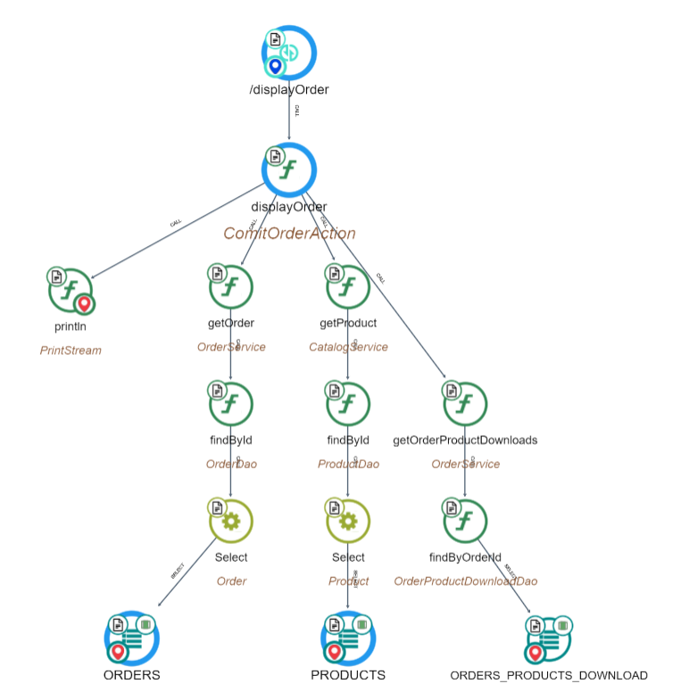
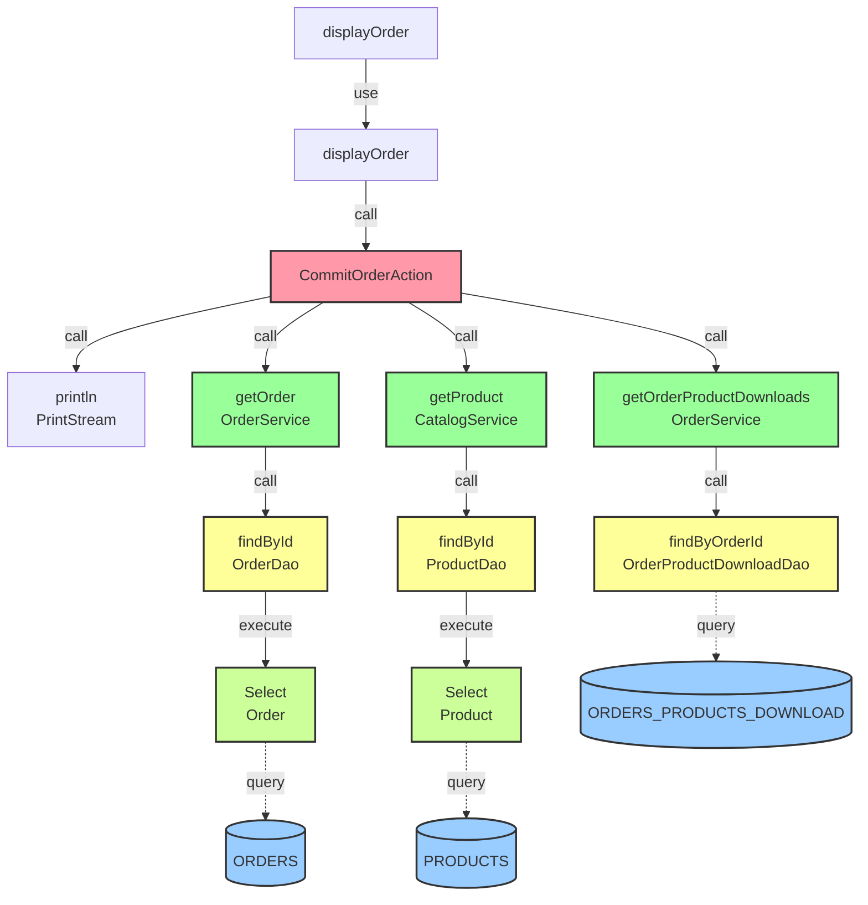

# Transaction : displayOrder

# 1\. Functional Overview

## 1.1 Summary (purpose)

- **Purpose**: show the details of a single order to a customer (from their profile/orders area) or an administrator — i.e., present a read‑only view of order details such as items, quantities, prices, shipping, payment and order status.
- Typical users: authenticated customer viewing their own order; possibly admin staff viewing any order.

Trigger / entry points (where invoked)

- Invoked by a web request mapped to a Struts action named displayOrder (or similar) — mapping defined in struts-customer.xml / struts-checkout.xml.
- Likely called from the orders listing page (customer profile -> orders) or from an order confirmation/thank‑you flow.

## **1.2 Inputs**

- Required: order identifier (orderId) passed as HTTP parameter or path variable.
- Context: authenticated user (session contains customer principal) or admin credentials.
- Optional: locale/currency from session for formatting.

## 1.3 Preconditions / authorisation checks

- Verify that the request is authenticated.
- If user is a customer: verify the requested order belongs to the logged-in customer; otherwise deny/redirect.
- If user is an admin: bypass customer ownership check but possibly check admin permission.

## 1.4 Core processing steps (business logic)

- Load order record by orderId via Order service / DAO.
- Load associated entities:
    - Ordered products (order items) — product ids, names, SKU, quantity, unit price, total price, product attributes.
    - Shipping details — shipping method, address, shipping cost.
    - Billing/payment details — payment method (mask sensitive), transaction id, status.
    - Order totals (subtotal, taxes, discounts, shipping, grand total).
    - Order history / status timeline and any notes.
    - Possibly invoice or shipment records (if present).
- Calculate or format display values if needed (taxes, localized currency formatting, weight/volumes if displayed).
- Populate a view model / request attributes with the above for the JSP / template.

## **1.5 Outputs / presentation**

- Forwards to a view (JSP or Tiles) that renders:
    - Header with order number, date, current status.
    - Line items table with product links, images, SKU, quantity, unit price, line totals.
    - Pricing summary block (subtotal, tax, shipping, total).
    - Shipping & billing addresses and shipping method.
    - Payment method and (partially masked) transaction id if applicable.
    - Order history / status updates and merchant notes.
- HTTP response: HTML page (200) or redirect/error page if not allowed or order missing.

## 1.6 Error handling

- If orderId missing or invalid -> redirect to orders list or show an error message.
- If order not found -> show a not‑found page or message.
- If user is not authorized to view the order -> redirect to login or show access denied.
- If backend error -> show a friendly error and log exception.

## 1.7 Non‑functional concerns

- Mask sensitive payment information.
- Avoid exposing internal IDs or data to non-authorized users.
- Cache or lazy‑load heavy related data only when needed (e.g., large invoice PDFs).
- Internationalization: format dates/currencies based on user locale.

## 1.8 Repository evidence and next steps

- I found related files by searching the repo (candidate places to inspect):
    - sm-shop/src/com/salesmanager/customer/profile/OrdersAction.java — likely contains actions used by the customer profile (open this to confirm displayOrder implementation).
    - sm-shop/WebContent/WEB-INF/classes/struts-customer.xml — likely maps the displayOrder action to OrdersAction or another Action class and the JSP.
    - Relevant JSP pages under sm-shop/WebContent/customer or sm-shop/WebContent/checkout that present order details (e.g., profile.jsp, order detail JSPs).

# 2\. Technical Overview

Here is what CAST Imaging shows for the displayOrder transaction in the eCommerce application.

## 2.1 displayOrder (Tx ID: 335341)

**Technologies and size:**

- Stack: apache struts, hibernate, java, java server pages, spring, sql
- Size: 187 nodes

**Start point:**

- Struts Operation: com.salesmanager.checkout.flow.ComitOrderAction/CAST_Struts_Operation/displayOrder (name: /displayOrder)

**Object purpose (from method documentation in Imaging):**

- displayOrder: “Display order details on the thank you page after a successful order completion”

**Core flow (reduced path):**

- /displayOrder (Struts) → displayOrder (Java Method)

**Key business/data retrieval branches:**

- Order retrieval path:
    - displayOrder → getOrder → findById → JPA Select → ORDERS (MySQL Table)
- Product details path:
    - displayOrder → getProduct → findById → JPA Select → PRODUCTS (MySQL Table)
- Downloadable items (digital content) path:
    - displayOrder → getOrderProductDownloads → findByOrderId → ORDERS_PRODUCTS_DOWNLOAD (MySQL Table)

**Presentation/utility calls observed from displayOrder:**

- Amount/format/locale: displayFormatedAmount, displayFormatedAmountNoCurrency, getFormatedAmount, getLocale, setLocale, getText, addActionError
- Session/request handling: getServletRequest, setAttribute
- Logging/console: println
- Order preparation: setTotals, setOrderStatusHistory, setOrderProductList, setOrderCommited, resetCart

**Data endpoints touched:**

- ORDERS (MySQL Table)
- PRODUCTS (MySQL Table)
- ORDERS_PRODUCTS_DOWNLOAD (MySQL Table)
- Java Method: println (marked as an end point)

**Notable complexity (cyclomatic/essential/integration):**

- displayOrder: 18/2/18
- findById (Order): 3/3/3
- findById (Product): 3/3/3
- findByOrderId (Downloads): 3/3/3
- getOrder: 1/1/1
- getProduct: 1/1/1
- getOrderProductDownloads: 1/1/1

**Quality insights observed (objects within this transaction):**

- Numerous Vulnerability insights on Struts-related classes/methods used by the flow (e.g., ActionSupport, ValidationAware, TextProvider, LocaleProvider, getText, addActionError, getSession), typically 56–57 per element
- Green - Blocker insights:
    - CatalogService (Java Class)
    - OrderService (Java Class)

**Notes:**

- The displayOrder Java method is called by the /displayOrder Struts operation (this transaction) and is also reachable from /displayInvoiceConfirmation, but the paths above reflect the /displayOrder transaction (Tx ID: 335341).
- JPA Entity Operations are present on the ORDERS and PRODUCTS branches (Select nodes).