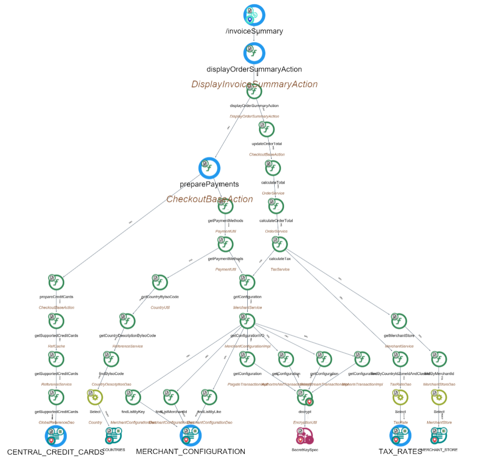

# Transaction : invoiceSummary

# 1\. Functional Overview

Below is a concise, developer‑oriented functional description of the "invoiceSummary" transaction (how the application handles the request to view/produce an invoice summary), assembled from the repository files and documentation related to the invoice/checkout flow. 1.1 Purpose

Let a user (customer or admin) request and view the invoice summary for a completed order (or a generated invoice), validate access, collect invoice and order details (line items, prices, taxes, shipping, payments), prepare view data (HTML or PDF), and return the rendered invoice summary page or confirmation to the client (and optionally trigger delivery such as email or PDF generation).

## 1.2 Actors

- Shopper / Customer (browser/client) — requests invoice from storefront (my orders) or receives after payment.
- Merchant/Admin (back-office) — views invoice list/details from admin UI.
- Front-end JSP/JS views (checkout flow, order history, admin invoice pages).
- Server-side Struts action (InvoiceAction) — controller handling invoice requests.
- Domain services and entities — OrderService / InvoiceService / PaymentService, Invoice entity, Order entity, Customer entity, Pricing/Tax services.
- Persistence layer (DAOs / Hibernate) — retrieving persisted invoices/orders.  
    (Sources: code listing paths and docs in repository: [InvoiceAction.java](http://InvoiceAction.java), invoice-related JSPs, admin invoice UI doc.)

## 1.3 Preconditions

- An order exists and has an associated invoice record (or the application can generate one from the order).
- The requesting session is valid (customer session or authenticated admin).
- The requester is authorized to view the invoice (owner of the order or an admin).
- Required configuration (currency, store context, locale) is available in session/context.

## 1.4 Typical input (request parameters / payload)

- invoiceId or orderId (identifier used to look up the invoice/order).
- customerId (implied from session or provided for admin views).
- storeCode / locale / currency (usually derived from user session/store context).
- view format flag (e.g., html, pdf, email) — optional.  
    Notes: exact parameter names are defined by the Struts mapping and InvoiceAction request handling. (See struts-checkout.xml and [InvoiceAction.java](http://InvoiceAction.java) in repository.)

## 1.5 High-level transaction flow (step-by-step)

1.  **Client request**

- Shopper/admin clicks “View Invoice” (from order history, confirmation page, admin invoice list) or is redirected after payment.
- Front-end issues HTTP request to an invoiceSummary action/URL mapped via Struts.

2.  **Request routing**

- Struts maps invoiceSummary URL to the server action (InvoiceAction) defined in struts-checkout.xml / Struts config.
- The action receives request parameters (invoiceId/orderId, store context).

3.  **Server-side processing & validation**

- InvoiceAction loads the invoice and/or order using OrderService/InvoiceService (DAO calls).
- Validate that invoice/order exists.
- Authorize access: ensure current user is the order owner or has admin privileges.
- Validate store/shop context (prevent cross-store data leaks).

4.  **Data aggregation and calculation**

- Gather line items, SKU/product references, quantities, unit prices.
- Recompute or verify totals: subtotal, discounts, taxes, shipping, order total (server-side pricing logic / PricingService / TaxService).
- Retrieve payment records and invoice status (paid, pending) from PaymentService.
- Format amounts to the current currency/locale.
- Optionally: prepare PDF render data or generate attachments (PDF invoice) and/or prepare email content.

5.  **Side effects / optional behavior**

- Possibly mark invoice as “viewed” or update an audit trail.
- Optionally queue/send invoice email to customer if action is used to trigger sending.
- Optionally create or update an invoice PDF in the file system or cloud storage.

6.  **Response rendering**

- Populate request / model with invoice data and render the appropriate JSP (invoice summary page or invoicePaymentConfirmation.jsp / invoice PDF).
- For API/AJAX flows: return JSON payload (status, invoice details, payment links).
- For full-page flows: forward to the invoice summary JSP with the model.

7.  **Client display**

- Browser shows invoice details (line items, totals, payment state, print/download link).
- If payment is pending, show payment action/links.

(Sources: Struts config files and InvoiceAction / JSP locations in repository; admin UI document describing invoice list and flows.)

## 1.6 **Data changes / side effects**

- Typically read-only for viewing; potential side effects:
    - Audit/log entry (viewed timestamp).
    - Marking invoice as “sent” or creating/persisting a generated PDF copy.
    - If used to trigger email/payment, it can produce persisted payment records or update invoice status.
- All price values must be authoritative server-side (prices not trusted from client).

## 1.7 Error handling

- Missing/invalid invoiceId or orderId → return 404/“Invoice not found” page or error message.
- Unauthorized access → 403 / redirect to login or “access denied” page.
- Service failures (DB down, service exceptions) → show friendly error and log details for debugging.
- Payment service errors (when invoiceSummary triggers payment actions) → surface payment-specific messages and allow retry.

## 1.8 Security and integrity

- Enforce authentication and authorization (only order owner or admin can view).
- Validate store context to avoid cross-store access.
- Always compute/verify prices server-side; do not trust client-supplied totals.
- Escape/format customer data in views to prevent XSS.
- If PDFs or downloadable content are generated, ensure URLs are protected or time-limited.

## 1.9 Observability

- Log access attempts (successful and failed) to InvoiceAction for debugging and audit.
- Log errors/exceptions with stack traces to aid triage.
- Optional: emit audit events for invoice generation/email/payment.
- Monitor metrics: number of invoice views, PDF generations, email sends.

## 1.10 Files and code locations to inspect (in this repository)

- **Controller / Action:**
    - sm-shop/src/com/salesmanager/checkout/invoice/[InvoiceAction.java](http://InvoiceAction.java) (main server action for invoice operations) — (code KB)
- **Struts / routing:**
    - sm-shop/WebContent/WEB-INF/classes/struts-checkout.xml (maps invoice-related URLs to actions) — (code KB)
    - sm-shop/WebContent/WEB-INF/classes/struts.xml (global Struts config) — (code KB)
- **Views / JSPs:**
    - sm-central/WebContent/invoice/invoicePaymentConfirmation.jsp (invoice payment/confirmation view) — (code KB)
    - check for invoice summary JSP(s) in sm-shop/WebContent/checkout or sm-central/WebContent/invoice — (repo)
- **Domain / models:**
    - sm-core/src/com/salesmanager/core/entity/orders/ws/[Invoice.java](http://Invoice.java) (invoice entity / ws model) — (code KB)
    - OrderService / PaymentService implementations under sm-core/src/com/salesmanager/core/service/order and payment service locations — (code KB)
- **Documentation:**
    - admin031_[description.md](http://description.md) — UX description of invoice list & admin invoice UI (helps understand admin flows) — (doc KB)
    - [OVERVIEW.md](http://OVERVIEW.md) — platform service overview (Order/Invoice services referenced) — (doc KB)

**Notes / caveats**

- This description condenses the common behavior of an invoice summary flow. Exact parameter names, endpoint URIs, JSP names, and side-effecting behaviors (e.g., whether viewing marks invoice as sent or triggers email) must be confirmed by inspecting:
    - [InvoiceAction.java](http://InvoiceAction.java) implementation and its method(s) handling "invoiceSummary", and
    - struts-checkout.xml mappings and the JSPs referenced by the action.
- The repository contains the listed files ([InvoiceAction.java](http://InvoiceAction.java), struts-checkout.xml, invoice JSPs, and admin UI doc) — review those files for precise request shapes, security checks, and any store-specific nuances. (Sources: repository code and docs listed above.)

# 2\. Technical Overview

Here is what CAST Imaging shows for the invoiceSummary transaction in the eCommerce application. There are two distinct invoiceSummary flows:

## 2.1 Struts-driven invoiceSummary (Tx ID: 335344)

**Technologies and size:**

- Stack: apache struts, spring, hibernate, java, java server pages, sql
- Size: 567 nodes

**Start point:**

- Struts Operation: com.salesmanager.checkout.flow.DisplayInvoiceSummaryAction/CAST_Struts_Operation/invoiceSummary (name: /invoiceSummary)

**Core flow (reduced path):**

- /invoiceSummary (Struts) → displayOrderSummaryAction (Java Method) → updateOrderTotal (Java Method) → calculateOrderTotal (Java Method) → calculateTax (Java Method)

**Merchant configuration and payment setup branches:**

- Configuration lookup:
    - getConfigurationVO → getConfiguration → findListByKey → MERCHANT_CONFIGURATION (MySQL Table)
- Payment methods:
    - prepareCreditCards → getPaymentMethods → getSupportedCreditCards
- Store/country info:
    - findByIsoCode → COUNTRIES (MySQL Table)
    - MERCHANT_STORE (MySQL Table)

**Data endpoints touched:**

- MERCHANT_CONFIGURATION (MySQL Table)
- MERCHANT_STORE (MySQL Table)
- COUNTRIES (MySQL Table)

**Notable complexity (cyclomatic/essential/integration):**

- calculateTax: 36/11/35
- calculateOrderTotal: 27/8/26
- getPaymentMethods: 29/10/26
- displayOrderSummaryAction: 7/2/7
- updateOrderTotal: 4/1/4
- getConfigurationVO: 9/7/8

**Quality insights observed (objects within this transaction):**

- Numerous Vulnerability insights on Struts framework classes/methods (e.g., TextProviderFactory, ActionSupport, ValidationAware, TextProvider, LocaleProvider, ActionContext, getText, setLocale, getSession, getContext), typically 56–57 per element
- Detection Pattern insights on calculateTax (7 occurrences)

## 2.2 JSP-driven invoiceSummary (Tx ID: 335621)

**Technologies and size:**

- Stack: apache struts, spring, hibernate, java, java server pages, sql, azure sdk for java
- Size: 1104 nodes

**Start point:**

- JSP Page: §{main_sources}§/Shopizer-src-1.1.5/sm-shop/WebContent/checkout/invoice/invoiceSummary.jsp (name: invoiceSummary.jsp)

**Core flow (reduced path):**

- invoiceSummary.jsp (JSP) → displayInvoice (Java Method) → updateOrderTotal → calculateOrderTotal → calculateTax

**Product enrichment, pricing, and catalog branches:**

- Product display and relations:
    - displayProduct → getProductRelationShip
- Category navigation and listing:
    - findCategoryByMerchantIdAndSeoURLAndByLang → getCategoryPath
    - findProductsByAvailabilityCategoriesIdAndMerchantIdAndLanguageId
    - findAttributesByProductId
- Pricing and currency validation:
    - getAmount → validateCurrency

Printing/external call branch:

- printInvoice → invokeGetUrl → HttpURLConnection (Java Class, marked as an end point)

**Configuration and reference data:**

- getConfigurationVO → getConfiguration → MERCHANT_CONFIGURATION (MySQL Table)
- Payment and card setup:
    - getPaymentMethods → getSupportedCreditCards
- CMS/labels:
    - DYNAMIC_LABEL (MySQL Table)
- Country reference:
    - COUNTRIES (MySQL Table)

**Data endpoints touched:**

- MERCHANT_CONFIGURATION (MySQL Table)
- DYNAMIC_LABEL (MySQL Table)
- COUNTRIES (MySQL Table)
- External endpoint via HttpURLConnection (end point)

**Notable complexity (cyclomatic/essential/integration):**

- displayLanding: 35/9/35
- displayProduct: 32/6/32
- setCategories: 30/9/30
- formatHTMLProductPriceWithAttributes: 30/4/30
- calculateOrderTotal: 27/8/26
- addAttributesToProduct: 23/11/23
- createOrderProduct: 21/11/21
- assembleShoppingCartItems: 19/9/18
- calculateOrderPrice: 19/1/19 and 15/1/15 (two variants)
- getAmount: 14/8/12
- addOrderProduct: 10/6/10
- calculateTax: 36/11/35

**Quality insights observed (objects within this transaction):**

- Numerous Vulnerability insights on Struts framework classes/methods used by the flow (e.g., TextProviderFactory, ActionSupport, ValidationAware, TextProvider, LocaleProvider, ActionContext, getText, addActionError, setActionErrors, setLocale, getSession, getContext), typically 56–57 per element

**Notes:**

- The Struts-driven flow (Tx 335344) focuses on computing and presenting the invoice summary via the Struts action path and prominently accesses merchant configuration, store, and country reference data.
- The JSP-driven flow (Tx 335621) is broader, weaving invoice display with product/category enrichment, pricing, CMS labels, and a printing path that performs an external HTTP call.