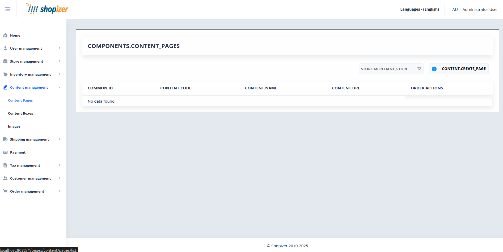

# Shopizer Content Management Interface

## 1\. Summary

This image depicts an administrative interface of the Shopizer e-commerce platform, specifically focusing on the content management section. The interface is designed to manage various aspects of content pages within the system.

## 2\. Metadata

- **File Path**: Shopizer source/images/UI/Administration/Content Management Module/admin023.png
- **File Size**: 0.09 MB
- **Dimensions**: 1893 x 950 pixels
- **Format**: PNG
- **Processed**: 2025-12-10T23:20:11.510652
- **Context**: Administration / Content Management Module

## 3\. Analysis Result COMPONENTS.CONTENT_PAGES

### Executive Summary

- **Screen Purpose**: This screen allows administrators to manage content pages within the Shopizer platform, specifically for creating, viewing, and managing content pages associated with a merchant store.
- **User Role**: Administrator User
- **Business Process**: Content Management
- **Screen Type**: List/Dashboard

### User Goals

1.  **Primary goal**: Create new content pages for the merchant store.
2.  **Secondary goal**: View existing content pages (if any) and manage them.
3.  **Tertiary goal**: Navigate to other content management sections like Content Boxes and Images.

### User Flow

Entry Points

- **Click 'Content management'** from the main navigation menu.
- **Select 'Content Pages'** from the sub-menu under Content management.

Main Flow

1.  **Step 1**: User arrives at the COMPONENTS.CONTENT_PAGES screen.
    - **System response**: Displays a list of content pages (empty state in this case).
2.  **Step 2**: User selects the store from the STORE.MERCHANT_STORE dropdown.
    - **System response**: The screen refreshes to show content pages associated with the selected store.
3.  **Step 3**: User clicks the CONTENT.CREATE_PAGE button.
    - **System response**: Navigates to the content page creation form.

### Exit Points

- **Success Path**: Navigates to the content page creation form after clicking CONTENT.CREATE_PAGE.
- **Cancel Path**: User can return to the Home screen or navigate to other management sections.
- **Error Path**: No specific error path visible in the current state.

## 4\. Interactive Elements

### Primary Actions

| Element | Action | Trigger | Result |
| --- | --- | --- | --- |
| CONTENT.CREATE_PAGE | Creates a new content page | Click | Navigates to the content page creation form |
| STORE.MERCHANT_STORE dropdown | Changes the selected store | Click and select | Refreshes the list to show content pages for the selected store |

### Navigation Elements

| Element | Destination | Condition |
| --- | --- | --- |
| Home | Home screen | Always visible |
| User management | User management screen | Always visible |
| Store management | Store management screen | Always visible |
| Inventory management | Inventory management screen | Always visible |
| Content management | Content management sub-menu | Always visible |
| Content Pages | Current screen | Selected in the sub-menu |
| Content Boxes | Content Boxes management screen | Click |
| Images | Images management screen | Click |
| Shipping management | Shipping management screen | Always visible |
| Payment | Payment management screen | Always visible |
| Tax management | Tax management screen | Always visible |
| Customer management | Customer management screen | Always visible |
| Order management | Order management screen | Always visible |

## 5\. Data Display

### Table Columns

| Column Name | Description |
| --- | --- |
| COMMON.ID | Unique identifier for each content page |
| CONTENT.CODE | Code associated with the content page |
| CONTENT.NAME | Name of the content page |
| CONTENT.URL | URL of the content page |
| ORDER.ACTIONS | Actions that can be performed on the content page (e.g., edit, delete) |

### Current State

- **No data found**: The table is currently empty, indicating there are no content pages for the selected store.

## 6\. Functional Analysis

### Create Functionality

- The CONTENT.CREATE_PAGE button allows administrators to create new content pages.
- This is likely the primary function of this screen, given the empty state and the prominent placement of the create button.

### Store Selection

- The STORE.MERCHANT_STORE dropdown allows administrators to switch between different stores.
- This indicates that the platform supports multi-store management.

### Navigation

- The left-hand navigation menu provides access to various management sections, indicating a comprehensive administrative interface.

## 7\. Technical Details

- **URL**: localhost:8082/#/pages/content/pages/list
- **Copyright**: Shopizer 2010-2025

## 8\. Functional Gaps and Observations

- **Empty State**: The screen is in an empty state with no data to display. This might be due to no content pages being created yet or the selected store having no content pages.
- **No Data Actions**: There are no visible actions for managing existing content pages since the table is empty.

This analysis provides a comprehensive overview of the COMPONENTS.CONTENT_PAGES screen, focusing on its functionality, user interactions, and navigational structure.

## 9\. Processing Notes

- Image validated successfully