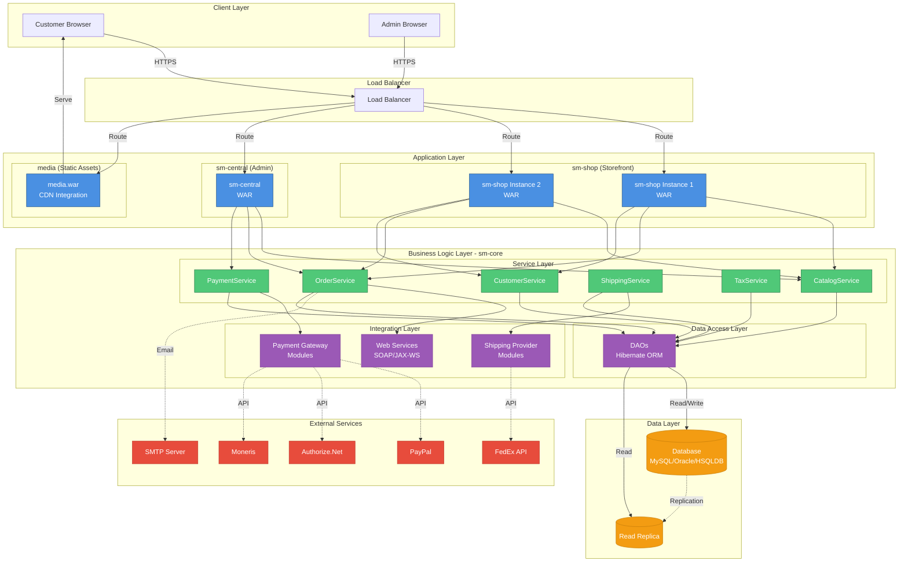
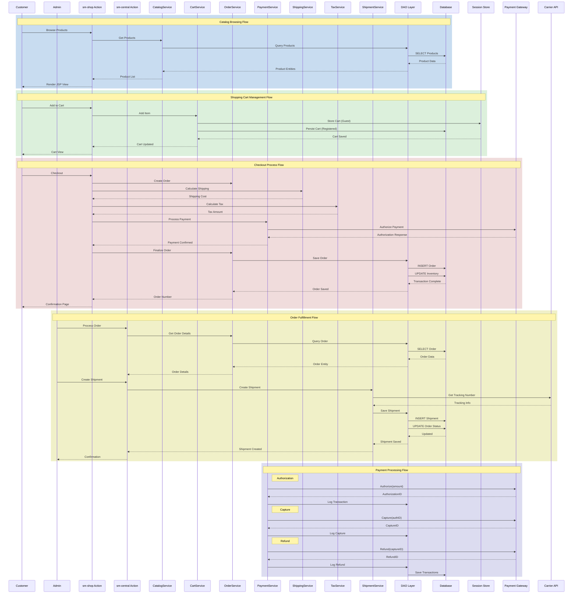
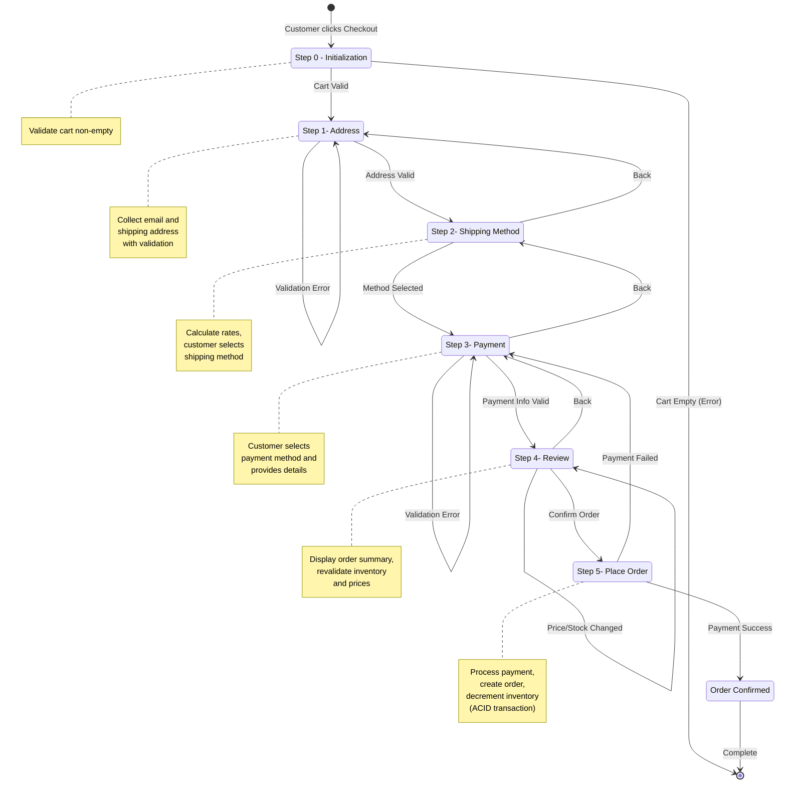
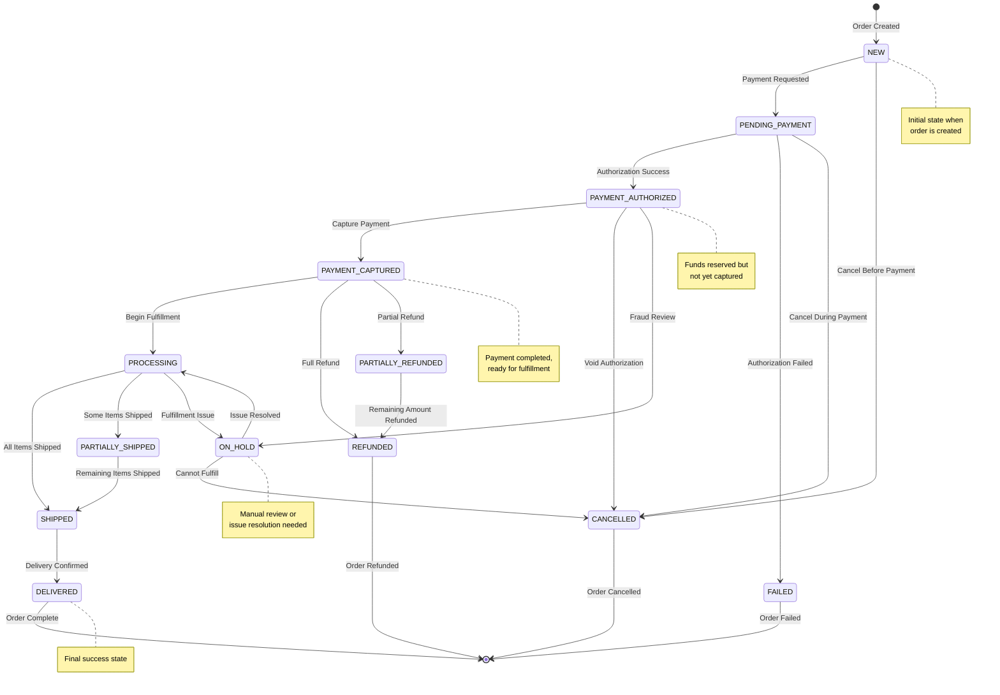
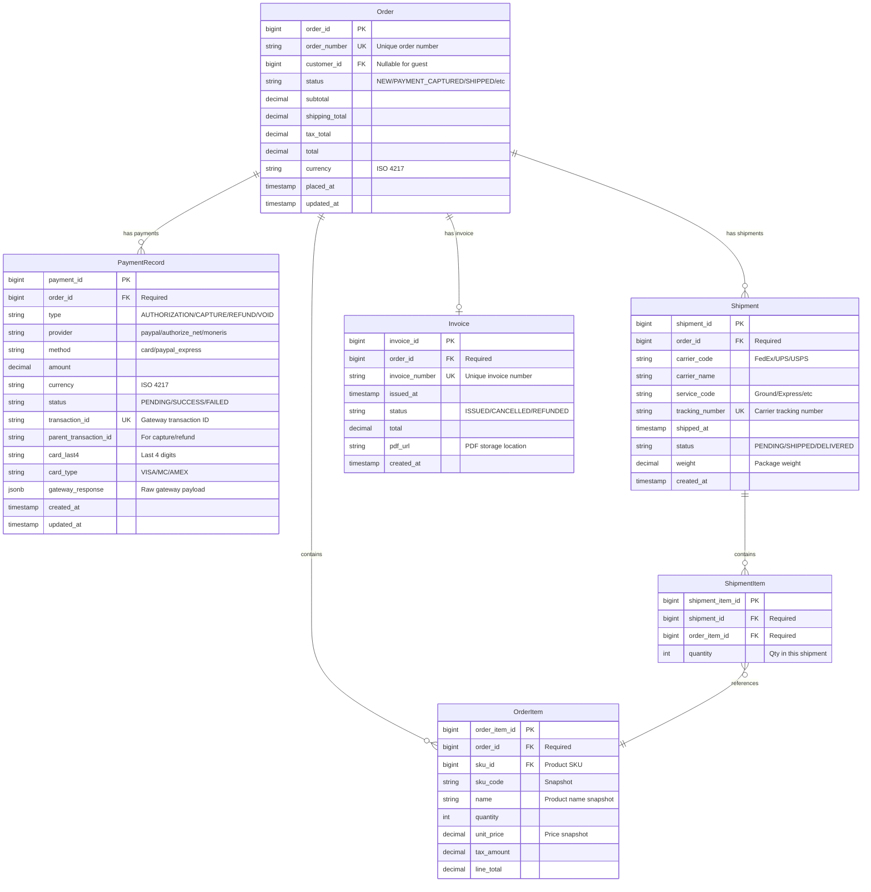
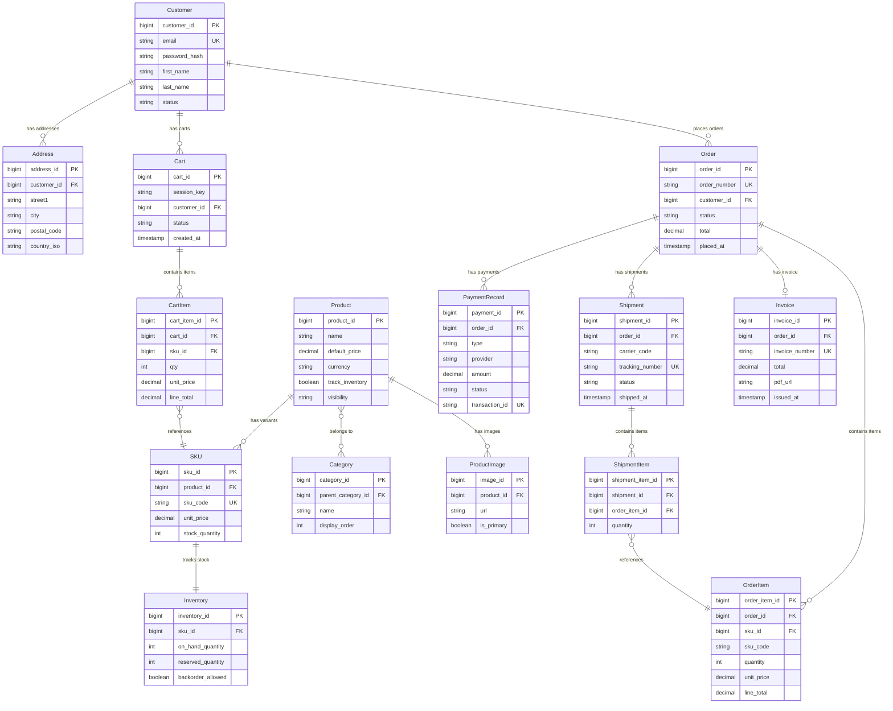
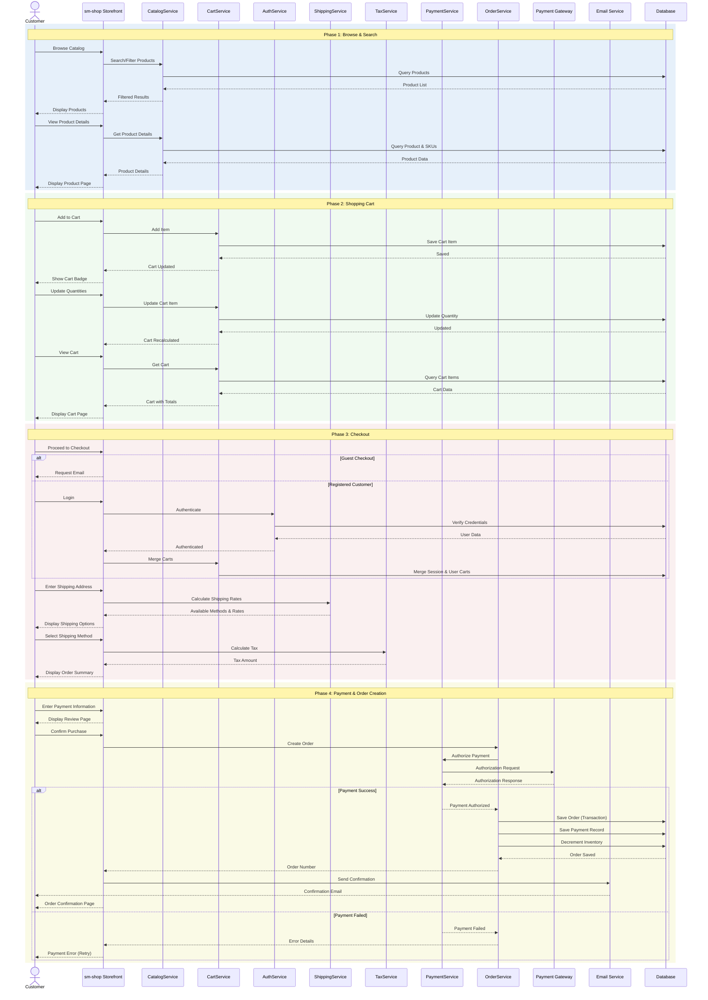
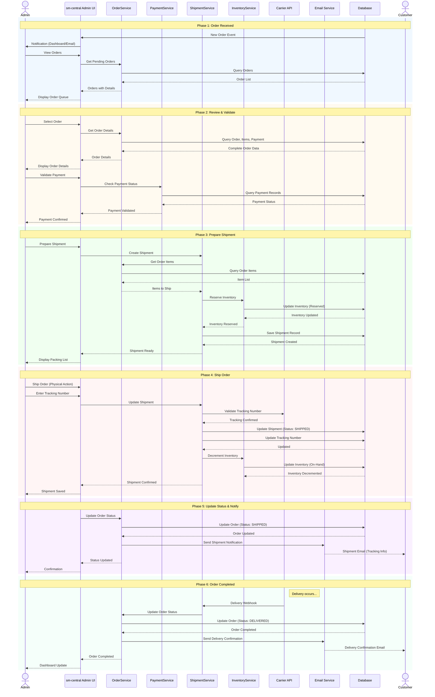

# Detailed Specifications

# Shopizer E-Commerce Platform

**Document Version:** 1.0  
**Date:** October 22, 2025  
**Project:** Shopizer v1.x E-Commerce Platform  
**Document Type:** Detailed Functional Specifications (DFS)

---

## Document Control

| Version | Date | Author | Changes |
| --- | --- | --- | --- |
| 1.0 | 2025-10-22 | System | Initial SFD document creation |

---

## 1\. Introduction and System Overview

### 1.1 Document Objective

This Software Functional Design (SFD) document provides comprehensive, detailed functional specifications for the Shopizer e-commerce platform. It serves as the authoritative reference for development teams, quality assurance engineers, system integrators, and business stakeholders to understand the complete functional behavior, business rules, data structures, user interfaces, and technical requirements of the system.

The document translates the high-level requirements outlined in the General Functional Specifications (SFG) into detailed, implementable specifications including:

- Complete feature specifications with actors, scenarios, and acceptance criteria
- Detailed business rules and validation logic
- Comprehensive data models with entity relationships and constraints
- User interface specifications and workflows
- System interfaces and integration points
- Error handling strategies and recovery procedures
- Security and compliance requirements
- Testing strategies and acceptance criteria

This document is intended to be used throughout the software development lifecycle, from initial implementation through testing, deployment, and ongoing maintenance.

### 1.2 Scope

The scope of this SFD encompasses all functional aspects of the Shopizer e-commerce platform, organized into four primary modules:

- **sm-core (Core Business Logic Module)**: Contains the domain model, service layer, data access objects (DAOs), and shared utilities that provide foundational business logic for all applications. This includes product catalog management, order processing, payment handling, shipping calculations, tax computations, customer management, and integration modules for external services.
- **sm-shop (Customer-Facing Storefront)**: The public-facing web application that enables customers to browse products, search the catalog, manage shopping carts, complete checkout processes, create and manage accounts, view order history, and track shipments. Built as a Struts 2 web application with JSP views.
- **sm-central (Administrative Back-Office)**: The merchant and administrator interface for managing all aspects of the e-commerce operation including product catalog management, order processing and fulfillment, customer service, store configuration, payment and shipping method setup, content management, user and role management, and reporting and analytics.
- **schema (Database Module)**: Database schema definitions, table structures, relationships, constraints, and seed data for supported RDBMS platforms (MySQL, Oracle, HSQLDB).

**In Scope**: Product catalog and category management, shopping cart and checkout workflows, order lifecycle management, payment gateway integrations (PayPal, [Authorize.Net](http://Authorize.Net), Moneris), shipping method configuration and carrier integrations, tax calculation, customer account management, administrative console, content management, multi-store support, internationalization and multi-currency, product search with Lucene/Hibernate Search, media management, email notifications, reporting and analytics, web services API (SOAP/JAX-WS).

**Out of Scope**: Native mobile applications (iOS/Android), advanced marketing automation, built-in social media integration beyond basic configuration, advanced analytics and business intelligence dashboards, subscription and recurring billing without customization, multi-vendor marketplace functionality, real-time inventory synchronization with external systems without custom integration.

### 1.3 Target Audience

This document is intended for the following audiences:

- **Development Teams**: Software engineers implementing features, customizations, and integrations who require detailed specifications of business logic, data structures, and technical requirements.
- **Quality Assurance Engineers**: QA professionals designing test plans, test cases, and validation procedures who need comprehensive acceptance criteria and expected system behaviors.
- **System Architects**: Technical architects designing system integrations, infrastructure, and deployment strategies who require understanding of system interfaces and technical constraints.
- **Business Analysts**: Analysts validating that implemented functionality meets business requirements and documenting system behavior for stakeholders.
- **Project Managers**: Project leads planning development sprints, estimating effort, and tracking progress against detailed functional requirements.
- **Technical Writers**: Documentation specialists creating user guides, API documentation, and operational procedures.
- **Security and Compliance Teams**: Security professionals conducting assessments, audits, and ensuring compliance with PCI DSS and other regulatory requirements.

### 1.4 Glossary and Definitions

| Term / Acronym | Definition |
| --- | --- |
| **ABAC** | Attribute-Based Access Control - fine-grained access control based on attributes |
| **Add to Cart** | Action of adding a product to the shopping cart for potential purchase |
| **Admin Console** | Back-office web application (sm-central) used by merchants and administrators |
| **API** | Application Programming Interface - programmatic interface for system integration |
| **ASV** | Approved Scanning Vendor - PCI DSS authorized security scanning service |
| **Attribute** | Product characteristic such as size, color, or material with multiple values |
| **Authorization** | Process of verifying user permissions to perform specific actions |
| **Backorder** | Order for out-of-stock items fulfilled when inventory is replenished |
| **Billing Address** | Customer address used for payment processing and invoicing |
| **Cart Line Item** | Individual product entry in shopping cart including SKU, quantity, and price |
| **Category** | Logical grouping of products for organization and navigation |
| **CDN** | Content Delivery Network - infrastructure for serving static media assets |
| **Checkout** | Multi-step process of converting a shopping cart into a completed order |
| **CSRF** | Cross-Site Request Forgery - web security vulnerability |
| **Customer** | Registered or guest user who browses products and places orders |
| **DAO** | Data Access Object - design pattern for abstracting persistence operations |
| **Discount** | Reduction in product or order price based on promotional rules |
| **ERD** | Entity Relationship Diagram - visual representation of data model |
| **Fulfillment** | Process of preparing and shipping an order to the customer |
| **Gateway** | External service that processes payments or provides shipping rates |
| **Guest Checkout** | Checkout process allowing purchase without customer registration |
| **Hibernate** | Object-relational mapping (ORM) framework for database persistence |
| **HSM** | Hardware Security Module - physical device for cryptographic key management |
| **HTTPS** | HTTP Secure - encrypted HTTP protocol using TLS/SSL |
| **Inventory** | Quantity of products available for sale |
| **Invoice** | Document representing order details, line items, and payment information |
| **IPN** | Instant Payment Notification - asynchronous payment gateway callback |
| **JAAS** | Java Authentication and Authorization Service - security framework |
| **JWT** | JSON Web Token - compact token format for authentication |
| **KMS** | Key Management Service - cloud-based cryptographic key management |
| **Line Item** | Individual product entry in an order or cart |
| **Merchant** | Store owner or operator who manages products, orders, and configuration |
| **MFA** | Multi-Factor Authentication - authentication using multiple verification methods |
| **OAuth2** | Open standard for access delegation and authorization |
| **Order** | Persisted transaction containing customer information, products, and payment details |
| **Order Lifecycle** | Progression of order through states (NEW, PAID, SHIPPED, COMPLETED, CANCELLED) |
| **ORM** | Object-Relational Mapping - technique for database interaction using objects |
| **PAN** | Primary Account Number - credit card number |
| **Payment Authorization** | Process of reserving funds on a payment method |
| **Payment Capture** | Process of actually charging the authorized payment |
| **PCI DSS** | Payment Card Industry Data Security Standard - security standards for payment card data |
| **Product** | Sellable item in the catalog with attributes, price, and inventory |
| **Promotion** | Marketing campaign offering discounts or special pricing |
| **RBAC** | Role-Based Access Control - access control based on user roles |
| **Refund** | Return of payment to customer for canceled or returned order |
| **RMA** | Return Merchandise Authorization - approval for product return |
| **ROC** | Report on Compliance - PCI DSS compliance documentation |
| **SAQ** | Self-Assessment Questionnaire - PCI DSS compliance questionnaire |
| **SAST** | Static Application Security Testing - code analysis for vulnerabilities |
| **Shipping Address** | Customer address where order will be delivered |
| **Shipping Method** | Delivery option with associated cost and estimated delivery time |
| **SIEM** | Security Information and Event Management - centralized logging and monitoring |
| **SKU** | Stock Keeping Unit - unique identifier for a specific product or variant |
| **sm-central** | Administrative web application module |
| **sm-core** | Core business logic and service layer module |
| **sm-shop** | Customer-facing storefront web application module |
| **SOAP** | Simple Object Access Protocol - XML-based web services protocol |
| **SQL Injection** | Security vulnerability allowing malicious SQL code execution |
| **SSO** | Single Sign-On - authentication across multiple systems with one login |
| **Storefront** | Public-facing website where customers browse and purchase products |
| **Struts 2** | MVC web framework used for presentation layer |
| **Tax** | Government-imposed charge calculated based on order value and location |
| **TDE** | Transparent Data Encryption - database-level encryption |
| **TLS** | Transport Layer Security - cryptographic protocol for secure communication |
| **TOTP** | Time-based One-Time Password - MFA method using time-synchronized codes |
| **Variant** | Specific version of a product with unique attributes (e.g., size, color) |
| **WAR** | Web Application Archive - packaged Java web application for deployment |
| **XSS** | Cross-Site Scripting - web security vulnerability allowing script injection |

### 1.5 Context Summary

Shopizer is an open-source, Java-based e-commerce platform designed to provide a complete online store solution for organizations requiring self-hosted, customizable e-commerce capabilities. The platform targets small-to-medium businesses, enterprise organizations, and development teams that prefer code-level control and customization over hosted SaaS solutions.

The platform operates in a multi-tier architecture with clear separation between presentation, business logic, and data access layers. It leverages mature enterprise Java technologies including Struts 2 for MVC, Spring for dependency injection and transaction management, Hibernate 3 for ORM, and JAAS for security. Applications are deployed as WAR files to servlet containers (Tomcat, JBoss) with support for multiple RDBMS platforms (MySQL, Oracle, HSQLDB).

Key business capabilities include comprehensive product catalog management with categories and variants, shopping cart and checkout workflows supporting both guest and registered customers, order lifecycle management from creation through fulfillment, payment processing with multiple gateway integrations, shipping and tax calculations, customer account management, administrative tools for merchants and store managers, content management for static pages, multi-store support for operating multiple independent storefronts, and internationalization with multi-currency support.

The platform serves multiple user personas including merchants and store owners who manage catalogs and configure stores, store administrators who process orders and handle customer service, developers and system integrators who customize and extend the platform, end customers who browse and purchase products, and back-office staff who fulfill orders and manage operations.

### 1.7 Functional Architecture

#### 1.7.1 High-Level Architecture

The Shopizer platform employs a modular, layered architecture organized into four primary deployable modules:

- **sm-core (Core Module)** provides the foundational business logic consumed by all applications. It contains the domain model with entity classes (Product, Order, Customer, Category), service layer with business logic organized by domain (CatalogService, OrderService, PaymentService, ShippingService, TaxService, CustomerService), data access layer with Hibernate-based DAOs for persistence operations, integration modules for payment gateways and shipping providers, web services implementations (SOAP/JAX-WS), and utility classes for encryption, session management, and file handling.
- **sm-shop (Storefront Application)** is the customer-facing web application implementing the public storefront. Built as a Struts 2 web application with JSP views and packaged as sm-shop.war, it provides product catalog browsing and search, shopping cart management with AJAX updates, multi-step checkout workflow, customer account management with registration and login, order history and tracking, payment gateway interactions, and responsive product pages with category navigation.
- **sm-central (Administrative Application)** is the back-office web application for merchant and store administration. Also built on Struts 2 and packaged as sm-central.war, it provides merchant dashboard with key metrics and analytics, product and category management with CRUD operations, order processing and fulfillment tools, customer management and service capabilities, store configuration and settings, payment and shipping method configuration, content management system for static pages, user and role management with RBAC, and reporting and analytics capabilities.
- **schema (Database Module)** contains SQL scripts for creating and initializing database schemas across supported RDBMS platforms. It includes table definitions with constraints and indexes, entity relationships with foreign keys, seed data for reference tables, and migration scripts for schema updates.
- **media (Media Application)** is a lightweight web application for serving static assets including product images, CSS, JavaScript, and downloadable files. Deployed separately as media.war to enable CDN offloading and independent scaling.

#### 1.7.2 Layered Architecture

The platform follows a strict layered architecture pattern:

```mermaid
graph TB
    subgraph "Presentation Layer"
        Actions[Struts 2 Actions]
        JSP[JSP Views]
        Actions <--> JSP
    end
    
    subgraph "Service Layer"
        CatalogSvc[CatalogService]
        OrderSvc[OrderService]
        CustomerSvc[CustomerService]
        PaymentSvc[PaymentService]
        ShippingSvc[ShippingService]
        TaxSvc[TaxService]
    end
    
    subgraph "Data Access Layer"
        ProductDAO[ProductDAO]
        OrderDAO[OrderDAO]
        CustomerDAO[CustomerDAO]
        PaymentDAO[PaymentDAO]
        HibernateMapping[Hibernate Mappings<br/>.hbm.xml]
    end
    
    subgraph "Integration Layer"
        PaymentModules[Payment Gateway<br/>Modules]
        ShippingModules[Shipping Provider<br/>Modules]
        WebServiceLayer[Web Services<br/>SOAP/JAX-WS]
    end
    
    subgraph "Cross-Cutting Concerns"
        Spring[Spring Framework<br/>DI & Transactions]
        JAAS[JAAS<br/>Auth & Authz]
        HibernateSearch[Hibernate Search<br/>Lucene]
        C3P0[C3P0<br/>Connection Pool]
    end
    
    subgraph "Data Layer"
        DB[(Database<br/>MySQL/Oracle/HSQLDB)]
    end
    
    subgraph "External Systems"
        PaymentGW[Payment Gateways]
        ShippingAPI[Shipping APIs]
        ExternalClients[External Clients]
    end
    
    %% Presentation to Service
    Actions -->|Delegate| CatalogSvc
    Actions -->|Delegate| OrderSvc
    Actions -->|Delegate| CustomerSvc
    Actions -->|Delegate| PaymentSvc
    
    %% Service to DAO
    CatalogSvc -->|Use| ProductDAO
    OrderSvc -->|Use| OrderDAO
    CustomerSvc -->|Use| CustomerDAO
    PaymentSvc -->|Use| PaymentDAO
    
    %% Service to Integration
    PaymentSvc -->|Use| PaymentModules
    ShippingSvc -->|Use| ShippingModules
    OrderSvc -->|Expose| WebServiceLayer
    
    %% DAO to Database
    ProductDAO -->|Query| DB
    OrderDAO -->|Query| DB
    CustomerDAO -->|Query| DB
    PaymentDAO -->|Query| DB
    HibernateMapping -.->|Map| ProductDAO
    HibernateMapping -.->|Map| OrderDAO
    
    %% Integration to External
    PaymentModules -.->|API Calls| PaymentGW
    ShippingModules -.->|API Calls| ShippingAPI
    WebServiceLayer <-.->|SOAP| ExternalClients
    
    %% Cross-cutting to layers
    Spring -.->|Inject & Manage| CatalogSvc
    Spring -.->|Inject & Manage| OrderSvc
    Spring -.->|Transactions| ProductDAO
    JAAS -.->|Secure| Actions
    HibernateSearch -.->|Index| ProductDAO
    C3P0 -.->|Pool| DB
    
    classDef presentation fill:#4A90E2,stroke:#2E5C8A,color:#fff
    classDef service fill:#50C878,stroke:#2E7D4E,color:#fff
    classDef dao fill:#F39C12,stroke:#C87F0A,color:#fff
    classDef integration fill:#9B59B6,stroke:#7D3C98,color:#fff
    classDef crosscut fill:#95A5A6,stroke:#7F8C8D,color:#fff
    classDef data fill:#E67E22,stroke:#CA6F1E,color:#fff
    classDef external fill:#E74C3C,stroke:#C0392B,color:#fff
    
    class Actions,JSP presentation
    class CatalogSvc,OrderSvc,CustomerSvc,PaymentSvc,ShippingSvc,TaxSvc service
    class ProductDAO,OrderDAO,CustomerDAO,PaymentDAO,HibernateMapping dao
    class PaymentModules,ShippingModules,WebServiceLayer integration
    class Spring,JAAS,HibernateSearch,C3P0 crosscut
    class DB data
    class PaymentGW,ShippingAPI,ExternalClients external
```

- **Presentation Layer** consists of Struts 2 actions and JSP views that handle HTTP requests, form processing, and response rendering. Actions delegate to the service layer for business operations and never directly access DAOs or perform business logic.
- **Service Layer** contains Spring-managed service beans that implement business logic and orchestrate transactions. Services are grouped by domain (catalog, orders, customers, payments, shipping, taxes) and provide coarse-grained operations. All service methods are transactional and handle cross-cutting concerns through Spring AOP.
- **Data Access Layer** provides Hibernate-based DAOs for persistence operations. Hibernate mappings (.hbm.xml files) define entity-to-table mappings and relationships. DAOs provide CRUD operations and custom queries but contain no business logic.
- **Integration Layer** consists of pluggable modules for payment gateways, shipping providers, and external services. Web services layer exposes functionality to external systems via SOAP/JAX-WS endpoints. Integration modules implement provider-specific interfaces and handle protocol details.
- **Cross-Cutting Concerns** are handled by Spring (dependency injection and transaction management), JAAS (authentication and authorization), Hibernate Search (full-text search with Lucene integration), and C3P0 (connection pooling).

#### 1.7.3 Component Interactions

Key interaction patterns include:

- **Catalog Browsing**: Customer → sm-shop Action → CatalogService → ProductDAO → Hibernate → Database. Product data retrieved and rendered in JSP views with category navigation and search capabilities.
- **Shopping Cart Management**: Customer → sm-shop CartAction → CartService → Session/Database. Cart persisted in session for guests and database for registered customers with merge logic on login.
- **Checkout Process**: Customer → sm-shop CheckoutAction → OrderService + PaymentService + ShippingService + TaxService → Payment Gateway → OrderDAO → Database. Multi-step workflow with validation at each step, payment authorization, order creation, and inventory decrement in transactional context.
- **Order Fulfillment**: Admin → sm-central OrderAction → OrderService → ShipmentService → Carrier API → OrderDAO → Database. Order status updates, shipment creation, tracking number capture, and customer notifications.
- **Payment Processing**: System → PaymentService → Payment Gateway Adapter → External Gateway API. Authorization, capture, refund, and void operations with transaction logging and reconciliation.

### 1.8 General Principles

The Shopizer platform adheres to the following design and implementation principles:

1.  **Separation of Concerns**: Clear boundaries between presentation, business logic, and data access layers. Each layer has specific responsibilities and dependencies flow downward only.
2.  **Transaction Management**: All state-changing operations are transactional. Service layer methods are annotated with @Transactional to ensure ACID properties. Compensating transactions handle cross-system failures.
3.  **Data Integrity**: Referential integrity enforced at database level through foreign key constraints. Soft deletes used for entities referenced in order history. Optimistic locking prevents concurrent modification issues.
4.  **Price and Tax Snapshotting**: Prices, taxes, and shipping costs captured at order time and stored with order items to preserve historical accuracy regardless of future price changes.
5.  **Idempotency**: Critical operations (order creation, payment capture) use idempotency keys to prevent duplicate execution on retries or network failures.
6.  **Validation**: Server-side validation is authoritative. Client-side validation provides user experience enhancement but is never relied upon for security or data integrity.
7.  **Security by Default**: All administrative functions require authentication and appropriate role-based permissions. Customer data and payment information protected according to security best practices and PCI DSS requirements.
8.  **Extensibility**: Pluggable architecture for payment gateways, shipping providers, and tax calculators. New implementations added by implementing provider interfaces without modifying core code.
9.  **Internationalization**: Multi-language support with locale-specific content. Multi-currency pricing and display. Localized date and number formatting. Configurable default language and currency per store.
10. **Audit Trail**: All critical operations logged with actor, timestamp, and details. Order status transitions recorded in order history. Payment transactions logged with gateway responses for reconciliation.

### 1.9 Technical and Business Constraints

#### 1.9.1 Technical Constraints

| Constraint Category | Requirements | Details |
| --- | --- | --- |
| **Technology Stack** | Java JDK 1.5+ | Java 8 or 11 LTS recommended for production |
|     | Servlet Container | Tomcat 6+, JBoss/WildFly, or other Java EE compliant containers |
|     | Database | MySQL 5.x+, Oracle 10g+, HSQLDB (development only) |
|     | Build Tool | Apache Ant for build automation |
| **Framework Versions** | Struts 2 | MVC web framework for presentation layer |
|     | Spring Framework | Dependency injection and transaction management |
|     | Hibernate 3 | ORM and persistence layer |
|     | Note | Mature but aging frameworks; may require technology refresh for cloud-native compatibility |
| **Session Management** | Guest Users | Session-based cart storage (in-memory) |
|     | Registered Users | Optional database persistence for cart |
|     | Scaling Strategy | Requires session externalization (Redis, database, or sticky sessions) |
| **Database Compatibility** | Portability | Schema compatible with multiple RDBMS platforms |
|     | SQL Standards | Database-specific features avoided |
|     | ORM Mappings | Hibernate mappings (.hbm.xml) for portability |
| **Build and Deployment** | Packaging | WAR (Web Application Archive) files |
|     | Build Process | Apache Ant build scripts |
|     | Deployment | Servlet container configuration and database provisioning required |

#### 1.9.2 Business Constraints

| Constraint | Description | Impact |
| --- | --- | --- |
| **Infrastructure Investment** | Organizations must provision and maintain hosting infrastructure including application servers, database servers, and supporting infrastructure | Requires upfront capital investment and ongoing operational expertise |
| **Technical Expertise Dependency** | Successful deployment and customization requires expertise in enterprise Java technologies (Java EE, Struts, Spring, Hibernate) | May limit adoption by organizations without specialized Java development talent |
| **Desktop-Centric Administration** | Administrative interface optimized for desktop web browsers | Mobile device management capabilities limited, impacting operational flexibility for mobile-first organizations |
| **Self-Support Model** | As open-source platform, organizations assume responsibility for troubleshooting, security patching, and issue resolution | No vendor-provided SLAs or guaranteed support response times |
| **PCI Compliance Responsibility** | Organizations storing or processing payment card data must achieve and maintain PCI DSS compliance | Compliance responsibility falls on deploying organization, not platform vendor |
| **Customization Maintenance** | Customizations and extensions may require rework during platform upgrades | Organizations must balance customization needs with upgrade path maintenance |

---

## 2\. Detailed Feature Specifications

### 2.1 Product Catalog Management

**Feature Summary**: Comprehensive product catalog management with support for simple and configurable products, variants, categories, images, pricing, and inventory tracking. Detailed specifications provided in Section 1.9 above include actors (Merchant, Catalog Manager, Inventory Manager), prerequisites (authentication, store context, database schema, media storage), scenarios (create simple product, create with variants, edit, delete, bulk import), business rules (SKU uniqueness, required fields, pricing rules, inventory rules, visibility rules), UI specifications (product list, create/edit screens with tabs), data structures (Product, SKU, ProductImage, Category entities), validation rules (SKU 3-64 chars unique, name required, price >=0, stock >=0), and 15 acceptance criteria covering CRUD operations, inventory integration, security, and performance.

**Key Business Rules**:

- SKU must be unique per store
- Required fields: name, SKU, price for published products
- Price must be non-negative decimal
- Inventory tracking optional; if enabled, stock decremented on order completion
- Soft delete preferred to preserve order history
- Product visibility controls storefront display

**Key Acceptance Criteria**:

- AC1: Create product with required fields persists correctly
- AC2: Duplicate SKU rejected with error message
- AC8: Inventory decrements on order completion
- AC9: Insufficient stock prevents checkout when backorders disabled
- AC13: Bulk import processes valid rows and reports invalid rows

### 2.2 Shopping Cart and Checkout

**Feature Summary**: Session-based shopping cart for guests and persistent cart for registered customers, with multi-step checkout workflow supporting guest and registered paths. Includes cart management (add/remove/update items), cart persistence and merging on login, multi-step checkout (address → shipping → payment → review), payment gateway integration (PayPal, [Authorize.Net](http://Authorize.Net), Moneris), order creation with ACID transaction, and cart abandonment detection.

**Actors**: Merchant/Store Admin, Registered Customer, Guest Customer, Payment Gateway, System/Scheduler

**Prerequisites**: Authentication configured, store settings (currency, tax/shipping rules), database schema, HTTPS enabled, payment gateway credentials

**. Checkout Workflow**:

1.  **Step 0 - Initialization**: Validate cart non-empty
2.  **Step 1 - Address**: Collect email and shipping address with validation
3.  **Step 2 - Shipping Method**: Calculate rates, customer selects method
4.  **Step 3 - Payment**: Customer selects payment method and provides details
5.  **Step 4 - Review**: Display order summary, revalidate inventory/prices
6.  **Step 5 - Place Order**: Process payment, create order, decrement inventory (transactional)

**. Business Rules**:

- Cart persistence: session-based for guests, database for registered users
- Cart expiration: 30 days for guest carts
- Cart merge on login: combine items by SKU, sum quantities
- Inventory validation at add-to-cart and at order placement
- Price snapshotting: store unit price in cart item
- Idempotency: prevent duplicate orders on retry
- Payment authorization before order creation
- Atomic transaction: order creation + payment + inventory decrement

**. Data Structures**:

- Cart: id, sessionId, customerId, items, coupons, totals, status
- CartItem: cartId, sku, qty, unitPrice, lineTotal
- Order: orderId, orderNumber, customerId, status, items, payments, totals
- OrderItem: orderId, sku, qty, unitPrice, taxAmount, lineTotal
- PaymentRecord: orderId, type, provider, amount, transactionId, status

**. Key Acceptance Criteria**:

- AC1: Adding product to cart creates cart item with correct quantity and price
- AC4: Guest cart persists across browser sessions within TTL
- AC5: Cart merge on login combines items correctly
- AC9: Successful payment creates order with PAYMENT_CAPTURED status
- AC10: Order creation is atomic (order + payment + inventory in transaction)

### 2.3 Order Management and Payment Processing

**Feature Summary**: Complete order lifecycle management from creation through fulfillment, with payment operations (authorize, capture, refund, void), multiple payment gateway integrations, invoice generation, order search/filtering, status tracking, and reconciliation procedures.

**. Order Lifecycle States**:

**. Payment Operations**:

- **Authorize**: Place hold on funds, returns authorizationId
- **Capture**: Charge authorized funds (full or partial)
- **Sale**: Authorize + Capture in single operation
- **Void**: Cancel authorization before capture
- **Refund**: Return captured funds (full or partial)

**. Payment Gateway Integrations**:

- **PayPal**: Express Checkout (redirect flow), REST API, webhook handling
- [**Authorize.Net**](http://Authorize.Net): AIM (direct), Accept Hosted (redirect), signed requests
- **Moneris**: Hosted PayPage, Direct Post, tokenization

**. Invoice Management**:

- Generate on order capture or admin action
- PDF generation with order details, line items, totals
- Unique invoice numbering per store
- Support for partial invoicing (per shipment)
- Storage in database with PDF reference

**. Order Search Capabilities**:

- Search by: order number, customer name/email, SKU, transaction ID, status, date range, amount range
- Filters: status, payment status, date range, store
- Full-text search on customer and product names
- Export to CSV

**. Fulfillment Workflows**:

```mermaid
graph LR
    subgraph "Standard Fulfillment Workflow"
        OrderReceived[Order Received]
        Pick[Pick Items from Warehouse]
        Pack[Pack Items]
        Ship[Ship Package]
        Notify[Notify Customer]
        Complete[Order Complete]
        
        OrderReceived --> Pick
        Pick --> Pack
        Pack --> Ship
        Ship --> Notify
        Notify --> Complete
    end
    
    subgraph "Partial Shipment Workflow"
        OrderPartial[Order Received]
        CheckStock{All Items<br/>Available?}
        CreateShipment1[Create Shipment 1<br/>Available Items]
        CreateShipment2[Create Shipment 2<br/>Backordered Items]
        Ship1[Ship Partial Order]
        Ship2[Ship Remaining Items]
        NotifyPartial1[Notify: Partial Shipment]
        NotifyPartial2[Notify: Final Shipment]
        CompletePartial[Order Complete]
        
        OrderPartial --> CheckStock
        CheckStock -->|No| CreateShipment1
        CreateShipment1 --> Ship1
        Ship1 --> NotifyPartial1
        NotifyPartial1 --> CreateShipment2
        CreateShipment2 --> Ship2
        Ship2 --> NotifyPartial2
        NotifyPartial2 --> CompletePartial
    end
    
    subgraph "Returns/RMA Workflow"
        CustomerRequest[Customer Requests Return]
        CreateRMA[Create RMA Authorization]
        ApproveRMA{Approve<br/>Return?}
        SendInstructions[Send Return Instructions]
        ReceiveReturn[Receive Returned Items]
        InspectItems{Items<br/>Acceptable?}
        ProcessRefund[Process Refund]
        RestockInventory[Restock Inventory]
        NotifyRefund[Notify Customer: Refund]
        RMAComplete[RMA Complete]
        RejectRMA[Reject Return Request]
        
        CustomerRequest --> CreateRMA
        CreateRMA --> ApproveRMA
        ApproveRMA -->|Yes| SendInstructions
        ApproveRMA -->|No| RejectRMA
        SendInstructions --> ReceiveReturn
        ReceiveReturn --> InspectItems
        InspectItems -->|Pass| ProcessRefund
        InspectItems -->|Fail| RejectRMA
        ProcessRefund --> RestockInventory
        RestockInventory --> NotifyRefund
        NotifyRefund --> RMAComplete
    end
    
    classDef standard fill:#4A90E2,stroke:#2E5C8A,color:#fff
    classDef partial fill:#50C878,stroke:#2E7D4E,color:#fff
    classDef rma fill:#F39C12,stroke:#C87F0A,color:#fff
    classDef decision fill:#E74C3C,stroke:#C0392B,color:#fff
    
    class OrderReceived,Pick,Pack,Ship,Notify,Complete standard
    class OrderPartial,CreateShipment1,CreateShipment2,Ship1,Ship2,NotifyPartial1,NotifyPartial2,CompletePartial partial
    class CustomerRequest,CreateRMA,SendInstructions,ReceiveReturn,ProcessRefund,RestockInventory,NotifyRefund,RMAComplete,RejectRMA rma
    class CheckStock,ApproveRMA,InspectItems decision
```

- Standard: Order → Pick → Pack → Ship → Notify
- Partial shipment: Create multiple shipments, track separately
- Returns/RMA: Create return authorization, process refund on receipt

**. Key Business Rules**:

- Payment must be authorized before order confirmation
- Capture may be immediate or deferred based on configuration
- Refunds require prior capture
- Cancellation before capture uses void; after capture requires refund
- Order status transitions follow defined state machine
- All payment operations logged with transaction IDs
- Daily reconciliation with gateway settlement reports

**. Data Structures**:

- PaymentRecord: id, orderId, type (AUTHORIZATION/CAPTURE/REFUND/VOID), provider, amount, status, transactionId, gatewayResponse
- Shipment: id, orderId, carrier, trackingNumber, shippedAt, status
- Invoice: id, orderId, invoiceNumber, issuedAt, total, pdfUrl

**. Key Acceptance Criteria**:

- Order progresses through defined states correctly
- Payment authorization holds funds without capture
- Capture completes payment and updates order status
- Refund returns funds and updates order to REFUNDED
- Failed payments preserve cart for retry
- Reconciliation identifies orphaned transactions

## 3\. Data and Interface Management

### 3.1 Conceptual Data Model

**. Core Entities and Relationships**:

**. Entity Cardinalities**:

- One Product has many SKUs (for variants)
- One Order has many OrderItems
- One Customer has many Orders
- One Order has many PaymentRecords (auth, capture, refunds)
- Products belong to many Categories (many-to-many)

### 3.2 Data Dictionary

#### . Product Entity

| Column | Type | Constraints | Description |
| --- | --- | --- | --- |
| product_id | BIGINT | PK, Auto-increment | Unique product identifier |
| name | VARCHAR(255) | NOT NULL | Product name (localized) |
| sku_code | VARCHAR(64) | UNIQUE, NOT NULL | Stock keeping unit code |
| default_price | DECIMAL(12,2) | NOT NULL, >= 0 | Base price in default currency |
| currency | CHAR(3) | NOT NULL | ISO 4217 currency code |
| stock_quantity | INTEGER | \>= 0 | Available stock quantity (if tracking enabled) |
| track_inventory | BOOLEAN | NOT NULL | Enable/disable inventory tracking |
| visibility | VARCHAR(20) | NOT NULL | PUBLISHED / DRAFT / HIDDEN |
| created_at | TIMESTAMP | NOT NULL | Record creation timestamp |
| updated_at | TIMESTAMP | NOT NULL | Last update timestamp |
| deleted | BOOLEAN | NOT NULL, Default: FALSE | Soft delete flag |

#### . Order Entity

| Column | Type | Constraints | Description |
| --- | --- | --- | --- |
| order_id | BIGINT | PK, Auto-increment | Unique order identifier |
| order_number | VARCHAR(64) | UNIQUE, NOT NULL | Human-readable order number |
| customer_id | BIGINT | FK, Nullable | Customer reference (null for guest orders) |
| status | VARCHAR(32) | NOT NULL | Order status (NEW/PAYMENT_CAPTURED/SHIPPED/etc.) |
| subtotal | DECIMAL(12,2) | NOT NULL | Order subtotal (before shipping/tax) |
| shipping_total | DECIMAL(12,2) | NOT NULL | Shipping cost |
| tax_total | DECIMAL(12,2) | NOT NULL | Total tax amount |
| total | DECIMAL(12,2) | NOT NULL | Grand total (subtotal + shipping + tax - discounts) |
| currency | CHAR(3) | NOT NULL | ISO 4217 currency code |
| placed_at | TIMESTAMP | NOT NULL | Order placement timestamp |
| updated_at | TIMESTAMP | NOT NULL | Last update timestamp |

#### . PaymentRecord Entity

| Column | Type | Constraints | Description |
| --- | --- | --- | --- |
| payment_id | BIGINT | PK, Auto-increment | Unique payment record identifier |
| order_id | BIGINT | FK, NOT NULL | Order reference |
| type | VARCHAR(20) | NOT NULL | AUTHORIZATION / CAPTURE / REFUND / VOID |
| provider | VARCHAR(64) | NOT NULL | Payment gateway (paypal/authorize_net/moneris) |
| method | VARCHAR(64) |     | Payment method (card/paypal_express) |
| amount | DECIMAL(12,2) | NOT NULL | Transaction amount |
| currency | CHAR(3) | NOT NULL | ISO 4217 currency code |
| status | VARCHAR(20) | NOT NULL | PENDING / SUCCESS / FAILED / VOIDED |
| transaction_id | VARCHAR(128) | UNIQUE | Gateway transaction identifier |
| parent_transaction_id | VARCHAR(128) |     | Parent transaction (for capture/refund) |
| card_last4 | VARCHAR(4) |     | Last 4 digits of card (tokenized) |
| card_type | VARCHAR(32) |     | Card type (VISA/MC/AMEX) |
| gateway_response | JSONB |     | Raw gateway response payload |
| created_at | TIMESTAMP | NOT NULL | Transaction timestamp |
| updated_at | TIMESTAMP | NOT NULL | Last update timestamp |

### 3.3 Referential Integrity Rules

**. Cascade Behaviors**:

- product → sku: ON DELETE RESTRICT (prevent accidental deletion)
- sku → inventory: ON DELETE CASCADE
- customer → orders: ON DELETE SET NULL (preserve order history)
- order → order_item: ON DELETE CASCADE
- order → payment_record: ON DELETE RESTRICT (preserve financial records)
- cart → cart_item: ON DELETE CASCADE

**. Soft Delete Strategy**:

- Products: Use deleted flag to preserve order history
- Customers: Anonymize PII on request, preserve orders
- Orders: Never delete, use status for cancellation

### 3.4 Data Consistency Rules

**. Database Constraints**:

- NOT NULL for required fields ([order.total](http://order.total), [product.name](http://product.name), sku.sku_code)
- UNIQUE constraints (order_number, sku_code per store, [customer.email](http://customer.email))
- CHECK constraints (qty >= 0, amounts >= 0)
- Foreign key constraints for referential integrity

**. Application-Level Validations**:

- Price snapshotting on order items
- Tax calculation based on shipping address
- Inventory reservation/decrement with optimistic locking
- Currency consistency across order, items, and payments
- Atomic operations for order creation (transaction boundary)

### 3.5 Reference Data and Lookup Tables

**. Required Lookup Tables**:

- country: ISO codes, names
- currency: ISO codes, symbols, decimal places
- order_status: status codes and descriptions
- payment_status: status codes
- payment_type: type codes
- shipment_status: status codes
- tax_class: tax classification codes
- shipping_method: method codes and calculators
- payment_provider: provider codes and configurations

### 3.6 Archiving and Data Retention

**. Retention Policies**:

- **Financial Records** (orders, payments, invoices): 7-10 years per tax law
- **Customer PII**: Anonymize on request (GDPR), preserve order history
- **Guest Carts**: Expire after 30 days, purge after 90 days
- **Audit Logs**: 1-3 years minimum, longer for financial events
- **Payment Gateway Logs**: 7 years with PII redaction

**. Archiving Procedures**:

- Partition orders by date (monthly/yearly)
- Move old orders to archive schema or cold storage
- Maintain indexes on active data only
- Store invoice PDFs in object storage (S3)
- Scheduled purge jobs with audit trail

### 3.7 System Interfaces

**. Payment Gateway Interfaces**:

- PayPal Express Checkout API (REST)
- [Authorize.Net](http://Authorize.Net) Payment Gateway API (AIM/Accept Hosted)
- Moneris Payment Gateway API (Hosted/Direct)
- Common operations: authorize(), capture(), refund(), void(), queryTransaction()
- Webhook endpoints for asynchronous notifications

**. Shipping Provider Interfaces**:

- FedEx Web Services (rate quotes, tracking)
- Configurable shipping method framework
- Extensible shipping module interface

**. Email/SMTP Interface**:

- SMTP integration for transactional emails
- Templates: order confirmation, shipping notification, password reset
- Configurable SMTP server and credentials

**. Web Services API**:

- SOAP/JAX-WS endpoints for external integration
- Customer management web service
- Invoice management web service
- Extensible web service framework

## 4\. Error Handling and Security

### 4.1 Error Types and Handling Strategies

**. Error Categories**:

- **Validation Errors**: Invalid input data, constraint violations
- **Business Logic Errors**: Insufficient stock, invalid state transitions
- **Integration Errors**: Payment gateway failures, shipping API timeouts
- **System Errors**: Database failures, file system errors
- **Security Errors**: Authentication failures, authorization violations

**. Handling Strategies**:

- **Validation Errors**: Return field-level errors to user, preserve form data
- **Payment Failures**: Preserve cart, allow retry, log full gateway response
- **Insufficient Stock**: Revalidate at checkout, offer quantity adjustment
- **Gateway Timeouts**: Implement retry with exponential backoff, use idempotency keys
- **System Errors**: Log details, return generic user message, alert operations

### 4.2 Logging and Traceability

**. Audit Events**:

- Authentication: login success/failure, password resets, MFA events
- Authorization: role assignments, permission changes
- Payment operations: authorizations, captures, refunds, voids
- Administrative actions: product changes, order updates, configuration changes
- Security events: failed validations, CSRF failures, suspicious activity

**. Log Format** (structured):

- timestamp (UTC), event_id, actor_id, actor_role, ip_address, action, resource_type, resource_id, result, correlation_id

**. Storage and Retention**:

- Centralized logging (SIEM: ELK, Splunk)
- Tamper-proof storage (append-only, checksums)
- Retention: 1 year minimum for security logs, 3+ years for financial logs
- Encrypted backups with RBAC for restoration

### 4.3 Authentication and Authorization

**. Authentication Mechanisms**:

- **JAAS Implementation**: DatabaseLoginModule, LDAPLoginModule
- **Login Flows**: Username/password, OAuth2/OIDC, SAML SSO
- **MFA**: TOTP (Time-based One-Time Password)
- **Password Policies**: 12+ characters, Argon2id/bcrypt hashing, account lockout after 5 failed attempts
- **Password Reset**: One-time tokens (128+ bits), 1-hour expiry
- **Remember-Me**: Secure long-lived tokens (server-side validation)

**. Authorization (RBAC)**:

- **Roles**: SYSTEM_ADMIN, STORE_ADMIN, CATALOG_MANAGER, ORDER_MANAGER, PAYMENT_MANAGER, CUSTOMER_SUPPORT, WAREHOUSE_USER, FINANCE, AUDITOR, API_CLIENT, CUSTOMER
- **Permissions**: product:create/read/update/delete, order:read/update/cancel/ship/refund, payment:authorize/capture/refund/void
- **Two-Level Checks**: Coarse-grained RBAC (role required) + fine-grained ABAC (resource attributes)

**. Session Management**:

- Server-side sessions (Redis for distributed deployments)
- Cookie attributes: Secure, HttpOnly, SameSite=Lax/Strict
- Session regeneration on login
- Idle timeout: 15-30 min (admin), 60-120 min (customer)
- Token-based for APIs: JWT access tokens (5-15 min), refresh tokens with rotation

### 4.4 Input Validation and Output Encoding

**. Input Validation**:

- Server-side validation always (never trust client)
- Whitelist approach over blacklist
- Type, length, range, format checks
- File upload validation: MIME type, size, malware scan
- Hibernate Validator / JSR-380 for Java
- Normalization before validation

**. Output Encoding**:

- Context-aware escaping: HTML, JavaScript, URL, CSS
- OWASP Java Encoder library
- Auto-escaping templates (Thymeleaf)
- Parameterized queries for SQL (never string concatenation)

### 4.5 Protection Against Common Vulnerabilities

**SQL Injection**: Prepared statements, ORM parameterized queries, input validation  
**XSS (Cross-Site Scripting)**: Output encoding, Content Security Policy (CSP), input sanitization  
**CSRF (Cross-Site Request Forgery)**: Synchronizer tokens, SameSite cookies, double-submit cookies  
**SSRF (Server-Side Request Forgery)**: URL whitelist, disable redirects, validate protocols  
**IDOR (Insecure Direct Object Reference)**: Authorization checks on every resource access  
**Clickjacking**: X-Frame-Options: DENY, CSP frame-ancestors  
**File Upload Attacks**: Type validation, size limits, storage outside webroot, malware scanning

### 4.6 PCI DSS Compliance

**. Scope Reduction**:

- Use tokenization: store tokens not PAN (Primary Account Number)
- Never store CVV, full track data, or PIN
- Use hosted payment pages or client-side tokenization to minimize PCI scope

**. Technical Measures**:

- TLS 1.2+ for all cardholder data transmission
- Network segmentation (separate payment processing environment)
- Encryption at rest for any stored payment data (AES-256, HSM/KMS)
- Mask PAN in logs and UIs (show only last 4 digits)
- MFA for administrative access to payment systems

**. Compliance Requirements**:

- Quarterly ASV (Approved Scanning Vendor) scans
- Annual ROC (Report on Compliance) or SAQ (Self-Assessment Questionnaire)
- Maintain logging for 1 year minimum (3 months immediately available)
- Secure key management: key rotation, split knowledge, access controls
- Employee training and documented policies

### 4.7 Data Encryption

**. In Transit**:

- TLS 1.2+ minimum (TLS 1.3 recommended)
- Strong cipher suites only
- HSTS (HTTP Strict Transport Security)
- mTLS for internal service-to-service communication

**. At Rest**:

- Database: TDE (Transparent Data Encryption), column-level encryption for PAN
- Files: Encrypted object storage (SSE-S3, SSE-KMS)
- Backups: Encrypted with separate key management
- Key Management: Centralized KMS (AWS KMS, Azure KeyVault, HashiCorp Vault)
- Key rotation: Annual or per policy
- Secrets: Never in code or VCS, use secret managers

## 5\. Non-Functional Requirements and Testing

### 5.1 Performance Requirements

**. Response Time**:

- Storefront page load: ≤ 800ms (cached), ≤ 2s (dynamic)
- Admin interface: ≤ 1.5s for typical operations
- Checkout transaction: ≤ 4s end-to-end (excluding gateway latency)
- Search results: ≤ 500ms
- API responses: ≤ 200ms (simple), ≤ 1s (complex)

**. Throughput**:

- 1,000+ concurrent users for medium-traffic stores
- 100 transactions per minute during peak
- 10,000+ products in catalog without degradation
- 50+ concurrent admin users

**. Scalability**:

- Horizontal scaling: stateless app design, load balancer, multiple instances
- Database scaling: read replicas, connection pooling, query optimization
- Media offload: CDN for static assets
- Session externalization: Redis/Memcached

### 5.2 Availability Requirements

**. Uptime Targets**:

- Storefront: 99.9% availability (≤ 43 min downtime/month)
- Admin interface: 99.5% availability
- Planned maintenance during off-peak hours

**. Reliability**:

- MTBF (Mean Time Between Failures): ≥ 720 hours
- MTTR (Mean Time To Recovery): ≤ 30 minutes
- Zero data loss for completed transactions

**. High Availability Architecture**:

- Multiple application server instances behind load balancer
- Database replication (master-slave or multi-master)
- Automated failover
- Health checks and automatic instance replacement
- Geographic redundancy (optional)

### 5.3 Compatibility Requirements

**Browser Support**: Chrome, Firefox, Safari, Edge (modern versions), graceful degradation for older browsers  
**Database**: MySQL 5.x+, Oracle 10g+, HSQLDB (development)  
**Application Server**: Tomcat 6+, JBoss/WildFly, Java EE servlet containers  
**Java Version**: JDK 1.5+ (recommend Java 8 LTS or Java 11 LTS)  
**Operating System**: Linux (Ubuntu, CentOS, RHEL), Windows Server

### 5.4 Test Strategy

**. Testing Levels**:

- **Unit Testing**: JUnit for service layer and business logic
- **Integration Testing**: Test service-to-DAO interactions, payment gateway integrations (sandbox)
- **Functional Testing**: Selenium/WebDriver for UI workflows
- **API Testing**: REST/SOAP API endpoint testing
- **Performance Testing**: JMeter for load testing
- **Security Testing**: SAST (SonarQube), DAST (ZAP), penetration testing annually
- **Regression Testing**: Automated test suite run on every build

**. Test Data Sets**:

- Sample products with variants
- Customer accounts (guest and registered)
- Order scenarios (successful, failed payment, partial shipment)
- Payment test cards (gateway sandbox)
- Edge cases (empty cart, out of stock, price changes)

### 5.5 Validation Criteria and Acceptance Procedures

**. Functional Acceptance**:

- All critical user journeys complete successfully
- Business rules enforced correctly
- Error handling graceful with clear messages
- Data persisted accurately

**. Performance Acceptance**:

- Response times meet SLA under expected load
- System stable under peak load (load testing)
- No memory leaks or resource exhaustion

**. Security Acceptance**:

- Vulnerability scan results acceptable (no critical/high)
- Penetration test findings remediated
- PCI compliance validated (if applicable)
- Authentication and authorization working correctly

**. User Acceptance Testing (UAT)**:

- Business stakeholders validate functionality
- Real-world scenarios tested
- Sign-off from product owner

## 6\. Appendices

### 6.1 Traceability Matrix

| Business Requirement | Functional Module | Implementation Component |
| --- | --- | --- |
| Product Management | Catalog Management | sm-core: Product, Category entities; sm-central: Product CRUD actions |
| Shopping Cart | Shopping Cart Module | sm-shop: ShoppingCartAction; sm-core: Cart services |
| Checkout Process | Checkout Module | sm-shop: Checkout actions; sm-core: OrderService |
| Payment Processing | Payment Module | sm-core: PaymentService, gateway implementations |
| Order Management | Order Module | sm-core: OrderService; sm-central: Order management actions |
| Customer Accounts | Customer Module | sm-core: Customer entities; sm-shop: Customer actions |
| Shipping Calculation | Shipping Module | sm-core: ShippingService, carrier integrations |
| Tax Calculation | Tax Module | sm-core: TaxService |
| Admin Dashboard | Reporting Module | sm-central: Dashboard actions and views |
| Content Management | CMS Module | sm-central: Content management actions |
| Multi-Store | Multi-Store Module | sm-core: MerchantService; sm-central: Store configuration |
| Search | Search Module | sm-core: Hibernate Search/Lucene integration |
| Media Management | Media Module | media.war; sm-core: File utilities |
| Web Services API | Integration Module | sm-core: Web service implementations |

### 6.2 Sequence Diagrams

**. Customer Purchase Flow**

**. Order Fulfillment Flow**:

**. Payment Processing Flow**:

### 6.3 Glossary of Technical Terms

Comprehensive glossary provided in Section 1.5 covering all technical terms, acronyms, and domain-specific terminology used throughout the platform.

### 6.4 References

- Shopizer Source Code Repository (sm-core, sm-shop, sm-central modules)
- General Functional Specifications (SFG) v1.0
- PCI DSS v3.2.1 Security Standards
- OWASP Top 10 Web Application Security Risks
- Java EE Specifications (Servlet, JSP, JAAS)
- Hibernate 3 Documentation
- Struts 2 Framework Documentation
- Spring Framework Documentation
- Payment Gateway API Documentation (PayPal, [Authorize.Net](http://Authorize.Net), Moneris)

---

## Document Approval

| Role | Name | Signature | Date |
| --- | --- | --- | --- |
| Project Sponsor |     |     |     |
| Business Owner |     |     |     |
| Solution Architect |     |     |     |
| Development Lead |     |     |     |
| QA Lead |     |     |     |
| Security Lead |     |     |     |

---

**End of Software Functional Design Document**Ask the twin to describe eBanking