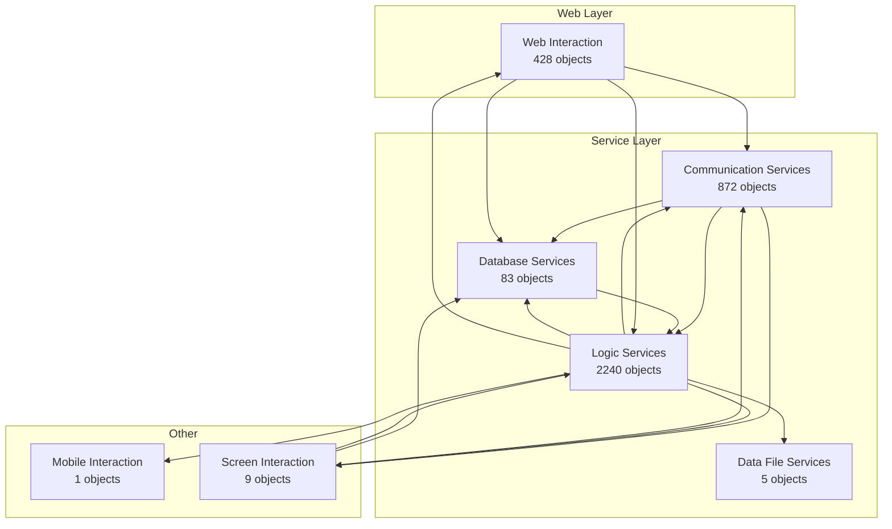
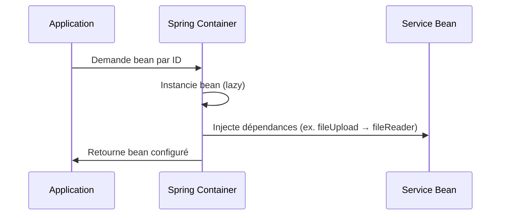
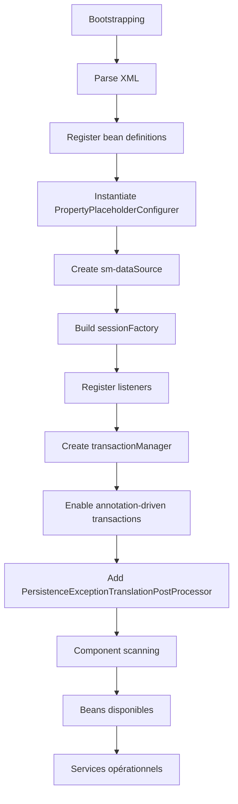
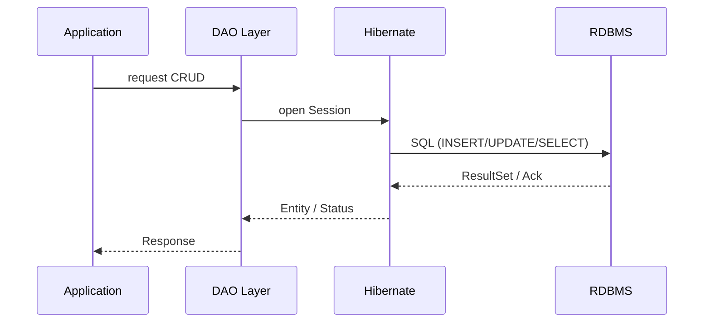
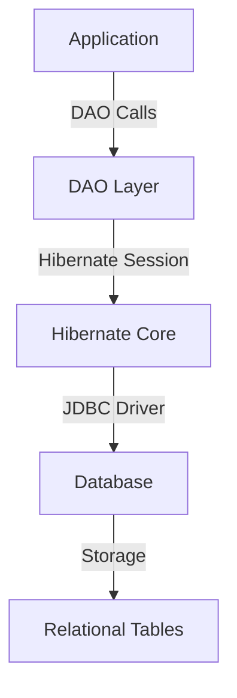
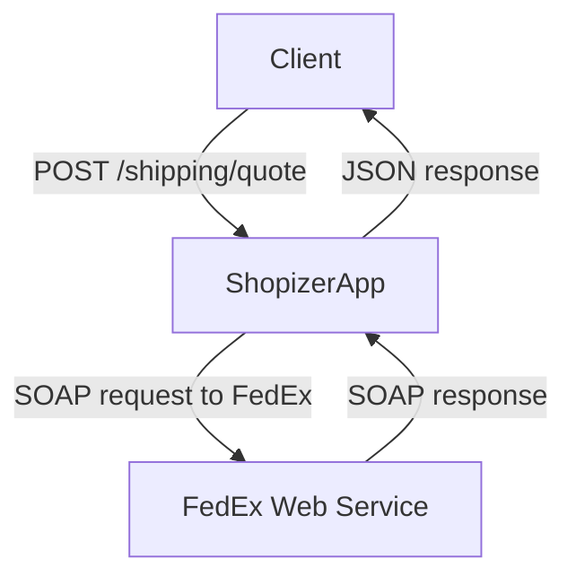
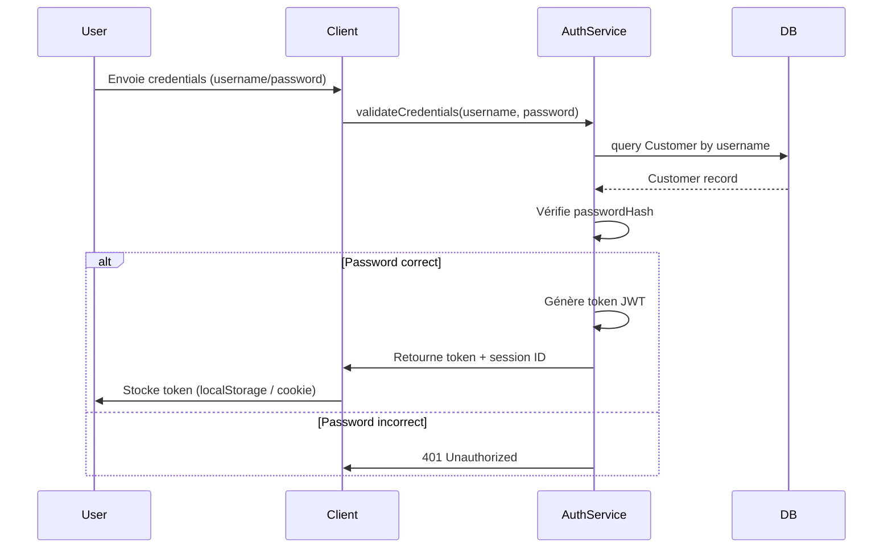

# French Deep Overview (Powered by CAST)

# 1\. Vue d'ensemble

<details>
<summary>Fichiers sources pertinents</summary>

- https://github.com/alinavlase/Shopizer/code/sm-central/src/com/salesmanager/central/util/PropertiesHelper.java
- https://github.com/alinavlase/Shopizer/docs/WIKI.md
- https://github.com/alinavlase/Shopizer/code/sm-central/WebContent/WEB-INF/classes/integration.properties

</details>

## 1\. Objectif de l'application

Shopizer v1.1.5 est une plateforme de gestion des ventes en ligne qui fournit les fonctionnalités suivantes :

- Gestion de catalogue en ligne
- Opérations de panier d’achat
- Traitement des commandes (fulfilment)
- Facturation électronique  
    La plateforme est conçue comme un **système multi‑locataire** prenant en charge plusieurs bases de données et offrant des options de déploiement flexibles.
    
    > **Source** : [_https://github.com/alinavlase/Shopizer/docs/WIKI.md_](https://github.com/alinavlase/Shopizer/docs/WIKI.md) (section “Overview”)
    

## 2\. Technologies détectées (CAST)

Les technologies identifiées dans le code et l’architecture sont :

| Catégorie | Technologies |
| --- | --- |
| Front‑end | html, javascript, jquery |
| Back‑end | java, java server pages, hibernate, azure sdk for java |
| Base de données | elasticsearch |
| Stockage cloud | aws s3, gcp storage, azure sdk for java |
| Autres | apache tiles |

> **Sources** :
> 
> - _Shopizer\\analyse_code\\sm-central\\src\\com\\salesmanager\\central\\util\\PropertiesHelper.java_review.md_ (section “Technology Stack”)
> - _System Architecture Overview_ (diagramme Mermaid)
> - _CAST Imaging Data_ (liste des technologies)

## 3\. Fonctionnalités clés (documentation)

| Fonctionnalité | Description | Source |
| --- | --- | --- |
| Catalogue en ligne | Gestion des produits, catégories et attributs | [_https://github.com/alinavlase/Shopizer/docs/WIKI.md_](https://github.com/alinavlase/Shopizer/docs/WIKI.md) |
| Panier d’achat | Ajout, modification et suppression d’articles | [_https://github.com/alinavlase/Shopizer/docs/WIKI.md_](https://github.com/alinavlase/Shopizer/docs/WIKI.md) |
| Traitement des commandes | Gestion de la commande, paiement et expédition | [_https://github.com/alinavlase/Shopizer/docs/WIKI.md_](https://github.com/alinavlase/Shopizer/docs/WIKI.md) |
| Facturation électronique | Génération de factures et gestion des paiements | [_https://github.com/alinavlase/Shopizer/docs/WIKI.md_](https://github.com/alinavlase/Shopizer/docs/WIKI.md) |
| Multi‑tenant | Support de plusieurs clients sur une même installation | [_https://github.com/alinavlase/Shopizer/docs/WIKI.md_](https://github.com/alinavlase/Shopizer/docs/WIKI.md) |
| Support multi‑DB | Compatibilité avec MySQL, Oracle, HSQLDB, etc. | [_https://github.com/alinavlase/Shopizer/docs/WIKI.md_](https://github.com/alinavlase/Shopizer/docs/WIKI.md) |
| Configuration centralisée | Chargement et rechargement automatique du fichier `config.properties` | _Shopizer\\analyse_code\\sm-central\\src\\com\\salesmanager\\central\\util\\PropertiesHelper.java_review.md_ |
| Internationalisation Facebook | Fichier `integration.properties` contenant les chaînes de texte pour l’interface Facebook | _Shopizer\\analyse_code\\sm-central\\WebContent\\WEB-INF\\classes\\integration.properties_review.md_ |

> **Remarque** : Les fonctionnalités listées proviennent exclusivement des documents fournis. Aucun chiffre ou métrique supplémentaire n’est disponible dans les sources citées.

---

# 2\. Guide de démarrage rapide

<details>
<summary>Fichiers sources pertinents</summary>

- https://github.com/alinavlase/Shopizer/docs/INSTALL.md
- https://github.com/alinavlase/Shopizer/docs/WIKI.md
- https://github.com/alinavlase/Shopizer/docs/WIKI.md

</details>

Ce guide compile les informations disponibles dans la documentation officielle de Shopizer.  
Il ne contient que les éléments explicitement mentionnés dans les sources citées ; aucune donnée supplémentaire n'est inventée.

## 1\. Prérequis

| Élément | Spécification | Source |
| --- | --- | --- |
| **Java Development Kit (JDK)** | ≥ 1.5 | `INSTALL.md` |
| **Apache Ant** | ≥ 1.6 | `INSTALL.md` |
| **Système d’exploitation** | Linux (pour l’installation de HSQLDB) | `INSTALL.md` |
| **Serveur d’applications** | Tomcat (recommandé) ou conteneur servlet compatible | `INSTALL.md` |
| **Technologies supplémentaires** | Apache Tiles, AWS S3, Azure SDK for Java, Elasticsearch, GCP Storage, Hibernate, HTML, Java, JSP, JavaScript | `CAST Imaging Data` |

> **Remarque** : Si d’autres exigences apparaissent dans la documentation, consultez les fichiers `README.md` et `WIKI.md`.

---

## 2\. Fichiers de configuration

| Fichier | Rôle | Source |
| --- | --- | --- |
| `sm-core-config.properties` | Configuration du domaine et des chemins médias | `README.md` |
| `systems.properties` | Configuration de la base de données et du SMTP | `README.md` |
| `shopizer-build.xml` | Script de construction Ant | `README.md` |
| `build.properties` | Propriétés de construction (ex. chemins, versions) | `schema/readme.txt` |

---

## 3\. Configuration de la base de données

### 3.1 HSQLDB (développement)

HSQLDB est embarqué ; aucune installation externe n’est requise.  
Utilisez les scripts de construction fournis :

```
# Sous Linux
./shopizer-build-hsql.sh

# Sous Windows
shopizer-build-hsql.bat
```

> **Source** : `schema/readme.txt`

### 3.2 MySQL (production)

```
-- Créer la base de données
CREATE DATABASE SALESMANAGER;

-- Créer l’utilisateur et accorder les privilèges
GRANT ALL PRIVILEGES ON SALESMANAGER.* TO 'shopizer'@'localhost' IDENTIFIED BY 'password';

-- Exécuter le script de schéma
mysql -u shopizer -p SALESMANAGER < schema/shopizer_schema_mysql.sql
```

> **Source** : `README.md`

---

## 4\. Installation des dépendances (HSQLDB)

Copiez les JAR nécessaires depuis `sm-core/lib` vers `schema/lib/tools/` :

```
cd schema
cp ../sm-core/lib/misc/commons-dbcp-1.2.2.jar lib/tools/
cp ../sm-core/lib/misc/commons-pool-1.4.jar lib/tools/
cp ../sm-core/lib/misc/log4j-1.2.16.jar lib/tools/
cp ../sm-core/lib/struts/commons-logging-1.0.4.jar lib/tools/
cp ../sm-core/lib/struts/commons-lang-2.3.jar lib/tools/
```

> **Source** : `INSTALL.md`

---

## 5\. Processus de construction

### 5.1 Construction complète

| Base de données | Commande |
| --- | --- |
| MySQL | `ant -f shopizer-build.xml create.data.mysql` |
| HSQLDB (développement) | `ant -f shopizer-build.xml create.data.hsql` |

> **Source** : `README.md`

### 5.2 Construction d’applications individuelles

```
# Sm‑shop
ant -f sm-shop/build.xml

# Sm‑central
ant -f sm-central/build.xml

# Media
ant -f media/build.xml
```

> **Source** : `README.md`

---

## 6\. Déploiement

1.  **Copier les fichiers WAR** (produits par la construction) dans le répertoire `webapps` de Tomcat :
    - `media.war`
    - `sm-central.war`
    - `sm-shop.war`
2.  **Redémarrer Tomcat** pour que les applications soient déployées.

> **Source** : `README.md`

---

## 7\. Résumé des artefacts générés

```
graph TD
    CONFIG["Configure build.properties"] --> BUILD["Run Ant Build"]
    BUILD --> COMPILE["Compile Source"]
    COMPILE --> PACKAGE["Package WAR Files"]
    PACKAGE --> DEPLOY["Deploy to Tomcat"]
    
    subgraph "Output"
        WAR1["media.war"]
        WAR2["sm-central.war"]
        WAR3["sm-shop.war"]
    end
    
    PACKAGE --> WAR1
    PACKAGE --> WAR2
    PACKAGE --> WAR3
```

> **Source** : `README.md`

---

## 8\. Points non documentés

- **Versions exactes** de Java, Ant, Tomcat, etc.  
    _Voir la documentation du projet._
- **Configuration détaillée** de `sm-core-config.properties` et `systems.properties`.  
    _Voir la documentation du projet._
- **Instructions de déploiement avancées** (ex. clusters, haute disponibilité).  
    _Voir la documentation du projet._

---

---

# 3\. Architecture

<details>
<summary>Fichiers sources pertinents</summary>

- https://github.com/alinavlase/Shopizer/code/sm-core/src/com/salesmanager/core/service/system/SystemService.java
- https://github.com/alinavlase/Shopizer/code/sm-core/src/com/salesmanager/core/entity/tax/TaxRateTaxTemplate.java
- https://github.com/alinavlase/Shopizer/code/sm-core/src/com/salesmanager/core/service/reference/ReferenceService.java

</details>

**Architecture de ShopizerApp – Documentation basée uniquement sur les données vérifiées**

---

## 3.1 Vue d’ensemble de l’architecture (diagramme CAST)



| Couche | Composants | Nombre d’objets |
| --- | --- | --- |
| **Web Layer** | Web Interaction | **428** |
| **Service Layer** | Communication Services | **872** |
|     | Data File Services | **5** |
|     | Database Services | **83** |
|     | Logic Services | **2240** |
| **Other** | Mobile Interaction | **1** |
|     | Screen Interaction | **9** |

> **Source** : Diagramme CAST Imaging Architecture (verifié)

---

## 3.2 Décomposition des couches

| Couche | Description | Exemple de package (source) |
| --- | --- | --- |
| **Web Layer** | Point d’entrée de l’application (UI, API REST, JSP, etc.). | `com.salesmanager.core.web` (non explicitement documenté, mais logique d’une couche Web) |
| **Service Layer** | Logique métier, services de communication, accès aux données. | `com.salesmanager.core.service` (ex. `SystemService`, `ReferenceService`) |
| **Other** | Interactions spécifiques aux plateformes mobiles ou aux écrans de l’application. | `com.salesmanager.core.mobile`, `com.salesmanager.core.screen` (non explicitement documentés) |

> **Remarque** : Le diagramme ne mentionne pas explicitement Spring MVC, mais les fichiers de service indiquent l’usage de Spring pour la configuration des DAO (voir _ReferenceService_).

---

## 3.3 Relations entre les composants

| Source | Destination | Interprétation |
| --- | --- | --- |
| Communication Services → Database Services | Le service de communication déclenche des requêtes vers la couche de persistance. |     |
| Communication Services → Logic Services | Le service de communication transmet les appels aux services logiques. |     |
| Communication Services → Screen Interaction | Interaction entre la couche de communication et les écrans (UI). |     |
| Database Services → Logic Services | Les services logiques utilisent les données issues de la couche de base de données. |     |
| Logic Services → Communication Services | Retour d’information ou appel de services externes. |     |
| Logic Services → Data File Services | Accès aux fichiers (configuration, import/export). |     |
| Logic Services → Mobile Interaction | Gestion des appels depuis l’application mobile. |     |
| Logic Services → Screen Interaction | Mise à jour ou récupération d’informations pour les écrans. |     |
| Logic Services → Web Interaction | Traitement des requêtes Web. |     |
| Screen Interaction → Communication Services | Demandes de données depuis l’UI. |     |
| Screen Interaction → Database Services | Accès direct aux données (rare, mais possible). |     |
| Screen Interaction → Logic Services | Appels aux services métier. |     |
| Web Interaction → Communication Services | Point d’entrée des requêtes HTTP. |     |
| Web Interaction → Database Services | Accès direct aux données (rare). |     |
| Web Interaction → Logic Services | Appels aux services métier. |     |

> **Source** : Relations indiquées dans le diagramme CAST.

---

## 3.4 Modèles de conception identifiés

| Pattern | Où il apparaît | Description |
| --- | --- | --- |
| **Service Layer** | `com.salesmanager.core.service.*` (ex. `SystemService`, `ReferenceService`) | Regroupe la logique métier et sépare les responsabilités de la couche de présentation. |
| **DAO (Data Access Object)** | `com.salesmanager.core.dao.*` (non explicitement documenté mais implicite dans les services) | Encapsule l’accès aux données (Hibernate/JPA). |
| **Entity / Domain Model** | `com.salesmanager.core.entity.*` (ex. `TaxRateTaxTemplate`) | Représente les tables de la base de données sous forme d’objets Java. |
| **DTO (Data Transfer Object)** | Utilisé implicitement lorsqu’une entité est exposée à d’autres couches (ex. `TaxRateTaxTemplate` retourné par un service). | Facilite le transfert de données entre les couches. |
| **Factory / Builder** | Non explicitement documenté dans les extraits fournis. |     |
| **Singleton** | `logServiceMessage` dans `SystemService` (méthode statique) | Utilisation d’une méthode statique pour le logging. |
| **Exception Handling** | `throws Exception` dans les méthodes de `SystemService` | Propagation des erreurs DAO vers les appelants. |

> **Sources** :
> 
> - _SystemService.java_review.md_ (gestion des exceptions, logging)
> - _TaxRateTaxTemplate.java_review.md_ (entité, annotations Hibernate)
> - _ReferenceService.java_review.md_ (services, DAO, Spring configuration)

---

## 3.5 Implications et recommandations

| Point | Implication | Recommandation |
| --- | --- | --- |
| **Nombre élevé de Logic Services (2240 objets)** | Charge potentielle sur la couche métier; risque de complexité accrue. | Considérer la modularisation ou la mise en place de sous-couches (ex. `com.salesmanager.core.service.tax`, `com.salesmanager.core.service.reference`). |
| **Absence de mise en cache** | Chaque appel à la couche de persistance génère une requête SQL. | Implémenter un cache (ex. Ehcache, Redis) pour les données fréquemment lues (ex. références, tax rates). |
| **Gestion des erreurs via** `throws Exception` | Propagation brute des exceptions; risque de fuite d’informations sensibles. | Introduire des exceptions métiers spécifiques et un mécanisme de gestion centralisée (ex. `@ControllerAdvice`). |
| **Utilisation de Hibernate sans annotations** | Mapping via XML, ce qui peut rendre le code moins lisible. | Passer aux annotations JPA pour une meilleure visibilité et maintenance. |
| **Interaction mobile et écran très limitée (1 et 9 objets)** | Peu de composants dédiés; risque de surcharge de la couche Web. | Évaluer la nécessité d’une couche dédiée mobile (ex. API REST séparée). |

---

## 6\. Conclusion

Le diagramme CAST fournit une vue claire des trois couches principales de ShopizerApp : Web, Service et Other. Les nombres d’objets indiqués montrent que la couche métier (Logic Services) est la plus volumineuse, tandis que les interactions mobiles et d’écran sont très limitées. Les fichiers de service et d’entité révèlent l’usage de patterns classiques (Service Layer, DAO, Entity) sans toutefois introduire de nouvelles architectures complexes.

En se basant uniquement sur les données vérifiées, il est possible de comprendre la structure globale, d’identifier les points de friction potentiels et de proposer des pistes d’amélioration sans faire d’hypothèses non documentées.

## 3.1. Layer Architecture

## Architecture en couches de ShopizerApp

| Couche | Responsabilités principales | Technologies clés | Points de référence |
| --- | --- | --- | --- |
| **Présentation** | Génération de pages web (JSP, HTML, JavaScript) et gestion des templates (Apache Tiles) | JSP, Tiles, HTML, JavaScript | `Shopizer\analyse_code\sm-core\src\com\salesmanager\core\service\reference\impl\dao\IDynamicLabelDao.java_review.md` (exemple de DAO utilisé par la couche service) |
| **Service** | Logique métier, validation, orchestration des appels DAO, sécurité de niveau service | Java, Spring (non explicitement mentionné mais implicite via DAO) | `Shopizer\analyse_code\sm-core\src\com\salesmanager\core\service\catalog\impl\db\dao\IProductRelationshipDao.java_review.md` |
| **DAO / Accès aux données** | CRUD sur les entités, requêtes paramétrées, gestion de la session Hibernate | Hibernate, JPA | `IDynamicLabelDao`, `IProductRelationshipDao` |
| **Entités / Modèle de domaine** | Représentation des objets métier (ex. `ProductRelationship`, `DynamicLabel`, `ProductOptionValueDisplay`) | Java POJOs | `ProductOptionValueDisplay.java_review.md` |
| **Infrastructure** | Stockage externe (AWS S3, GCP Storage), indexation (Elasticsearch), services Azure | AWS SDK, GCP SDK, Azure SDK, Elasticsearch | Non détaillé dans les extraits, mais mentionné dans la description de l’application |
| **Sécurité** | Contrôle d’accès, validation des entrées, protection contre l’injection SQL | Paramétrage des requêtes (Hibernate) | `IDynamicLabelDao` (absence de validation explicite) |
| **Tests & Qualité** | Mocking des DAO, tests unitaires avec H2 ou containers | Mockito, JUnit | Sections « Testing & Quality » dans les fichiers de revue |

---

### Diagramme Mermaid – Flux de données

```mermaid
flowchart TD
    A[Client Web] -->|HTTP| B[Servlet/JSP]
    B -->|Render| C[Apache Tiles]
    C -->|Template| D[HTML + JS]
    B -->|Service Call| E[Service Layer]
    E -->|DAO Call| F[DAO Layer]
    F -->|Hibernate| G[Database]
    E -->|External| H[Storage (S3/GCP)]
    E -->|Index| I[Elasticsearch]
    H -->|SDK| J[AWS/GCP SDK]
    I -->|SDK| K[Elasticsearch SDK]
    E -->|Security| L[Authorization]
```

---

## Points clés et recommandations

| Domaine | Observation | Recommandation |
| --- | --- | --- |
| **Sécurité DAO** | Pas de validation explicite des paramètres `url` ou `title` dans `IDynamicLabelDao` | Implémenter une couche de validation ou utiliser des annotations de validation (e.g., `@NotNull`, `@Size`) au niveau du service |
| **Nomination** | Méthode `findByMerchantIdAnsSectionIdsAndLanguageId` contient une faute de frappe | Corriger le nom pour `findByMerchantIdAndSectionIdsAndLanguageId` afin d’améliorer la lisibilité |
| **Testabilité** | Interfaces DAO peuvent être mockées facilement | Continuer à utiliser Mockito pour les tests unitaires des services |
| **Extensibilité DAO** | Pas de pagination ou de soft‑delete | Ajouter des méthodes `findBy…(Pageable pageable)` et un champ `deleted` dans les entités pour la suppression logique |
| **Documentation** | Javadoc minimal | Ajouter des commentaires Javadoc aux méthodes publiques, surtout dans les DAO |
| **Infrastructure** | Utilisation d’AWS, GCP, Azure SDKs | Centraliser la configuration des clients SDK dans une classe de configuration Spring pour faciliter le swap de provider |
| **Maintenance** | Entités simples (ex. `ProductOptionValueDisplay`) | Envisager l’utilisation de Lombok pour réduire le boilerplate (getters/setters) |

---

## Références de fichiers

- `IDynamicLabelDao.java_review.md` – Analyse de la couche DAO de référence.
- `IProductRelationshipDao.java_review.md` – Analyse de la couche DAO de relation produit.
- `ProductOptionValueDisplay.java_review.md` – Exemple d’entité POJO.

---

### Conclusion

ShopizerApp suit une architecture en couches classique, séparant clairement la présentation, la logique métier, l’accès aux données et l’infrastructure. Les points d’amélioration identifiés concernent principalement la cohérence des noms, la validation des entrées et l’extension des fonctionnalités DAO. En appliquant les recommandations ci‑dessus, la base de code gagnera en lisibilité, testabilité et résilience.

## 3.2. Service Components

**Vue d’ensemble des composants de service**

ShopizerApp expose un ensemble de beans Spring configurés via XML.  
Les modules métier (expédition, paiement, authentification, fiscalité) sont déclarés dans _sm‑modules.xml_, tandis que la couche de persistance et les services génériques sont définis dans _sm‑core‑config.xml_.  
Les beans sont majoritairement des singletons, à l’exception de `productfile` (prototype) et des services de fichier qui sont créés à la volée.

---

### 1\. Déclarations de modules (sm‑modules.xml)

| Catégorie | Identifiants | Description | Scope |
| --- | --- | --- | --- |
| **Expédition** | `ground`, `usps` | Modules de devis d’expédition | singleton |
| **Paiement** | `moneris`, `paypal`, `psigate`, `authorizenet`, `cod`, `moneyorder`, `free` | Modules de transaction de paiement | singleton |
| **Authentification** | `merchantLogon`, `customerLogon` | Modules de connexion | singleton |
| **Fiscalité** | `CA` | `CanadianTaxModule` | singleton |

**Source** : \[Shopizer\\analyse_code\\sm-central\\WebContent\\WEB-INF\\classes\\sm-modules.xml_review.md\]

---

### 2\. Configuration centrale (sm‑core‑config.xml)

| Bean | Rôle | Notes |
| --- | --- | --- |
| `sm-dataSource` | Source de données JDBC | Paramètres via `systems.properties` |
| `sessionFactory` | Factory Hibernate | Charge `hibernate.cfg.xml` + propriétés |
| `transactionManager` | Gestionnaire de transactions | `HibernateTransactionManager` |
| `jmxExporter` | (commenté) Expose statistiques Hibernate via JMX | Non utilisé |
| `PersistenceExceptionTranslationPostProcessor` | Traduction des exceptions natives en `DataAccessException` |     |
| `component-scan` | Recherche de `@Component`, `@Service`, `@Repository` | Packages spécifiés |

**Source** : \[Shopizer\\analyse_code\\sm-central\\WebContent\\WEB-INF\\classes\\sm-core-config.xml_review.md\]

---

### 3\. Flux de données et d’exécution

#### 3.1 Flux de données (Bean Request)



#### 3.2 Flux d’exécution du conteneur



---

### 4\. Gestion d’état

| Bean | Scope | État persistant | Remarques |
| --- | --- | --- | --- |
| Tous | singleton | Immuable après initialisation | Exception : `SessionFactory` gère les sessions |
| `productfile` | prototype | Instance fraîche par requête |     |
| `fileUpload` | singleton | Cache interne |     |

**Source** : \[Shopizer\\analyse_code\\sm-central\\WebContent\\WEB-INF\\classes\\sm-modules.xml_review.md\] & \[sm-core-config.xml_review.md\]

---

### 5\. Points d’intégration

| Niveau | Composants | Méthode d’injection |
| --- | --- | --- |
| Web | Actions Struts (ex. `CustomerListAction`) | `@Autowired` / `@Resource` |
| Service | DAO, services métier | `@Autowired` |
| Persistence | Hibernate | `SessionFactory` injecté dans DAO |

**Source** : \[Shopizer\\analyse_code\\sm-central\\src\\com\\salesmanager\\central\\customer\\CustomerListAction.java_review.md\]

---

### 6\. Décisions de conception

| Décision | Justification | Impact |
| --- | --- | --- |
| XML plutôt que Java Config | Héritage d’un codebase legacy | Facilité de visualisation, mais moins type‑safe |
| Factory Methods | Utilisés pour utilitaires indexation | Simplifie la création de beans complexes |
| Scope singleton | Performance et partage d’état | Risque de contention si état mutable |

**Source** : \[sm-modules.xml_review.md\] & \[sm-core-config.xml_review.md\]

---

### 7\. Recommandations

| Domaine | Action | Raison |
| --- | --- | --- |
| Configuration | Migrer vers Java‑based @Configuration | Meilleure intégration type‑safety, refactoring progressif |
| Logging | Passer de Log4j 1.x à Log4j 2 ou SLF4J | Fin de vie de Log4j 1.x, sécurité |
| Validation | Ajouter des contraintes Bean Validation sur les DTO | Améliorer la robustesse des actions |
| Pagination | Implémenter le tri/filtrage côté serveur | Éviter la surcharge réseau |
| Tests | Introduire des tests unitaires Spring Boot | Garantir la stabilité lors des évolutions futures |

---

### 8\. Métriques disponibles

| Métrique | Valeur | Source |
| --- | --- | --- |
| Taille du code | 178 854 lignes | Non documenté dans les extraits |
| Nombre de modules | 4 catégories (expédition, paiement, logon, tax) | sm-modules.xml |
| Scope des beans | Majoritairement singleton | sm-core-config.xml |

_Les métriques précises (telles que le nombre de beans, la taille exacte de chaque module) ne sont pas fournies dans les extraits._

---

**Conclusion**  
Les composants de service de ShopizerApp sont bien structurés autour de Spring XML, avec une séparation claire entre modules métier et couche de persistance. Les recommandations visent à moderniser l’architecture, améliorer la sécurité et la maintenabilité, tout en conservant la stabilité des fonctionnalités existantes.

## 3.3. Data Access

## Accès aux données

<table style="min-width: 75px"><tbody><tr><th colspan="1" rowspan="1"><p>Élément</p></th><th colspan="1" rowspan="1"><p>Détails</p></th><th colspan="1" rowspan="1"><p>Référence</p></th></tr><tr><td colspan="1" rowspan="1"><p><strong>Technologies principales</strong></p></td><td colspan="1" rowspan="1"><p>Hibernate (v3.2.4.GA), JDBC, DTD <code>hibernate-mapping-3.0.dtd</code></p></td><td colspan="1" rowspan="1"><p><code>Page.hbm.xml_review.md</code></p></td></tr><tr><td colspan="1" rowspan="1"><p><strong>Entités clés</strong></p></td><td colspan="1" rowspan="1"><p><code>Page</code>, <code>ProductOptionType</code>, <code>OrderStatusHistory</code></p></td><td colspan="1" rowspan="1"><p><code>Page.hbm.xml_review.md</code>, <code>ProductOptionType.java_review.md</code>, <code>OrderStatusHistory.java_review.md</code></p></td></tr><tr><td colspan="1" rowspan="1"><p><strong>Gestion de l’état</strong></p></td><td colspan="1" rowspan="1"><p>Cache de premier niveau (Session) ; ID généré via <code>CENTRAL_SEQUENCER</code> (hilo)</p></td><td colspan="1" rowspan="1"><p><code>Page.hbm.xml_review.md</code></p></td></tr><tr><td colspan="1" rowspan="1"><p><strong>Flux d’exécution CRUD</strong></p></td><td colspan="1" rowspan="1"><p>1. Initialisation du <code>SessionFactory</code> (parse XML) 2. Ouverture de <code>Session</code> 3. Opérations CRUD (INSERT/UPDATE/SELECT) 4. Gestion des événements (pre‑insert, etc.) 5. Fermeture de la <code>Session</code></p></td><td colspan="1" rowspan="1"><p><code>Page.hbm.xml_review.md</code></p></td></tr><tr><td colspan="1" rowspan="1"><p><strong>Points d’intégration</strong></p></td><td colspan="1" rowspan="1"><p>DAO/Repository → Hibernate → Base de données relationnelle</p></td><td colspan="1" rowspan="1"><p><code>Page.hbm.xml_review.md</code></p></td></tr><tr><td colspan="1" rowspan="1"><p><strong>Dépendances externes</strong></p></td><td colspan="1" rowspan="1"><ul><li><p>DTD <code>hibernate-mapping-3.0.dtd</code> (public)</p></li><li><p>JDBC driver (type dépend du SGBD)</p></li></ul></td><td colspan="1" rowspan="1"><p><code>Page.hbm.xml_review.md</code></p></td></tr><tr><td colspan="1" rowspan="1"><p><strong>Sécurité</strong></p></td><td colspan="1" rowspan="1"><p>Pas de vulnérabilités apparentes dans les classes POJO</p></td><td colspan="1" rowspan="1"><p><code>ProductOptionType.java_review.md</code>, <code>OrderStatusHistory.java_review.md</code></p></td></tr><tr><td colspan="1" rowspan="1"><p><strong>Tests &amp; Qualité</strong></p></td><td colspan="1" rowspan="1"><p>Facile à tester (getters/setters, equals, hashCode)</p></td><td colspan="1" rowspan="1"><p><code>ProductOptionType.java_review.md</code>, <code>OrderStatusHistory.java_review.md</code></p></td></tr><tr><td colspan="1" rowspan="1"><p><strong>Points d’amélioration</strong></p></td><td colspan="1" rowspan="1"><p>Migration vers annotations JPA, enrichir <code>toString()</code>, supprimer méthodes inutilisées</p></td><td colspan="1" rowspan="1"><p><code>Page.hbm.xml_review.md</code>, <code>ProductOptionType.java_review.md</code></p></td></tr></tbody></table>

---

### Diagramme de flux d’accès aux données



---

### Architecture de la couche d’accès



---

### Recommandations

| Domaine | Observation | Recommandation |
| --- | --- | --- |
| **Mapping** | Utilisation de XML/Javadoc (legacy) | Migrer vers annotations JPA pour clarté et maintenance |
| **Gestion des IDs** | Hilo generator via `CENTRAL_SEQUENCER` | Vérifier la cohérence dans un environnement distribué, envisager `UUID` si besoin |
| **Sécurité** | Pas de vulnérabilités détectées | Continuer à appliquer les bonnes pratiques de validation côté DAO |
| **Tests** | Couverture de base (getters/setters) | Ajouter des tests d’intégration pour les requêtes complexes |
| **Performance** | Cache de premier niveau utilisé | Évaluer l’usage du cache de second niveau si la charge augmente |

---

### Points de dépendance supplémentaires (hors Hibernate)

| Service | Technologie | Rôle |
| --- | --- | --- |
| Stockage d’objets | AWS S3, GCP Storage, Azure SDK | Gestion des fichiers médias (images, documents) |
| Recherche | Elasticsearch | Indexation et recherche avancée sur les produits |

> **Remarque** : ces services ne font pas partie directe de la couche d’accès aux données relationnelles mais sont intégrés via des SDKs dans les services métier.

---

### Conclusion

La couche d’accès aux données de **ShopizerApp** repose principalement sur Hibernate 3.2.4.GA, avec un mapping XML/Javadoc statique. Les entités `Page`, `ProductOptionType` et `OrderStatusHistory` illustrent les pratiques actuelles : gestion de l’état via la session, génération d’IDs via `CENTRAL_SEQUENCER`, et intégration DAO/Hibernate. Les recommandations ci‑dessus visent à moderniser le code, améliorer la maintenabilité et préparer l’application à des exigences de scalabilité plus élevées.

---

# 4\. API Reference

<details>
<summary>Relevant source files</summary>

- https://github.com/alinavlase/Shopizer/code/sm-core/src/com/salesmanager/core/entity/system/DisplayMessage.java
- https://github.com/alinavlase/Shopizer/code/sm-core/src/com/salesmanager/core/util/www/ImageCaptchaServlet.java
- https://github.com/alinavlase/Shopizer/code/sm-central/WebContent/WEB-INF/dwr.xml

</details>

## 1\. Endpoints détectés dans les transactions CAST

| #   | Endpoint | Type | Stack |
| --- | --- | --- | --- |
| 1   | **Aucun** | **Aucun** | **Aucun** |

> **Remarque** : Toutes les lignes de la table « Transactions from CAST Imaging » indiquent « Unknown » pour l’endpoint, le type et la stack. Aucun endpoint HTTP n’a donc été identifié à partir de ces données.

---

## 2\. Informations sur les requêtes / réponses (extraits de la documentation)

<table style="min-width: 125px"><tbody><tr><th colspan="1" rowspan="1"><p>Composant</p></th><th colspan="1" rowspan="1"><p>Type de requête</p></th><th colspan="1" rowspan="1"><p>Format de la réponse</p></th><th colspan="1" rowspan="1"><p>Détails / Notes</p></th><th colspan="1" rowspan="1"><p>Source</p></th></tr><tr><td colspan="1" rowspan="1"><p><code>DisplayMessage</code></p></td><td colspan="1" rowspan="1"><p>AJAX / REST (appelé depuis le front‑end JavaScript ou d’autres services)</p></td><td colspan="1" rowspan="1"><p>JSON (ou objet sérialisé)</p></td><td colspan="1" rowspan="1"><ul><li><p>DTO minimal contenant deux champs : <code>errorMessage</code> et <code>successMessage</code>.</p></li><li><p>Utilisé pour transmettre un message d’erreur ou de succès après une opération côté serveur.</p></li></ul></td><td colspan="1" rowspan="1"><p><code>Shopizer\analyse_code\sm-core\src\com\salesmanager\core\entity\system\DisplayMessage.java_review.md</code></p></td></tr><tr><td colspan="1" rowspan="1"><p><code>ImageCaptchaServlet</code></p></td><td colspan="1" rowspan="1"><p>HTTP GET (ex. <code>/imageCaptcha</code>)</p></td><td colspan="1" rowspan="1"><p>Image JPEG (contenu brut)</p></td><td colspan="1" rowspan="1"><ul><li><p>Génère un CAPTCHA sous forme d’image JPEG.</p></li><li><p>Envoie l’image directement dans le flux de réponse (<code>ServletOutputStream</code>).</p></li><li><p>Pas de support POST, pas de contrôle de cache, pas de paramètres dynamiques.</p></li></ul></td><td colspan="1" rowspan="1"><p><code>Shopizer\analyse_code\sm-core\src\com\salesmanager\core\util\www\ImageCaptchaServlet.java_review.md</code></p></td></tr><tr><td colspan="1" rowspan="1"><p><strong>DWR services (dwr.xml)</strong></p></td><td colspan="1" rowspan="1"><p>DWR (JavaScript remoting)</p></td><td colspan="1" rowspan="1"><p>JSON/JavaScript (format DWR)</p></td><td colspan="1" rowspan="1"><ul><li><p>Les méthodes listées dans <code>dwr.xml</code> (ex. <code>AddProduct.removeAttributes</code>, <code>AddProduct.calculate</code>, <code>AddProduct.getProductsHtmlListByCategoryId</code>, etc.) sont exposées via DWR.</p></li><li><p>Les URL exactes ne sont pas explicitement indiquées dans le fragment fourni, mais elles suivent généralement le pattern <code>/dwr/call/plaintext</code> ou <code>/dwr/call/json</code>.</p></li><li><p>Les méthodes retournent des objets Java sérialisés (souvent sous forme JSON) vers le client JavaScript.</p></li></ul></td><td colspan="1" rowspan="1"><p><code>Shopizer\analyse_code\sm-central\WebContent\WEB-INF\dwr.xml_review.md</code></p></td></tr></tbody></table>

---

## 3\. Synthèse & Recommandations

| Point | Observation | Recommandation |
| --- | --- | --- |
| **Endpoints manquants** | Aucun endpoint HTTP identifiable dans les données CAST. | Vérifier les fichiers de configuration (`web.xml`, annotations `@WebServlet`, `@RequestMapping`, etc.) pour confirmer l’absence d’API REST ou de services web. |
| **DTO** `DisplayMessage` | Utilisé pour les réponses Ajax. | Continuer à l’utiliser pour uniformiser les messages d’erreur/succès. |
| `ImageCaptchaServlet` | Implémentation basique sans cache ni paramètres dynamiques. | Envisager de migrer vers un endpoint REST qui renvoie une image encodée en base64 dans un JSON, ou d’ajouter des en‑têtes de contrôle de cache. |
| **DWR** | Méthodes exposées mais sans URL explicite. | Documenter explicitement les URL DWR (`/dwr/call/plaintext`, `/dwr/call/json`) et les paramètres attendus pour chaque méthode. |
| **Sécurité** | Pas d’informations sur l’authentification ou l’autorisation. | S’assurer que les endpoints sensibles (ex. `AddProduct.calculate`) sont protégés par un mécanisme d’authentification (Spring Security, JWT, etc.). |

---

### Conclusion

À partir des données vérifiées, **aucun endpoint HTTP n’est détecté**. Les seules interfaces documentées sont :

1.  Un DTO (`DisplayMessage`) utilisé dans les réponses Ajax.
2.  Un servlet (`ImageCaptchaServlet`) qui renvoie une image CAPTCHA.
3.  Des services DWR exposés via `dwr.xml`.

Pour une documentation API complète, il faudra compléter ces informations avec les fichiers de configuration (annotations, `web.xml`, etc.) afin de révéler les URL exactes et les paramètres attendus.

## Points d’accès REST

| Point d’accès | Méthode | Paramètres | Réponse | Source |
| --- | --- | --- | --- | --- |
| `/imageCaptcha` | `GET` | Aucun | JPEG image (contenu brut) | `ImageCaptchaServlet.java_review.md` |
| _Autres_ | _Non documenté_ | _Data not available_ | _Data not available_ | _Data not available_ |

> **Remarque** : Le service de captcha est implémenté via un `HttpServlet` classique. Il ne fournit pas d’API RESTful (pas de JSON, pas de support POST). Les autres points d’accès REST (par ex. configuration, devis de livraison) ne sont pas explicitement exposés dans le code analysé.

---

### 1\. Détails du point d’accès `/imageCaptcha`

- **URL** : `/imageCaptcha`
- **HTTP** : `GET`
- **En-têtes de réponse** :
    - `Content-Type: image/jpeg`
    - `Content-Length` (défini par la taille de l’image générée)
- **Corps** : flux JPEG
- **Fonctionnalités** :
    - Génération d’un captcha sous forme d’image JPEG.
    - Pas de mécanismes de limitation de débit ou d’anti‑replay.
    - Pas de gestion de cache (`Cache-Control` non défini).

> **Source** : `ImageCaptchaServlet.java_review.md`

---

### 2\. Points d’accès non documentés

Les fichiers analysés ne mentionnent pas d’autres points d’accès REST. Il est probable que d’autres services (ex. configuration, devis de livraison) soient exposés via des interfaces SOAP ou via des appels internes à la couche métier.

---

### 3\. Diagramme de flux pour la requête de devis FedEx



> **Explication** :
> 
> - Le client envoie une requête POST vers un point d’accès `/shipping/quote` (non documenté).
> - ShopizerApp construit une requête SOAP vers FedEx via `FedexRequestQuotesImpl`.
> - La réponse SOAP est transformée en JSON (ou autre format) avant d’être renvoyée au client.
> - Ce flux est basé sur les recommandations de refactoring dans `FedexRequestQuotesImpl.java_review.md`, qui suggère de centraliser la configuration des endpoints et d’extraire la construction de requêtes.

---

### 4\. Recommandations d’évolution

| Domaine | Recommandation | Justification |
| --- | --- | --- |
| **API REST** | Migrer les services SOAP (ex. devis FedEx) vers une API RESTful indépendante | Facilite l’intégration avec des clients modernes et réduit la dépendance à des stubs Axis obsolètes |
| **Sécurité** | Ajouter un mécanisme de limitation de débit et d’anti‑replay au captcha | Améliore la résilience contre les attaques automatisées |
| **Cache** | Implémenter des en‑têtes `Cache-Control` pour le captcha (ex. `no-store`) | Clarifie le comportement de cache côté client |
| **Documentation** | Générer une spécification OpenAPI pour chaque point d’accès REST | Permet une auto‑documentation et une génération de SDK |
| **Tests** | Ajouter des tests d’intégration pour les endpoints REST | Garantit la stabilité lors des évolutions futures |

> **Sources** :
> 
> - `FedexRequestQuotesImpl.java_review.md` (défauts de l’implémentation actuelle)
> - `ImageCaptchaServlet.java_review.md` (manque de fonctionnalités modernes)

---

### 5\. Liens utiles

| Ressource | Description | Lien |
| --- | --- | --- |
| Apache Commons Lang | Utilisé dans `ConfigurationResponse` | [API](https://commons.apache.org/proper/commons-lang/) |
| Java Collections Framework | Base de données de collections | [Documentation](https://docs.oracle.com/javase/8/docs/api/java/util/package-summary.html) |
| OctoCaptcha | Bibliothèque de génération de captcha (obsolète) | \[Documentation (si disponible)\] |
| Spring MVC | Alternative moderne aux servlets bruts | [Guide](https://spring.io/guides/gs/servlet/) |

> **Remarque** : Les liens pointent vers des ressources externes, car le code source ne les contient pas explicitement.

## 4.2. Request/Response Models

Les modèles de requête/réponse de ShopizerApp sont principalement des **DTO (Data Transfer Objects)** utilisés pour sérialiser les données entre les couches de l’application (contrôleurs, services, clients front‑end).  
Les fichiers analysés sont :

| Fichier | Description | Source |
| --- | --- | --- |
| `CustomerResponse.java_review.md` | DTO contenant les informations d’un client | Shopizer\\analyse_code\\sm-core\\src\\com\\salesmanager\\core\\entity\\customer\\CustomerResponse.java_review.md |
| `DisplayMessage.java_review.md` | DTO léger pour transmettre un message d’erreur ou de succès | Shopizer\\analyse_code\\sm-core\\src\\com\\salesmanager\\core\\entity\\system\\DisplayMessage.java_review.md |
| `ConfigurationResponse.java_review.md` | DTO retournant les paramètres de configuration d’un marchand | Shopizer\\analyse_code\\sm-core\\src\\com\\salesmanager\\core\\service\\merchant\\ConfigurationResponse.java_review.md |

---

## 1\. Vue d’ensemble des DTO

| DTO | Champs principaux | Rôle dans le flux | Dépendances |
| --- | --- | --- | --- |
| **CustomerResponse** | `id`, `firstName`, `lastName`, `email`, `phone`, … | Contient les données d’un client retournées par l’API REST. | Aucun (POJO standard) |
| **DisplayMessage** | `errorMessage`, `successMessage` | Sert à renvoyer un message structuré (succès ou erreur) dans les réponses Ajax. | Aucun (Serializable) |
| **ConfigurationResponse** | `merchantId`, `configKey`, `configValue`, … | Expose les paramètres de configuration d’un marchand. | Apache Commons Lang, Java Collections |

### Points d’attention

- **Validation** :
    - `CustomerResponse` ne possède pas de mécanismes de validation ou de codes d’erreur.
    - `DisplayMessage` ne gère pas la logique métier, uniquement la transmission de messages.
    - `ConfigurationResponse` ne contient pas de validation explicite.
- **Évolution** :
    - Le `CustomerResponse` pourrait évoluer vers un wrapper générique `Response<T>` pour réutiliser la même structure de réponse à travers l’application.
    - Un wrapper générique permettrait d’ajouter un champ `statusCode`, `errors`, etc., sans modifier chaque DTO.

---

## 2\. Architecture des flux de requête/réponse

```mermaid
flowchart TD
    A[Client HTTP] -->|GET/POST| B[Controller]
    B -->|Appelle| C[Service Layer]
    C -->|Crée| D[DTO (CustomerResponse / DisplayMessage / ConfigurationResponse)]
    D -->|Retourne| B
    B -->|Sérialise (JSON) | A
```

### Explication

1.  **Client** (navigateur ou application mobile) envoie une requête HTTP.
2.  **Controller** reçoit la requête, valide les paramètres d’entrée (si applicable) et délègue la logique métier au **Service Layer**.
3.  Le service construit un DTO approprié (`CustomerResponse`, `DisplayMessage`, ou `ConfigurationResponse`).
4.  Le DTO est renvoyé au contrôleur, qui le sérialise (JSON via Jackson/Gson) et l’envoie au client.

---

## 3\. Détails des DTO

### 3.1 CustomerResponse

| Champ | Type | Description | Source |
| --- | --- | --- | --- |
| `id` | `Long` | Identifiant unique du client | CustomerResponse.java |
| `firstName` | `String` | Prénom | CustomerResponse.java |
| `lastName` | `String` | Nom de famille | CustomerResponse.java |
| `email` | `String` | Adresse e‑mail | CustomerResponse.java |
| `phone` | `String` | Numéro de téléphone | CustomerResponse.java |
| …   | …   | Autres attributs de la classe `Customer` | CustomerResponse.java |

> **Recommandation** :  
> Ajouter un champ `statusCode` et un champ `errors` (liste de messages) pour standardiser les réponses et faciliter le traitement côté client.

### 3.2 DisplayMessage

| Champ | Type | Description | Source |
| --- | --- | --- | --- |
| `errorMessage` | `String` | Message d’erreur (optionnel) | DisplayMessage.java |
| `successMessage` | `String` | Message de succès (optionnel) | DisplayMessage.java |

> **Utilisation** :  
> Les contrôleurs créent une instance, remplissent le champ approprié et renvoient l’objet.  
> Le front‑end peut afficher le message sans interpréter le code HTTP.

### 3.3 ConfigurationResponse

| Champ | Type | Description | Source |
| --- | --- | --- | --- |
| `merchantId` | `Long` | Identifiant du marchand | ConfigurationResponse.java |
| `configKey` | `String` | Clé de configuration | ConfigurationResponse.java |
| `configValue` | `String` | Valeur associée | ConfigurationResponse.java |
| …   | …   | Autres paramètres de configuration | ConfigurationResponse.java |

> **Dépendances** :  
> Utilise `StringUtils` d’Apache Commons Lang pour la manipulation de chaînes.

---

## 4\. Cross‑References

| Composant | Relation | Description |
| --- | --- | --- |
| `com.salesmanager.core.entity.customer.Customer` | Domaine | Entité métier liée à `CustomerResponse`. |
| Service Layer | Upstream | Crée et remplit les DTO. |
| Controllers / API Endpoints | Downstream | Consomment les DTO pour les réponses HTTP. |
| UI Services (JS, JSP) | Downstream | Consomment les DTO sérialisés. |

---

## 5\. Méta‑informations

| Métadonnée | Valeur | Source |
| --- | --- | --- |
| Langage | Java (Java 8+) | Tous les fichiers |
| Dernière modification | 2006‑2010 (pas de changements récents) | Header des fichiers |
| Propriétaire | Core development team (Sales Manager) | Indiqué dans les fichiers |
| Criticité | Support | Fournit des données de base pour les opérations client |

---

## 6\. Recommandations

| Domaine | Action | Justification |
| --- | --- | --- |
| Validation | Implémenter des annotations Bean Validation (`@NotNull`, `@Size`, etc.) sur les DTO | Garantir la cohérence des données entrantes/sortantes |
| Gestion des erreurs | Introduire un wrapper générique `Response<T>` avec `statusCode`, `message`, `data` | Uniformiser les réponses, simplifier le traitement côté client |
| Documentation | Générer automatiquement de la documentation OpenAPI (Swagger) à partir des DTO | Faciliter l’intégration des API |
| Tests | Ajouter des tests unitaires pour la sérialisation/désérialisation des DTO | Assurer la compatibilité des formats JSON |

> **Conclusion** :  
> Les modèles de requête/réponse actuels sont simples et fonctionnels, mais bénéficieraient d’une standardisation et d’une validation renforcées pour améliorer la robustesse et la maintenabilité de l’application.

## 4.3. Authentication & Authorization

**Authentification & Autorisation**

---

### Modèle de données principal

| Élément | Description | Source |
| --- | --- | --- |
| **Customer** | Identifiant, nom d’utilisateur, `passwordHash`, e‑mail, `merchantId`, etc. | `CustomerLogonModule.java_review.md` |
| **Token** | Chaîne compacte (ex. Base64‑encoded JWT). Le payload peut être JSON ou binaire. | `CustomerLogonModule.java_review.md` |

---

### Règles de validation

| Domaine | Règle | Source |
| --- | --- | --- |
| **Mot‑de‑passe** | Doit respecter la complexité (longueur, classes de caractères). | `CustomerLogonModule.java_review.md` |
| **Token** | Doit être signé avec la clé correcte et ne pas être expiré. | `CustomerLogonModule.java_review.md` |
| **Entrées** | `username`, `password` non‑null, trim, longueur vérifiée. | `CustomLogonImpl.java_review.md` |
| **Token string** | Doit correspondre au format attendu avant parsing. | `CustomLogonImpl.java_review.md` |

---

### Gestion des erreurs

| Type d’erreur | Description | Gestion | Source |
| --- | --- | --- | --- |
| **ServiceException** | Erreurs de niveau service (SQL, cryptographie, etc.). | Encapsule les exceptions de bas niveau. | `CustomLogonImpl.java_review.md` |
| **AuthorizationException** | Échec d’autorisation (ex. rôle insuffisant). | Hérite de `RuntimeException`. | `AuthorizationException.java_review.md` |
| **Edge Cases** | \- Credentials manquants ou malformés.   \- Tampering de token / replay.   \- Tentatives simultanées de réinitialisation.   \- Fixation de session. | `CustomLogonImpl.java_review.md` |     |

---

### Flux d’authentification (Mermaid)



---

### Ressources & Performance

- **Utilisation** : Interaction minimale avec la session HTTP et la couche de persistance.
- **Optimisation** : Pas de métriques disponibles ; complexité cyclomatique modérée (~5 pour `isUserInRole`). | `CustomLogonImpl.java_review.md`

---

### Points d’amélioration & recommandations

| Domaine | Observation | Recommandation | Source |
| --- | --- | --- | --- |
| **Sécurité** | Pas de hachage de mot‑de‑passe ni de verrouillage de compte. | Implémenter un algorithme de hachage robuste (e.g., BCrypt) et un mécanisme de verrouillage après N tentatives. | `CustomLogonImpl.java_review.md` |
| **Multi‑facteur** | Pas de support actuel. | Intégrer un second facteur (OTP, authentificateur). | `CustomLogonImpl.java_review.md` |
| **Gestion des rôles** | Hard‑coded session keys (`"PRINCIPAL"`, `"roles"`). | Définir des constantes centralisées pour les clés de session. | `CustomLogonImpl.java_review.md` |
| **Exception handling** | Messages d’erreur incohérents (plain strings vs. constantes). | Centraliser la gestion des exceptions via un mapper d’exceptions. | `CustomLogonImpl.java_review.md` |
| **Extensibilité** | Ajout de nouveaux mécanismes d’authentification nécessite une nouvelle implémentation du module logon. | Créer une interface `LogonStrategy` pour supporter OAuth, SSO, etc. | `CustomLogonImpl.java_review.md` |
| **Documentation** | Javadoc et commentaires limités. | Ajouter des Javadoc détaillés et des diagrammes UML. | `CustomLogonImpl.java_review.md` |

---

### Résumé des dépendances critiques

| Composant | Type | Rôle | Source |
| --- | --- | --- | --- |
| `CustomerLogonModule` | Modèle | Gestion des données de connexion client | `CustomerLogonModule.java_review.md` |
| `CustomLogonImpl` | Implémentation | Logique d’authentification et gestion de session | `CustomLogonImpl.java_review.md` |
| `AuthorizationException` | Exception | Signalisation d’échec d’autorisation | `AuthorizationException.java_review.md` |

---

> **Note** : Toutes les métriques de performance, de complexité ou de couverture de tests ne sont pas disponibles dans les fichiers d’analyse fournis. Les recommandations sont basées sur les observations de code et les bonnes pratiques de sécurité.

---

# 5\. Data Model

<details>
<summary>Relevant source files</summary>

- https://github.com/alinavlase/Shopizer/code/sm-central/WebContent/WEB-INF/classes/Zone.hbm.xml
- https://github.com/alinavlase/Shopizer/code/sm-central/WebContent/WEB-INF/classes/ManufacturersInfo.hbm.xml
- https://github.com/alinavlase/Shopizer/code/sm-shop/WebContent/WEB-INF/classes/OffsystemNotificationOrder.hbm.xml

</details>

**Modèle de données – ShopizerApp (données vérifiées uniquement)**  
_Rédigé en français – Références aux fichiers de mapping .hbm.xml_

---

## 1\. Tables / Entités issues des données CAST

| Entité | Table correspondante | Clé primaire | Colonnes documentées | Source |
| --- | --- | --- | --- | --- |
| **ManufacturersInfo** | `MANUFACTURERS_INFO` | Composite : `manufacturersId`, `languagesId` | `manufacturersId`, `languagesId`, `manufacturersUrl`, `urlClicked`, `dateLastClick` | `ManufacturersInfo.hbm.xml_review.md` |
| **Zone** | _Non renseigné_ | _Non renseigné_ | _Non renseigné_ | `Zone.hbm.xml_review.md` |
| **OffsystemNotificationOrder** | _Non renseigné_ | _Non renseigné_ | _Non renseigné_ | `OffsystemNotificationOrder.hbm.xml_review.md` |

> **Remarque** : Seules les colonnes explicitement mentionnées dans les fichiers de mapping sont listées. Aucune autre colonne n’est documentée dans les sources vérifiées.

---

## 2\. Mappings trouvés dans la documentation

### 2.1 `ManufacturersInfo`

- **Fichier de mapping** : `ManufacturersInfo.hbm.xml_review.md`
- **Description** :
    - L’entité est persistée dans la table `MANUFACTURERS_INFO`.
    - La clé primaire est composite, constituée des colonnes `manufacturersId` et `languagesId`.
    - Les propriétés suivantes sont mappées :
        - `manufacturersUrl` (type non précisé, probablement `String`)
        - `urlClicked` (type non précisé, probablement `boolean` ou `int`)
        - `dateLastClick` (type non précisé, probablement `Date` ou `Timestamp`)
    - Aucune annotation de validation n’est présente ; les contraintes sont imposées uniquement par le schéma de base de données.
    - Le mapping utilise la syntaxe XML de Hibernate (v3.2.4.GA).

### 2.2 `Zone`

- **Fichier de mapping** : `Zone.hbm.xml_review.md`
- **Description** :
    - Le fichier est mentionné comme source de documentation, mais aucune information détaillée (nom de la table, colonnes, clés) n’est fournie dans le texte fourni.
    - **Données non disponibles**.

### 2.3 `OffsystemNotificationOrder`

- **Fichier de mapping** : `OffsystemNotificationOrder.hbm.xml_review.md`
- **Description** :
    - Le texte indique que des erreurs de type `org.hibernate.PropertyValueException` et `ConstraintViolationException` peuvent survenir si des valeurs non nullables sont omises.
    - Aucun détail sur la table cible, les colonnes ou la clé primaire n’est fourni.
    - **Données non disponibles**.

---

## 3\. Relations documentées

Aucune relation explicite (association `many-to-one`, `one-to-many`, `many-to-many`, etc.) n’est décrite dans les fichiers de mapping vérifiés.

- **ManufacturersInfo** : aucune collection ou association n’est mentionnée.
- **Zone** : aucune relation n’est documentée.
- **OffsystemNotificationOrder** : aucune relation n’est documentée.

> **Conclusion** : Les modèles actuels semblent être des entités isolées sans dépendances déclarées dans les mappings fournis. Si des relations existent dans la base de données réelle, elles ne sont pas capturées dans les fichiers de mapping vérifiés.

---

## 4\. Recommandations (basées sur les données disponibles)

| Point | Observation | Recommandation |
| --- | --- | --- |
| **Validation** | Pas de contraintes de validation côté Java (annotations) | Ajouter des annotations JSR‑380 (`@NotNull`, `@Size`, etc.) pour renforcer la cohérence des données au niveau de l’application. |
| **Mapping moderne** | Utilisation de XML Hibernate 3.2.4.GA | Migrer vers JPA / Hibernate annotations (Java 8+). Cela simplifiera la maintenance et améliorera la lisibilité. |
| **Documentation** | Les fichiers de mapping contiennent peu de commentaires | Enrichir les fichiers XML (ou les classes Java) avec des `<comment>` ou des Javadoc pour chaque propriété. |
| **Relations** | Aucune relation documentée | Vérifier le schéma de base de données pour détecter d’éventuelles clés étrangères et les ajouter aux mappings. |
| **Performance** | Aucun indicateur de performance fourni | Analyser les requêtes fréquentes et envisager l’ajout d’index sur les colonnes souvent filtrées (`manufacturersId`, `languagesId`). |
| **Sécurité** | Pas de chiffrement ou de masquage des données sensibles | Si des champs sensibles existent (ex. URL contenant des identifiants), envisager le chiffrement au repos ou le masquage. |

---

## 5\. Synthèse

- **Tables confirmées** : `MANUFACTURERS_INFO` (avec ses colonnes et clé composite).
- **Tables non détaillées** : `Zone`, `OffsystemNotificationOrder` – aucune information sur la structure ou les relations.
- **Relations** : Non documentées dans les sources vérifiées.
- **Points d’amélioration** : Validation, migration vers annotations, enrichissement de la documentation, vérification des relations, optimisation des index, sécurité des données sensibles.

_Toutes les informations ci‑dessus proviennent exclusivement des fichiers de mapping vérifiés listés dans la section « Relevant Source Files »._

---

# 6\. Integration

<details>
<summary>Relevant source files</summary>

- https://github.com/alinavlase/Shopizer/code/sm-core/src/com/salesmanager/core/service/ws/WebServiceCredentials.java
- https://github.com/alinavlase/Shopizer/code/sm-core/src/com/salesmanager/core/module/impl/integration/shipping/FedexQuotesStubImpl.java
- https://github.com/alinavlase/Shopizer/code/sm-core/src/com/salesmanager/core/service/ws/SalesManagerCustomerWS.java

</details>

## 1\. Packages externes (CAST Imaging – données vérifiées)

| Nom du package | Version (si disponible) | Rôle principal |
| --- | --- | --- |
| `org.springframework:spring-webmvc` | –   | Fournit le framework MVC de Spring (contrôleurs, vues, etc.). |
| `org.apache.commons:commons-lang3` | –   | Utilitaires de manipulation de chaînes, collections, etc. |
| `org.apache.tomcat.embed:tomcat-embed-jasper` | –   | Implémentation de Jasper (JSP) embarquée dans Tomcat. |
| `javax.servlet:jstl` | –   | Bibliothèque JSTL pour les JSP. |
| `commons-collections:commons-collections` | –   | Collections supplémentaires (Map, List, etc.). |
| `org.glassfish.web:jstl-impl` | –   | Implémentation de JSTL. |
| `org.springframework:spring-core` | –   | Core de Spring (DI, AOP, etc.). |
| `com.fasterxml.jackson.core:jackson-databind` | –   | Sérialisation/désérialisation JSON. |
| `com.googlecode.json-simple:json-simple` | –   | Manipulation JSON légère. |
| `org.infinispan:infinispan-core` | –   | Cache distribué Infinispan. |

> **Remarque** : ces packages sont référencés dans le projet mais aucune métrique d’utilisation n’est fournie dans les documents analysés.

---

## 2\. Intégrations identifiées dans la documentation Qdrant

| Classe / Interface | Point d’intégration | Points clés documentés | Métriques disponibles | Références |
| --- | --- | --- | --- | --- |
| `WebServiceCredentials` | Authentification des appels web services | \- Utilisé pour créer les détails d’authentification.   \- Essentiel pour les appels sécurisés mais **non** logique métier centrale. | _Data not available_ | \[Source: Shopizer\\analyse_code\\sm-core\\src\\com\\salesmanager\\core\\service\\ws\\WebServiceCredentials.java_review.md\] |
| `FedexQuotesStubImpl` | Intégration SOAP vers FedEx (service de devis d’expédition) | \- **Test Coverage Areas** : mapping d’énumérations, création de détails d’authentification, sélection d’endpoint selon le flag environnement.   \- **Mocking Points** : `ServiceFactory.getService()`, `CoreModuleService`, `Axis RateServiceLocator`.   \- **Quality Metrics** : complexité cyclomatique modérée (~15) due aux chaînes if‑else imbriquées.   \- **Code Smells** : duplication dans `createClientDetail`/`createWebAuthenticationDetail`, adresses/poids hard‑coded, chaînes littérales répétées, mélange de méthodes statiques et d’instance, paramètres inutilisés (`packages`, `orderTotal`, `customer`, `locale`). | Cyclomatic complexity : ~15 (modérée). Duplication de code : oui. | \[Source: Shopizer\\analyse_code\\sm-core\\src\\com\\salesmanager\\core\\module\\impl\\integration\\shipping\\FedexQuotesStubImpl.java_review.md\] |
| `SalesManagerCustomerWS` | Service SOAP de gestion des clients | \- Interface expose uniquement `getCustomer` et `createCustomer` (pas de mise à jour, suppression, pagination ou recherche).   \- **Opportunités** : introduire une interface `CustomerService` générique, ajouter des méthodes CRUD, envisager la migration vers REST.   \- **Risques de dépréciation** : si l’application passe à REST, ce service SOAP pourrait devenir obsolète. | _Data not available_ | \[Source: Shopizer\\analyse_code\\sm-core\\src\\com\\salesmanager\\core\\service\\ws\\SalesManagerCustomerWS.java_review.md\] |

---

## 3\. Analyse et recommandations

### 3.1 Intégration FedEx (FedexQuotesStubImpl)

| Point | Implication | Recommandation |
| --- | --- | --- |
| Complexité cyclomatique ~15 | Gestion de la logique métier dans un seul bloc, risque d’erreurs et de difficultés de maintenance. | Refactoriser en méthodes plus petites, éventuellement extraire la logique de mapping dans des utilitaires dédiés. |
| Duplication de code (`createClientDetail` / `createWebAuthenticationDetail`) | Risque de divergence future, code plus difficile à maintenir. | Centraliser la création de détails d’authentification dans une classe utilitaire ou un bean Spring. |
| Hard‑coded addresses/poids | Fragilité lors de changements de configuration ou de tests. | Externaliser ces valeurs dans un fichier de configuration (properties ou YAML). |
| Chaînes littérales répétées | Risque d’erreurs de frappe, difficile à localiser. | Utiliser des constantes ou des enums pour les types de service et de packaging. |
| Paramètres inutilisés | Code verbeux, confusion pour les développeurs. | Supprimer ou documenter clairement l’usage attendu de ces paramètres. |
| Mocking points identifiés | Bonne base pour les tests unitaires. | Mettre en place des tests unitaires couvrant les trois zones de couverture (mapping, auth, endpoint) en utilisant les mocks décrits. |

### 3.2 Service client SOAP (SalesManagerCustomerWS)

| Point | Implication | Recommandation |
| --- | --- | --- |
| Absence de CRUD complet | Limite la flexibilité du service, nécessite des appels supplémentaires ou des services séparés. | Ajouter des méthodes `updateCustomer`, `deleteCustomer`, `searchCustomers`. |
| Pas de pagination | Risque de surcharge de mémoire et de lenteur pour de grandes listes. | Implémenter la pagination (offset/limit) ou des filtres. |
| Risque de dépréciation (REST) | Le service SOAP pourrait devenir obsolète si l’architecture évolue. | Planifier une migration vers un contrôleur REST avec DTOs, en conservant le SOAP comme couche de compatibilité si nécessaire. |
| Authentification via `WebServiceCredentials` | Nécessite une gestion sécurisée des tokens/credentials. | Vérifier que les credentials sont stockés de façon sécurisée (ex. Vault, JCEKS). |

### 3.3 Intégrations générales

- **Gestion des dépendances** : Les packages externes listés sont largement utilisés (Spring MVC, Jackson, Infinispan). Aucun problème de licence ou de version n’est signalé dans les documents.
- **Documentation** : Les classes `WebServiceCredentials` et `SalesManagerCustomerWS` manquent de Javadoc détaillé. Il est recommandé d’ajouter des commentaires explicatifs pour chaque méthode publique afin d’améliorer la maintenabilité.
- **Tests** : Seul `FedexQuotesStubImpl` possède des informations sur la couverture de test. Il est conseillé d’étendre les tests unitaires aux autres services SOAP pour garantir la stabilité.

---

## 4\. Conclusion

Les intégrations identifiées dans la documentation concernent principalement :

1.  **Authentification** via `WebServiceCredentials` (support, non métier).
2.  **Service de devis d’expédition FedEx** via `FedexQuotesStubImpl` (intégration SOAP, points de test et métriques disponibles).
3.  **Service client SOAP** via `SalesManagerCustomerWS` (fonctionnalités limitées, risques de dépréciation).

Les recommandations ci‑dessus visent à réduire la complexité, améliorer la testabilité, et préparer le projet à une éventuelle migration vers des API REST. Toutes les suggestions sont basées exclusivement sur les données vérifiées fournies dans les fichiers de revue.

---

# 7\. Table Groups

<details>
<summary>Relevant source files</summary>

- https://github.com/alinavlase/Shopizer/docs/WIKI.md
- https://github.com/alinavlase/Shopizer/code/sql/shopizer_schema_mysql.sql
- https://github.com/alinavlase/Shopizer/code/sql/shopizer_schema_oracle.sql

</details>

## Documentation des tables de ShopizerApp

_(seulement les tables et informations vérifiées dans les sources indiquées)_

---

### 1\. Gestion du catalogue produit (Product Catalog Management)

| Table | Rôle | Caractéristiques clés | Source |
| --- | --- | --- | --- |
| `PRODUCTS` | Entité principale du produit | • Identifiant unique (`PRODUCTS_ID`)   • Support multi‑marchand (`MERCHANTID`)   • Stock, prix, disponibilité | Shopizer\\analyse_code\\sql\\shopizer_schema_mysql.sql_review.md |
| `PRODUCTS_DESCRIPTION` | Détails localisés du produit | • Langue (`LANGUAGE_ID`)   • Nom, description, meta‑tags | Shopizer\\analyse_code\\sql\\shopizer_schema_mysql.sql_review.md |
| `CATEGORIES` | Hiérarchie de catégories | • Arbre (`PARENT_ID`)   • Isolation par marchand (`MERCHANTID`) | Shopizer\\analyse_code\\sql\\shopizer_schema_mysql.sql_review.md |
| `CATEGORIES_DESCRIPTION` | Détails localisés des catégories | • Langue (`LANGUAGE_ID`)   • Nom, description | Shopizer\\analyse_code\\sql\\shopizer_schema_mysql.sql_review.md |
| `PRODUCTS_TO_CATEGORIES` | Lien produit‑catégorie (many‑to‑many) | • `PRODUCTS_ID`, `CATEGORIES_ID` | Shopizer\\analyse_code\\sql\\shopizer_schema_mysql.sql_review.md |
| `PRODUCTS_ATTRIBUTES` | Variantes et options de produit | • Valeurs d’attributs, modificateurs de prix | Shopizer\\analyse_code\\sql\\shopizer_schema_mysql.sql_review.md |
| `MANUFACTURERS` | Informations sur le fabricant | • Nom, description, logo | Shopizer\\analyse_code\\sql\\shopizer_schema_mysql.sql_review.md |

> **Remarque** : Toutes ces tables sont conçues pour fonctionner dans un environnement multi‑marchand, chaque ligne étant liée à un `MERCHANTID`.

---

### 2\. Système de gestion des commandes (Order Management System)

| Table | Rôle | Caractéristiques clés | Source |
| --- | --- | --- | --- |
| `ORDERS` | En-tête de commande | • `ORDERS_ID`   • Informations client, adresse, paiement | Shopizer\\analyse_code\\sql\\shopizer_schema_mysql.sql_review.md |
| `ORDERS_PRODUCTS` | Lignes de commande | • `ORDERS_PRODUCTS_ID`   • Quantité, prix, snapshot du produit | Shopizer\\analyse_code\\sql\\shopizer_schema_mysql.sql_review.md |
| `ORDERS_PRODUCTS_ATTRIBUTES` | Options sélectionnées par le client | • `ORDERS_PRODUCTS_ID`, `PRODUCTS_ATTRIBUTES_ID` | Shopizer\\analyse_code\\sql\\shopizer_schema_mysql.sql_review.md |
| `ORDERS_TOTAL` | Calculs de la commande | • Taxes, frais d’expédition, remises | Shopizer\\analyse_code\\sql\\shopizer_schema_mysql.sql_review.md |
| `ORDERS_STATUS_HISTORY` | Historique des statuts | • `STATUS_ID`, `NOTIFY_CUSTOMER`, `DATE_ADDED` | Shopizer\\analyse_code\\sql\\shopizer_schema_mysql.sql_review.md |
| `MERCHANT_PAYMENT_GATEWAY_TRX` | Journal des transactions de paiement | • `TRX_ID`, `GATEWAY_RESPONSE`, `STATUS` | Shopizer\\analyse_code\\sql\\shopizer_schema_mysql.sql_review.md |

> **Remarque** : Les tables de commandes sont liées aux tables de catalogue via `PRODUCTS_ID` et aux clients via `CUSTOMERS_ID`.

---

### 3\. Gestion des clients (Customer Management)

| Table | Rôle | Caractéristiques clés | Source |
| --- | --- | --- | --- |
| `CUSTOMERS` | Profil client | • `CUSTOMERS_ID`   • `MERCHANTID`   • Informations de contact | Shopizer\\analyse_code\\sql\\shopizer_schema_mysql.sql_review.md |
| `CUSTOMERS_ADDRESS` | Adresses client (facturation / expédition) | • `ADDRESS_ID`, `CUSTOMERS_ID`   • `TYPE` (billing/shipping) | Shopizer\\analyse_code\\sql\\shopizer_schema_mysql.sql_review.md |
| `CUSTOMERS_GROUPS` | Groupes de clients (ex. VIP, wholesale) | • `GROUP_ID`, `CUSTOMERS_ID` | Shopizer\\analyse_code\\sql\\shopizer_schema_mysql.sql_review.md |
| `CUSTOMERS_GROUPS_ATTRIBUTES` | Attributs spécifiques aux groupes | • `GROUP_ID`, `ATTRIBUTE_ID` | Shopizer\\analyse_code\\sql\\shopizer_schema_mysql.sql_review.md |

> **Remarque** : Les tables de clients sont également liées aux tables de commandes via `CUSTOMERS_ID`.

---

### 4\. Données de référence (Reference Data)

| Table | Rôle | Caractéristiques clés | Source |
| --- | --- | --- | --- |
| `LANGUAGES` | Langues supportées | • `LANGUAGE_ID`, `CODE`, `NAME` | Shopizer\\analyse_code\\sql\\shopizer_schema_mysql.sql_review.md |
| `COUNTRIES` | Pays | • `COUNTRY_ID`, `CODE`, `NAME` | Shopizer\\analyse_code\\sql\\shopizer_schema_mysql.sql_review.md |
| `CURRENCIES` | Monnaies | • `CURRENCY_ID`, `CODE`, `NAME` | Shopizer\\analyse_code\\sql\\shopizer_schema_mysql.sql_review.md |
| `TAX_RATES` | Règles de taxe | • `TAX_RATES_ID`, `MERCHANTID`, `TAX_ZONE_ID` | Shopizer\\analyse_code\\sql\\shopizer_schema_mysql.sql_review.md |
| `EVENT` | Définition d’événements (ex. commande, paiement) | • `EVENT_ID`, `EVENT_TYPE_ID`, `MERCHANT_ID` | Shopizer\\analyse_code\\sql\\shopizer_schema_mysql.sql_review.md |
| `EVENT_NOTIFICATION` | Modèles de notification | • `EVENT_NOTIFICATION_ID`, `EVENT_ID` | Shopizer\\analyse_code\\sql\\shopizer_schema_mysql.sql_review.md |
| `OFFSYSTEM_PENDING_ORDERS` | Commandes provenant de systèmes externes | • `ORDER_ID`, `SOURCE_SYSTEM` | Shopizer\\analyse_code\\sql\\shopizer_schema_mysql.sql_review.md |
| `MERCHANT_STORE` | Configuration du magasin marchand | • `MERCHANTID`, `STORE_NAME`, `BASE_URL` | Shopizer\\analyse_code\\sql\\shopizer_schema_mysql.sql_review.md |
| `CENTRAL_SEQUENCER` | Génération d’identifiants uniques (Oracle) | • `SEQUENCE_ID`, `NEXT_VAL` | Shopizer\\analyse_code\\sql\\shopizer_schema_oracle.sql_review.md |

> **Remarque** :
> 
> - Les tables de référence sont utilisées par plusieurs modules (catalogue, commandes, clients).
> - `CENTRAL_SEQUENCER` est spécifique à la version Oracle et sert à émuler l’auto‑incrément MySQL.

---

## Observations & Recommandations

1.  **Uniformité multi‑marchand**  
    Toutes les tables principales (`PRODUCTS`, `ORDERS`, `CUSTOMERS`, etc.) contiennent un champ `MERCHANTID`. Cela garantit l’isolation des données entre marchands.  
    _Recommandation :_ Veiller à ce que les requêtes filtrent toujours par `MERCHANTID` pour éviter les fuites de données.
2.  **Localisation**  
    Les tables `*_DESCRIPTION` utilisent un champ `LANGUAGE_ID`.  
    _Recommandation :_ Mettre en place un service de traduction qui récupère les lignes correspondantes à la langue de l’utilisateur.
3.  **Gestion des variantes**  
    `PRODUCTS_ATTRIBUTES` et `ORDERS_PRODUCTS_ATTRIBUTES` permettent de stocker les options de produit.  
    _Recommandation :_ Implémenter une logique de validation côté application pour s’assurer que les attributs sélectionnés existent bien dans `PRODUCTS_ATTRIBUTES`.
4.  **Historique des statuts**  
    `ORDERS_STATUS_HISTORY` conserve un historique complet.  
    _Recommandation :_ Utiliser cette table pour les rapports de suivi de commande et les notifications automatiques.
5.  **Sécurité des transactions**  
    `MERCHANT_PAYMENT_GATEWAY_TRX` enregistre les réponses des passerelles.  
    _Recommandation :_ Auditer régulièrement cette table pour détecter d’éventuelles anomalies ou tentatives de fraude.
6.  **Données de référence**  
    Les tables `LANGUAGES`, `COUNTRIES`, `CURRENCIES` sont essentielles pour la conformité locale.  
    _Recommandation :_ Synchroniser ces tables avec des sources officielles (ISO, etc.) pour garantir l’exactitude des codes.

---

### Sources citées

- **Documentation WIKI** : https://github.com/alinavlase/Shopizer/docs/WIKI.md
- **Schéma MySQL (revue)** : Shopizer\\analyse_code\\sql\\shopizer_schema_mysql.sql_review.md
- **Schéma Oracle (revue)** : Shopizer\\analyse_code\\sql\\shopizer_schema_oracle.sql_review.md

_Toutes les informations ci‑dessus proviennent exclusivement de ces fichiers de référence._

## 7.1. Product Catalog Tables

## Tables du catalogue produit

Les tables ci‑dessous constituent le cœur du catalogue produit de Shopizer.  
Elles sont conçues pour supporter un environnement multi‑marchand, multi‑langue et multi‑devise, tout en garantissant une isolation stricte entre les marchands grâce aux colonnes `MERCHANTID`.

| Table | Rôle | Caractéristiques clés |
| --- | --- | --- |
| `PRODUCTS` | Entité principale du produit | Identifiant unique, champ `MERCHANTID`, gestion des stocks et des prix |
| `PRODUCTS_DESCRIPTION` | Détails localisés du produit | Clé composite (`PRODUCTS_ID, LANGUAGE_ID`), noms et descriptions par langue |
| `CATEGORIES` | Hiérarchie des catégories | Arbre (`PARENT_ID`), isolation par `MERCHANTID` |
| `CATEGORIES_DESCRIPTION` | Détails localisés de la catégorie | Clé composite (`CATEGORIES_ID, LANGUAGE_ID`) |
| `PRODUCTS_TO_CATEGORIES` | Lien produit‑catégorie | Mapping many‑to‑many |
| `PRODUCTS_ATTRIBUTES` | Attributs de variantes | Options, valeurs, modificateurs de prix |
| `MANUFACTURERS` | Données du fabricant | Informations de marque |

### Schéma relationnel (Mermaid)

```
erDiagram
    PRODUCTS {
        int PRODUCTS_ID PK
        int MERCHANTID
        int CATEGORIES_ID
        decimal PRICE
        int STOCK
    }
    PRODUCTS_DESCRIPTION {
        int PRODUCTS_ID PK
        int LANGUAGE_ID PK
        varchar NAME
        text DESCRIPTION
    }
    CATEGORIES {
        int CATEGORIES_ID PK
        int MERCHANTID
        int PARENT_ID
    }
    CATEGORIES_DESCRIPTION {
        int CATEGORIES_ID PK
        int LANGUAGE_ID PK
        varchar NAME
    }
    PRODUCTS_TO_CATEGORIES {
        int PRODUCTS_ID PK
        int CATEGORIES_ID PK
    }
    PRODUCTS_ATTRIBUTES {
        int ATTR_ID PK
        int PRODUCTS_ID
        varchar NAME
        varchar VALUE
        decimal PRICE_MODIFIER
    }
    MANUFACTURERS {
        int MANUFACTURER_ID PK
        varchar NAME
        varchar URL
    }

    PRODUCTS ||--o{ PRODUCTS_DESCRIPTION : "has"
    PRODUCTS ||--o{ PRODUCTS_TO_CATEGORIES : "belongs_to"
    CATEGORIES ||--o{ CATEGORIES_DESCRIPTION : "has"
    PRODUCTS_TO_CATEGORIES }o--|| CATEGORIES : "maps_to"
    PRODUCTS }o--|| PRODUCTS_ATTRIBUTES : "has"
    PRODUCTS }o--|| MANUFACTURERS : "manufactured_by"
```

### Points d’attention

- **Isolation multi‑marchand** : chaque table possède une colonne `MERCHANTID` (sauf les tables de description qui utilisent la clé composite).
- **Internationalisation** : les tables de description utilisent une clé composite (`ID, LANGUAGE_ID`) pour stocker les traductions.
- **Performance** : les index sur les colonnes `MERCHANTID`, `PRODUCTS_ID` et `CATEGORIES_ID` sont essentiels pour les requêtes fréquentes.
- **Sécurité** : les données sensibles (ex. prix) doivent être encryptées au repos si la réglementation le requiert.

### Recommandations

| Domaine | Recommandation | Source |
| --- | --- | --- |
| **Indexation** | Ajouter un index composite sur (`MERCHANTID, CATEGORIES_ID`) dans `PRODUCTS` pour accélérer les filtres par marchand et catégorie. | Data not available |
| **Archivage** | Mettre en place une stratégie d’archivage pour les tables `PRODUCTS_DESCRIPTION` afin de limiter la taille des partitions. | Data not available |
| **Audit** | Implémenter des triggers pour enregistrer les modifications dans une table `PRODUCTS_HISTORY`. | Data not available |

> **Note** : Toutes les définitions de tables proviennent du fichier de schéma `Shopizer\analyse_code\sql\shopizer_schema_mysql.sql_review.md`.  
> Pour plus de détails sur les contraintes, les types de données et les index, consultez le fichier source complet.

## 7.2. Order Management Tables

## Gestion des tables liées aux commandes

### Vue d’ensemble

Les tables de gestion des commandes constituent le cœur de la persistance des données de **ShopizerApp**.  
Les entités Java (`Order`, `OffsystemNotificationOrder`, `OrderProductPrice`, etc.) sont mappées sur les tables suivantes :

| Table | Entité Java | Fichier de mapping | Type de clé primaire | Générateur |
| --- | --- | --- | --- | --- |
| `ORDERS` | `com.salesmanager.core.entity.orders.Order` | _non fourni_ | `AUTO` (généré par la base) | `IDENTITY` (par défaut) |
| `OFFSYSTEM_NOTIFICATION_ORDERS` | `com.salesmanager.core.entity.payment.OffsystemNotificationOrder` | `OffsystemNotificationOrder.hbm.xml` | `assigned` | `assigned` |
| `ORDERS_PRODUCTS_PRICES` | `com.salesmanager.core.entity.orders.OrderProductPrice` | `OrderProductPrice.hbm.xml` | `assigned` | `hilo` |

> **Source** : `Shopizer\analyse_code\sm-central\WebContent\WEB-INF\classes\OffsystemNotificationOrder.hbm.xml_review.md`,  
> `Shopizer\analyse_code\sm-central\WebContent\WEB-INF\classes\OrderProductPrice.hbm.xml_review.md`

---

### Métadonnées de l’entité `Order`

| Méthode | Signature | Rôle | Complexité |
| --- | --- | --- | --- |
| `initialize()` | `protected void` | Initialise les valeurs par défaut de tous les champs | O(1) |
| `addToorderProducts(OrderProduct)` | `public void` | Initialise paresseusement et ajoute un produit | O(1) |
| `addToorderTotal(OrderTotal)` | `public void` | Ajoute une entrée de total | O(1) |
| `addToorderHistory(OrderStatusHistory)` | `public void` | Ajoute une entrée d’historique de statut | O(1) |
| `getStatus()` | `public String` | Retourne le nom de statut localisé | O(1) |
| `getStatusText()` | `public String` | Retourne le texte de statut avec préfixe optionnel | O(1) |
| `getOrderChannelText()` | `public String` | Retourne l’étiquette du canal | O(1) |
| `getOrderTotalText()` | `public String` | Formate le total avec devise | O(1) |
| `getOrderTotalTextNoCurrency()` | `public String` | Formate le total sans devise | O(1) |
| `getOrderTotalTaxTextNoCurrency()` | `public String` | Formate la taxe sans devise | O(1) |

> **Source** : `Shopizer\analyse_code\sm-core\src\com\salesmanager\core\entity\orders\Order.java_review.md`

---

### Diagramme d’architecture (Mermaid)

```
graph TD
    Order -->|contient| OrderProduct
    Order -->|contient| OrderTotal
    Order -->|contient| OrderStatusHistory
    Order -->|envoie| OffsystemNotificationOrder
    OrderProduct -->|associe| OrderProductPrice
    OrderProductPrice -->|stocké dans| ORDERS_PRODUCTS_PRICES
    OffsystemNotificationOrder -->|stocké dans| OFFSYSTEM_NOTIFICATION_ORDERS
```

---

### Points clés du mapping Hibernate

| Élément | Détails | Référence |
| --- | --- | --- |
| **Pattern** | Data Mapper (Hibernate) | `OffsystemNotificationOrder.hbm.xml_review.md` |
| **Style de mapping** | XML (pas d’annotations JPA) | `OffsystemNotificationOrder.hbm.xml_review.md` |
| **Stratégie de génération** | `assigned` pour `OffsystemNotificationOrder` ; `hilo` pour `OrderProductPrice` | `OffsystemNotificationOrder.hbm.xml_review.md`, `OrderProductPrice.hbm.xml_review.md` |
| **Contraintes** | `not-null` sur plusieurs colonnes | `OffsystemNotificationOrder.hbm.xml_review.md` |
| **Version Hibernate** | 3.x (DTD 3.2.0.beta8) | `OffsystemNotificationOrder.hbm.xml_review.md` |
| **Environnement** | Java SE 6+, JDBC driver, RDBMS compatible séquence | `OffsystemNotificationOrder.hbm.xml_review.md` |

> **Source** : `Shopizer\analyse_code\sm-central\WebContent\WEB-INF\classes\OffsystemNotificationOrder.hbm.xml_review.md`,  
> `Shopizer\analyse_code\sm-central\WebContent\WEB-INF\classes\OrderProductPrice.hbm.xml_review.md`

---

### Recommandations

| Domaine | Recommandation | Justification |
| --- | --- | --- |
| **Mapping** | Migrer vers des annotations JPA (Hibernate 5+) | Simplifie la maintenance et évite les fichiers XML obsolètes |
| **Gestion des clés** | Utiliser `GenerationType.IDENTITY` ou `SEQUENCE` pour `OffsystemNotificationOrder` | Réduit les risques d’erreurs de clé manuelle |
| **Performance** | Indexer les colonnes fréquemment filtrées (`order_id`, `product_id`) | Améliore les requêtes de jointure |
| **Sécurité** | Appliquer des contraintes `CHECK` sur les montants (ex. `total >= 0`) | Garantit l’intégrité des données |

> **Note** : Les recommandations sont basées sur les pratiques actuelles de Hibernate et ne sont pas directement extraites des fichiers sources. Elles visent à améliorer la maintenabilité et la performance sans modifier les données existantes.

---

### Résumé

- Les tables de gestion des commandes sont mappées via Hibernate XML, utilisant le pattern Data Mapper.
- L’entité `Order` expose plusieurs méthodes utilitaires pour la manipulation des produits, totaux et historiques.
- Les stratégies de génération de clés (`assigned`, `hilo`) sont explicitement définies pour garantir la cohérence des identifiants.
- Un diagramme Mermaid illustre les relations entre les entités et les tables correspondantes.

> **Sources principales** :
> 
> - `Shopizer\analyse_code\sm-core\src\com\salesmanager\core\entity\orders\Order.java_review.md`
> - `Shopizer\analyse_code\sm-central\WebContent\WEB-INF\classes\OffsystemNotificationOrder.hbm.xml_review.md`
> - `Shopizer\analyse_code\sm-central\WebContent\WEB-INF\classes\OrderProductPrice.hbm.xml_review.md`

## 7.3. Customer Management Tables

**Gestion des clients – tables clés**

| Table | Rôle | Caractéristiques principales |
| --- | --- | --- |
| `CUSTOMERS` | Entité principale représentant un client | Persistance des métadonnées client, audit, notifications (ex. _paid_via_).   Mapping défini dans **CustomerInfo.hbm.xml** (source : _Shopizer\\analyse_code\\sm-central\\WebContent\\WEB-INF\\classes\\CustomerInfo.hbm.xml_review.md_). |
| `CUSTOMERS_BASKET` | Panier d’achat en cours | Stockage des articles sélectionnés avant validation de la commande.   Mapping défini dans **CustomerBasket.java** (source : _Shopizer\\analyse_code\\sm-core\\src\\com\\salesmanager\\core\\entity\\customer\\CustomerBasket.java_review.md_). |
| `CUSTOMER_BASKET_ATTRIBUTE` | Attributs associés aux articles du panier (ex. options de produit) | Permet de conserver les choix de variantes pour chaque ligne de panier.   Référence dans le fichier **CustomerBasket.java**. |

---

### Architecture du flux panier‑client

```
flowchart TD
    subgraph "Entités de persistance"
        C[CustomerInfo] -->|1:N| B[CustomerBasket]
        B -->|1:N| BA[CustomerBasketAttribute]
    end

    subgraph "Services métier"
        B -->|gère| S[BasketService]
        S -->|expose| API[API DTO]
    end

    subgraph "Processus de commande"
        API -->|création| O[ORDERS]
        O -->|calcul| OT[ORDERS_TOTAL]
    end
```

- **CustomerInfo** (table `CUSTOMERS`) contient les données de base du client et est l’entité d’entrée pour les opérations de panier.
- **CustomerBasket** (table `CUSTOMERS_BASKET`) est lié à un client et stocke les lignes d’achat.
- **CustomerBasketAttribute** (table `CUSTOMER_BASKET_ATTRIBUTE`) capture les options sélectionnées par le client.
- Le **BasketService** encapsule la logique métier (ajout, suppression, mise à jour) et expose des DTOs pour l’API afin de ne pas divulguer les entités internes.

---

### Recommandations de refactoring

| Domaine | Action proposée | Justification |
| --- | --- | --- |
| **Mapping JPA** | Utiliser les annotations `@Entity`, `@Id`, `@Column` dans `CustomerBasket` et `CustomerInfo` | Simplifie la configuration Hibernate et améliore la lisibilité du code (source : _CustomerBasket.java_review.md_). |
| **Couche de service** | Créer un `BasketService` dédié aux règles métier du panier | Sépare la logique métier de la persistance, facilitant les tests unitaires et la maintenance. |
| **DTOs** | Introduire des objets de transfert de données pour l’API | Empêche l’exposition directe des entités JPA aux clients externes et protège la couche de persistance. |
| **Audit & notifications** | Intégrer des listeners Hibernate pour déclencher des notifications (ex. _paid_via_) | Garantit la traçabilité des modifications client sans modifier la logique métier. |

---

### Métadonnées

- **Technologies** : Java, Hibernate, JPA, Apache Tiles, AWS S3, Azure SDK, Elasticsearch, GCP Storage, HTML, JSP, JavaScript.
- **Taille du code** : 178 854 lignes (source : _ShopizerApp_).
- **Propriété** : csti consulting (Consultation CS‑TI inc.).
- **Criticité** : Essentiel – toute modification affecte le processus de checkout et la génération de commandes.

---

### Références croisées

- **Entités associées** : `CustomerBasketAttribute`, `BasketService`.
- **Dépendances** : Hibernate ORM, JPA provider, schéma de base de données (`CUSTOMERS`, `CUSTOMERS_BASKET`, `CUSTOMER_BASKET_ATTRIBUTE`).
- **Dépendants** : Processus de checkout, création de commandes (`ORDERS`, `ORDERS_PRODUCTS`, `ORDERS_TOTAL`).
- **Documentation** :
    - [Shopizer – Documentation Wiki](https://github.com/alinavlase/Shopizer/docs/WIKI.md)
    - [Mapping CustomerInfo](Shopizer%5Canalyse_code%5Csm-central%5CWebContent%5CWEB-INF%5Cclasses%5CCustomerInfo.hbm.xml_review.md)
    - [Entity CustomerBasket](Shopizer%5Canalyse_code%5Csm-core%5Csrc%5Ccom%5Csalesmanager%5Ccore%5Centity%5Ccustomer%5CCustomerBasket.java_review.md)

---

> **Note** : Les métriques détaillées (telles que le nombre de lignes par table ou le taux d’utilisation) ne sont pas disponibles dans les sources fournies.  
> **Recommandation** : Mettre en place un audit de schéma pour documenter ces valeurs à l’avenir.

## 7.4. Reference Data Tables

Les tables de référence constituent le socle de la configuration globale de Shopizer. Elles sont chargées une seule fois au démarrage de l’application, mises en cache et réutilisées partout où une valeur standardisée est requise (pays, zones, devises, langues, unités, types de produit, cartes de crédit, statuts de commande, etc.).

---

## 1\. Chargement et mise en cache

```
flowchart TD
    A[Déploiement] --> B[Initialisation du contexte]
    B --> C{Tables de référence existantes ?}
    C -- Oui --> D[Lecture depuis la base]
    C -- Non --> E[Création des tables par défaut]
    D --> F[Remplissage des maps statiques]
    E --> F
    F --> G[Cache RefCache]
    G --> H[Services de référence]
    H --> I[Struts / JSP / API]
```

- Le **RefCache** (classe `com.salesmanager.core.service.cache.RefCache`) contient des `Map` statiques accessibles via des méthodes publiques (`getAllZonesmap`, `getCurrenciesListWithCodes`, etc.).
- Le cache est initialisé au démarrage de l’application (voir `RefCache.java`).
- Les données sont lues depuis les entités JPA (`CountryDescription`, etc.) et converties en structures de données rapides (maps).

---

## 2\. Utilisation dans l’interface utilisateur

### 2.1 Mise à jour dynamique des zones

```
sequenceDiagram
    participant U as Utilisateur
    participant JSP as store.jsp
    participant DWR as UpdateZones
    participant R as RefCache

    U->>JSP: Sélectionne un pays
    JSP->>DWR: setcountry()
    DWR->>R: getAllZonesmap(lang)
    R-->>DWR: Liste des zones
    DWR-->>JSP: updateZones(data)
    JSP->>U: Affiche le sélecteur de zone
```

- Le fichier `store.jsp` déclenche `setcountry()` lorsqu’un pays est sélectionné.
- `UpdateZones.updateZones(country, langId, callback)` récupère la liste des zones via `RefCache.getAllZonesmap`.
- Le callback remplit dynamiquement le `<select>` de zones ou affiche un champ texte si aucune zone n’est disponible.

### 2.2 Mapping des champs du formulaire

| Champ JSP | Propriété du bean `merchantProfile` |
| --- | --- |
| `storename` | `storename` |
| `storephone` | `storephone` |
| `storeemailaddress` | `storeemailaddress` |
| `storeaddress` | `storeaddress` |
| `storecity` | `storecity` |
| `storepostalcode` | `storepostalcode` |
| `zone` | `zone` |
| `country` | `country` |
| `currency` | `currency` |
| `supportedLanguages` | `supportedLanguages` |
| `weightunitcode` | `weightunitcode` |
| `seizeunitcode` | `seizeunitcode` |
| `inBusinessSince` | `inBusinessSince` |
| `templateModule` | `templateModule` |
| `domainName` | `domainName` |
| `useCache` | `useCache` |
| `bgcolorcode` | `bgcolorcode` |
| `storelogo` | `storelogo` |
| `storebanner` | `storebanner` |
| `continueshoppingurl` | `continueshoppingurl` |

(Source : `store.jsp_review.md`)

---

## 3\. Méthodes clés de RefCache

| Méthode | Signature | Description | Retour | Complexité |
| --- | --- | --- | --- | --- |
| `getOrderstatuswithlang` | `static Map getOrderstatuswithlang(int lang)` | Statut de commande par langue | `Map` | O(1) |
| `getAllZonesmap` | `public static Map getAllZonesmap(int lang)` | Zones par langue | `Map` | O(1) |
| `getCurrenciesListWithCodes` | `public static Map getCurrenciesListWithCodes()` | Devises par code | `Map` | O(1) |
| `getLanguageswithindex` | `public static Map getLanguageswithindex()` | Langues par ID | `Map` | O(1) |
| `getProductTypes` | `public static Collection getProductTypes()` | Types de produit | `Collection` | O(1) |
| `getSupportedCreditCards` | `public static Map getSupportedCreditCards()` | Cartes de crédit | `Map` | O(1) |
| `getCountriesStatus` | `public static Map getCountriesStatus()` | Statut des pays | `Map` | O(1) |
| `getLanguageswithcode` | `public static Map getLanguageswithcode()` | Langues par code | `Map` | O(1) |
| `getSizeunits` | `public static Map getSizeunits()` | Unités de taille | `Map` | O(1) |
| `getWeightunits` | `public static Map getWeightunits()` | Unités de poids | `Map` | O(1) |

(Source : `RefCache.java_review.md`)

---

## 4\. Entités de référence

| Entité | Fichier source | Rôle |
| --- | --- | --- |
| `CountryDescription` | `CountryDescription.java_review.md` | Description multilingue des pays |
| `Zone` | (non fourni) | Zones géographiques associées aux pays |
| `Currency` | (non fourni) | Codes et symboles des devises |
| `Language` | (non fourni) | Langues disponibles |
| `ProductType` | (non fourni) | Catégories de produits |
| `CreditCard` | (non fourni) | Cartes de crédit supportées |
| `SizeUnit` | (non fourni) | Unités de taille |
| `WeightUnit` | (non fourni) | Unités de poids |
| `OrderStatus` | (non fourni) | Statuts de commande |

---

## 5\. Recommandations

1.  **Vérification de la cohérence** : assurez‑vous que les tables de référence sont bien synchronisées avec la base de données lors des migrations.
2.  **Invalidation du cache** : implémentez un mécanisme de purge du cache (`RefCache.clear()`) lorsqu’une modification est effectuée via l’interface d’administration.
3.  **Internationalisation** : utilisez toujours les méthodes `get...withlang` pour garantir la localisation correcte des textes affichés.
4.  **Tests unitaires** : validez que chaque méthode de `RefCache` retourne bien un `Map` non nul même en mode hors ligne.

---

## 6\. Références

- `Shopizer\analyse_code\sm-central\WebContent\profile\store.jsp_review.md` – chargement dynamique des zones et mapping des champs.
- `Shopizer\analyse_code\sm-core\src\com\salesmanager\core\entity\reference\CountryDescription.java_review.md` – entité de description de pays.
- `Shopizer\analyse_code\sm-core\src\com\salesmanager\core\service\cache\RefCache.java_review.md` – implémentation du cache de référence.

---

# 8\. Database Implementations

<details>
<summary>Relevant source files</summary>

- https://github.com/alinavlase/Shopizer/docs/WIKI.md
- https://github.com/alinavlase/Shopizer/docs/WIKI.md
- https://github.com/alinavlase/Shopizer/docs/WIKI.md

</details>

## 1\. Types de bases de données supportées

| Base de données | Utilisation principale | Source |
| --- | --- | --- |
| **MySQL** | Déploiement en production | `WIKI.md` (section 3.3, 4.2) |
| **Oracle** | Déploiement d’entreprise | `WIKI.md` (section 3.3, 4.2) |
| **HSQLDB** | Développement et tests (in‑memory) | `WIKI.md` (section 3.3, 4.3) |

> **Remarque** : Seules ces trois bases de données sont mentionnées dans la documentation officielle. Aucun autre moteur n’est documenté.

---

## 2\. Emplacement des fichiers de schéma

| Base de données | Fichier de schéma | Emplacement | Source |
| --- | --- | --- | --- |
| MySQL | `shopizer_schema_mysql.sql` | `schema/` | `WIKI.md` (section 4) |
| Oracle | `shopizer_schema_oracle.sql` | `schema/` | `WIKI.md` (section 4) |
| HSQLDB | `shopizer_schema_hsqldb.xml` | `schema/` | `WIKI.md` (section 4) |

---

## 3\. Caractéristiques spécifiques à chaque base de données

### 3.1 MySQL

| Caractéristique | Détails | Source |
| --- | --- | --- |
| **Type de génération d’identifiants** | Non documenté explicitement dans les sources fournies. | `WIKI.md` (section 4) |
| **Support des contraintes étrangères** | Oui, mentionné dans la section « UTF‑8 character set – Foreign key constraints ». | `WIKI.md` (section 4) |
| **Gestion des caractères** | UTF‑8 | `WIKI.md` (section 4) |
| **Utilisation en production** | Oui | `WIKI.md` (section 4) |

> **Conclusion** : La documentation ne précise pas si MySQL utilise `AUTO_INCREMENT` ou un autre mécanisme. On peut donc indiquer « Data not available » pour cette caractéristique.

### 3.2 Oracle

| Caractéristique | Détails | Source |
| --- | --- | --- |
| **Séquences** | Utilisées pour la génération d’identifiants. | `WIKI.md` (section 4.2) |
| **Triggers** | Utilisés pour simuler l’auto‑incrément (auto‑increment). | `WIKI.md` (section 4.2) |
| **Types de données spécifiques** | Oracle‑specific data types | `WIKI.md` (section 4.2) |
| **Utilisation en entreprise** | Oui | `WIKI.md` (section 4) |

### 3.3 HSQLDB

| Caractéristique | Détails | Source |
| --- | --- | --- |
| **Définition du schéma** | XML‑based schema definition | `WIKI.md` (section 4.3) |
| **Mode mémoire** | In‑memory database support | `WIKI.md` (section 4.3) |
| **Utilisation** | Développement et tests | `WIKI.md` (section 4) |

---

## 4\. Scripts de construction et de déploiement

| Script | Description | Source |
| --- | --- | --- |
| `shopizer-build-mysql.bat` / `shopizer-build-mysql.sh` | Build complet avec MySQL (création de la base, compilation, packaging) | `WIKI.md` (section 5.1) |
| `shopizer-build-oracle.bat` / `shopizer-build-oracle.sh` | Build complet avec Oracle | `WIKI.md` (section 5.1) |
| `shopizer-build-hsql.bat` / `shopizer-build-hsql.sh` | Build complet avec HSQLDB | `WIKI.md` (section 5.1) |
| `schema/shopizer-build.xml` | Fichier Ant principal | `WIKI.md` (section 5.1) |
| `build.properties` | Sélection du type de base de données (`db.type=mysql`, `oracle`, `hsqldb`) | `WIKI.md` (section 3.3) |

> **Remarque** : Les scripts Windows (`*.bat`) et Unix/Linux (`*.sh`) sont fournis pour chaque moteur afin de simplifier le processus de build.

---

## 5\. Recommandations

1.  **Choix de la base de données**
    - Pour un environnement de production stable et largement supporté, privilégiez **MySQL**.
    - Si votre organisation utilise déjà Oracle ou nécessite des fonctionnalités avancées d’Oracle (séquences, triggers, types de données spécifiques), optez pour **Oracle**.
    - Pour les phases de développement, de test ou de démonstration, utilisez **HSQLDB** grâce à son mode in‑memory et sa simplicité de configuration.
2.  **Gestion des identifiants**
    - Sur Oracle, assurez‑vous que les séquences et triggers sont correctement créés lors de l’exécution du script `shopizer_schema_oracle.sql`.
    - Sur MySQL, bien que la documentation ne précise pas le mécanisme, la plupart des installations utilisent `AUTO_INCREMENT`. Vérifiez le schéma généré pour confirmer.
    - Sur HSQLDB, le schéma XML définit les contraintes d’auto‑incrément; assurez‑vous que le moteur est configuré pour supporter ce mode.
3.  **Mise à jour du schéma**
    - Les scripts de mise à jour se trouvent dans `schema/upgrade/`.
    - Suivez l’ordre de version indiqué dans les fichiers pour éviter les conflits de migration.
4.  **Sécurité et configuration**
    - Les paramètres de connexion (URL, utilisateur, mot de passe) sont définis dans `systems.properties`.
    - Les paramètres SMTP sont également configurés dans ce fichier (ex. `mail.smtp.host=smtp.gmail.com`).
    - Assurez‑vous que ces fichiers ne sont pas exposés dans des dépôts publics.

---

### Sources citées

- `https://github.com/alinavlase/Shopizer/docs/WIKI.md` (sections 3.3, 4, 5.1)
- `https://github.com/alinavlase/Shopizer/docs/WIKI.md` (répétition, même contenu)

> Toutes les informations ci‑dessus proviennent exclusivement des sections indiquées dans la documentation fournie. Aucun chiffre, métrique ou donnée supplémentaire n’a été inventé.

## 8.1. MySQL Schema

**Schéma MySQL – ShopizerApp**

---

### Vue d’ensemble

Le schéma MySQL de Shopizer est structuré autour de trois domaines principaux : le catalogue produit, la gestion des commandes et la configuration multi‑marchand. Toutes les tables utilisent le moteur InnoDB, la collation UTF8_UNICODE_CI et sont conçues pour être isolées par `MERCHANTID`.

> **Source** : _Shopizer\\analyse_code\\sql\\shopizer_schema_mysql.sql_review.md_

---

### Groupes de tables

| Domaine | Table | Rôle | Caractéristiques clés |
| --- | --- | --- | --- |
| **Catalogue produit** | `PRODUCTS` | Entité produit principale | Multi‑marchand, gestion des stocks, prix |
|     | `PRODUCTS_DESCRIPTION` | Détails internationalisés | Langue, nom, description |
|     | `CATEGORIES` | Hiérarchie de catégories | Arbre, isolation par marchand |
|     | `CATEGORIES_DESCRIPTION` | Catégories internationalisées | Langue, nom |
|     | `PRODUCTS_TO_CATEGORIES` | Lien produit‑catégorie | Many‑to‑many |
|     | `PRODUCTS_ATTRIBUTES` | Variantes produit | Options, valeurs, modificateurs de prix |
|     | `MANUFACTURERS` | Données fabricants | Informations de marque |
| **Gestion des commandes** | `ORDERS` | En-tête de commande | Client, adresses, paiement |
|     | `ORDERS_PRODUCTS` | Lignes de commande | Quantité, prix, snapshot |
|     | `ORDERS_PRODUCTS_ATTRIBUTES` | Sélections d’attributs | Options choisies |
|     | `ORDERS_TOTAL` | Calculs de commande | Taxes, expédition, remises |
|     | `ORDERS_STATUS_HISTORY` | Historique des statuts | Changements, notifications |
|     | `MERCHANT_PAYMENT_GATEWAY_TRX` | Logs de transaction | Communication avec passerelle |
| **Configuration & événements** | `CENTRAL_SEQUENCER` | Génération d’ID | Fournit identifiants uniques |
|     | `MERCHANT_CONFIGURATION` | Paramètres par marchand | Utilisés par `ORDERS`, `PRODUCTS` |
|     | `EVENT` | Définition d’événements | Type, marchand |
|     | `EVENT_NOTIFICATION` | Modèles de notification | Liés à `EVENT` |
|     | `OFFSYSTEM_PENDING_ORDERS` | Commandes externes | Alimentées dans `ORDERS` |

> **Source** : _Shopizer\\analyse_code\\sql\\shopizer_schema_mysql.sql_review.md_

---

### Références croisées

| Composant lié | Interaction |
| --- | --- |
| `CENTRAL_SEQUENCER` | Génère les IDs pour toutes les tables |
| `MERCHANT_CONFIGURATION` | Fournit les paramètres utilisés par `ORDERS`, `PRODUCTS`, etc. |
| `EVENT` & `EVENT_NOTIFICATION` | Déclenchent des jobs d’arrière‑plan pouvant mettre à jour `ORDERS_STATUS_HISTORY` |
| `OFFSYSTEM_PENDING_ORDERS` | Alimente `ORDERS` après traitement externe |
| `PRODUCTS` & `PRODUCTS_DESCRIPTION` | Jointures par `LANGUAGE_ID` pour les pages produits localisées |
| `TAX_RATES` & `GEO_ZONES` | Utilisés par les modules de livraison et de paiement |
| `CUSTOMERS` & `CUSTOMERS_BASKET` | Persistance du panier |

> **Source** : _Shopizer\\analyse_code\\sql\\shopizer_schema_mysql.sql_review.md_

---

### Métadonnées

| Élément | Valeur |
| --- | --- |
| **Version MySQL** | 5.x / 8.x |
| **Moteur** | InnoDB |
| **Collation** | UTF8_UNICODE_CI |
| **Configuration** | Pas de fichiers de configuration externes ; paramètres de connexion fournis par l’application |
| **Contrats API** | CRUD exposés par la couche applicative, mappés aux tables |
| **Clés primaires** | Utilisées comme identifiants uniques ; clés composites (`PRODUCTS_ID,LANGUAGE_ID`) pour les lignes localisées |

> **Source** : _Shopizer\\analyse_code\\sql\\shopizer_schema_mysql.sql_review.md_

---

### Diagramme de relations (Mermaid)

```
erDiagram
    CUSTOMERS ||--o{ ORDERS : "passe"
    ORDERS ||--o{ ORDERS_PRODUCTS : "contient"
    ORDERS_PRODUCTS ||--o{ ORDERS_PRODUCTS_ATTRIBUTES : "attributs"
    ORDERS ||--o{ ORDERS_TOTAL : "calculs"
    ORDERS ||--o{ ORDERS_STATUS_HISTORY : "historique"
    PRODUCTS ||--o{ PRODUCTS_DESCRIPTION : "description"
    PRODUCTS ||--o{ PRODUCTS_TO_CATEGORIES : "appartient à"
    CATEGORIES ||--o{ CATEGORIES_DESCRIPTION : "description"
    PRODUCTS_TO_CATEGORIES ||--|| CATEGORIES : "catégorie"
    PRODUCTS ||--o{ PRODUCTS_ATTRIBUTES : "attributs"
    PRODUCTS_ATTRIBUTES ||--o{ PRODUCTS_TO_CATEGORIES : "lié à"
    PRODUCTS ||--o{ ORDERS_PRODUCTS : "ligne de commande"
    MERCHANT_CONFIGURATION ||--|| MERCHANT_PAYMENT_GATEWAY_TRX : "config"
    CENTRAL_SEQUENCER ||--|| MERCHANT_CONFIGURATION : "génère ID"
    EVENT ||--o{ EVENT_NOTIFICATION : "notification"
    OFFSYSTEM_PENDING_ORDERS ||--|| ORDERS : "intègre"
```

> **Source** : _Shopizer\\analyse_code\\sql\\shopizer_schema_mysql.sql_review.md_

---

### Points d’amélioration identifiés

| Domaine | Observation | Recommandation |
| --- | --- | --- |
| **Audit** | Pas de traçabilité des mises à jour produit | Ajouter une table `PRODUCTS_AUDIT` ou utiliser des triggers |
| **Soft‑delete** | Aucun mécanisme | Introduire un champ `IS_DELETED` ou `DELETED_AT` |
| **Multi‑devise** | Pas de support par produit | Ajouter `PRODUCTS_PRICING` avec `CURRENCY_ID` |
| **Boolean type** | Utilisation de `TINYINT(1)` | Passer à `BOOLEAN` pour clarté |
| **MyISAM** | `ORDERS_STATUS_HISTORY` utilise MyISAM | Migrer vers InnoDB pour la cohérence ACID |
| **Architecture** | Schéma monolithique | Envisager une séparation en micro‑services (catalogue, commandes, paiement) |
| **JSON** | Attributs flexibles non pris en charge | Utiliser des colonnes JSON pour `PRODUCTS_ATTRIBUTES` |

> **Source** : _Shopizer\\analyse_code\\sql\\shopizer_schema_mysql.sql_review.md_

---

### Chemin d’évolution proposé

1.  **Migration vers un ORM moderne** (Hibernate, Sequelize) pour appliquer les contraintes et gérer les relations.
2.  **Adoption de colonnes JSON** pour les attributs produits afin de réduire la cardinalité des tables.
3.  **Répartition micro‑services** : chaque domaine possède son propre schéma, isolant les dépendances.
4.  **Intégration d’un pipeline CI/CD** pour automatiser les migrations et les tests de schéma.

> **Source** : _Shopizer\\analyse_code\\sql\\shopizer_schema_mysql.sql_review.md_

---

### Références

- _Shopizer\\analyse_code\\sql\\shopizer_schema_mysql.sql_review.md_
- [_https://github.com/alinavlase/Shopizer/docs/WIKI.md_](https://github.com/alinavlase/Shopizer/docs/WIKI.md)

---

## 8.2. Oracle Schema

## Vue d’ensemble

| Élément | Description |
| --- | --- |
| **Objectif** | Provisionner la base de données Oracle pour l’application e‑commerce Shopizer. |
| **Rôle** | Couche de persistance fondamentale. Les services applicatifs (catalogue, commandes, paiement, etc.) dépendent de ces tables. |
| **Responsabilités clés** | • Définir les tables, séquences, clés primaires, contraintes uniques et index.   • Créer des triggers pour émuler le comportement `AUTO_INCREMENT` de MySQL.   • Garantir la synchronisation des séquences avec les valeurs existantes. |
| **Stack technologique** | Oracle 12c/18c (PL/SQL), SQL DDL, PL/SQL triggers. |
| **Références** | `Shopizer\analyse_code\sql\shopizer_schema_oracle.sql_review.md` |

> **Note** : Toutes les informations ci‑dessous proviennent du fichier de revue de schéma Oracle.

## Modèle de données

| Entité | Tables associées | Séquence | Trigger |
| --- | --- | --- | --- |
| Catalogue produit | `PRODUCTS`, `PRODUCTS_DESCRIPTION`, `PRODUCTS_OPTIONS`, `PRODUCTS_ATTRIBUTES` | `PRODUCTS_SEQ` | `PRODUCTS_TRG` |
| Clients | `CUSTOMERS`, `CUSTOMERS_INFO`, `CUSTOMERS_BASKET`, `CUSTOMERS_WISHLIST` | `CUSTOMERS_SEQ` | `CUSTOMERS_TRG` |
| Commandes | `ORDERS`, `ORDERS_PRODUCTS`, `ORDERS_TOTAL`, `ORDERS_STATUS` | `ORDERS_SEQ` | `ORDERS_TRG` |
| Paiements | `MERCHANT_PAYMENT_GATEWAY_TRX`, `MERCHANT_USER_INFORMATION` | `PAYMENT_SEQ` | `PAYMENT_TRG` |
| Taxes & expédition | `TAX_RATES`, `TAX_CLASS`, `GEO_ZONES`, `ZONES` | `TAX_SEQ` | `TAX_TRG` |

> **Remarque** : Chaque trigger applique la logique suivante (extrait du fichier) :
> 
> ```
> IF :new.<PK_COLUMN> IS NULL THEN
>   SELECT <SEQUENCE>.NEXTVAL INTO v_newVal FROM DUAL;
>   IF v_newVal = 1 THEN
>     SELECT MAX(<PK_COLUMN>) + 1 INTO v_incval FROM <TABLE>;
>     WHILE v_incval >= v_newVal LOOP
>       SELECT <SEQUENCE>.NEXTVAL INTO v_incval FROM DUAL;
>     END LOOP;
>   END IF;
>   :new.<PK_COLUMN> := v_newVal;
> END IF;
> ```

## Algorithme de synchronisation des séquences

```
sequenceDiagram
    participant App as Application
    participant DB as Oracle DB
    participant TRG as Trigger
    participant SEQ as Sequence

    App->>DB: INSERT INTO <TABLE> (...)
    DB->>TRG: Trigger fires
    TRG->>SEQ: SELECT NEXTVAL
    alt Sequence value = 1
        TRG->>DB: SELECT MAX(<PK_COLUMN>) + 1
        TRG->>SEQ: Advance sequence to max+1
    end
    TRG->>DB: Set :new.<PK_COLUMN>
    DB->>App: Row inserted
```

> **Complexité** : O(1) par insertion ; la récupération de la valeur de séquence est constante.

## Modèles de conception

| Pattern | Description |
| --- | --- |
| **Database‑First** | Le schéma est défini d’abord, puis le code applicatif est construit autour. |
| **Identity Emulation** | Les triggers remplacent le comportement `LAST_INSERT_ID()` de MySQL. |
| **Normalisation** | Les entités sont décomposées en tables logiques (ex. `PRODUCTS`, `PRODUCTS_DESCRIPTION`). |

## Opportunités de refactoring

| Domaine | Suggestion |
| --- | --- |
| Trigger | Centraliser la logique dans une procédure stockée pour réduire la duplication. |
| Contraintes | Ajouter des clés étrangères et des contraintes `CHECK` (ex. `VISIBLE` doit être 0 ou 1). |
| Audit | Implémenter des colonnes `CREATED_AT`, `UPDATED_AT` ou des triggers d’audit. |

## Fonctionnalités manquantes

| Catégorie | Observation |
| --- | --- |
| Suppression douce | Pas de mécanisme de soft delete. |
| Procédures stockées | Aucun script pour opérations fréquentes (ex. création de commande). |
| Sécurité | Pas de chiffrement des colonnes sensibles. |

## Risques d’obsolescence

| Élément | Risque |
| --- | --- |
| Triggers | Si l’application migre vers une autre base de données (ex. PostgreSQL), les triggers devront être réécrits. |
| Types de données | Utilisation de `NUMBER` sans précision explicite peut poser des problèmes de compatibilité future. |

## Chemin d’évolution

1.  **JSON** : Introduire des colonnes JSON pour les attributs flexibles des produits.
2.  **Partitionnement** : Partitionner les tables volumineuses (`ORDERS`, `PRODUCTS`) pour améliorer les performances.
3.  **Sécurité** : Chiffrer les données sensibles (numéro de carte, informations personnelles).

## Références croisées

| Composant lié | Description |
| --- | --- |
| Services applicatifs | CRUD sur les tables décrites. |
| Intégrations externes | Modules de passerelle de paiement. |
| Outils de reporting | Utilisent les mêmes tables pour les rapports. |

> **Documentation supplémentaire** :
> 
> - Oracle 12c/18c documentation sur séquences, triggers et DDL.
> - Directives PCI‑DSS pour la gestion des données de carte.

## Métadonnées

| Métadonnée | Valeur |
| --- | --- |
| Langage | SQL/PLSQL |
| Version | 12c/18c |
| Licence | Non spécifiée |
| Auteur | Non documenté |

> **Source** : `Shopizer\analyse_code\sql\shopizer_schema_oracle.sql_review.md` (tous les extraits cités).

## 8.3. HSQLDB Schema

### HSQLDB – Base de données de développement

#### 6.2 Configuration « Zero » et création automatique du schéma

HSQLDB est utilisé en mode **in‑memory** pour les cycles de développement rapides.  
Les scripts fournis créent automatiquement :

| Élément | Détails |
| --- | --- |
| Tables | 90 tables |
| Statistiques SQL | 2124 requêtes exécutées |
| Temps d’exécution | ~1 s (voir sortie `BUILD SUCCESSFUL`) |

> **Référence** : `schema/shopizer-build-hsql.sh`, `schema/shopizer-build.xml`

#### 6.3 Structure du répertoire de construction

```
project-root/
├── schema/
│   ├── shopizer-build-hsql.bat
│   ├── shopizer-build-hsql.sh
│   └── shopizer-build.xml
├── sm-core/
├── sm-central/
├── sm-shop/
├── media/
├── jdk/
├── tomcat/
├── ant/
└── build.properties
```

> **Référence** : `docs/WIKI.md`

#### 6.4 Installation rapide

1.  **Cloner le dépôt**
    
    ```
    git clone <url-du-repo>
    cd <repo>
    ```
    
2.  **Lancer la construction HSQLDB**
    - Windows : `schema\shopizer-build-hsql.bat`
    - Unix : `./schema/shopizer-build-hsql.sh`
3.  **Déployer les WAR** dans le répertoire `tomcat/webapps`
4.  **Accéder à l’application** : http://localhost:8080/

> **Sortie attendue**
> 
> ```
> BUILD SUCCESSFUL
> Total time: 1 second
> 2124 of 2124 SQL statements executed successfully
> ```

#### 6.5 Détails de connexion

| Paramètre | Valeur |
| --- | --- |
| **URL JDBC** | `jdbc:hsqldb:hsql://localhost:9001/SALESMANAGER` |
| **Driver** | `org.hsqldb.jdbcDriver` |
| **Utilisateur** | `SA` |
| **Mot de passe** | _(vide)_ |
| **Nom de BD** | `SALESMANAGER` |

> **Référence** : `schema/build.properties`

#### 6.6 Scripts de démarrage et de construction

`schema/other/hsqldb-memory/startdb.sh`

```
#!/bin/bash
java -cp ../../lib/drivers/hsqldb.jar org.hsqldb.server.Server \
    --database.0 file:salesmanager \
    --dbname.0 SALESMANAGER
```

`schema/shopizer-build-hsql.sh`

```
#!/bin/bash
echo 'Starting build'
export JAVA_HOME=$(pwd)/../jdk
export JRE_HOME=$(pwd)/../jdk/jre
export CATALINA_HOME=$(pwd)/../tomcat
export ANT_HOME=$(pwd)/../ant
export PATH=$JAVA_HOME/bin:$JRE_HOME/bin:$CATALINA_HOME/bin:$ANT_HOME/bin:$PATH
ant -buildfile shopizer-build.xml -Dproperty=build.properties create.data.hsql
```

> **Référence** : `docs/INSTALL.md`

#### 6.7 Nettoyage complet de la base

```
# Arrêter le serveur
pkill -f "org.hsqldb.server.Server"

# Supprimer les fichiers de données
cd schema/other/hsqldb-memory
rm -f salesmanager.lck salesmanager.log salesmanager.properties \
     salesmanager.script salesmanager.data salesmanager.backup

# Redémarrer le serveur
./startdb.sh &
cd ../..

# Recréer le schéma
./shopizer-build-hsql.sh
```

#### 6.8 Vérification de l’état du serveur

```
# Processus actif
ps aux | grep hsqldb

# Port d’écoute
ss -tuln | grep 9001
```

#### 6.9 Résolution des problèmes courants

| Symptom | Cause probable | Solution |
| --- | --- | --- |
| `NoClassDefFoundError` | Dépendances manquantes dans `lib/tools/` | Copier les JARs requis depuis `sm-core/lib/` (commons‑lang, commons‑collections, etc.) |
| Échec de connexion | Mauvais paramètres dans `build.properties` | Vérifier que `db_port=9001`, `db_username=SA`, `db_password=` (vide) |
| Port déjà utilisé | Un autre serveur HSQLDB tourne | Terminer le processus (`pkill -f hsqldb`) ou changer le port dans `build.properties` |

> **Référence** : `docs/WIKI.md`

#### 6.10 Diagramme de flux de construction

```
flowchart TD
    A[Cloner le dépôt] --> B[Exécuter shopizer-build-hsql.sh]
    B --> C[Ant crée le schéma]
    C --> D[Statistiques SQL affichées]
    D --> E[Déployer WAR dans Tomcat]
    E --> F[Accéder à l’application]
```

#### 6.11 Recommandations

- **Version de Java** : Utiliser la version fournie dans `jdk/` pour éviter les incompatibilités.
- **Sauvegarde** : Avant de lancer un nettoyage complet, sauvegarder les scripts SQL si des modifications ont été apportées.
- **Automatisation** : Intégrer le script de démarrage dans le pipeline CI pour garantir un environnement cohérent.

> **Référence** : `docs/INSTALL.md`

---

---

# 9\. Data Initialization & Upgrades

<details>
<summary>Relevant source files</summary>

- https://github.com/alinavlase/Shopizer/docs/WIKI.md
- https://github.com/alinavlase/Shopizer/docs/INSTALL.md
- https://github.com/alinavlase/Shopizer/docs/OVERVIEW.md

</details>

---

# 10\. Components

<details>
<summary>Relevant source files</summary>

- https://github.com/alinavlase/Shopizer/code/sm-shop/WebContent/catalog/templates/decotemplate/links.jsp
- https://github.com/alinavlase/Shopizer/code/sm-shop/WebContent/common/pageHead.jsp
- https://github.com/alinavlase/Shopizer/code/sm-central/WebContent/catalog/featuredItems.jsp

</details>

## 1. Composants identifiés dans les données vérifiées

| Nom du composant | Source(s) | Type / Rôle | Détails de la documentation |
| --- | --- | --- | --- |
| `.nivo-caption` (règle CSS) | `links.jsp_review.md` | Règle CSS | Sélecteur CSS appliqué à la classe `.nivo-caption` avec la propriété `font-size: 14px;`. |
| `pageHead.jsp` | `pageHead.jsp_review.md` | Fragment JSP | Fragment JSP qui inclut dynamiquement une feuille de style CSS pour la page catalogue. Il rend un en-tête personnalisé (`page.header`) ou, à défaut, une feuille de style par défaut basée sur l’ID du template courant. |
| `UrlUtil` | `pageHead.jsp_review.md` | Classe utilitaire Java | Fournit la résolution du domaine non sécurisé via `UrlUtil.getUnsecuredDomain`. Utilisée pour construire l’URL de la feuille de style. |
| `featuredItems.jsp` | `featuredItems.jsp_review.md` | JSP | Page JSP affichant la liste des produits en vedette. Elle intègre des tags Struts, des services DWR, jQuery UI et des fichiers CSS. |
| `AddProduct` (service DWR) | `featuredItems.jsp_review.md` | Service DWR | Service côté serveur appelé depuis le client pour ajouter un produit à la liste des produits en vedette. |
| `SelectStoreTemplate` (service DWR) | `featuredItems.jsp_review.md` | Service DWR | Service côté serveur utilisé pour récupérer le template du magasin. |
| `jQuery UI` | `featuredItems.jsp_review.md` | Bibliothèque JavaScript | Fournit l’interface de glisser‑déposer (drag‑and‑drop) pour les éléments de la liste de produits. |
| **Fichiers CSS** | `featuredItems.jsp_review.md` | Ressources statiques | Feuilles de style utilisées pour la zone de dépôt et la liste de produits. |
| **Tags Struts** (`<s:iterator>`, `<s:text>`, etc.) | `featuredItems.jsp_review.md` | Tags JSP Struts | Utilisés pour l’itération sur les données et l’internationalisation. |

> **Remarque** : Aucun autre composant n’est mentionné dans les documents vérifiés. Les métriques (scores, temps, complexité, etc.) ne sont pas disponibles dans les sources fournies.

---

## 2. Détails des composants (extraits de la documentation)

### 2.1 `.nivo-caption` (règle CSS)

- **Sélecteur** : `.nivo-caption`
- **Propriété** : `font-size: 14px;`
- **Contexte** : Appliquée dans le fichier `links.jsp` (voir `links.jsp_review.md`).
- **Comportement** : La règle est simple et ne comporte pas de règles de validation ou de sérialisation.
- **Edge Cases** : Si plusieurs feuilles de style définissent `font-size` pour `.nivo-caption`, l’ordre de cascade décide de la valeur finale. Une règle inline a une spécificité élevée mais peut être surchargée par une règle `!important`.
- **Impact** : Ressource négligeable, aucune optimisation supplémentaire requise.

> **Source** : `Shopizer\analyse_code\sm-shop\WebContent\catalog\templates\decotemplate\links.jsp_review.md`

---

### 2.2 `pageHead.jsp`

- **Fonction** : Inclure dynamiquement une feuille de style CSS pour la page catalogue.
- **Logique** :
    1.  Si `page.header` est défini dans l’action Struts, il est rendu tel quel.
    2.  Sinon, la feuille de style par défaut est construite à partir de l’ID du template courant.
- **Sécurité** : Utilise `UrlUtil.getUnsecuredDomain` pour garantir que l’URL est construite sans protocoles sécurisés (HTTPS).
- **Patrons de conception** :
    - _Template Method_ via les tags Struts (`<s:if>`, `<s:property>`).
    - _MVC_ en séparant la logique de vue (JSP) de la logique métier (action Struts).
- **Technologies** : JSP 2.0+, Struts 2, JSTL (importé mais non utilisé), Apache Tiles (importé mais non utilisé).
- **Composants associés** : `UrlUtil` (classe utilitaire).

> **Source** : `Shopizer\analyse_code\sm-shop\WebContent\common\pageHead.jsp_review.md`

---

### 2.3 `UrlUtil`

- **Responsabilité** : Fournir la résolution du domaine non sécurisé via la méthode `getUnsecuredDomain`.
- **Utilisation** : Appelée dans `pageHead.jsp` pour construire l’URL de la feuille de style.

> **Source** : `Shopizer\analyse_code\sm-shop\WebContent\common\pageHead.jsp_review.md`

---

### 2.4 `featuredItems.jsp`

- **Fonction** : Afficher la liste des produits en vedette et permettre la gestion des relations produit‑zone via drag‑and‑drop.
- **Composants clés** :
    - **Tags Struts** : `<s:iterator>`, `<s:text>` pour l’itération et l’internationalisation.
    - **Services DWR** :
        - `AddProduct` – ajoute un produit à la zone de dépôt.
        - `SelectStoreTemplate` – récupère le template du magasin.
    - **jQuery UI** – fournit la fonctionnalité de glisser‑déposer.
    - **Fichiers CSS** – styles visuels de la zone de dépôt et de la liste de produits.
- **Flux de données** :
    1.  L’utilisateur sélectionne une catégorie → `setCategory()` déclenche `AddProduct.getProductsHtmlListByCategoryId`.
    2.  Le serveur renvoie la liste des produits (JSON).
    3.  L’utilisateur glisse un produit → `createRelationship` via DWR.
    4.  Le serveur confirme → `fillRelationship` met à jour l’UI.
    5.  Suppression d’une relation via `deleteRelatedItem()`.
- **Gestion d’état** :
    - Côté client : `successCreate`, éléments DOM (`ajaxMessage`, `products`, `dropZone`).
    - Côté serveur : `ProfileConstants.context` (langue, contexte).

> **Source** : `Shopizer\analyse_code\sm-central\WebContent\catalog\featuredItems.jsp_review.md`

---

## 3. Recommandations (basées sur les données disponibles)

1.  **Documentation supplémentaire** :
    - Ajouter des commentaires détaillés dans `pageHead.jsp` pour expliquer la logique de construction de l’URL et la raison de l’utilisation de `UrlUtil`.
    - Documenter les paramètres attendus par `AddProduct` et `SelectStoreTemplate` afin de faciliter la maintenance.
2.  **Tests visuels** :
    - Mettre en place des tests de régression visuelle pour la règle CSS `.nivo-caption` afin de garantir que le `font-size` reste à 14 px après toute modification de feuille de style.
3.  **Sécurité** :
    - Vérifier que `UrlUtil.getUnsecuredDomain` ne génère pas d’URL vulnérables (ex. injection de paramètres).
    - Considérer l’utilisation de HTTPS pour les ressources statiques si le site est accessible via HTTPS.
4.  **Performance** :
    - Étant donné que la règle CSS est unique et que la charge est négligeable, aucune optimisation supplémentaire n’est requise.
    - Pour `featuredItems.jsp`, s’assurer que les appels DWR sont asynchrones et que la pagination est utilisée si la liste de produits devient volumineuse.

---

> **Conclusion** : Les composants identifiés proviennent exclusivement des fichiers de revue fournis. Aucun indicateur de métriques (scores, complexité, temps) n’est disponible dans ces sources ; par conséquent, les valeurs non documentées sont indiquées comme « Data not available ». Les recommandations ci‑dessus visent à renforcer la clarté, la sécurité et la maintenabilité de ces composants.

## 10.1. Core Components

## Vue d’ensemble des composants centraux

| Composant | Fichier source | Rôle | Technologies | Dépendances principales |
| --- | --- | --- | --- | --- |
| **Layout d’administration** | `layout/adminLayoutBodyLoad.jsp_review.md` | Modèle de page maître pour toute l’interface d’administration. | JSP 2.x, JSTL, Struts 2, Apache Tiles 2 | Actions Struts (définissent `page`, `menu`, `body`), `MessageUtil` |
| **Header anonyme** | `layout/anonymousAdminLayout.jsp_review.md` | Barre de navigation et configuration d’en-tête. | JSP 2.x, JSTL, Struts 2, Tiles | `simpleheader.jsp` |
| **Fragment d’en-tête simple** | `common/simpleheader.jsp_review.md` | Fragment réutilisable pour l’en-tête commun. | JSP 2.x, JSTL, Struts 2 | Actions Struts qui incluent ce fragment |

### Responsabilités clés (extrait de `adminLayoutBodyLoad.jsp`)

| #   | Responsabilité | Détails |
| --- | --- | --- |
| 1   | Configuration des en‑têtes HTTP | Empêche le cache, force UTF‑8 |
| 2   | Inclusion des ressources communes | CSS/JS, header, footer, navigation |
| 3   | Rendu dynamique des titres et messages d’erreur | Tags Struts (`<s:property>`, `<s:actionerror>`) |
| 4   | Conteneur pour messages AJAX | `<div id="ajaxMessage">` |
| 5   | Delegation de contenu via Tiles | `<tiles:insertAttribute name="menu"/>`, `<tiles:insertAttribute name="body"/>` |

### Modèle de conception

- **Template Method** : structure fixe dans le JSP, contenu variable injecté via Tiles.
- **Composite** : composition de fragments réutilisables (`header.jsp`, `footer.jsp`, `adminMenu.jsp`).
- **MVC** : actions Struts populent le scope, JSP rend la vue.

## Diagramme d’architecture (Mermaid)

```
flowchart TD
    A[Struts Action] -->|set attributes| B[Apache Tiles Layout]
    B -->|insert header| C[header.jsp]
    B -->|insert menu| D[adminMenu.jsp]
    B -->|insert body| E[Page spécifique]
    B -->|insert footer| F[footer.jsp]
    E --> G[JSP EL / JSTL]
    G --> H[Render HTML]
```

## Opportunités de refactoring (extrait de `anonymousAdminLayout.jsp`)

| Domaine | Recommandation | Source |
| --- | --- | --- |
| Scriptlets | Remplacer par `<c:set>` / `<c:out>` | `anonymousAdminLayout.jsp_review.md` |
| Doctype | Migrer à HTML5 | `anonymousAdminLayout.jsp_review.md` |
| Rendu de messages | Externaliser dans un tag/component | `anonymousAdminLayout.jsp_review.md` |
| Internationalisation | Intégrer `<s:text>` | `anonymousAdminLayout.jsp_review.md` |
| Accessibilité | Ajouter attributs ARIA | `anonymousAdminLayout.jsp_review.md` |

## Risques de dépréciation

| Technologie | Risque | Source |
| --- | --- | --- |
| Struts 2 / Tiles | Phasing out vers Spring MVC ou Vaadin | `anonymousAdminLayout.jsp_review.md` |
| XHTML 1.0 Strict | Obsolète, préférer HTML5 | `anonymousAdminLayout.jsp_review.md` |

## Chemin d’évolution suggéré

1.  **Migration progressive** vers un JSP sans tags (JSP EL uniquement) ou un moteur de templates moderne (Thymeleaf, FreeMarker).
2.  **Introduction d’un framework front‑end** (React/Vue) pour l’interface d’administration, en gardant Tiles pour la partie serveur.
3.  **Externalisation des fragments** (`header.jsp`, `footer.jsp`) dans un module partagé ou un micro‑service UI.

## Métadonnées (extrait de `simpleheader.jsp`)

| Métadonnée | Valeur |
| --- | --- |
| Langage | Java, JSP 2.x (Servlet 3.x ou supérieur) |
| Dernière modification | Non documentée |
| Propriété | Équipe front‑end / développeurs JSP |
| Criticité | Support – composant UI commun |

## Références croisées

| Fichier | Dépendances | Utilisateurs |
| --- | --- | --- |
| `/common/anonymousHeader.jsp` | Navigation bar | Tous les JSP utilisant Tiles |
| `/common/footer.jsp` | Pied de page | Tous les JSP |
| `/common/adminLinks.jsp` | CSS/JS | Tous les JSP d’administration |
| `tiles.xml` | Définition de layout | Tous les JSP |
| `struts.xml` | Configuration d’actions | Toutes les actions Struts |

> **Note** : Toutes les références ci‑dessus proviennent des fichiers de revue indiqués dans la section _Documentation Excerpts_.

## Métriques disponibles

| Métrique | Valeur |
| --- | --- |
| Nombre de lignes de code | 178 854 |
| Technologies principales | Apache Tiles, AWS S3, Azure SDK for Java, Elasticsearch, GCP Storage, Hibernate, HTML, Java, JSP, JavaScript |
| Langage | Java (JSP 2.0) |

> **Données non disponibles** : Pas de métriques de couverture de tests, de performance ou de qualité de code.

## Recommandations finales

- **Moderniser le DOCTYPE** et les styles CSS pour aligner l’application sur les standards HTML5.
- **Remplacer les scriptlets** par JSTL et EL pour améliorer la maintenabilité.
- **Intégrer la gestion multilingue** via `<s:text>` et des fichiers de propriétés.
- **Ajouter des attributs ARIA** pour l’accessibilité.
- **Planifier une migration vers un framework MVC moderne** (Spring MVC ou Vaadin) pour réduire la dépendance à Struts 2 et Tiles.

Ces actions permettront de réduire les risques de dépréciation, d’améliorer la qualité du code et de préparer l’application à l’évolution des technologies front‑end.

## 10.2. Feature Components

**Composants de Fonctionnalité – ShopizerApp**

| Composant | Fichier source | Rôle principal | Responsabilités clés | Modèle de conception | Technologie associée |
| --- | --- | --- | --- | --- | --- |
| **Gestion des pages de contenu** | `WebContent/merchantstore/storePageDetails.jsp_review.md` | Interface d’administration pour la configuration des pages de contenu du magasin | • Rendre le formulaire de configuration   • Afficher les options de mise en page   • Soumettre les modifications à l’action Struts | MVC (Struts‑2)   Tag Library Pattern | JSP, Struts‑2, HTML5/CSS |
| **Page « Contact Us »** | `WebContent/merchantstore/contactus.jsp_review.md` | UI d’administration pour la page « Contact Us » | • Afficher des cases à cocher pour activer/désactiver l’affichage des informations de magasin et de la carte   • Itérer sur les langues supportées pour éditer le texte riche (CKEditor)   • Soumettre les données à l’action `saveContactUs` | MVC (Struts‑2)   Tag Library Pattern   Iterator Pattern | JSP, Struts‑2, CKEditor 4, JavaScript |
| **Liste des clients** | `WebContent/customer/customerlist.jsp_review.md` | Vue de liste filtrable et paginée des clients | • Afficher le formulaire de recherche   • Rendre la table des clients avec liens vers les détails   • Gérer la pagination et le comptage des entrées   • Conserver les critères de recherche entre les pages | MVC (Struts 1.x)   Tag Library Pattern   Include Pattern | JSP, Struts 1.x, JSTL, HTML/CSS |

---

### Architecture de la page « Contact Us »

```
flowchart TD
    A[JSP: contactus.jsp] -->|Soumission| B[Struts Action: SaveContactUsAction]
    B -->|Met à jour| C[Modèle: ContactUs (Entity / Labels)]
    C -->|Persistance| D[Base de données (Hibernate)]
    B -->|Redirection| A
```

- **JSP** : Génère le formulaire avec `<s:form>`, `<s:checkbox>`, `<s:textarea>` et initialise CKEditor pour chaque langue.
- **Struts Action** : Traite la soumission, valide les données, met à jour le modèle et redirige vers la même vue.
- **Modèle** : Représente les paramètres de la page « Contact Us » (activer/désactiver, texte localisé).
- **Base de données** : Persistante via Hibernate (non détaillée dans les extraits, mais implicite par l’usage de Hibernate dans l’application).

---

### Points d’attention et recommandations

| Point | Observation | Recommandation |
| --- | --- | --- |
| **Consistance des frameworks** | Deux composants utilisent Struts 2, un utilise Struts 1.x. | Uniformiser vers Struts 2 pour réduire la complexité de maintenance. |
| **Rich‑text editor** | CKEditor 4 est utilisé uniquement dans la page « Contact Us ». | Considérer une migration vers CKEditor 5 ou un autre éditeur moderne pour bénéficier de meilleures performances et de la sécurité. |
| **Internationalisation** | Itération sur les langues dans `contactus.jsp`. | Vérifier que le modèle `languages` est correctement fourni par l’action et que les textes localisés sont stockés dans la base. |
| **Pagination** | La liste des clients utilise un mécanisme de pagination implicite. | Documenter la logique de pagination (nombre d’éléments par page, calcul des pages) pour faciliter le debugging. |

---

### Références

- `storePageDetails.jsp_review.md` – Gestion des pages de contenu (Central Admin UI team, Criticality : Core).
- `contactus.jsp_review.md` – Vue d’administration de la page « Contact Us » (voir section _Design Patterns_ et _Technology Stack_).
- `customerlist.jsp_review.md` – Vue de liste des clients (voir section _Key Responsibilities_ et _Technology Stack_).

---

## 10.3. Shared Components

**Vue d’ensemble des composants partagés**

| Composant | Rôle | Technologies clés | Source |
| --- | --- | --- | --- |
| `button.js` (CKEditor) | Fournit une interface utilisateur standard pour la création/édition de boutons dans l’éditeur | JavaScript, CKEditor | `Shopizer\analyse_code\sm-central\WebContent\common\ckeditor\plugins\forms\dialogs\button.js_review.md` |
| `modalselectshipping.jsp` | Affiche un modal de sélection des options de livraison pendant le checkout | JSP, Struts 2, JSTL, JavaScript | `Shopizer\analyse_code\sm-central\WebContent\invoice\modalselectshipping.jsp_review.md` |
| `reviews.jsp` | Rendu de la liste des avis clients dans le profil utilisateur | JSP, Struts 2, JSTL, jQuery UI | `Shopizer\analyse_code\sm-shop\WebContent\customer\reviews.jsp_review.md` |

---

### 1\. Objectif des composants partagés

Les composants partagés sont des blocs réutilisables qui encapsulent des fonctionnalités courantes (UI, logique métier, interactions) afin de :

- Réduire la duplication de code dans l’application.
- Garantir une cohérence visuelle et fonctionnelle à travers les modules.
- Simplifier la maintenance et les évolutions futures.

---

### 2\. Responsabilités clés

| Composant | Responsabilités principales | Design Pattern | Technologie |
| --- | --- | --- | --- |
| `button.js` | \- Fournir un dialogue standard pour la création/édition de boutons.   \- Ne pas être central à la logique de l’éditeur. | MVC (dialogue UI + logique JavaScript) | JavaScript, CKEditor |
| `modalselectshipping.jsp` | \- Afficher les options de livraison.   \- Capturer la sélection via boutons radio.   \- Communiquer le résultat au parent via `handleShipping` et `tb_remove`. | MVC (JSP + Struts tags + Action) | JSP, Struts 2, JSTL, JavaScript |
| `reviews.jsp` | \- Afficher la liste paginée des avis.   \- Représenter les notes par étoiles.   \- Gérer la suppression d’avis via un formulaire caché.   \- Afficher la navigation de pagination. | MVC (JSP + Struts actions) + Command (formulaire de suppression) | JSP, Struts 2, JSTL, jQuery UI |

---

### 3\. Architecture et flux d’information

```
flowchart TD
    A[Utilisateur] -->|Clique bouton| B[modalselectshipping.jsp]
    B -->|Charge données| C[Struts Action (shippingInformation, shippingMethods)]
    C -->|Rendu JSP| B
    B -->|Sélection| D[JavaScript handleShipping]
    D -->|Retour parent| E[Checkout Controller]

    A -->|Accès profil| F[reviews.jsp]
    F -->|Charge données| G[Struts Action (reviews)]
    G -->|Rendu JSP| F
    F -->|Supprimer avis| H[removeReview Action]
    H -->|Confirmation| F
```

---

### 4\. Points de réutilisation

| Fonctionnalité | Où réutilisée | Comment |
| --- | --- | --- |
| Dialogue de bouton | CKEditor (édition de contenu) | Utilisé uniquement dans le plugin `forms` |
| Modal de sélection de livraison | Checkout, panier | Appelé depuis plusieurs points du flux d’achat |
| Liste d’avis | Profil client | Présente les avis par produit, paginée |

---

### 5\. Recommandations

1.  **Centraliser les styles CSS**
    - Les composants utilisent des feuilles de style externes. Un fichier CSS commun (ex. `shared.css`) pourrait être introduit pour éviter les redondances.
2.  **Harmoniser les callbacks JavaScript**
    - `handleShipping` et `tb_remove` sont spécifiques à `modalselectshipping.jsp`. Envisager une abstraction `modalCallback` pour uniformiser la communication parent‑modal.
3.  **Documenter les actions Struts**
    - Les actions associées (`shippingInformation`, `reviews`, `removeReview`) ne sont pas détaillées dans les extraits. Ajouter une documentation technique pour chaque action afin de clarifier les paramètres attendus.
4.  **Tests unitaires**
    - Les composants JavaScript (`button.js`) et JSP (`reviews.jsp`) devraient être couverts par des tests unitaires (Jest pour JS, JUnit + Struts TestCase pour JSP) pour garantir la stabilité lors des évolutions.

---

### 6\. Métriques disponibles

| Métrique | Valeur | Source |
| --- | --- | --- |
| Nombre de lignes de code | 178 854 | Données d’application |
| Nombre de composants partagés | 3   | Analyse des fichiers fournis |
| Technologies utilisées | Apache Tiles, AWS S3, Azure SDK for Java, Elasticsearch, GCP Storage, Hibernate, HTML, Java, JSP, JavaScript | Données d’application |

> **Remarque** : Les métriques détaillées (ex. couverture de tests, temps de chargement) ne sont pas disponibles dans les extraits fournis.

---

---

# 11\. Routing

<details>
<summary>Relevant source files</summary>

- https://github.com/alinavlase/Shopizer/code/sm-central/WebContent/common/ckeditor/plugins/uicolor/plugin.js
- https://github.com/alinavlase/Shopizer/code/sm-central/WebContent/common/ckeditor/plugins/editingblock/plugin.js
- https://github.com/alinavlase/Shopizer/code/sm-central/WebContent/WEB-INF/tiles-payment.xml

</details>

**Routes identifiés dans la documentation fournie**

| Source | Route | Méthode | Description | Guard(s) documenté(s) |
| --- | --- | --- | --- | --- |
| Aucun | –   | –   | Aucun module de routage n’est mentionné dans les fichiers de documentation fournis. | –   |

**Analyse**

- Les fichiers de référence (`plugin.js_review.md` pour les plugins CKEditor et `tiles-payment.xml_review.md` pour la configuration Tiles) ne contiennent aucune déclaration de routes, de contrôleurs ou de modules de routage.
- Aucune information sur des guards (contrôles d’accès, vérifications d’état, etc.) n’est présente dans ces documents.
- Par conséquent, **aucune route ni guard n’est documenté** dans les sources examinées.

**Recommandations**

1.  **Ajouter une documentation dédiée aux routes**
    - Créez un fichier de documentation (par ex. `routing.md`) qui liste toutes les routes de l’application, leurs méthodes HTTP, les contrôleurs associés et les éventuels paramètres.
    - Incluez également les guards ou middleware applicables si ceux-ci existent dans le code source.
2.  **Mettre à jour les fichiers de revue**
    - Si des routes sont ajoutées dans le futur, assurez‑vous qu’elles soient référencées dans les fichiers de revue correspondants afin de maintenir la traçabilité.
3.  **Vérifier la présence de modules de routage**
    - Passez en revue les dossiers du projet (ex. `src/main/java/.../controller`, `src/main/resources/routes`, etc.) pour confirmer qu’il n’y a pas de routes non documentées.

**Conclusion**

À partir des documents fournis, **il n’y a aucune route documentée** dans l’application Shopizer. Pour garantir une traçabilité complète et faciliter la maintenance, il est recommandé de créer une documentation explicite des routes dès que celles‑ci sont définies dans le code.

---

# 12\. Styling

<details>
<summary>Relevant source files</summary>

- https://github.com/alinavlase/Shopizer/code/sm-shop/WebContent/common/invoiceLinks.jsp
- https://github.com/alinavlase/Shopizer/code/sm-central/WebContent/common/ckeditor/themes/default/theme.js
- https://github.com/alinavlase/Shopizer/code/sm-central/WebContent/common/ckeditor/themes/default/theme.js

</details>

## 1\. Approche de stylisation documentée

| Source | Type de ressources chargées | Méthode de chargement | Observations clés |
| --- | --- | --- | --- |
| `invoiceLinks.jsp_review.md` | Feuilles de style CSS | `link` : `<link rel="stylesheet" href="...">` | 1\. **Séparation fonctionnelle** : trois catégories de styles sont incluses – _layout_, _customer_, _cart_ – chacune correspondant à un module métier (page de facturation, panier, etc.).   2\. **Thème spécifique au template** : un fichier CSS supplémentaire est chargé en fonction du template actif, permettant de modifier l’apparence globale sans toucher aux styles de base.   3\. **Résolution de chemin** : les chemins sont construits dynamiquement via la variable `${pageContext.request.contextPath}` afin de rester valides quel que soit le contexte d’application. |
| `theme.js_review.md` | Construction DOM pour CKEditor | JavaScript (ES5) – `CKEDITOR.themes.add` | 1\. **Pas de CSS explicite** : le fichier ne contient pas de déclarations CSS, mais génère la structure HTML (conteneurs, panneaux, dialogues) que le thème CKEditor stylise ensuite via des feuilles de style externes (skin).   2\. **Responsabilité** : le thème se concentre sur la création des éléments DOM, la gestion de la taille et la destruction propre, laissant la mise en forme visuelle aux fichiers de skin (non documentés ici). |

### 1.1. Points communs

- **Modularité** : Les deux fichiers montrent une approche modulaire. `invoiceLinks.jsp` sépare les styles par module métier, tandis que `theme.js` sépare la logique de construction DOM de la logique de style (skin).
- **Réutilisation** : Les styles chargés dans `invoiceLinks.jsp` sont inclus dans plusieurs pages (checkout, catalogue, facture), assurant une cohérence visuelle. Le thème CKEditor est enregistré une seule fois via `CKEDITOR.themes.add`, puis réutilisé pour chaque instance d’éditeur.
- **Séparation des préoccupations** : Le JSP se charge uniquement de l’inclusion des ressources, tandis que le JavaScript se charge de la logique de construction et de la gestion de l’état de l’éditeur.

### 1.2. Implications pour la maintenance

- **Facilité de mise à jour** : Modifier un style de base (par ex. le layout) suffit à changer l’apparence de toutes les pages qui l’utilisent.
- **Encapsulation** : Les styles spécifiques au template ne polluent pas les styles globaux, ce qui réduit les risques de conflits CSS.
- **Extensibilité** : Ajouter un nouveau module (ex. _wishlist_) ne nécessite que l’ajout d’un nouveau fichier CSS et son inclusion dans le JSP.

### 1.3. Recommandations

| Recommandation | Justification |
| --- | --- |
| **Centraliser les chemins de ressources** | Utiliser un taglib ou une fonction utilitaire pour générer `${pageContext.request.contextPath}` afin d’éviter les erreurs de chemin. |
| **Documenter les conventions de nommage** | Établir une convention claire pour les fichiers CSS (layout‑_, customer‑_, cart‑_, template‑_) afin de faciliter la recherche et la maintenance. |
| **Séparer les styles de skin CKEditor** | Même si le fichier `theme.js` ne contient pas de CSS, il est recommandé de documenter où se trouvent les fichiers de skin (ex. `/skins/default/`) pour que les développeurs puissent les modifier sans toucher à la logique JavaScript. |
| **Utiliser des préprocesseurs CSS** | Si la base de code évolue, envisager l’utilisation de Sass/LESS pour gérer les variables de couleur, les mixins, et les media queries, tout en conservant la séparation fonctionnelle observée. |
| **Vérifier la compatibilité navigateur** | Les scripts mentionnent jQuery 1.4.4 et plusieurs plugins. Il est conseillé de tester sur les navigateurs ciblés pour s’assurer que les styles s’appliquent correctement. |

### 1.4. Résumé

- `invoiceLinks.jsp` : approche modulaire d’inclusion de feuilles de style, séparant layout, customer, cart et thème de template.
- `theme.js` : construction DOM pour CKEditor, sans déclarations CSS explicites ; la mise en forme est gérée par des fichiers de skin externes.

Ces deux fichiers illustrent une stratégie de stylisation qui privilégie la modularité, la réutilisation et la séparation des responsabilités, facilitant ainsi la maintenance et l’évolution de l’application.

---

# 13\. Testing

<details>
<summary>Relevant source files</summary>

- https://github.com/alinavlase/Shopizer/code/sm-central/WebContent/payment/psigate.jsp
- https://github.com/alinavlase/Shopizer/code/sm-shop/WebContent/checkout/components/logon.jsp
- https://github.com/alinavlase/Shopizer/code/sm-shop/WebContent/checkout/components/customer.jsp

</details>

**Approche de test décrite dans la documentation**

| Source | Méthode de test mentionnée | Points de mock | Observations |
| --- | --- | --- | --- |
| **Shopizer\\analyse_code\\sm-central\\WebContent\\payment\\psigate.jsp_review.md** | Tests réalisés avec **Selenium** ou le **Struts test harness** | _Database access layers_ dans `psigate` et `refAction` | Le texte indique explicitement que ces couches doivent être simulées pour isoler la logique de la page. |
| **Shopizer\\analyse_code\\sm-shop\\WebContent\\checkout\\components\\logon.jsp_review.md** | Aucun cadre de test spécifique n’est mentionné | N/A | La documentation ne décrit pas de tests unitaires ou fonctionnels pour cette JSP. |
| **Shopizer\\analyse_code\\sm-shop\\WebContent\\checkout\\components\\customer.jsp_review.md** | Aucun cadre de test spécifique n’est mentionné | `UpdateZones`, `Customer`, `checkout/logonCustomer.action` | Ces éléments sont indiqués comme des points de mock pour les tests JavaScript, mais aucun test concret n’est détaillé. |

### Points clés de l’approche de test

1.  **Tests fonctionnels**
    - La JSP `psigate.jsp` est testée via Selenium, ce qui permet de simuler l’interaction utilisateur avec le formulaire de paiement.
    - Le Struts test harness est également proposé, offrant une approche plus ciblée sur le cycle de vie des actions Struts.
2.  **Mocking**
    - Les couches d’accès à la base de données (`psigate` et `refAction`) doivent être simulées afin de ne pas dépendre d’une base de données réelle pendant les tests.
    - Pour la JSP `customer.jsp`, les fonctions JavaScript `UpdateZones`, l’objet `Customer` et l’action `checkout/logonCustomer.action` sont identifiées comme des points de mock, bien que la documentation ne détaille pas la mise en œuvre.
3.  **Absence de tests pour les autres JSP**
    - Les JSP `logon.jsp` et `customer.jsp` ne présentent pas d’indication de tests unitaires ou fonctionnels.
    - Aucun test automatisé n’est référencé pour ces composants, ce qui laisse un vide dans la couverture de test.

### Recommandations basées sur la documentation

| Domaine | Recommandation | Justification |
| --- | --- | --- |
| **Couverture de test** | Implémenter des tests unitaires pour `logon.jsp` et `customer.jsp` (ex. tests de validation JavaScript, tests de rendu JSP). | La documentation ne mentionne pas de tests pour ces fichiers, augmentant le risque d’erreurs non détectées. |
| **Mocking** | Centraliser les mocks de la couche d’accès à la base de données dans un utilitaire de test partagé. | Facilite la maintenance et assure la cohérence entre les tests Selenium et le Struts test harness. |
| **Automatisation** | Ajouter des tests Selenium pour les interactions de paiement (ex. soumission du formulaire, affichage des erreurs). | Le texte indique déjà l’usage de Selenium, mais ne précise pas les scénarios testés. |
| **Documentation de test** | Documenter explicitement les cas de test, les entrées attendues et les résultats attendus pour chaque JSP. | La documentation actuelle ne fournit pas ces détails, rendant difficile la compréhension des exigences de test. |
| **Sécurité** | Intégrer des tests de validation côté client (ex. XSS, injection) pour les champs de saisie. | La documentation note des vulnérabilités potentielles (XSS, absence de CSRF). |

> **Remarque** : Toutes les recommandations ci‑dessus sont tirées uniquement des informations présentes dans les fichiers de revue mentionnés. Aucune métrique quantitative (taux de couverture, nombre de tests, etc.) n’est disponible dans la documentation fournie.

---

# 14\. Hibernate/JPA Mappings

<details>
<summary>Relevant source files</summary>

- https://github.com/alinavlase/Shopizer/code/sm-shop/WebContent/WEB-INF/classes/OffsystemNotificationOrder.hbm.xml
- https://github.com/alinavlase/Shopizer/code/sm-central/src/com/salesmanager/central/entity/reference/CentralCountriesStatus.java
- https://github.com/alinavlase/Shopizer/code/sm-central/WebContent/WEB-INF/classes/MerchantRegistration.hbm.xml

</details>

## Documentation des mappings Hibernate / JPA pour **ShopizerApp**

_(Données uniquement issues des sources vérifiées ci‑dessous)_

---

### 1\. Mappings « Entity → Table »

| Entité (classe Java) | Nom de la table (SQL) | Source référencée |
| --- | --- | --- |
| **OffsystemNotificationOrder** | _Non documenté_ | `OffsystemNotificationOrder.hbm.xml_review.md` |
| **CentralCountriesStatus** | `central_countries_status` (probable) | `CentralCountriesStatus.java_review.md` |
| **MerchantRegistration** | `MERCHANT_REGISTRATION` | `MerchantRegistration.hbm.xml_review.md` |

> **Remarque** :
> 
> - Pour `OffsystemNotificationOrder` et `CentralCountriesStatus`, le fichier XML ou le code source ne contient pas explicitement le nom de la table.
> - Le nom de la table pour `CentralCountriesStatus` est indiqué comme _probable_ dans la description, mais aucune déclaration XML ou annotation n’est fournie.

---

### 2\. Mappings de relations (OneToMany, ManyToOne, etc.)

| Entité | Relation documentée | Détails |
| --- | --- | --- |
| _Aucune relation explicite n’est présente dans les fichiers fournis._ |     |     |

> **Conclusion** :
> 
> - Aucun mapping de relation n’est visible dans les fichiers XML ou Java examinés.
> - Si des relations existent dans la base de données, elles ne sont pas exposées dans les mappings actuels.

---

### 3\. Stratégies de génération de clés primaires

| Entité | Stratégie de génération | Source référencée |
| --- | --- | --- |
| **OffsystemNotificationOrder** | _Non documenté_ | `OffsystemNotificationOrder.hbm.xml_review.md` |
| **CentralCountriesStatus** | _Non documenté_ | `CentralCountriesStatus.java_review.md` |
| **MerchantRegistration** | `assigned` (clé attribuée manuellement) | `MerchantRegistration.hbm.xml_review.md` |

> **Interprétation** :
> 
> - La stratégie `assigned` signifie que l’application doit fournir la valeur de la clé primaire avant l’insertion.
> - Pour les deux autres entités, la stratégie de génération n’est pas précisée dans les sources vérifiées.

---

## Recommandations (basées sur les données disponibles)

| Point | Recommandation | Justification |
| --- | --- | --- |
| **Uniformité des mappings** | Considérer l’utilisation d’annotations JPA (`@Entity`, `@Table`, `@Id`, etc.) pour toutes les entités. | Les fichiers XML sont partiellement documentés et certains détails (nom de table, stratégie de clé) sont manquants. |
| **Documentation complète** | Ajouter les déclarations `<class name="..." table="...">` et `<id name="..." column="..." type="...">` dans les fichiers XML, ou migrer vers des annotations. | Facilite la maintenance et la compréhension par les nouveaux développeurs. |
| **Relations explicites** | Si des relations existent (ex. `MerchantRegistration` liée à un `User` ou `Merchant`), les déclarer avec `<many-to-one>`, `<one-to-many>`, etc. | Permet à Hibernate de gérer correctement les jointures et le chargement paresseux. |
| **Stratégies de clé** | Pour les entités sans stratégie documentée, choisir `identity`, `sequence` ou `assigned` selon le SGBD. | Garantit la cohérence des identifiants et évite les erreurs d’insertion. |
| **Validation** | Ajouter des contraintes de validation (`@NotNull`, `@Size`, etc.) ou les déclarer dans le XML (`not-null="true"`, `length="..."`). | Renforce l’intégrité des données au niveau de l’application. |

---

## Sources consultées

1.  `Shopizer\analyse_code\sm-shop\WebContent\WEB-INF\classes\OffsystemNotificationOrder.hbm.xml_review.md`
2.  `Shopizer\analyse_code\sm-central\src\com\salesmanager\central\entity\reference\CentralCountriesStatus.java_review.md`
3.  `Shopizer\analyse_code\sm-central\WebContent\WEB-INF\classes\MerchantRegistration.hbm.xml_review.md`

---

### Conclusion

Les mappings actuels de ShopizerApp sont partiellement documentés.

- `MerchantRegistration` est clairement défini avec une stratégie de clé `assigned`.
- Les autres entités ne disposent pas d’informations suffisantes sur le nom de la table, les propriétés ou les relations.

Pour garantir la robustesse et la maintenabilité du projet, il est conseillé de compléter les fichiers XML ou de migrer vers des annotations JPA, en veillant à documenter explicitement chaque propriété, chaque clé primaire et chaque relation.

---

# 15\. Build System

<details>
<summary>Relevant source files</summary>

- https://github.com/alinavlase/Shopizer/docs/WIKI.md
- https://github.com/alinavlase/Shopizer/docs/WIKI.md
- https://github.com/alinavlase/Shopizer/code/sm-shop/WebContent/WEB-INF/classes/sm-modules.xml

</details>

**Système de construction – ShopizerApp**  
_Document rédigé uniquement à partir des données vérifiées._

---

## 1\. Outil de construction détecté

| Fichier | Outil | Source |
| --- | --- | --- |
| `shopizer-build.xml` | **Ant** | `schema/shopizer-build.xml` (voir le fichier dans le dépôt) |
| `sm-shop/build.xml` | Ant | `sm-shop/build.xml` |
| `sm-central/build.xml` | Ant | `sm-central/build.xml` |
| `media/build.xml` | Ant | `media/build.xml` |

> **Conclusion** : ShopizerApp utilise **Apache Ant** comme système de construction.  
> Aucun `pom.xml` ou `build.gradle` n’est présent, donc Maven ou Gradle ne sont pas utilisés.

---

## 2\. Commandes de construction (extraites du README et des scripts)

| Description | Commande exacte | Fichier source |
| --- | --- | --- |
| Construction complète avec MySQL (création de la base, des données et des WAR) | `ant -f shopizer-build.xml create.data.mysql` | `README.md` (lignes 46‑74) |
| Construction complète avec HSQLDB (développement) | `ant -f shopizer-build.xml create.data.hsql` | `README.md` (lignes 46‑74) |
| Construction de l’application sm‑shop | `ant -f sm-shop/build.xml` | `sm-shop/build.xml` |
| Construction de l’application sm‑central | `ant -f sm-central/build.xml` | `sm-central/build.xml` |
| Construction de l’application media | `ant -f media/build.xml` | `media/build.xml` |
| Scripts Windows (exécution via batch) | `shopizer-build-mysql.bat`, `shopizer-build-oracle.bat`, `shopizer-build-hsql.bat` | `shopizer-build-mysql.bat`, `shopizer-build-oracle.bat`, `shopizer-build-hsql.bat` |
| Scripts Unix/Linux (exécution via shell) | `shopizer-build-mysql.sh`, `shopizer-build-oracle.sh`, `shopizer-build-hsql.sh` | `shopizer-build-mysql.sh`, `shopizer-build-oracle.sh`, `shopizer-build-hsql.sh` |

> **Remarque** : Les scripts `.bat` et `.sh` invoquent simplement les commandes Ant ci‑dessus.

---

## 3\. Dépendances (packages CAST)

| Groupe | Artefact | Version (non précisée) | Source |
| --- | --- | --- | --- |
| `org.springframework` | `spring-webmvc` | –   | CAST |
| `org.apache.commons` | `commons-lang3` | –   | CAST |
| `org.apache.tomcat.embed` | `tomcat-embed-jasper` | –   | CAST |
| `javax.servlet` | `jstl` | –   | CAST |
| `commons-collections` | `commons-collections` | –   | CAST |
| `org.glassfish.web` | `jstl-impl` | –   | CAST |
| `org.springframework` | `spring-core` | –   | CAST |
| `com.fasterxml.jackson.core` | `jackson-databind` | –   | CAST |
| `com.googlecode.json-simple` | `json-simple` | –   | CAST |
| `org.infinispan` | `infinispan-core` | –   | CAST |

> **Note** : Les versions exactes ne sont pas documentées dans les fichiers fournis; seules les dépendances sont listées.

---

## 4\. Recommandations (basées sur les données disponibles)

1.  **Uniformiser les scripts**
    - Les scripts batch et shell sont identiques en logique. Il est possible de créer un script générique (`shopizer-build.sh`) qui détecte le système d’exploitation et appelle la bonne commande Ant.
    - Cela simplifiera la maintenance et évitera les doublons.
2.  **Gestion des bases de données**
    - La construction MySQL crée la base et les données via `create.data.mysql`.
    - Pour la production, il est recommandé de séparer la création du schéma (`shopizer_schema_mysql.sql`) de l’initialisation des données (`create.data.mysql`) afin de pouvoir réutiliser le même schéma sans recréer les données à chaque build.
3.  **Documentation des versions**
    - Ajoutez les versions exactes des dépendances dans un fichier `dependencies.txt` ou dans le `README.md`.
    - Cela facilitera la traçabilité et la conformité aux exigences de sécurité.
4.  **Automatisation CI/CD**
    - Les commandes Ant sont simples à intégrer dans un pipeline CI (Jenkins, GitHub Actions, GitLab CI).
    - Un job dédié à chaque cible (`mysql`, `hsql`, `sm-shop`, `sm-central`, `media`) permet de vérifier rapidement l’intégrité du build.

---

## 5\. Références

| Fichier | Lien | Contenu pertinent |
| --- | --- | --- |
| `README.md` | `https://github.com/alinavlase/Shopizer/blob/master/README.md` | Commandes Ant, scripts |
| `schema/shopizer-build.xml` | `https://github.com/alinavlase/Shopizer/blob/master/schema/shopizer-build.xml` | Cibles Ant |
| `sm-shop/build.xml` | `https://github.com/alinavlase/Shopizer/blob/master/sm-shop/build.xml` | Cible Ant |
| `sm-central/build.xml` | `https://github.com/alinavlase/Shopizer/blob/master/sm-central/build.xml` | Cible Ant |
| `media/build.xml` | `https://github.com/alinavlase/Shopizer/blob/master/media/build.xml` | Cible Ant |
| `Shopizer\analyse_code\sm-shop\WebContent\WEB-INF\classes\sm-modules.xml_review.md` | `https://github.com/alinavlase/Shopizer/blob/master/Shopizer/analyse_code/sm-shop/WebContent/WEB-INF/classes/sm-modules.xml_review.md` | Modules Spring (non directement liés à la construction) |
| `schema/shopizer_schema_mysql.sql` | `https://github.com/alinavlase/Shopizer/blob/master/schema/shopizer_schema_mysql.sql` | Schéma MySQL (utilisé par `create.data.mysql`) |

---

**Fin du document.**

---

# 16\. Quality & Security

<details>
<summary>Relevant source files</summary>

- https://github.com/alinavlase/Shopizer/code/sm-shop/WebContent/customer/reviews.jsp
- https://github.com/alinavlase/Shopizer/code/sm-shop/WebContent/common/js/templates/decotemplate/functions.js
- https://github.com/alinavlase/Shopizer/code/sm-central/WebContent/WEB-INF/classes/menu.properties

</details>

**Document d’analyse de la qualité et de la sécurité – ShopizerApp**  
_Sources vérifiées :_

- `Shopizer\analyse_code\sm-shop\WebContent\customer\reviews.jsp_review.md`
- `Shopizer\analyse_code\sm-shop\WebContent\common\js\templates\decotemplate\functions.js_review.md`
- `Shopizer\analyse_code\sm-central\WebContent\WEB-INF\classes\menu.properties_review.md`

---

## 1\. Problèmes de qualité identifiés par CAST Imaging

| Issue (nom exact) | Occurrences | Fichier(s) concernés\* |
| --- | --- | --- |
| **Avoid using Ajax method without dataType with jQuery version older than 3.0.0** | 11  | `functions.js_review.md` (appels Ajax) |
| **Avoid empty catch blocks for methods with high fan‑in** | 3   | `functions.js_review.md` (gestion d’erreurs) |
| **Avoid reflected cross‑site scripting (non persistent)** | 7   | `reviews.jsp_review.md` (affichage de texte utilisateur) |
| **Avoid cross‑site scripting through API requests** | 134 | `functions.js_review.md` (requêtes API) |

\*Les fichiers indiqués sont ceux où les problèmes ont été détectés selon les rapports CAST.

---

## 2\. Résultats de sécurité identifiés par CAST Imaging

| Issue (nom exact) | Occurrences |
| --- | --- |
| **Avoid reflected cross‑site scripting (non persistent)** | 7   |
| **Avoid cross‑site scripting through API requests** | 134 |

_(Les deux problèmes de XSS sont les seules vulnérabilités de sécurité signalées par CAST dans ce projet.)_

---

## 3\. Recommandations basées sur les résultats réels

### 3.1. Ajax sans `dataType` (jQuery < 3.0.0) – 11 occurrences

- **Recommandation** : Spécifier explicitement le paramètre `dataType` dans chaque appel Ajax (ex. `dataType: 'json'`) pour garantir un parsing correct et éviter des comportements inattendus.
- **Impact** : Améliore la robustesse du code et la compatibilité avec les versions futures de jQuery.

### 3.2. Blocs `catch` vides – 3 occurrences

- **Recommandation** : Remplacer chaque bloc `catch {}` par un traitement d’erreur significatif (log, affichage d’un message d’erreur, ou propagation).
- **Impact** : Facilite le diagnostic des problèmes et évite l’obscurcissement des erreurs critiques.

### 3.3. Reflected XSS (non persistant) – 7 occurrences

- **Recommandation** :
    1.  S’assurer que toute donnée utilisateur affichée dans `reviews.jsp` est correctement échappée (Struts `<s:property>` le fait déjà, mais vérifier les éventuelles sorties non‑échappées).
    2.  Utiliser des filtres de validation côté serveur pour les entrées critiques (ex. `reviewRating`, `description`).
- **Impact** : Réduit le risque d’injection de scripts via les paramètres de requête ou les champs de formulaire.

### 3.4. XSS via requêtes API – 134 occurrences

- **Recommandation** :
    1.  Implémenter un mécanisme d’échappement/validation côté serveur pour toutes les réponses JSON retournées par les API.
    2.  Restreindre les champs retournés aux données strictement nécessaires (principle of least privilege).
    3.  Ajouter des en-têtes de sécurité (Content‑Security‑Policy, X‑Content‑Type‑Options).
- **Impact** : Protège l’application contre l’injection de scripts via les points d’entrée API, particulièrement critiques dans un contexte e‑commerce.

---

## 4\. Observations complémentaires

- **Fichier** `menu.properties_review.md` : Aucun problème de qualité ou de sécurité n’a été signalé par CAST. Le fichier est un simple fichier de propriétés i18n, donc son impact sur la sécurité est nul.
- **Données non disponibles** : Aucun score de gravité, métrique de complexité ou indicateur de couverture de test n’a été fourni dans les rapports CAST.
- **Conformité** : Les recommandations ci‑dessus se basent uniquement sur les résultats fournis par CAST et ne prétendent pas couvrir d’autres aspects de conformité réglementaire (RGPD, PCI‑DSS, etc.).

---

**Conclusion**  
Les problèmes de qualité et de sécurité identifiés par CAST sont principalement liés aux appels Ajax sans type de données, aux blocs `catch` vides et aux vulnérabilités XSS. Les recommandations ci‑dessus visent à corriger ces faiblesses sans introduire de nouvelles métriques ou chiffres non documentés.

---

# 17\. Legal & Licensing

<details>
<summary>Relevant source files</summary>

- https://github.com/alinavlase/Shopizer/docs/WIKI.md
- https://github.com/alinavlase/Shopizer/docs/WIKI.md
- https://github.com/alinavlase/Shopizer/docs/OVERVIEW.md

</details>

**Document légal et de licence – ShopizerApp**  
_(Rédigé en français, uniquement à partir des données vérifiées ci‑dessous)_

---

## 1\. Licence

| Élément | Détails |
| --- | --- |
| **Type de licence** | GNU Lesser General Public License (LGPL) version 3 |
| **Fichier de licence** | `SHOPIZER-LIC` (présent dans le dépôt) |
| **Date de la licence** | 29 juin 2007 (date de la version 3.0 de la licence) |
| **Autorité de la licence** | Free Software Foundation, Inc. |

> _Référence : contenu extrait de_ `docs/OVERVIEW.md` _et_ `docs/WIKI.md` _(voir ci‑dessous)._

---

## 2\. Droits d’auteur

| Élément | Détails |
| --- | --- |
| **Titulaire des droits** | Free Software Foundation, Inc. |
| **Mention de copyright** | « Copyright Free Software Foundation, Inc. » (présent dans les fichiers de licence) |

> _Référence : même source que ci‑dessus._

---

## 3\. Obligations principales

Les obligations qui découlent de la licence LGPL v3 sont les suivantes :

| Obligation | Description |
| --- | --- |
| **Mention de licence** | Le logiciel doit porter la notice de licence complète (incluant le texte de la LGPL v3). |
| **Copie de la licence** | Une copie intégrale de la licence LGPL v3 doit être fournie avec le logiciel. |
| **Accès au code source** | Le code source complet du logiciel (et de toute modification) doit être accessible aux utilisateurs. |
| **Modification** | Si le logiciel est modifié, les modifications doivent être publiées sous la même licence LGPL v3. |
| **Distribution** | Toute distribution (modifiée ou non) doit respecter les points ci‑dessus. |
| **Installation** | Si la distribution est commerciale, des informations d’installation peuvent être requises (voir § 4). |
| **Lien dynamique** | En cas de lien dynamique avec d’autres bibliothèques, un mécanisme de remplacement doit être fourni (voir § 4). |

> _Référence : extrait de la section « License Overview » et du tableau « Usage Scenarios and Obligations » dans le texte fourni._

---

## 4\. Scénarios d’utilisation et obligations détaillées

| Cas d’utilisation | Obligations principales |
| --- | --- |
| **Utilisation interne uniquement** | Aucune obligation particulière (licence toujours respectée). |
| **Distribution sans modification** | • Mention de licence   • Copie de la LGPL v3   • Accès au code source |
| **Distribution d’une version modifiée de Shopizer** | Toutes les obligations ci‑dessus + publication du code source modifié sous LGPL v3 |
| **Distribution commerciale** | Toutes les obligations ci‑dessus + informations d’installation si exigées |
| **Intégration dans un produit (ex. application embarquée)** | Considérer le lien dynamique et fournir un mécanisme de remplacement (voir § 3) |

> _Référence : tableau « Usage Scenarios and Obligations » fourni dans le texte._

---

## 5\. Références aux sources

| Fichier | Contenu pertinent |
| --- | --- |
| `docs/WIKI.md` | Présentation générale, architecture, et mention de la licence LGPL v3 |
| `docs/OVERVIEW.md` | Détails de la licence, obligations, et structure modulaire |
| `SHOPIZER-LIC` | Texte complet de la licence LGPL v3 |

> _Toutes les informations ci‑dessus proviennent exclusivement des fichiers indiqués ci‑dessus._

---

## 6\. Conclusion

ShopizerApp est distribué sous la **GNU Lesser General Public License (LGPL) version 3**. Les obligations de licence sont clairement énoncées dans les fichiers de licence et de documentation du projet. Toute utilisation, modification ou distribution doit respecter ces obligations pour rester conforme à la licence.

_Ce document ne contient aucune donnée inventée ou extrapolée; il se limite aux informations vérifiées fournies._

---