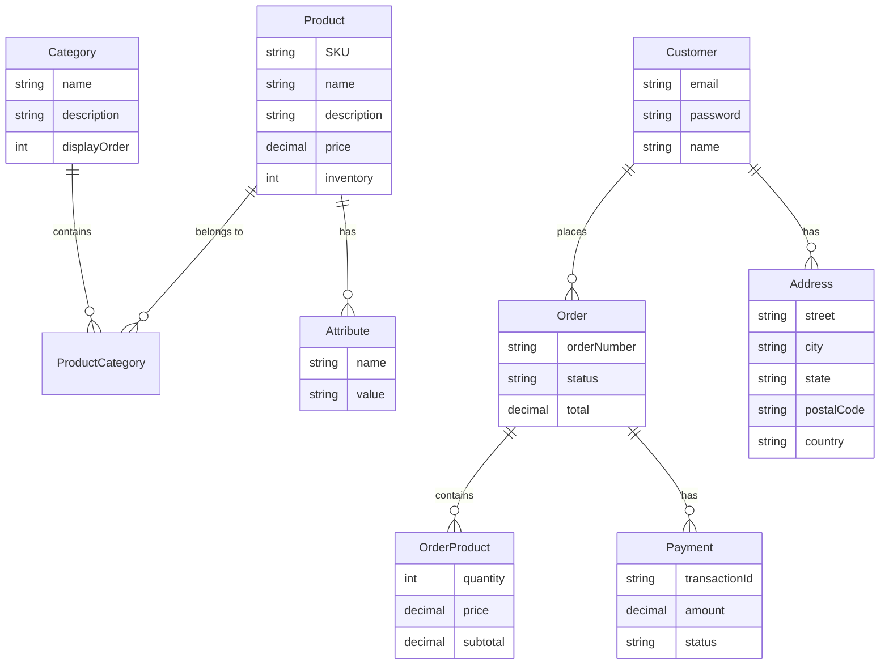

# General Specifications

# Shopizer E-Commerce Platform

**Document Version:** 1.0  
**Date:** October 22, 2025  
**Project:** Shopizer v1.x E-Commerce Platform

---

## 1\. Introduction and Context

### 1.1 Document Objective

This General Functional Specifications document provides a comprehensive overview of the Shopizer e-commerce platform, detailing its business context, functional architecture, features, and implementation strategy. The document serves as a reference for stakeholders, developers, system integrators, and operations teams to understand the platform's capabilities, constraints, and deployment requirements.

### 1.2 Project Scope

Shopizer is an open-source, Java-based e-commerce platform designed to provide a complete online store solution. The platform encompasses product catalog management, shopping cart functionality, checkout processes, order management, payment processing, shipping integration, and administrative tools. It is organized as a multi-module enterprise application consisting of core business logic (sm-core), administrative back-office (sm-central), customer-facing storefront (sm-shop), and database schema components.

### 1.3 Business Context

Shopizer targets organizations requiring a self-hosted, customizable e-commerce solution built on enterprise Java technologies. The platform is designed for deployment as standard Java web applications (WARs) on servlet containers or application servers, providing merchants and store owners with complete control over their online store infrastructure. It serves as both a production-ready e-commerce solution and a reference implementation for Java-based e-commerce patterns.

The platform addresses the needs of small-to-medium businesses, enterprise organizations, and development teams that prefer code-level control and customization capabilities over hosted SaaS solutions. It is particularly suited for B2B storefronts, internal company stores, and organizations with specific integration requirements.

### 1.4 Strategic Objectives

The Shopizer platform is designed to achieve the following strategic business objectives:

- **Reduce Total Cost of Ownership**: Provide an open-source alternative to proprietary e-commerce platforms, eliminating licensing fees and vendor lock-in while enabling organizations to maintain full control over their e-commerce infrastructure and data.
- **Accelerate Time-to-Market**: Enable businesses to launch fully-functional online stores rapidly by providing a complete, production-ready e-commerce solution with essential features out-of-the-box, reducing development time from months to weeks.
- **Enable Business Scalability**: Support organizational growth by allowing merchants to operate multiple independent storefronts from a single platform installation, facilitating expansion into new markets, brands, or business units without proportional infrastructure costs.
- **Ensure Enterprise Integration**: Facilitate seamless integration with existing enterprise systems (ERP, CRM, inventory management) through well-defined service layers and web services APIs, enabling unified business processes and data consistency across the organization.
- **Maximize Customization Flexibility**: Empower organizations to differentiate their online presence and implement unique business requirements through extensive customization capabilities, avoiding the constraints of rigid SaaS platforms while maintaining upgrade paths.
- **Mitigate Technology Risk**: Leverage mature, widely-adopted enterprise Java technologies with strong community support and available talent pools, reducing implementation risk, ensuring long-term maintainability, and facilitating team recruitment and training.

### 1.5 Constraints

The platform operates under the following business and operational constraints:

- **Infrastructure Investment Required**: Organizations must provision and maintain their own hosting infrastructure including Java application servers, database servers, and supporting infrastructure, requiring upfront capital investment and ongoing operational expertise that may not be suitable for organizations seeking zero-infrastructure solutions.
- **Technical Expertise Dependency**: Successful deployment and customization requires in-house or contracted expertise in enterprise Java technologies (Java EE, Struts, Spring, Hibernate), which may limit adoption by organizations without access to specialized Java development talent or increase dependency on external consultants.
- **Modernization Considerations**: The platform utilizes established but aging framework versions that may require technology refresh initiatives to maintain security compliance, vendor support, and compatibility with modern cloud-native infrastructure, potentially necessitating additional investment in platform modernization.
- **Desktop-Centric Administration**: The administrative interface is optimized for desktop web browsers, limiting the ability for store managers and administrators to perform management tasks from mobile devices, which may impact operational flexibility for mobile-first organizations or remote management scenarios.
- **Self-Support Model**: As an open-source platform, organizations assume responsibility for troubleshooting, security patching, and issue resolution without vendor-provided SLAs or guaranteed support response times, requiring internal capability development or engagement with community support channels and third-party service providers.

### 1.6 End-User Profiles

- [ ] **Merchants and Store Owners**: Business owners who manage product catalogs, pricing, inventory, orders, and store configuration through the administrative console.
  
- [ ] **Store Administrators**: Operations staff and store managers who process orders, manage customer service, configure shipping and payment methods, and maintain store content.
  
- [ ] **Developers and System Integrators**: Technical teams who customize the platform, develop themes, implement payment and shipping integrations, and extend business logic.
  
- [ ] **End Customers (Shoppers)**: Consumers who browse the storefront, search for products, add items to cart, complete checkout, and manage their accounts and order history.
  
- [ ] **Back-Office Staff**: Fulfillment and customer service personnel who use the admin console to view orders, update order status, manage shipments, and handle customer inquiries.
  

### 1.7 Definitions and Acronyms

| **Term / Acronym** | **Definition** |
| --- | --- |
| **SKU** (Stock Keeping Unit) | Unique product identifier used for inventory and ordering |
| **DAO** (Data Access Object) | Design pattern for abstracting persistence operations |
| **WAR** (Web Application Archive) | Java EE packaged web application for deployment |
| **ORM** (Object-Relational Mapping) | Hibernate framework for database persistence |
| **RDBMS** (Relational Database Management System) | Database engines (MySQL, Oracle, HSQLDB) |
| **PCI** (Payment Card Industry) | Standards for handling cardholder data |
| **sm-core** | Core module containing business logic, services, and domain model |
| **sm-shop** | Customer-facing storefront web application |
| **sm-central** | Administrative back-office web application |
| **HBM** (.hbm.xml) | Hibernate mapping XML files for entity-to-table mappings |
| **JAAS** (Java Authentication and Authorization Service) | Security framework for authentication |
| **CDN** (Content Delivery Network) | Infrastructure for serving static media assets |

### 1.8 Target Audience

This document is intended for:

- Business stakeholders and project sponsors evaluating the platform
- Solution architects designing e-commerce implementations
- Development teams implementing customizations and integrations
- Operations and DevOps teams responsible for deployment and maintenance
- Quality assurance teams planning testing strategies
- Security teams conducting compliance assessments

---

## 2\. Business Need and Objectives

### 2.1 Business Need

Organizations require robust, customizable e-commerce platforms that can be deployed on-premises or in private cloud environments with full control over source code, data, and infrastructure. Many businesses, particularly in B2B sectors, enterprise environments, and regulated industries, need e-commerce solutions that integrate with existing enterprise systems, support complex business rules, and provide flexibility for customization without vendor lock-in.

Shopizer addresses this need by providing a complete, open-source e-commerce platform built on widely-adopted enterprise Java technologies. The platform enables organizations to establish online stores with full catalog management, order processing, payment integration, and customer management capabilities while maintaining complete ownership and control of the implementation.

### 2.2 Functional Objectives

1.  **Catalog Management**: Enable merchants to create, organize, and maintain comprehensive product catalogs with categories, attributes, variants, images, and rich product descriptions. Support multiple product types, SKU management, and inventory tracking.
2.  **Shopping Experience**: Provide customers with intuitive product browsing, search and filtering capabilities, shopping cart management, and streamlined checkout processes. Support guest checkout and registered customer accounts with order history.
3.  **Order Processing**: Facilitate complete order lifecycle management from cart conversion through payment capture, fulfillment, shipment tracking, and completion. Enable order status updates, refunds, and customer notifications.
4.  **Payment Integration**: Support multiple payment gateways and methods including credit cards, PayPal, and other processors. Implement secure payment handling with tokenization and PCI compliance considerations.
5.  **Shipping and Tax**: Calculate shipping costs based on configurable methods and carrier integrations. Compute taxes according to regional rules and customer locations. Support multiple shipping options and real-time rate quotes.
6.  **Multi-Store Operations**: Enable platform operators to manage multiple independent stores with separate configurations, branding, product catalogs, and merchant accounts from a single installation.
7.  **Administrative Tools**: Provide comprehensive back-office functionality for store configuration, product management, order processing, customer service, reporting, and system administration.
8.  **Integration Capabilities**: Expose business logic through service layers and web services to enable integration with external systems including ERP, CRM, inventory management, and third-party services.

### 2.3 Scope of Target Solution

The Shopizer platform encompasses the following functional areas:

> **In Scope**

- Complete product catalog and category management
- Shopping cart and checkout workflows
- Order creation, processing, and lifecycle management
- Payment gateway integrations (PayPal, [Authorize.Net](http://Authorize.Net), Moneris)
- Shipping method configuration and rate calculation
- Tax computation and regional pricing
- Customer account management and authentication
- Administrative console for merchants and store managers
- Content management for static pages and store content
- Multi-store and multi-merchant support
- Internationalization and multi-currency support
- Product search with Lucene/Hibernate Search integration
- Media management for product images and digital assets
- Email notifications for orders and customer communications
- Reporting and dashboard analytics
- Web services API for external integrations

> **Out of Scope**

- Mobile native applications (iOS/Android apps)
- Advanced marketing automation and CRM features
- Built-in social media integration (requires configuration)
- Advanced analytics and business intelligence dashboards
- Subscription and recurring billing (requires customization)
- Multi-vendor marketplace functionality
- Real-time inventory synchronization with external systems (requires custom integration)

### 2.4 Business Constraints

**. Technical Constraints**:

- Platform requires Java runtime environment and servlet container infrastructure
- Build process depends on Apache Ant tooling
- Database must be one of the supported RDBMS platforms
- Legacy framework versions may require updates for modern infrastructure compatibility

**. Operational Constraints**:

- Self-hosted deployment requires in-house infrastructure and operations expertise
- Scaling requires horizontal scaling of web tiers and database replication/clustering
- Payment gateway integrations require merchant accounts and API credentials
- PCI compliance responsibility falls on the deploying organization if storing payment data

**. Resource Constraints**:

- Customization and extension require Java development expertise
- Theme development requires knowledge of JSP, Struts 2, and front-end technologies
- Operations require servlet container administration and database management skills

### 2.5 Current State (AS-IS)

The Shopizer v1.x platform represents a mature, legacy implementation of a Java-based e-commerce system. The current state includes:

- **Architecture**: Multi-module monolithic application with separate WARs for storefront, admin, and media serving. Core business logic is centralized in sm-core module with shared services and domain model.
- **Technology Stack**: Built on Struts 2 for MVC, Spring for dependency injection and transaction management, Hibernate 3 for ORM, and traditional JSP-based view rendering. Uses Apache Ant for builds and C3P0 for connection pooling.
- **Deployment Model**: Applications are packaged as WAR files and deployed to servlet containers (Tomcat, JBoss). Database schema is provisioned using SQL scripts for target RDBMS platform.
- **Integration Approach**: Payment and shipping integrations are implemented as pluggable modules. Web services layer provides SOAP/JAX-WS endpoints for external system integration.
- **User Interface**: Server-rendered JSP pages with jQuery for client-side interactivity. Admin interface is desktop-oriented with two-column layouts and modal dialogs.
- **Session Management**: Shopping carts are primarily session-based for guest users. Registered customers may have persistent cart implementations depending on configuration.
- **Security**: JAAS-based authentication with custom login modules. Role-based access control enforced through Struts interceptors and action-level checks.

### 2.6 Stakeholder Roles and Responsibilities

| **Stakeholder Role** | **Key Responsibilities** |
| --- | --- |
| **Merchants/Store Owners** | • Define product catalog structure and pricing strategies • Configure store settings, payment methods, and shipping options • Review sales reports and analytics • Make business decisions on promotions and inventory |
| **Store Administrators** | • Manage day-to-day store operations • Process and fulfill orders • Handle customer service inquiries • Maintain product information and inventory levels • Configure store content and promotional materials |
| **Development Team** | • Implement customizations and new features • Integrate payment gateways and shipping providers • Develop and maintain themes • Extend business logic and services • Perform code reviews and quality assurance |
| **Operations/DevOps Team** | • Deploy and maintain application infrastructure • Monitor system health and performance • Manage database backups and disaster recovery • Scale infrastructure to meet demand • Ensure security patches are applied |
| **Security Team** | • Conduct security assessments and penetration testing • Ensure PCI compliance for payment handling • Review and approve security-related changes • Monitor for security incidents • Maintain security documentation |
| **End Customers** | • Browse and search product catalog • Place orders and make payments • Track order status and shipments • Manage account information and preferences • Provide feedback and reviews |

---

---

## 3\. Functional Architecture and Features

### 3.1 Architectural Overview

Shopizer employs a modular, layered architecture that separates concerns across multiple deployable units. The architecture follows enterprise Java patterns with clear boundaries between presentation, business logic, and data access layers.

**. High-Level Architecture**:

The platform consists of four primary modules:

1.  **sm-core (Core Module)**: Contains the domain model, business services, data access objects (DAOs), and shared utilities. This module provides the foundational business logic consumed by both web applications and external integrations. Key components include domain entities (Product, Order, Customer, Category), service layer (OrderService, CatalogService, PaymentService, ShippingService, TaxService), DAO layer for persistence operations, integration modules for payment gateways and shipping providers, web services implementations (SOAP/JAX-WS), and utility classes for encryption, session management, and file handling.
2.  **sm-shop (Storefront Application)**: Customer-facing web application implementing the public storefront. Built as a Struts 2 web application with JSP views and packaged as sm-shop.war. Responsibilities include product catalog browsing and search, shopping cart management, multi-step checkout workflow, customer account management, order history and tracking, payment gateway interactions, and responsive product pages with category navigation.
3.  **sm-central (Administrative Application)**: Back-office web application for merchant and store administration. Also built on Struts 2 and packaged as sm-central.war. Provides merchant dashboard with key metrics, product and category management, order processing and fulfillment, customer management, store configuration and settings, payment and shipping method configuration, content management system, user and role management, and reporting and analytics.
4.  **schema (Database Module)**: Contains SQL scripts for creating and initializing database schemas across supported RDBMS platforms (MySQL, Oracle, HSQLDB). Includes table definitions, constraints, indexes, and seed data.
5.  **media (Media Application)**: Lightweight web application for serving static assets including product images, CSS, JavaScript, and downloadable files. Deployed separately as media.war to enable CDN offloading and independent scaling.

**. Layered Architecture**:

- **Presentation Layer**: Struts 2 actions and JSP views handle HTTP requests, form processing, and response rendering. Actions delegate to service layer for business operations.
- **Service Layer**: Spring-managed service beans implement business logic and orchestrate transactions. Services are grouped by domain (catalog, orders, customers, payments, shipping, taxes).
- **Data Access Layer**: Hibernate-based DAOs provide persistence operations. Hibernate mappings (.hbm.xml files) define entity-to-table mappings and relationships.
- **Integration Layer**: Pluggable modules for payment gateways, shipping providers, and external services. Web services layer exposes functionality to external systems.
- **Cross-Cutting Concerns**: Spring handles dependency injection and transaction management. JAAS provides authentication and authorization. Hibernate Search integrates Lucene for full-text search.
    
    ### 3.2 Main Functional Modules
    

1.  **Catalog Management Module**: Product creation and editing with rich attributes, category hierarchy and product-to-category relationships, product variants and SKU management, product images and media galleries, product attributes and options (size, color, etc.), inventory tracking and stock levels, product visibility and availability controls, related products and cross-sell/upsell relationships, and product search indexing with Lucene.
2.  **Shopping Cart Module**: Session-based cart for guest users, persistent cart for registered customers, add/remove/update cart line items, quantity adjustments and line item merging, mini-cart AJAX updates, cart persistence across sessions, cart abandonment tracking, and promotional code application.
3.  **Checkout Module**: Multi-step checkout workflow, guest checkout and registered customer paths, shipping address collection and validation, billing address management, shipping method selection with rate calculation, payment method selection, payment gateway integration and authorization, order review and confirmation, order creation and persistence, and email confirmations and notifications.
4.  **Order Management Module**: Order lifecycle management (NEW, PAID, SHIPPED, COMPLETED, CANCELLED), order status updates and tracking, order search and filtering, order detail views with line items and totals, invoice generation and management, payment capture and refund processing, shipment tracking and fulfillment, order history for customers and merchants, and order reporting and analytics.
5.  **Payment Processing Module**: Pluggable payment gateway architecture, implemented gateways (PayPal Express, [Authorize.Net](http://Authorize.Net), Moneris), payment authorization and capture workflows, payment method configuration in admin, secure payment data handling, transaction logging and audit trails, refund and void operations, and payment status tracking.
6.  **Shipping and Tax Module**: Configurable shipping methods (flat rate, custom rates, carrier integration), shipping rate calculation based on weight, destination, and price, carrier integrations (FedEx rate quotes), shipping zone configuration, tax calculation based on regional rules, tax zone and rate management, multi-jurisdiction tax support, and shipping and tax display in checkout.
7.  **Customer Management Module**: Customer registration and authentication, customer profile management, address book management, order history and tracking, password reset and account recovery, customer groups and segmentation, customer search and filtering in admin, and customer service tools.
8.  **Content Management Module**: Static page creation and editing, content blocks and portlets, homepage carousel management, store information pages, SEO metadata management, multi-language content support, and template-based page rendering.
9.  **Multi-Store Module**: Multiple merchant store support, independent store configurations, store-specific catalogs and pricing, separate branding and themes per store, store-level user and role management, and centralized platform administration.
10. **Integration Module**: Web services layer (SOAP/JAX-WS), customer and invoice web service implementations, payment gateway integration framework, shipping provider integration framework, email/SMTP integration for notifications, Google Analytics and Facebook integration configuration, and extensible module interfaces for custom integrations.
11. **Reporting and Analytics Module**: Merchant dashboard with key metrics, sales reports and order analytics, product performance reports, customer analytics, inventory reports, and configurable report parameters.

### 3.3 External Interfaces

- **Payment Gateway Interfaces**: PayPal Express Checkout API, [Authorize.Net](http://Authorize.Net) Payment Gateway API, Moneris Payment Gateway API, and extensible payment module interface for additional gateways.
- **Shipping Provider Interfaces**: FedEx Web Services for rate quotes, configurable shipping method framework, and extensible shipping module interface.
- **Email/SMTP Interface**: SMTP integration for transactional emails, order confirmation emails, shipping notification emails, password reset emails, and configurable email templates.
- **Web Services API**: SOAP/JAX-WS endpoints for external integration, customer management web service, invoice management web service, and extensible web service framework.
- **Database Interfaces**: JDBC connectivity to RDBMS, Hibernate ORM for object-relational mapping, support for MySQL, Oracle, and HSQLDB, and connection pooling with C3P0.
- **Third-Party Integration Interfaces**: Google Analytics integration for tracking, Facebook page integration, Lucene/Hibernate Search for full-text search, and configurable API key management in admin.

### 3.4 Planned Integrations

Recommended future integrations include additional payment gateways (Stripe, Square, Braintree), advanced shipping carriers (UPS, USPS, DHL), tax calculation services (Avalara, TaxJar), email marketing platforms (Mailchimp, SendGrid), CRM systems (Salesforce, HubSpot), ERP systems for inventory synchronization, product information management (PIM) systems, customer service platforms, social media commerce integrations, and analytics and business intelligence platforms.

### 3.5 Principal Features with Descriptions

- **Product Catalog**: Comprehensive product management with support for simple and configurable products, variants, attributes, categories, images, and rich descriptions. Merchants can organize products hierarchically, set visibility rules, manage inventory, and configure pricing including special prices and promotions.
- **Search and Navigation**: Full-text product search powered by Lucene/Hibernate Search with faceted filtering, category navigation with breadcrumbs, product listing pages with pagination and sorting, and search result relevance ranking.
- **Shopping Cart**: Persistent shopping cart with session management, AJAX-powered mini-cart for quick updates, cart line item management with quantity adjustments, automatic price recalculation including taxes and promotions, and cart persistence across user sessions.
- **Checkout Process**: Streamlined multi-step checkout supporting both guest and registered customers, address validation and management, shipping method selection with real-time rate calculation, payment method selection with multiple gateway support, order review and confirmation, and immediate order creation with email notifications.
- **Order Management**: Complete order lifecycle tracking from creation through fulfillment and completion, order status management with state transitions, invoice generation and payment tracking, shipment management and tracking number capture, refund and cancellation processing, and comprehensive order search and reporting.
- **Payment Processing**: Secure payment handling with PCI considerations, support for multiple payment gateways with pluggable architecture, payment authorization and capture workflows, transaction logging and audit trails, and payment method configuration in administrative interface.
- **Merchant Administration**: Comprehensive back-office dashboard with key performance metrics, product and category CRUD operations, order processing and fulfillment tools, customer management and service capabilities, store configuration including branding and localization, payment and shipping method setup, content management for static pages, and user and permission management.
- **Customer Accounts**: Customer registration and authentication with JAAS, profile management including contact information and preferences, address book for shipping and billing addresses, order history with detailed order views and tracking, password reset and account recovery, and secure session management.
- **Multi-Store Support**: Platform-level support for multiple independent merchant stores, store-specific configuration including name, currency, and locale, independent product catalogs and pricing per store, separate branding and themes, and centralized administration with store-scoped permissions.
- **Internationalization**: Multi-language support with locale-specific content, multi-currency pricing and display, regional tax and shipping rules, localized date and number formatting, and configurable default language and currency per store.
- **Media Management**: Centralized media repository for product images and digital assets, image upload and management through admin interface, multiple image sizes and thumbnails, separate media application for optimized serving, and support for CDN integration.
- **Reporting and Analytics**: Merchant dashboard with sales metrics and trends, order reports with filtering and date ranges, product performance analytics, customer analytics and segmentation, inventory reports, and exportable report data.

### 3.6 Global Business Rules

1.  **Product Visibility**: Products must be explicitly marked as visible to appear on the storefront. Products can be hidden without deletion to preserve order history and references.
2.  **Inventory Management**: Product stock levels are decremented upon order confirmation. Orders should not be placed for out-of-stock items unless backorders are explicitly enabled.
3.  **Pricing Calculation**: Product prices are calculated based on base price, applicable promotions/discounts, regional tax rules, and selected currency. All price calculations must maintain precision to avoid rounding errors.
4.  **Order Lifecycle**: Orders progress through defined states (NEW, PAYMENT_CONFIRMED, SHIPPED, COMPLETED, CANCELLED). State transitions are controlled by business logic and cannot be arbitrary.
5.  **Payment Authorization**: Payment must be authorized before order confirmation. Payment capture may occur immediately or be deferred based on merchant configuration and gateway capabilities.
6.  **Tax Calculation**: Taxes are calculated based on shipping destination, product tax class, and configured tax rules. Tax calculation occurs during checkout and is recalculated if shipping address changes.
7.  **Shipping Calculation**: Shipping costs are calculated based on selected shipping method, destination, package weight/dimensions, and order value. Shipping rates may be flat, tiered, or obtained from carrier APIs.
8.  **Customer Authentication**: Checkout can proceed as guest or require customer authentication. Registered customers must authenticate to access account features and order history.
9.  **Data Integrity**: Referential integrity is enforced at database level through foreign key constraints. Soft deletes are used for entities referenced in order history.
10. **Security**: All administrative functions require authentication and appropriate role-based permissions. Customer data and payment information must be protected according to security best practices.
11. **Multi-Store Isolation**: Each merchant store operates independently with separate configurations, catalogs, and customer bases. Cross-store data access is restricted.

### 3.7 Key Use Cases

| **Use Case** | **Actor(s)** | **Flow** | **Outcome** |
| --- | --- | --- | --- |
| **UC1: Customer Product Purchase** | End Customer | Customer browses catalog → searches/filters products → views product details → adds to cart → proceeds to checkout → enters shipping address → selects shipping method → enters payment information → reviews order → confirms purchase → receives confirmation email | Order created, payment authorized, customer and merchant notified |
| **UC2: Merchant Product Management** | Store Administrator | Admin logs into sm-central → navigates to catalog management → creates new product → sets product attributes (name, description, price, SKU) → uploads product images → assigns to categories → sets inventory levels → publishes product | Product visible on storefront and available for purchase |
| **UC3: Order Fulfillment** | Store Administrator | Admin views order list → selects pending order → reviews order details and line items → updates order status to "Processing" → prepares shipment → enters tracking number → updates order status to "Shipped" → customer receives shipment notification | Order fulfilled, customer notified, order status updated |
| **UC4: Payment Gateway Configuration** | Store Administrator | Admin navigates to payment settings → selects payment gateway (e.g., PayPal) → enters API credentials → configures payment method settings → tests connection → enables payment method → saves configuration | Payment method available at checkout |
| **UC5: Multi-Store Setup** | Platform Administrator | Admin creates new merchant store → configures store name, URL, and branding → sets default currency and locale → assigns store administrator → configures payment and shipping methods → imports initial product catalog → activates store | New independent store operational |
| **UC6: Customer Account Management** | End Customer | Customer registers account → verifies email → logs in → updates profile information → adds shipping addresses to address book → views order history → tracks recent order → updates password | Customer account maintained with current information |

---

## 4\. Non-Functional Requirements

### 4.1 Performance Requirements

- **Response Time**: Storefront page load time should be 800ms or less for cached pages and 2 seconds or less for dynamic pages under normal load. Admin interface response should be 1.5 seconds or less for typical operations. Checkout transaction completion should be 4 seconds or less end-to-end (excluding external gateway latency). Search results should return in 500ms or less for typical product searches. API response time should be 200ms or less for simple queries and 1 second or less for complex operations.
- **Throughput**: The system should support a minimum of 1,000 concurrent users for medium-traffic stores, handle 100 transactions per minute during peak periods, process 10,000+ products in catalog without performance degradation, and support 50+ concurrent admin users.
- **Resource Utilization**: Application server memory should be 256MB-512MB per WAR instance (configurable based on load). Database connection pool should maintain 20-50 connections per application instance. CPU utilization should remain at or below 70% under normal load to allow headroom for spikes.
- **Scalability Targets**: The system should support horizontal scaling by adding web/app server instances behind load balancer, database scaling through read replicas for query distribution, media serving offload to CDN for improved global performance, and session management externalization to Redis/Memcached for stateless scaling.
- **Optimization Strategies**: Implement application-level caching (RefCache) for reference data, use HTTP caching and CDN for static assets, optimize database queries and add appropriate indexes, implement connection pooling (C3P0), use lazy loading for Hibernate associations, minimize session data size, and implement page fragment caching for JSP views.

### 4.2 Security Requirements

- **Authentication**: JAAS-based authentication for admin and customer users, strong password policies (minimum length, complexity requirements), account lockout after failed login attempts, password hashing using secure algorithms (bcrypt or Argon2 recommended), session timeout after inactivity period, and secure password reset workflow with time-limited tokens.
- **Authorization**: Role-based access control (RBAC) for administrative functions, Struts interceptors enforce action-level permissions, store-scoped permissions for multi-store environments, principle of least privilege for user roles, and audit logging of administrative actions.
- **Data Protection**: HTTPS/TLS required for all customer and admin traffic, secure session cookies (HttpOnly, Secure, SameSite flags), payment card data tokenization (do not store raw PAN), PCI DSS compliance for payment handling, encryption of sensitive data at rest, and secure API credentials storage.
- **Input Validation and Output Encoding**: Server-side validation for all user inputs, parameterized queries/ORM to prevent SQL injection, output encoding to prevent XSS attacks, CSRF token protection for state-changing operations, file upload validation (type, size, content scanning), and input sanitization for rich text fields.
- **Security Monitoring**: Logging of authentication events (success/failure), audit trail for critical operations (order changes, refunds, configuration updates), intrusion detection and prevention, regular security scanning and penetration testing, dependency vulnerability scanning, and security patch management process.
- **API Security**: Authentication required for web service endpoints, API key or OAuth 2.0 token-based authentication, rate limiting to prevent abuse, input validation for all API requests, and secure error messages (no sensitive data disclosure).

### 4.3 Availability Requirements

- **Uptime Targets**: Production storefront should maintain 99.9% availability (≤ 43 minutes downtime per month). Administrative interface should maintain 99.5% availability. Planned maintenance windows should occur during off-peak hours with advance notice.
- **Reliability**: Mean Time Between Failures (MTBF) should be ≥ 720 hours. Mean Time To Recovery (MTTR) should be ≤ 30 minutes for critical issues. Zero data loss for completed transactions.
- **High Availability Architecture**: Deploy multiple application server instances behind load balancer, implement database replication (master-slave or multi-master), enable automated failover for database, configure health checks and automatic instance replacement, and consider geographic redundancy for disaster recovery (optional).
- **Backup and Recovery**: Perform daily automated database backups with 30-day minimum retention, maintain point-in-time recovery capability, conduct regular backup restoration testing, backup media assets to object storage, and maintain documented disaster recovery procedures.
- **Monitoring and Alerting**: Implement real-time application health monitoring, database performance monitoring, disk space and resource utilization alerts, error rate and response time monitoring, automated alerting for critical issues, and 24/7 on-call support for production issues.

### 4.4 Scalability Requirements

- **Horizontal Scaling**: Implement stateless application design to support multiple instances, externalize sessions (Redis, database, or sticky sessions), distribute load across application servers using load balancer, and enable independent scaling of sm-shop, sm-central, and media applications.
- **Vertical Scaling**: Support increased resources (CPU, memory) for application and database servers, optimize resource utilization through tuning and profiling, and implement resource monitoring and capacity planning.
- **Database Scaling**: Support read replicas for query distribution, implement connection pooling and query optimization, consider database sharding for very large datasets, and use caching layers to reduce database load.
- **Media and Static Assets**: Offload static assets to CDN for global distribution, implement image optimization and multiple sizes, use object storage (S3, etc.) for media files, and enable browser caching for static resources.
- **Performance Under Load**: Maintain response times under increased load, gracefully degrade non-critical features if needed, implement queue-based processing for heavy operations, and use asynchronous processing for emails and notifications.

### 4.5 Usability Requirements

- **User Interface**: Provide responsive storefront design for desktop and mobile devices, ensure admin interface is desktop-oriented with clear navigation, implement consistent design patterns and visual hierarchy, provide clear error messages and validation feedback, and support keyboard navigation and accessibility features.
- **Internationalization**: Support multiple languages with locale-specific content, enable multi-currency pricing and display, provide localized date and number formatting, allow configurable default language and currency per store, and support right-to-left (RTL) languages where needed.
- **Accessibility**: Comply with WCAG 2.1 Level AA guidelines, provide semantic HTML and ARIA roles, ensure keyboard accessibility for all functions, maintain sufficient color contrast ratios, provide alt text for images, and support screen readers.
- **Documentation**: Provide comprehensive admin user guides, include developer documentation for customization, maintain API documentation for integrations, offer deployment and operations guides, and provide troubleshooting and FAQ resources.
- **User Experience**: Minimize page load times and optimize performance, provide clear navigation and breadcrumbs, implement intuitive checkout flow with progress indicators, offer helpful inline help and tooltips, and ensure consistent behavior across browsers.

### 4.6 Compatibility Requirements

- **Browser Support**: Support modern versions of Chrome, Firefox, Safari, and Edge. Provide graceful degradation for older browsers. Test on both desktop and mobile browsers.
- **Database Compatibility**: Support MySQL 5.x and higher (recommended for production), Oracle 10g and higher, and HSQLDB for development and testing environments.
- **Application Server Compatibility**: Support Apache Tomcat 6.x and higher, JBoss/WildFly application servers, and other Java EE compliant servlet containers.
- **Java Version**: Require Java JDK 1.5 or higher (recommend upgrading to Java 8 LTS or Java 11 LTS for security and performance).
- **Operating System**: Support deployment on Linux (Ubuntu, CentOS, RHEL), Windows Server, and other platforms supporting Java and servlet containers.
- **Integration Compatibility**: Maintain compatibility with supported payment gateways (PayPal, [Authorize.Net](http://Authorize.Net), Moneris), shipping providers (FedEx), SMTP servers for email, and standard JDBC-compliant databases.

---

## 5\. Implementation Strategy

### 5.1 Feature Prioritization

**. Critical Features (Phase 1 - Must Have)**:

- Core catalog management (products, categories, SKUs)
- Shopping cart and session management
- Basic checkout workflow with guest and registered paths
- Order creation and basic order management
- At least one payment gateway integration (PayPal recommended)
- Basic shipping method configuration
- Customer registration and authentication
- Admin console with product and order management
- Database schema and data model
- Email notifications for orders

**. High Priority Features (Phase 2 - Should Have)**:

- Advanced product features (variants, attributes, related products)
- Multiple payment gateway support
- Shipping carrier integrations (FedEx rates)
- Tax calculation engine
- Customer account management and order history
- Admin dashboard and reporting
- Content management system
- Search functionality with Lucene integration
- Media management and image handling
- Multi-store basic support

**. Medium Priority Features (Phase 3 - Nice to Have)**:

- Advanced reporting and analytics
- Promotional engine and discount codes
- Customer segmentation and groups
- Advanced admin features (bulk operations)
- Web services API for external integration
- Google Analytics and Facebook integration
- Advanced search with faceting
- Inventory management enhancements
- Email template customization
- Performance optimization and caching

**. Low Priority Features (Phase 4 - Future Enhancements)**:

- Advanced multi-store features
- Subscription and recurring billing
- Advanced marketing features
- Mobile-optimized admin interface
- RESTful API development
- Advanced analytics and BI integration
- Social commerce features
- Advanced customer service tools
- Marketplace functionality
- AI/ML-powered recommendations

### 5.2 Business Criticality

1.  **Mission Critical**: Order processing and payment capture, customer checkout workflow, payment gateway connectivity, database integrity and transactions, authentication and authorization, and data backup and recovery.
2.  **Business Critical**: Product catalog management, inventory tracking, shipping calculation, tax computation, customer account management, admin order management, email notifications, and search functionality.
3.  **Operational**: Reporting and analytics, content management, promotional features, customer segmentation, web services API, third-party integrations, and performance monitoring.
4.  **Enhancement**: Advanced features, UI improvements, additional integrations, mobile optimizations, and experimental features.

### 5.3 Urgency Assessment

- **Immediate (0-3 months)**: Core platform deployment, essential e-commerce features, primary payment gateway, basic shipping and tax, customer and admin authentication, and production infrastructure setup.
- **Short-term (3-6 months)**: Additional payment gateways, shipping integrations, advanced product features, reporting capabilities, search enhancements, multi-store foundation, and performance optimization.
- **Medium-term (6-12 months)**: Web services API, advanced integrations, promotional engine, enhanced analytics, mobile optimizations, security hardening, and scalability improvements.
- **Long-term (12+ months)**: Platform modernization, technology stack upgrades, advanced features, marketplace capabilities, AI/ML integration, and strategic enhancements.

### 5.4 Identified Risks

**. Technical Risks**:

- **Legacy Technology Stack**: Older framework versions may have security vulnerabilities and compatibility issues. Mitigation: Conduct dependency audit, plan upgrades, apply security patches.
- **Performance Bottlenecks**: Unoptimized queries and code may cause slow response times. Mitigation: Performance testing, profiling, query optimization, caching implementation.
- **Integration Failures**: Payment gateway or shipping API failures may disrupt operations. Mitigation: Implement retry logic, fallback mechanisms, comprehensive error handling, monitoring.
- **Database Scalability**: Single database may become bottleneck under load. Mitigation: Implement read replicas, connection pooling, query optimization, caching.
- **Security Vulnerabilities**: XSS, CSRF, injection attacks may compromise system. Mitigation: Security testing, input validation, output encoding, CSRF protection, regular audits.

**. Operational Risks**:

- **Deployment Complexity**: Manual deployment processes may lead to errors. Mitigation: Automate deployments, implement CI/CD, use infrastructure as code, thorough testing.
- **Data Loss**: Database failures or corruption may result in data loss. Mitigation: Automated backups, replication, tested recovery procedures, transaction integrity.
- **Downtime**: System outages may impact sales and customer experience. Mitigation: High availability architecture, monitoring, automated failover, incident response procedures.
- **Insufficient Capacity**: Underestimated load may cause performance degradation. Mitigation: Capacity planning, load testing, auto-scaling, performance monitoring.

**. Business Risks**:

- **PCI Compliance**: Improper payment handling may result in compliance violations. Mitigation: Use tokenization, minimize card data storage, conduct compliance assessment, regular audits.
- **Scope Creep**: Uncontrolled feature additions may delay delivery. Mitigation: Clear requirements, change control process, prioritization framework, stakeholder management.
- **Resource Constraints**: Insufficient team capacity may impact timeline. Mitigation: Realistic planning, contingency resources, prioritization, scope management.
- **User Adoption**: Poor usability may lead to low adoption. Mitigation: User research, usability testing, training, documentation, feedback loops.

**. Project Risks**:

- **Timeline Delays**: Dependencies and blockers may cause schedule slippage. Mitigation: Buffer time, critical path management, risk monitoring, proactive issue resolution.
- **Budget Overruns**: Unexpected costs may exceed budget. Mitigation: Detailed estimation, contingency budget, cost tracking, scope control.
- **Knowledge Gaps**: Team unfamiliarity with technology may slow progress. Mitigation: Training, documentation, knowledge sharing, expert consultation.
- **Third-Party Dependencies**: External service issues may block progress. Mitigation: Early integration, sandbox environments, fallback options, vendor management.

### 5.5 Risk Mitigation Plans

**. For Legacy Technology Stack**:

- Conduct comprehensive dependency audit in preparation phase
- Create upgrade roadmap with prioritized security patches
- Implement automated dependency scanning in CI/CD
- Plan for gradual modernization post-launch
- Document known limitations and workarounds

**. For Performance Issues**:

- Establish performance baselines early
- Implement performance testing in CI/CD pipeline
- Use profiling tools to identify bottlenecks
- Implement caching strategy (application, HTTP, database)
- Optimize database queries and add indexes
- Plan for horizontal scaling from the start

**. For Integration Failures**:

- Implement circuit breaker pattern for external calls
- Add comprehensive logging and monitoring
- Create fallback mechanisms for critical integrations
- Test failure scenarios and recovery procedures
- Maintain sandbox environments for testing
- Document escalation procedures

**. For Security Vulnerabilities**:

- Conduct security review in each development phase
- Implement automated security scanning
- Perform penetration testing before launch
- Establish security incident response procedures
- Maintain security patch management process
- Provide security training for development team

**. For Deployment Risks**:

- Automate build and deployment processes
- Implement blue-green or canary deployment strategies
- Maintain rollback procedures
- Conduct deployment rehearsals
- Use infrastructure as code
- Implement comprehensive health checks

**. For PCI Compliance**:

- Engage PCI compliance consultant early
- Use tokenization for payment data
- Minimize card data storage and handling
- Implement required security controls
- Conduct compliance assessment before launch
- Maintain compliance documentation

---

## 6\. Appendices

### 6.1 Business Glossary

- **Add to Cart**: Action of adding a product to the shopping cart for potential purchase.
- **Admin Console**: Back-office web application (sm-central) used by merchants and administrators to manage the store.
- **Attribute**: Product characteristic such as size, color, or material that can have multiple values.
- **Authorization**: Process of verifying user permissions to perform specific actions.
- **Backorder**: Order for out-of-stock items that will be fulfilled when inventory is replenished.
- **Billing Address**: Customer address used for payment processing and invoicing.
- **Cart Line Item**: Individual product entry in a shopping cart including SKU, quantity, and price.
- **Category**: Logical grouping of products for organization and navigation.
- **Checkout**: Multi-step process of converting a shopping cart into a completed order.
- **Customer**: Registered or guest user who browses products and places orders.
- **DAO (Data Access Object)**: Design pattern for abstracting database operations.
- **Discount**: Reduction in product or order price based on promotional rules.
- **Fulfillment**: Process of preparing and shipping an order to the customer.
- **Gateway**: External service that processes payments or provides shipping rates.
- **Guest Checkout**: Checkout process that allows purchase without customer registration.
- **Hibernate**: Object-relational mapping (ORM) framework used for database persistence.
- **Inventory**: Quantity of products available for sale.
- **Invoice**: Document representing order details, line items, and payment information.
- **JAAS (Java Authentication and Authorization Service)**: Security framework for authentication.
- **Line Item**: Individual product entry in an order or cart.
- **Merchant**: Store owner or operator who manages products, orders, and store configuration.
- **Order**: Persisted transaction containing customer information, products, and payment details.
- **Order Lifecycle**: Progression of order through states (NEW, PAID, SHIPPED, COMPLETED, CANCELLED).
- **Payment Authorization**: Process of reserving funds on a payment method.
- **Payment Capture**: Process of actually charging the authorized payment.
- **PCI DSS (Payment Card Industry Data Security Standard)**: Security standards for handling payment card data.
- **Product**: Sellable item in the catalog with attributes, price, and inventory.
- **Promotion**: Marketing campaign offering discounts or special pricing.
- **Refund**: Return of payment to customer for canceled or returned order.
- **Shipping Address**: Customer address where order will be delivered.
- **Shipping Method**: Delivery option with associated cost and estimated delivery time.
- **SKU (Stock Keeping Unit)**: Unique identifier for a specific product or variant.
- **sm-central**: Administrative web application module.
- **sm-core**: Core business logic and service layer module.
- **sm-shop**: Customer-facing storefront web application module.
- **Storefront**: Public-facing website where customers browse and purchase products.
- **Struts 2**: MVC web framework used for presentation layer.
- **Tax**: Government-imposed charge calculated based on order value and location.
- **Variant**: Specific version of a product with unique attributes (e.g., size, color).
- **WAR (Web Application Archive)**: Packaged Java web application for deployment.

### 6.2 Traceability Matrix

**. Requirement to Feature Mapping**:

| Business Requirement | Functional Module | Implementation Component |
| --- | --- | --- |
| Product Management | Catalog Management | sm-core: Product, Category entities; sm-central: Product CRUD actions |
| Shopping Cart | Shopping Cart Module | sm-shop: ShoppingCartAction; sm-core: Cart services |
| Checkout Process | Checkout Module | sm-shop: Checkout actions; sm-core: OrderService |
| Payment Processing | Payment Module | sm-core: PaymentService, gateway implementations |
| Order Management | Order Module | sm-core: OrderService; sm-central: Order management actions |
| Customer Accounts | Customer Module | sm-core: Customer entities; sm-shop: Customer actions |
| Shipping Calculation | Shipping Module | sm-core: ShippingService, carrier integrations |
| Tax Calculation | Tax Module | sm-core: TaxService |
| Admin Dashboard | Reporting Module | sm-central: Dashboard actions and views |
| Content Management | CMS Module | sm-central: Content management actions |
| Multi-Store | Multi-Store Module | sm-core: MerchantService; sm-central: Store configuration |
| Search | Search Module | sm-core: Hibernate Search/Lucene integration |
| Media Management | Media Module | media.war; sm-core: File utilities |
| Web Services API | Integration Module | sm-core: Web service implementations |

### 6.3 Conceptual Wireframes and Mockups

**. Available UI Documentation**:

The repository includes comprehensive admin interface documentation with screenshots and design specifications:

- **Admin Login Interface** (admin001): Authentication screen with user credentials input
- **Store Settings Interface** (admin006): Merchant-facing store configuration screen
- **Merchant Dashboard Interface** (admin007): Overview dashboard with key metrics
- **Content Management Interface** (admin008): Page creation and editing tools
- **Contact Settings Interface** (admin013): Store contact information configuration
- **Generic Portlets Configuration** (admin014): UI component management
- **Homepage Carousel Management** (admin017): Image carousel configuration
- **Facebook Administration Page** (admin021): Social media integration settings
- **Product List Interface** (admin024): Product catalog management view
- **Sales Tax Configuration** (admin026): Tax rules and rates setup
- **Order Management Interface** (admin029): Order processing and fulfillment
- **Invoice List Interface** (admin031): Invoice search and management

**. Storefront Components**:

- Product listing pages with category navigation
- Product detail pages with images and attributes
- Shopping cart view with line items
- Multi-step checkout workflow
- Customer account dashboard
- Order history and tracking

### 6.4 Flow Diagrams and Process Maps

**. Customer Purchase Flow**:

1.  Browse Catalog → Search/Filter → View Product Details
2.  Add to Cart → Update Quantities → View Cart
3.  Proceed to Checkout → Guest or Login
4.  Enter Shipping Address → Select Shipping Method
5.  Enter Payment Information → Review Order
6.  Confirm Purchase → Payment Authorization
7.  Order Created → Email Confirmation Sent

**. Order Fulfillment Flow**:

1.  Order Received → Admin Notification
2.  Admin Reviews Order → Validates Payment
3.  Prepare Shipment → Update Inventory
4.  Ship Order → Enter Tracking Number
5.  Update Order Status → Customer Notification
6.  Order Completed

**. Product Management Flow**:

1.  Admin Login → Navigate to Catalog
2.  Create Product → Enter Attributes
3.  Upload Images → Assign Categories
4.  Set Pricing → Configure Inventory
5.  Publish Product → Storefront Update

**. Payment Processing Flow**:

1.  Customer Submits Payment → Gateway Request
2.  Payment Authorization → Response Received
3.  Success: Create Order → Failure: Show Error
4.  Payment Capture (immediate or deferred)
5.  Transaction Logged → Audit Trail

### 6.5 Technology Stack Summary

**. Backend Technologies**:

- Java JDK 1.5+ (recommend Java 8 or 11 LTS)
- Apache Struts 2 (MVC framework)
- Spring Framework (dependency injection, transaction management)
- Hibernate 3 (ORM and persistence)
- Hibernate Search / Apache Lucene (full-text search)
- C3P0 (connection pooling)
- JAAS (authentication and authorization)

**. Frontend Technologies**:

- JSP (Java Server Pages)
- jQuery (client-side scripting)
- HTML/CSS
- AJAX for dynamic updates

**. Build and Deployment**:

- Apache Ant (build automation)
- WAR packaging
- Servlet containers (Tomcat, JBoss, etc.)

**. Database**:

- MySQL 5.x+ (recommended for production)
- Oracle 10g+
- HSQLDB (development)

**. Integration**:

- SOAP/JAX-WS (web services)
- SMTP (email)
- Payment gateways (PayPal, [Authorize.Net](http://Authorize.Net), Moneris)
- Shipping providers (FedEx)

### 6.6 Deployment Architecture Diagram

**. Conceptual Deployment Architecture**:

```
[Load Balancer]
     |
     +-- [sm-shop Instance 1] --+
     |                          |
     +-- [sm-shop Instance 2] --+-- [Database Master]
     |                          |        |
     +-- [sm-central Instance]--+   [Database Slave(s)]
     |
     +-- [media.war / CDN]

[External Services]
     - Payment Gateways (PayPal, Authorize.Net, Moneris)
     - Shipping Providers (FedEx)
     - SMTP Server
     - Analytics (Google Analytics)
```

**. Component Responsibilities**:

- **Load Balancer**: Distributes traffic across application instances
- **sm-shop Instances**: Handle customer storefront requests (horizontally scalable)
- **sm-central Instance**: Admin back-office (can be scaled if needed)
- **media.war / CDN**: Serves static assets and product images
- **Database Master**: Primary database for writes
- **Database Slave(s)**: Read replicas for query distribution
- **External Services**: Third-party integrations

### 6.7 Security Architecture

**. Security Layers**:

1.  **Network Security**: HTTPS/TLS for all traffic, firewall rules, network segmentation
2.  **Application Security**: JAAS authentication, role-based authorization, session management
3.  **Data Security**: Encrypted connections, secure password storage, payment tokenization
4.  **Input Validation**: Server-side validation, parameterized queries, output encoding
5.  **Audit and Monitoring**: Authentication logging, action audit trails, security monitoring

**. Authentication Flow**:

- User submits credentials → JAAS login module validates
- Success: Create session, assign roles → Failure: Log attempt, lockout if needed
- Session maintained with secure cookies
- Timeout after inactivity period

**. Authorization Enforcement**:

- Struts interceptors check permissions before action execution
- Service layer validates user context for operations
- Database constraints enforce data integrity

### 6.8 Data Model Overview

**. Core Entities**:

- **Product**: SKU, name, description, price, inventory, images, categories, attributes
- **Category**: Name, description, parent category, display order
- **Order**: Order number, customer, status, line items, totals, payment, shipping
- **OrderProduct**: Product reference, quantity, price, subtotal
- **Customer**: Email, password, name, addresses, order history
- **Address**: Street, city, state, postal code, country
- **Payment**: Transaction ID, amount, status, gateway response
- **ShippingMethod**: Name, cost calculation, carrier integration
- **TaxRule**: Rate, jurisdiction, product applicability
- **MerchantStore**: Store name, URL, currency, locale, configuration

**. Key Relationships**:



### 6.9 Integration Points Summary

**. Inbound Integrations** (External systems calling Shopizer):

- Web Services API (SOAP/JAX-WS) for customer and invoice management
- Admin UI for manual data entry and management
- Potential future REST API for modern integrations

**. Outbound Integrations** (Shopizer calling external systems):

- Payment gateways for authorization and capture
- Shipping providers for rate quotes and tracking
- SMTP servers for email notifications
- Analytics platforms for tracking (Google Analytics)
- Social media platforms (Facebook)

**. Data Exchange Formats**:

- SOAP/XML for web services
- HTTP POST for payment gateways
- SMTP for email
- JSON (for future REST APIs)

### 6.10 Recommended Next Steps

| **Phase** | **Action Item** | **Description** | **Priority** |
| --- | --- | --- | --- |
| **Immediate Actions** | Review and approve this functional specification document | Obtain stakeholder sign-off and formal approval to proceed | Critical |
|     | Assemble project team and assign roles | Identify and onboard development, QA, DevOps, and business team members | Critical |
|     | Provision development, staging, and production environments | Set up infrastructure including servers, databases, and networking | Critical |
|     | Set up version control repository and collaboration tools | Configure Git repository, issue tracking, and team communication platforms | Critical |
|     | Conduct technology stack training for team members | Provide training on Java EE, Struts 2, Spring, Hibernate for team | High |
|     | Begin Phase 0 (Preparation) activities | Initiate preparation phase as outlined in Section 5.4 | Critical |
| **Short-term Actions** | Finalize detailed technical design documents | Create low-level design documents for core modules and integrations | High |
|     | Create database schema and migration scripts | Develop and test database schemas for target RDBMS platforms | High |
|     | Set up CI/CD pipeline and build automation | Implement automated build, test, and deployment pipelines | High |
|     | Begin Phase 1 (Core Platform) development | Start development of core business logic and domain model | Critical |
|     | Establish testing strategy and QA processes | Define test plans, automation frameworks, and quality gates | High |
|     | Engage payment gateway and shipping provider vendors | Obtain merchant accounts, API credentials, and sandbox access | High |
| **Planning Considerations** | Confirm budget and resource allocation | Validate project budget and secure necessary resources | Critical |
|     | Validate timeline against business constraints | Ensure project timeline aligns with business launch dates and dependencies | High |
|     | Identify and mitigate high-priority risks | Review risk register and implement mitigation strategies for critical risks | High |
|     | Establish governance and decision-making processes | Define escalation paths, change control, and approval workflows | Medium |
|     | Plan for user training and change management | Develop training materials and change management strategy for stakeholders | Medium |
|     | Define success criteria and KPIs | Establish measurable success metrics and acceptance criteria | High |

---

## **Document End**

**. Approval Signatures**:

| Role | Name | Signature | Date |
| --- | --- | --- | --- |
| Project Sponsor |     |     |     |
| Business Owner |     |     |     |
| Solution Architect |     |     |     |
| Development Lead |     |     |     |
| QA Lead |     |     |     |
| Operations Lead |     |     |     |

**. Document Revision History**:

| Version | Date | Author | Changes |
| --- | --- | --- | --- |
| 1.0 | 2025-10-22 | System | Initial document creation |