# Technical Architecture

# Shopizer E-Commerce Platform

**Document Version:** 1.0  
**Date:** October 22, 2025  
**Project:** Shopizer v1.x E-Commerce Platform  
**Document Type:** Detailed Application Technology (DAT)

---

## Document Control

| Version | Date | Author | Changes |
| --- | --- | --- | --- |
| 1.0 | 2025-10-22 | System Architect | Initial DAT document creation |

---

## 1\. Introduction and Context

### 1.1 Document Purpose and Scope

This Technical Architecture Document (DAT) provides comprehensive technical specifications for the Shopizer e-commerce platform, detailing its purpose, scope, intended audience, reference documents, glossary, version history, project background, functional and non-functional requirements, business, technical, and organizational constraints, and main challenges and objectives.

The document serves as the authoritative technical reference for:

- Development teams implementing features and customizations
- Operations teams deploying and maintaining the platform
- Security teams conducting assessments and compliance audits
- Business stakeholders evaluating technical capabilities and constraints
- System integrators planning external system connections

### 1.2 Project Background

Shopizer is an open-source, Java-based e-commerce platform designed to provide a complete online store solution for organizations requiring self-hosted, customizable e-commerce capabilities. The platform targets small-to-medium businesses, enterprise organizations, and development teams that prefer code-level control and customization over hosted SaaS solutions.

**Key Business Objectives:**

- Reduce Total Cost of Ownership through open-source licensing
- Accelerate Time-to-Market with production-ready e-commerce solution
- Enable Business Scalability with multi-store support
- Ensure Enterprise Integration through well-defined service layers
- Maximize Customization Flexibility while maintaining upgrade paths
- Mitigate Technology Risk through mature Java technologies

### 1.3 Intended Audience

- **Technical Architects**: System design and integration planning
- **Development Teams**: Implementation and customization guidance
- **Operations Teams**: Deployment, monitoring, and maintenance procedures
- **Security Teams**: Security architecture and compliance requirements
- **Business Stakeholders**: Technical capabilities and constraints understanding
- **Quality Assurance**: Testing strategies and acceptance criteria

### 1.4 Glossary and Key Terms

| Term | Definition |
| --- | --- |
| **sm-core** | Core business logic and service layer module |
| **sm-shop** | Customer-facing storefront web application module |
| **sm-central** | Administrative back-office web application module |
| **WAR** | Web Application Archive - packaged Java web application |
| **JAAS** | Java Authentication and Authorization Service |
| **PCI DSS** | Payment Card Industry Data Security Standard |
| **RBAC** | Role-Based Access Control |
| **APM** | Application Performance Monitoring |
| **RTO** | Recovery Time Objective |
| **RPO** | Recovery Point Objective |

### 1.5 Main Challenges and Objectives

**. Technical Challenges:**

- Legacy framework versions requiring modernization planning
- PCI DSS compliance for payment card data handling
- Horizontal scaling with session management considerations
- Integration complexity with multiple payment and shipping providers

**. Strategic Objectives:**

- Maintain platform stability while enabling modernization
- Ensure security and compliance with industry standards
- Provide scalable architecture for business growth
- Enable seamless integration with enterprise systems

### 1.7 Executive Architecture Summary

**Platform Statistics:**

- **Codebase**: 136,828 lines of code across 4 modules
- **Architecture**: 1,930 service objects, 302 integration points, 111 data services
- **Performance**: 100-400 RPS per node, 99.95% availability target
- **Scalability**: Horizontal scaling with stateless design and distributed sessions

### 1.8 Document Structure Overview

```mermaid
graph LR
    A[1. Introduction<br/>& Context] --> B[2. Functional &<br/>Application Architecture]
    B --> C[3. Data<br/>Architecture]
    C --> D[4. Technical<br/>Infrastructure]
    D --> E[5. Security &<br/>Deployment]
    E --> F[6. Operations &<br/>NFRs]
    F --> G[7. Governance &<br/>Risk Management]
    G --> H[8. Appendices]
    
    style A fill:#e1f5ff
    style B fill:#e1f5ff
    style C fill:#fff4e1
    style D fill:#fff4e1
    style E fill:#ffe1e1
    style F fill:#e1ffe1
    style G fill:#f0e1ff
    style H fill:#f5f5f5
```

---

## 2\. Functional and Application Architecture

### 2.1 Functional Overview

The Shopizer platform employs a modular, layered architecture organized into four primary deployable modules that provide comprehensive e-commerce functionality including product catalog management, shopping cart and checkout workflows, order lifecycle management, payment processing, shipping and tax calculations, customer account management, and administrative tools.

**. Core Functional Capabilities:**

- Product catalog and category management with variants and attributes
- Shopping cart management with session and persistent storage
- Multi-step checkout workflow supporting guest and registered customers
- Payment gateway integrations (PayPal, Authorize.Net, Moneris)
- Shipping method configuration and carrier integrations (USPS, UPS, FedEx)
- Tax calculation based on regional rules and customer locations
- Customer account management with authentication and authorization
- Administrative console for merchants and store managers
- Content management for static pages and store content
- Multi-store support for operating multiple independent storefronts
- Internationalization and multi-currency support

### 2.2 Technology Stack and Framework Analysis

**. Core Technology Stack:**

- **Java Platform**: JDK 1.5+ (recommended Java 8/11 for production)
- **Web Framework**: Struts 2.x for MVC pattern implementation
- **Dependency Injection**: Spring Framework 2.5/3.0+ for service management
- **Persistence**: Hibernate 3.x with JPA annotations for ORM
- **Build Tool**: Apache Ant 1.6+ for build automation
- **Application Server**: Tomcat 6.x/7.x (legacy) or 8.5/9.x (modern), JBoss AS 5/6

**. Supporting Technologies:**

- **Presentation Layer**: JSP, Apache Tiles, Direct Web Remoting (DWR), jQuery
- **Caching**: OSCache for application-level caching
- **Search**: Hibernate Search with Lucene integration
- **Web Services**: JAX-WS for SOAP endpoints
- **Database**: MySQL 5.7/8.0, Oracle 12c/19c, HSQLDB (development)
- **Connection Pooling**: C3P0 or HikariCP for database connections

**. Layered Architecture Visualization:**

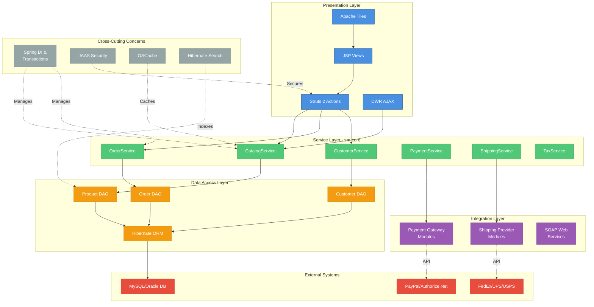

### 2.3 Application Components and Modules

**. sm-core (Core Module)**

- **Purpose**: Foundational business logic consumed by all applications
- **Components**: Domain model entities, service layer, data access objects (DAOs), integration modules
- **Key Services**: CatalogService, OrderService, PaymentService, ShippingService, TaxService, CustomerService
- **Integration Points**: Payment gateways, shipping providers, external APIs
- **Architecture Statistics**: 1,930 service objects, 302 system interaction objects, 111 data service objects

**. sm-shop (Storefront Application)**

- **Purpose**: Customer-facing web application implementing the public storefront
- **Technology**: Struts 2 web application with JSP views, packaged as sm-shop.war
- **User Interface**: 600+ JSP pages with responsive design and AJAX functionality
- **Capabilities**: Product browsing, shopping cart management, checkout workflow, customer accounts
- **Integration**: DWR for AJAX operations, payment gateway interactions

**. sm-central (Administrative Application)**

- **Purpose**: Back-office web application for merchant and store administration
- **Technology**: Struts 2 web application with JSP views, packaged as sm-central.war
- **Capabilities**: Product management, order processing, customer service, store configuration
- **Integration**: SOAP web services (SalesManagerCustomerWS, SalesManagerInvoiceWS)
- **Security**: Role-based access control with RoleInterceptor

**. schema (Database Module)**

- **Purpose**: Database schema definitions and initialization scripts
- **Components**: Table definitions, constraints, indexes, seed data
- **Supported Platforms**: MySQL, Oracle, HSQLDB
- **Key Tables**: PRODUCTS, CUSTOMERS, ORDERS, MERCHANT_STORE, CATEGORIES

**Module Dependency and Interaction Diagram:**

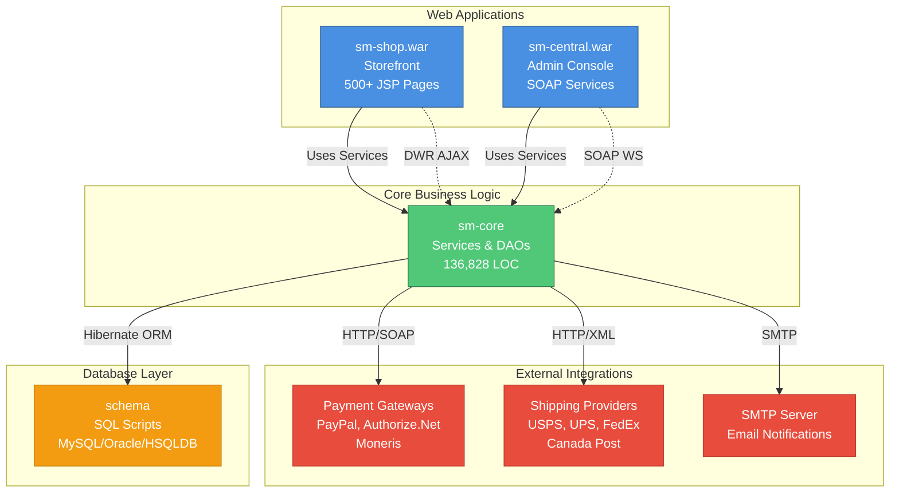

### 2.4 Integration Architecture

**. Payment Gateway Integrations:**

- PayPal Express Checkout (API endpoints: api-3t.paypal.com)
- Authorize.Net Payment Gateway
- Moneris/Beanstream Transaction Processing
- Extensible payment module framework for additional gateways

**. Shipping Provider Integrations:**

- USPS Rate Quotes (RateV3 API)
- UPS XML Rate Quotes
- Canada Post Rate Quotes
- FedEx Web Services for rate calculation

**. External Service Patterns:**

- HTTP/HTTPS client utilities for API communications
- SOAP web services for B2B integrations
- Email/SMTP integration for notifications
- Generic HTTP utility classes for extensibility

### 2.5 Key Business Process Flows

**. Checkout and Order Processing Sequence:**

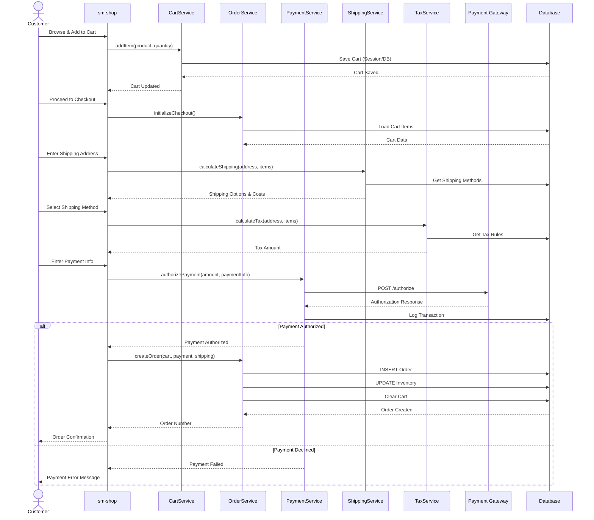

**. Admin Order Fulfillment Flow:**

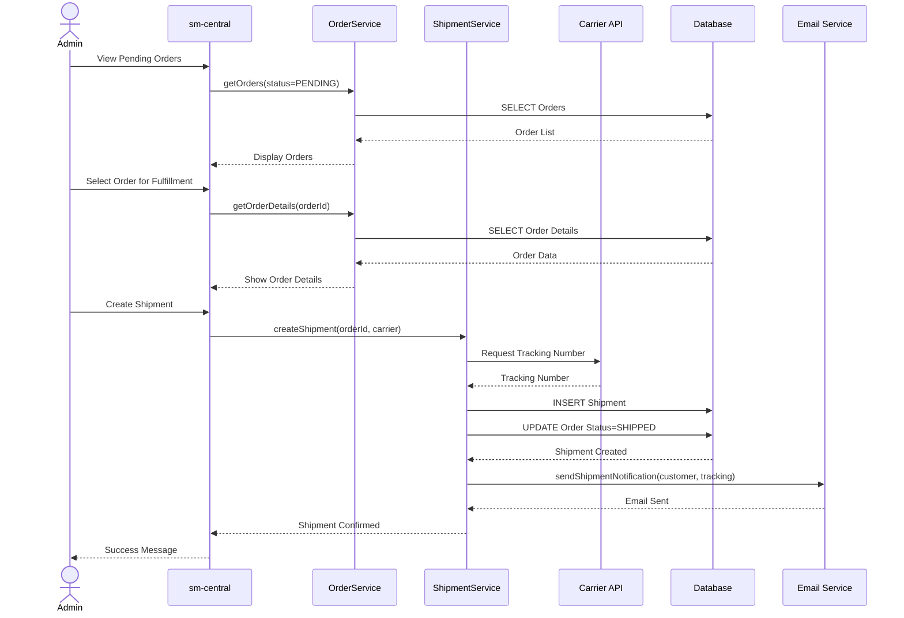

---

## 3\. Data Architecture

### 3.1 Data Overview

The Shopizer platform utilizes a relational database architecture with comprehensive data models supporting e-commerce operations, customer management, product catalogs, order processing, and administrative functions. The data architecture is designed for ACID compliance, referential integrity, and multi-store operations.

### 3.2 Conceptual Data Model

**. Core Data Entities:**

- **Products**: Product catalog with variants, attributes, categories, and pricing
- **Customers**: Customer accounts, profiles, addresses, and authentication data
- **Orders**: Order lifecycle, line items, payments, and fulfillment tracking
- **Merchants**: Store configurations, payment methods, and administrative settings
- **Categories**: Hierarchical product organization and navigation structure
- **Inventory**: Stock levels, reservations, and availability tracking

**. Entity Relationship Diagram:**

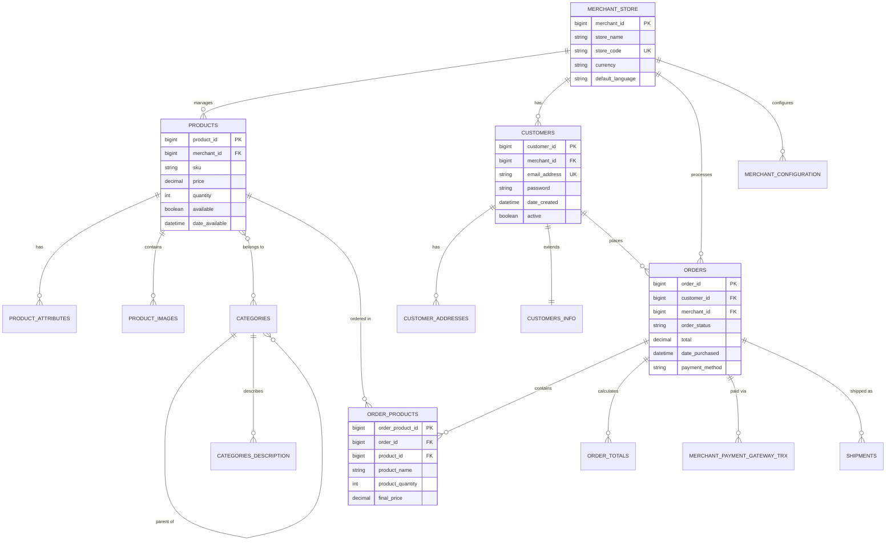

### 3.3 Database Architecture

**. Supported Database Platforms:**

- **MySQL 5.7/8.0**: Primary production database with InnoDB storage engine
- **Oracle 12c/19c**: Enterprise database option with advanced features
- **HSQLDB**: Development and testing database (not for production)

**. Database Design Principles:**

- Normalized schema design with referential integrity constraints
- Hibernate ORM mappings (.hbm.xml) for object-relational mapping
- Soft deletes for entities referenced in order history
- Audit trails for critical business operations
- Multi-tenant support for multiple merchant stores

### 3.4 Key Database Tables

**. Product Management:**

- `PRODUCTS`: Core product information and metadata
- `CATEGORIES`: Hierarchical category structure
- `PRODUCT_ATTRIBUTES`: Product variants and characteristics
- `PRODUCT_IMAGES`: Media and image management

**. Customer Management:**

- `CUSTOMERS`: Customer accounts and authentication
- `CUSTOMERS_INFO`: Extended customer profile information
- `CUSTOMER_ADDRESSES`: Shipping and billing addresses

**. Order Processing:**

- `ORDERS`: Order header information and status
- `ORDER_PRODUCTS`: Order line items and pricing
- `ORDER_TOTALS`: Tax, shipping, and total calculations
- `MERCHANT_PAYMENT_GATEWAY_TRX`: Payment transaction records

**. System Configuration:**

- `MERCHANT_STORE`: Multi-store configuration
- `MERCHANT_CONFIGURATION`: Store-specific settings
- `DYNAMIC_LABEL`: Internationalization and localization

### 3.5 Data Flows

**. Order Processing Data Flow:**

```mermaid
graph TB
    Start([Customer Visits Store])
    
    subgraph "Phase 1: Product Selection"
        A1[Browse Product Catalog]
        A2[View Product Details]
        A3[Add to Shopping Cart]
        A4{Cart Storage}
        A5[(Session Storage)]
        A6[(Database Storage)]
    end
    
    subgraph "Phase 2: Checkout Initiation"
        B1[Proceed to Checkout]
        B2{Customer Status?}
        B3[Customer Login]
        B4[Guest Checkout]
        B5[New Registration]
        B6[Authentication Success]
    end
    
    subgraph "Phase 3: Address & Shipping"
        C1[Enter/Select Shipping Address]
        C2[Calculate Shipping Options]
        C3[Select Shipping Method]
        C4[Calculate Tax]
        C5[(Tax Rules DB)]
        C6[(Shipping Rates DB)]
    end
    
    subgraph "Phase 4: Payment Processing"
        D1[Enter Payment Information]
        D2[Payment Gateway Integration]
        D3{Payment Authorized?}
        D4[Authorization Success]
        D5[Payment Declined]
        D6[(Payment Transaction Log)]
    end
    
    subgraph "Phase 5: Order Creation"
        E1[Create Order Record]
        E2[Decrement Inventory]
        E3[Clear Shopping Cart]
        E4[Generate Order Number]
        E5[(Orders DB)]
        E6[(Inventory DB)]
        E7[Send Confirmation Email]
    end
    
    subgraph "Phase 6: Order Fulfillment"
        F1[Admin Reviews Order]
        F2[Pick & Pack Items]
        F3[Create Shipment]
        F4[Request Tracking Number]
        F5[Update Order Status]
        F6[(Shipment DB)]
        F7[Send Tracking Email]
    end
    
    End([Order Complete])
    
    Start --> A1
    A1 --> A2
    A2 --> A3
    A3 --> A4
    A4 -->|Session-based| A5
    A4 -->|Persistent| A6
    A5 --> B1
    A6 --> B1
    
    B1 --> B2
    B2 -->|Existing Customer| B3
    B2 -->|Guest| B4
    B2 -->|New Customer| B5
    B3 --> B6
    B4 --> B6
    B5 --> B6
    
    B6 --> C1
    C1 --> C2
    C2 --> C6
    C2 --> C3
    C3 --> C4
    C4 --> C5
    
    C5 --> D1
    D1 --> D2
    D2 --> D3
    D3 -->|Yes| D4
    D3 -->|No| D5
    D4 --> D6
    D5 -.->|Retry| D1
    
    D6 --> E1
    E1 --> E2
    E2 --> E6
    E1 --> E5
    E2 --> E3
    E3 --> E4
    E4 --> E7
    
    E7 --> F1
    F1 --> F2
    F2 --> F3
    F3 --> F4
    F4 --> F6
    F6 --> F5
    F5 --> F7
    F7 --> End
    
    style Start fill:#e1f5ff
    style End fill:#e1ffe1
    style A3 fill:#4A90E2,color:#fff
    style A5 fill:#9B59B6,color:#fff
    style A6 fill:#F39C12,color:#fff
    style B3 fill:#4A90E2,color:#fff
    style B4 fill:#4A90E2,color:#fff
    style B5 fill:#4A90E2,color:#fff
    style C2 fill:#50C878,color:#fff
    style C4 fill:#50C878,color:#fff
    style C5 fill:#F39C12,color:#fff
    style C6 fill:#F39C12,color:#fff
    style D2 fill:#E74C3C,color:#fff
    style D4 fill:#50C878,color:#fff
    style D5 fill:#E74C3C,color:#fff
    style D6 fill:#F39C12,color:#fff
    style E1 fill:#4A90E2,color:#fff
    style E2 fill:#F39C12,color:#fff
    style E5 fill:#F39C12,color:#fff
    style E6 fill:#F39C12,color:#fff
    style E7 fill:#50C878,color:#fff
    style F3 fill:#4A90E2,color:#fff
    style F5 fill:#4A90E2,color:#fff
    style F6 fill:#F39C12,color:#fff
    style F7 fill:#50C878,color:#fff
```

**. Data Flow Diagram - Order Processing:**

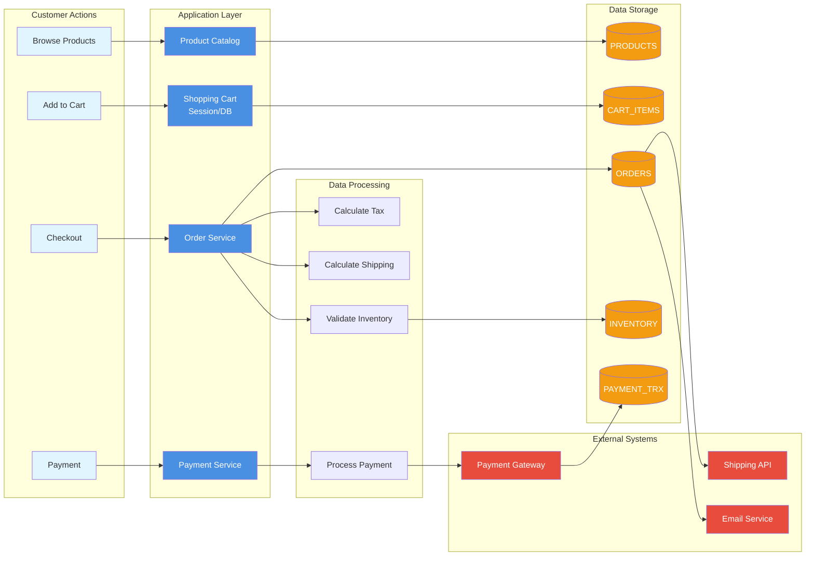

**Data Quality and Governance:**

- Input validation at application and database levels
- Data encryption for sensitive information (PCI DSS compliance)
- Regular backup procedures with point-in-time recovery
- Data retention policies for compliance requirements

---

## 4\. Technical Infrastructure and Network

### 4.1 Technical Overview

The Shopizer platform requires a multi-tier infrastructure supporting web applications, business services, databases, and external integrations. The architecture supports both traditional deployment models and modern containerized environments.

### 4.2 Hardware Infrastructure

**. Small Deployment (Development/Small Production):**

- **Application Servers**: 2 × 4 vCPU, 8-16 GB RAM, 50-100 GB SSD
- **Database Server**: 1 × 8 vCPU, 32 GB RAM, high-IOPS SSD, 500 GB+
- **Cache Node**: 1 × 2 vCPU, 4 GB RAM (Redis)
- **Network**: 1 Gbps NIC, private subnet configuration

**. Medium Deployment (Typical SMB Production):**

- **Application Tier**: 2-4 × 8 vCPU, 16-32 GB RAM each (Java heap 8-16GB)
- **Database Tier**: 2-3 × 16 vCPU, 64 GB+ RAM, provisioned IOPS (≥3000)
- **Read Replicas**: 1-2 read replicas for reporting and catalog reads
- **Cache Cluster**: 3 Redis nodes, 8-16 GB each
- **Network**: 10 Gbps internal network for high DB traffic

**. Large/Enterprise Deployment:**

- **Application Tier**: Autoscaling group with 8+ instances, 8-32 vCPU, 32-64 GB RAM
- **Database Tier**: Clustered RDBMS with HA (Oracle RAC or managed DB with multi-AZ)
- **Dedicated Services**: Caching, search, messaging clusters
- **CDN**: Global edge nodes with load balancing

### 4.3 Operating Systems and Middleware

**. Operating System Requirements:**

- Linux (Ubuntu 18.04+, CentOS 7+, RHEL 7+)
- Windows Server 2016+ (alternative)
- Container platforms: Docker, Kubernetes

**. Application Server Requirements:**

- **Tomcat**: 6.x/7.x (legacy) or 8.5/9.x (modern)
- **JBoss/WildFly**: JBoss AS 5/6 or WildFly 14+
- **JVM Configuration**: G1GC for Java 8+, heap sizing based on instance RAM

**. Technical Middleware:**

- **Connection Pooling**: C3P0 or HikariCP for database connections
- **Session Management**: Redis/Memcached for distributed sessions
- **Message Queues**: RabbitMQ/Kafka for asynchronous processing
- **Search Engine**: Elasticsearch/Solr for product search

### 4.4 Network Architecture

**. Network Topology:**

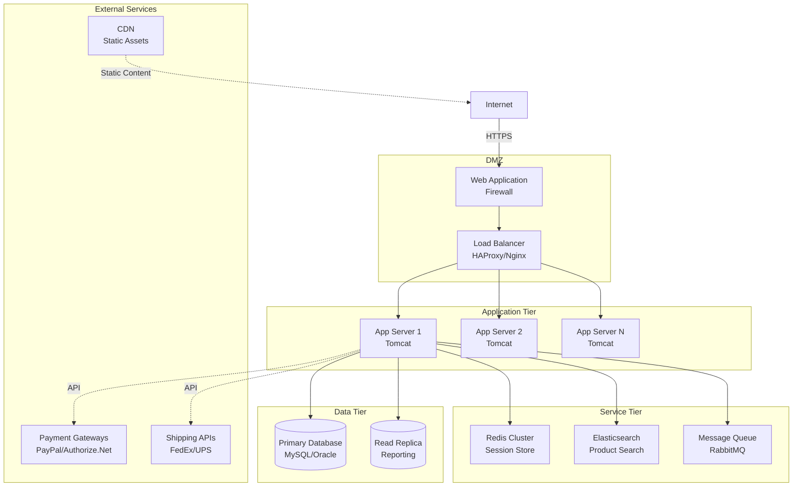

**. Network Security:**

- **Segmentation**: Separate subnets for web, application, and data tiers
- **Firewall Rules**: Least privilege access between network segments
- **VPN Access**: Secure administrative access through VPN with MFA
- **SSL/TLS**: TLS 1.2+ for all communications, certificate management

### 4.5 Sizing and Capacity Planning

**. Performance Targets:**

- **Throughput**: 100-400 RPS per application node for catalog browsing
- **Response Time**: <2 seconds for dynamic pages, <800ms for cached pages
- **Concurrent Users**: 1,000+ concurrent users for medium-traffic stores
- **Database Performance**: <200ms for simple queries, <1 second for complex operations

**. Scaling Strategies:**

- **Horizontal Scaling**: Add application server instances behind load balancer
- **Database Scaling**: Read replicas for query distribution, vertical scaling for writes
- **Caching**: Redis cluster for session and application data caching
- **CDN Integration**: Offload static assets to reduce server load

**. Deployment Sizing Comparison:**

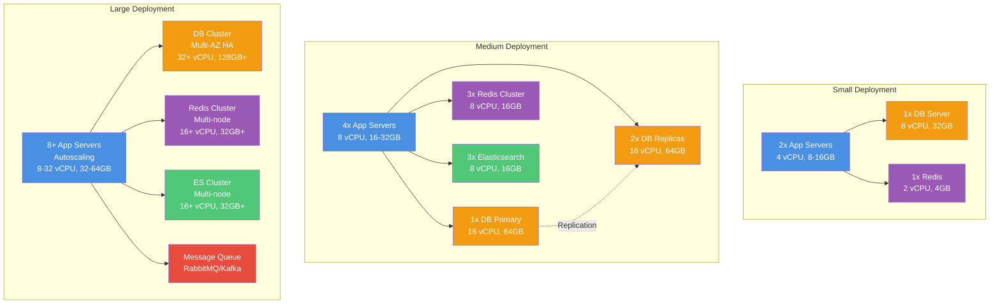

---

## 5\. Security and Deployment

### 5.1 Security Architecture

**. Authentication and Authorization:**

- **JAAS Implementation**: Custom authentication filters (JAASCustomerSecurityFilter, AuthFilter)
- **Role-Based Access Control**: RoleInterceptor for administrative functions
- **User Roles**: SYSTEM_ADMIN, STORE_ADMIN, CATALOG_MANAGER, ORDER_MANAGER, PAYMENT_MANAGER, CUSTOMER_SUPPORT
- **Multi-Factor Authentication**: TOTP support for administrative accounts
- **Session Management**: Secure session cookies with HttpOnly, Secure, SameSite flags

**. Application Security:**

- **Input Validation**: Server-side validation using JSR-303 annotations
- **Output Encoding**: Context-aware encoding using OWASP Java Encoder
- **SQL Injection Protection**: Hibernate parameterized queries
- **XSS Prevention**: Template engine auto-escaping and input sanitization
- **CSRF Protection**: Anti-CSRF tokens for state-changing operations

**. Security Architecture Layers:**

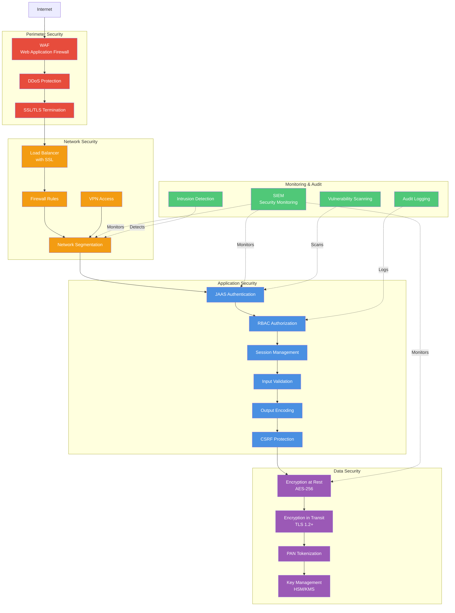

### 5.2 PCI DSS Compliance

**. Payment Card Data Protection:**

- **Tokenization Strategy**: Recommended SAQ A approach using gateway-hosted payment pages
- **Data Encryption**: TLS 1.2+ for data in transit, AES-256 for data at rest
- **Key Management**: HSM or cloud KMS (HashiCorp Vault, AWS KMS) for cryptographic keys
- **Network Segmentation**: Isolated payment processing subnet with strict firewall rules
- **Audit Logging**: Comprehensive logging of payment transactions and access events

**. Compliance Requirements:**

- **Annual Assessment**: External PCI audit (ROC or SAQ submission)
- **Quarterly Scanning**: ASV vulnerability scans
- **Penetration Testing**: Annual penetration testing by qualified assessors
- **Policy Documentation**: Security policies, procedures, and training materials

**. PCI DSS Compliance Flow:**

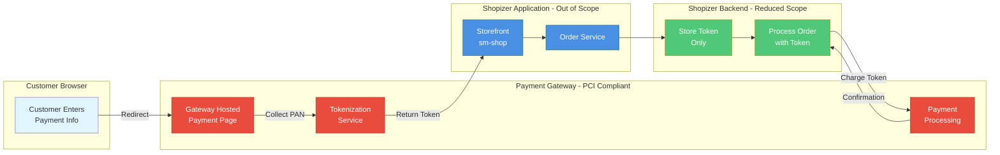

### 5.3 Network and Data Security

**. Transport Security:**

- **TLS Configuration**: TLS 1.2/1.3 only, strong cipher suites (ECDHE, AES-GCM)
- **Certificate Management**: Automated certificate renewal with ACME protocol
- **HSTS Headers**: HTTP Strict Transport Security with preload directive
- **Security Headers**: X-Content-Type-Options, X-Frame-Options, CSP

**. Data Protection:**

- **Encryption at Rest**: Database encryption for sensitive fields
- **Backup Security**: Encrypted backups with restricted access
- **Data Masking**: PAN masking in logs (show only last 4 digits)
- **Access Controls**: Principle of least privilege for data access

### 5.4 Deployment Security

**. Application Server Hardening:**

- **Tomcat Security**: Disable directory listing, remove sample applications, secure connectors
- **JVM Security**: Security manager configuration, disable insecure algorithms
- **File Permissions**: Non-root execution, restricted file system access
- **Service Accounts**: Dedicated service accounts with minimal privileges

**. Infrastructure Security:**

- **OS Hardening**: Minimal OS installation, security patches, disabled unnecessary services
- **Firewall Configuration**: Restrictive rules, port-based access control
- **Intrusion Detection**: Host-based IDS (OSSEC, Wazuh) and network monitoring
- **Vulnerability Management**: Regular security scanning and patch management

### 5.5 Deployment Strategies

**. Environment Management:**

- **Development**: Local development with HSQLDB, mock external services
- **Testing**: Staging environment with production-like data and configurations
- **Production**: Multi-tier deployment with high availability and monitoring

**. Deployment Models:**

- **Blue-Green Deployment**: Zero-downtime deployments with traffic switching
- **Rolling Deployment**: Gradual instance updates with health checks
- **Canary Deployment**: Limited traffic routing to new versions for validation

**. Blue-Green Deployment Strategy:**

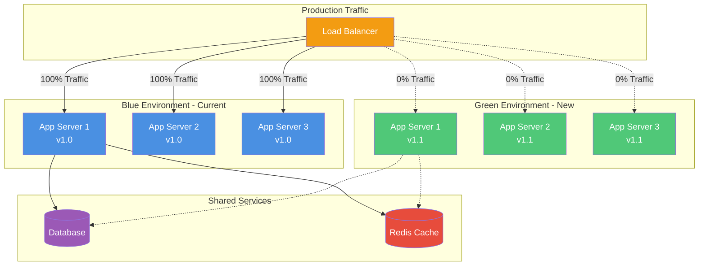

**. CI/CD Pipeline:**

```mermaid
graph LR
    A[Developer<br/>Commit] --> B[Git<br/>Repository]
    B --> C{CI Pipeline<br/>Jenkins/GitLab}
    C --> D[Build<br/>Ant Compile]
    D --> E[Unit Tests<br/>JUnit]
    E --> F[Static Analysis<br/>SonarQube]
    F --> G[Security Scan<br/>SAST/Snyk]
    G --> H[Package<br/>WAR Files]
    H --> I[Artifact<br/>Repository]
    I --> J{Deploy to<br/>Staging}
    J --> K[Integration<br/>Tests]
    K --> L[DAST<br/>Security Scan]
    L --> M{Manual<br/>Approval}
    M -->|Approved| N[Deploy to<br/>Production]
    M -->|Rejected| O[Rollback]
    N --> P[Health<br/>Checks]
    P --> Q{Success?}
    Q -->|Yes| R[Complete]
    Q -->|No| S[Auto<br/>Rollback]
    
    style A fill:#e1f5ff
    style C fill:#F39C12,color:#fff
    style D fill:#4A90E2,color:#fff
    style E fill:#4A90E2,color:#fff
    style F fill:#9B59B6,color:#fff
    style G fill:#E74C3C,color:#fff
    style H fill:#4A90E2,color:#fff
    style I fill:#50C878,color:#fff
    style J fill:#F39C12,color:#fff
    style M fill:#F39C12,color:#fff
    style N fill:#50C878,color:#fff
    style Q fill:#F39C12,color:#fff
    style R fill:#50C878,color:#fff
    style S fill:#E74C3C,color:#fff
```

**. Configuration Management:**

- **Environment-Specific Configs**: Externalized configuration files and JNDI resources
- **Secret Management**: Centralized secret storage with rotation policies
- **Infrastructure as Code**: Ansible/Terraform for reproducible deployments

---

## 6\. Operations and Non-Functional Requirements

### 6.1 Operations and Maintenance

**. System Monitoring:**

- **Application Performance Monitoring**: New Relic, Dynatrace, or Elastic APM
- **Infrastructure Monitoring**: Prometheus + Grafana for metrics and alerting
- **Log Management**: ELK stack (Elasticsearch, Logstash, Kibana) for centralized logging
- **Business Metrics**: Order conversion rates, payment success rates, response times

**. Monitoring Targets:**

- **Application Health**: Error rates, response times (P50/P95/P99), throughput
- **Infrastructure**: CPU, memory, disk I/O, network utilization
- **Database**: Connection pool usage, query performance, replication lag
- **External Services**: Payment gateway response times, shipping API availability

**. Monitoring Architecture:**

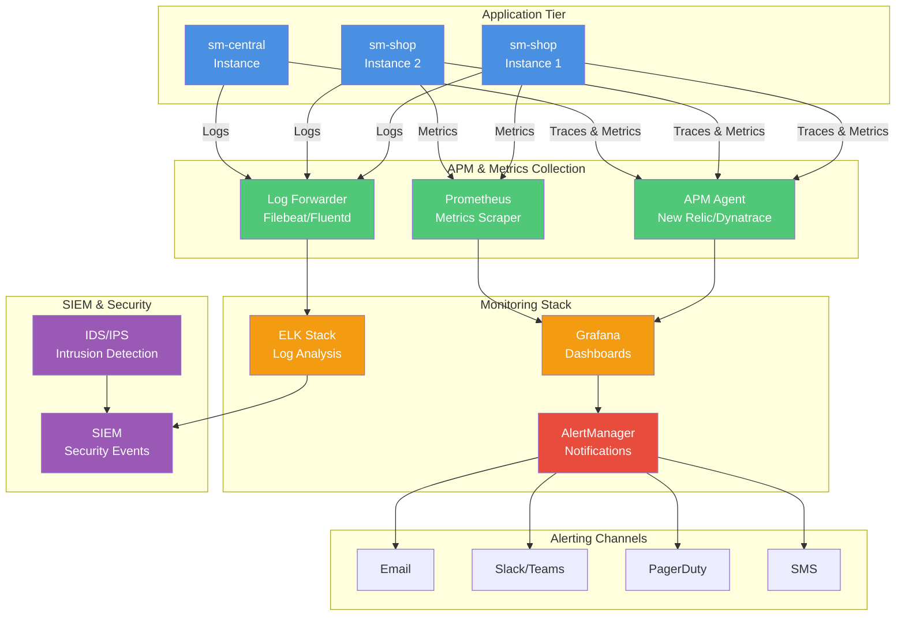

### 6.2 Backup and Disaster Recovery

**. Backup Strategy:**

- **Database Backups**: Daily full backups with continuous WAL/binlog shipping
- **Application Backups**: Versioned WAR artifacts in artifact repository
- **Configuration Backups**: Version-controlled configuration files
- **Media Backups**: Object storage replication with lifecycle policies

**. Recovery Objectives:**

- **Recovery Time Objective (RTO)**: 1 hour for critical services, 4 hours for non-critical
- **Recovery Point Objective (RPO)**: <15 minutes using binary log shipping
- **Business Continuity**: Manual order processing fallback procedures

**. Disaster Recovery Testing:**

- **Quarterly Tabletop Exercises**: Scenario-based recovery planning
- **Semi-Annual DR Tests**: Full failover testing to disaster recovery site
- **Documentation**: Maintained runbooks and contact procedures

**. Disaster Recovery Architecture:**

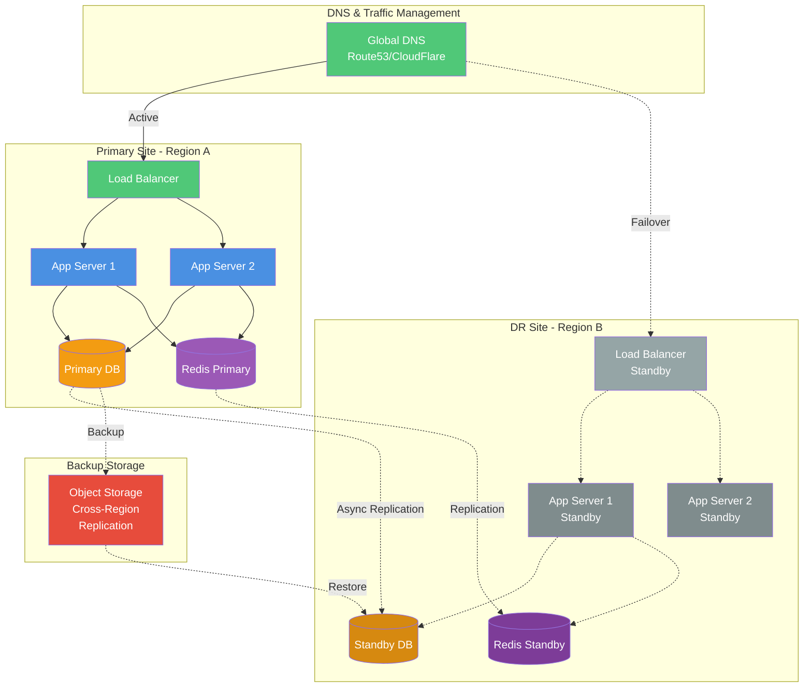

### 6.3 Performance Requirements

**. Response Time Targets:**

- **Storefront Pages**: <800ms for cached pages, <2 seconds for dynamic pages
- **Admin Interface**: <1.5 seconds for typical operations
- **Checkout Process**: <4 seconds end-to-end (excluding gateway latency)
- **API Responses**: <200ms for simple queries, <1 second for complex operations

**. Throughput Requirements:**

- **Concurrent Users**: 1,000+ concurrent users for medium-traffic stores
- **Transaction Volume**: 100 transactions per minute during peak periods
- **Catalog Size**: Support for 10,000+ products without performance degradation
- **Admin Users**: 50+ concurrent administrative users

### 6.4 Availability and Reliability

**. Availability Targets:**

- **Storefront**: 99.95% monthly availability (≤43 minutes downtime)
- **Admin Interface**: 99.5% monthly availability
- **Planned Maintenance**: Off-peak hours with advance notification

**. Reliability Measures:**

- **Mean Time Between Failures (MTBF)**: ≥720 hours
- **Mean Time To Recovery (MTTR)**: ≤30 minutes for critical issues
- **Data Integrity**: Zero data loss for completed transactions
- **Redundancy**: Multi-AZ deployment with automated failover

### 6.5 Scalability and Maintainability

**. Horizontal Scalability:**

- **Stateless Application Design**: Session externalization to Redis
- **Load Balancing**: Automatic traffic distribution across instances
- **Database Scaling**: Read replicas and connection pooling
- **Auto-scaling**: CPU and response time-based scaling policies

**. Maintainability:**

- **Code Quality**: Automated testing, code reviews, static analysis
- **Documentation**: Architecture diagrams, API documentation, runbooks
- **Monitoring**: Comprehensive observability and alerting
- **Deployment Automation**: CI/CD pipelines with rollback capabilities

---

## 7\. Governance, Standards and Risk Management

### 7.1 Technical Standards

**. Development Standards:**

- **Coding Standards**: Google Java Style Guide enforced by Checkstyle
- **Repository Management**: Gitflow branching model with protected main/release branches
- **Code Review Process**: Minimum two reviewers (functional peer + security/architecture reviewer)
- **Quality Gates**: Unit tests, static analysis (SonarQube), dependency security scans
- **Documentation Requirements**: Javadoc for public APIs, ADRs for architectural decisions

**. Architecture Governance:**

- **Architecture Review Board (ARB)**: Chief Architect, Lead Architects, Security Architect, SRE Lead
- **Decision Authority**: ARB approval for major technical decisions and framework changes
- **Architecture Decision Records**: All non-trivial decisions documented with context and rationale
- **Review Cadence**: Weekly ARB meetings, monthly roadmap reviews

### 7.2 Security and Quality Standards

**. Security Standards:**

- **Application Security**: OWASP Top 10 and ASVS compliance
- **Infrastructure Security**: NIST SP 800-53 or ISO/IEC 27001 frameworks
- **Secure Coding**: Input validation, output encoding, parameterized queries
- **Vulnerability Management**: SAST/DAST integration in CI/CD pipelines

**. Quality Standards:**

- **Test Coverage**: Minimum 70% line coverage, 80% for critical components
- **Performance Standards**: Response time and throughput benchmarks
- **Code Quality**: SonarQube quality gates and technical debt management
- **Release Criteria**: Automated testing, security scans, performance validation

### 7.3 Risk Management

**. Risk Assessment Process:**

- **Risk Identification**: Technical, security, operational, and business risks
- **Risk Scoring**: Likelihood × Impact matrix (1-5 scale each)
- **Risk Categories**: Low (1-6), Medium (7-12), High (13-20), Critical (21-25)
- **Review Frequency**: Quarterly risk register review, ad-hoc for major changes

**. Key Risk Areas:**

- **Legacy Framework Risk**: Struts vulnerabilities requiring upgrade or mitigation
- **PCI Compliance Risk**: Payment card data exposure requiring tokenization
- **Scalability Risk**: Session management and database bottlenecks
- **Integration Risk**: External service dependencies and failure scenarios

**. Mitigation Strategies:**

- **Defense in Depth**: Multiple security layers (WAF, input validation, encryption)
- **Redundancy**: Multi-AZ deployment, database replication, failover procedures
- **Monitoring**: Comprehensive alerting and incident response procedures
- **Business Continuity**: Disaster recovery planning and testing

### 7.4 Compliance and Regulatory Requirements

**. PCI DSS Compliance:**

- **Scope Reduction**: Tokenization strategy to achieve SAQ A classification
- **Network Segmentation**: Isolated payment processing environment
- **Annual Assessment**: External audit and quarterly vulnerability scans
- **Documentation**: Policies, procedures, and evidence maintenance

**. Data Protection Compliance:**

- **GDPR**: Data subject rights, breach notification, data minimization
- **Regional Privacy Laws**: Compliance matrix for deployment regions
- **Data Retention**: Policies for transaction logs and customer data

**. Audit Requirements:**

- **Internal Audits**: Quarterly security reviews and compliance checks
- **External Audits**: Annual PCI assessment and penetration testing
- **Evidence Management**: Centralized audit trail and documentation repository

### 7.5 Migration and Technology Evolution

**. Technology Roadmap:**

- **Short Term (0-6 months)**: Framework patching, security hardening, monitoring implementation
- **Medium Term (6-18 months)**: Spring Security migration, containerization, Redis session store
- **Long Term (18-36 months)**: Microservices architecture, Kubernetes orchestration, cloud migration

**. Technology Evolution Roadmap:**

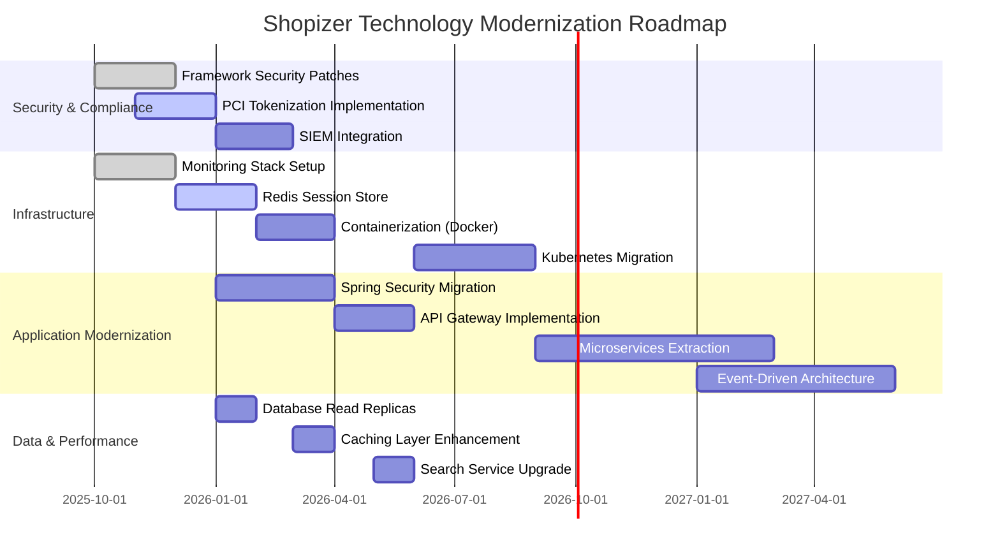

**Risk vs Impact Matrix:**

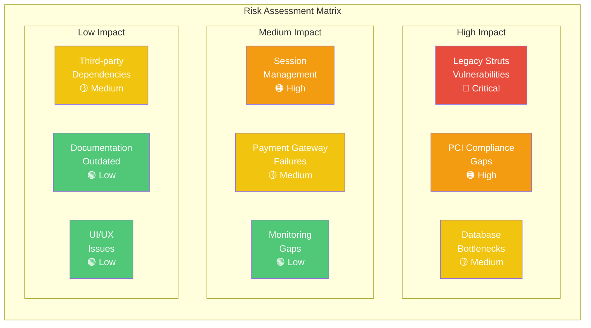

**. Legacy System Management:**

- **Coexistence Strategy**: Strangling pattern for gradual service replacement
- **Compatibility Layers**: API gateways and adapters for legacy integration
- **Data Synchronization**: Event-driven replication during transition periods

**. Migration Planning:**

- **Phased Approach**: Assessment → Pilot → Canary → Full migration → Legacy decommission
- **Risk Mitigation**: Rollback procedures, dual-write patterns, feature toggles
- **Testing Strategy**: Integration tests, performance benchmarks, user acceptance testing

### 7.6 Organizational Governance

**. Technical Organization:**

- **CTO/Head of Engineering**: Technical strategy and budget approval
- **Chief Architect**: Architecture standards and ARB leadership
- **Engineering Teams**: Module ownership (sm-shop, sm-central, sm-core)
- **SRE/Platform Team**: Infrastructure, CI/CD, monitoring, disaster recovery
- **Security Team**: Security controls, vulnerability management, compliance

**. Technical Organization Structure:**

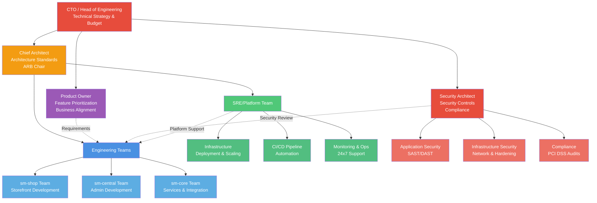

**. Decision-Making Processes:**

- **Operational Decisions**: Team lead authority with escalation paths
- **Architectural Decisions**: ARB review and approval for major changes
- **Emergency Decisions**: Incident commander authority during critical incidents
- **Conflict Resolution**: Documented escalation with time-bound response SLAs

**. Change Management:**

- **Change Advisory Board (CAB)**: Weekly meetings for release approvals
- **Change Categories**: Standard (automated), significant (CAB approval), emergency (expedited)
- **Approval Workflows**: Risk-based approval requirements with documented rollback plans

---

---

**Document Approval:**

| Role | Name | Signature | Date |
| --- | --- | --- | --- |
| Chief Architect | \[Name\] | \[Signature\] | \[Date\] |
| Security Architect | \[Name\] | \[Signature\] | \[Date\] |
| SRE Lead | \[Name\] | \[Signature\] | \[Date\] |
| CTO | \[Name\] | \[Signature\] | \[Date\] |