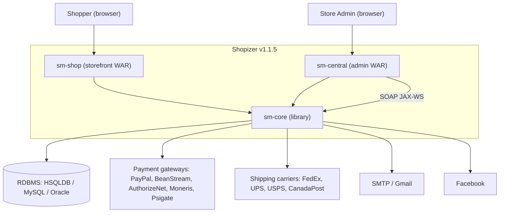
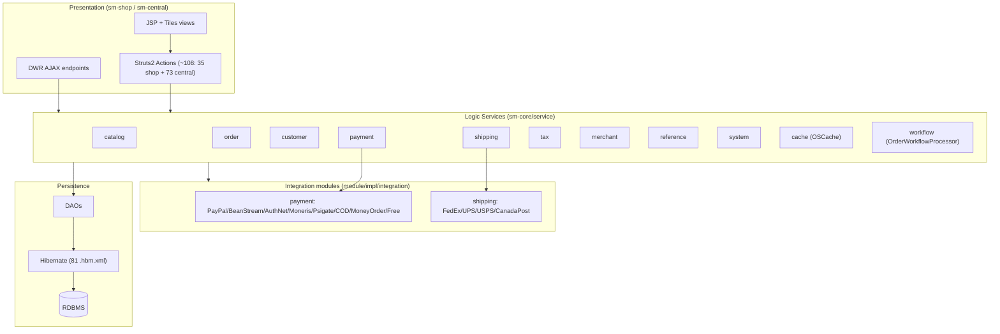

# As-Is Architecture — Shopizer v1.1.5

**Owner:** `software-architect`  **Stage:** 2 (Reverse Engineering)  **Generated:** 2026-06-06
**Gate:** stage-2-approval  **Inputs:** `01-discovery/**`, legacy source, `schema/`, CAST docs

> Every component cites local `file:line`. **Scope note:** the CAST *Short Audit Report*
> (Spring WebMVC, 300+ REST endpoints, Elasticsearch, AWS S3/GCP, Stripe/Braintree,
> 79 CVEs, 178k LOC) describes the **modern upstream fork**, NOT this checkout. This
> document reconstructs the **local v1.1.5** architecture (Struts 2 / JDK 1.5).
> CAST *transaction traces* are used only where they match local classes.

## 1. Architectural style

Modular monolith, classic 3-tier layered Java EE:

- **Presentation:** Struts 2 actions + JSP + Apache Tiles + DWR/jQuery (per web app).
- **Business:** Spring-wired service layer + pluggable integration modules + order workflow engine (in `sm-core`).
- **Persistence:** Hibernate ORM (81 `.hbm.xml`) over HSQLDB/MySQL/Oracle.
- **Integration:** Outbound HTTP to payment/shipping gateways; inbound SOAP (JAX-WS) from `sm-central`.

Evidence: `OVERVIEW.md:13-31`; `sm-*/WebContent/WEB-INF/web.xml`; `sm-core/conf/spring/*.xml`.

## 2. C4 — Level 1 (System Context)

## 3. C4 — Level 2 (Containers)

| Container | Tech | Role | Evidence |
|-----------|------|------|----------|
| `sm-shop` | Struts2 + JSP/Tiles + DWR | Customer storefront (catalog, cart, checkout) | `sm-shop/.../web.xml:22-68` |
| `sm-central` | Struts2 + JSP/Tiles + DWR + JAX-WS | Admin console + SOAP services | `sm-central/.../web.xml:11-68` |
| `sm-core` | Spring + Hibernate + integration modules | Domain, services, workflow, integrations | `sm-core/conf/spring/*.xml` |
| RDBMS | HSQLDB/MySQL/Oracle | Persistence | `schema/`; `README.md:27-35` |

Both web apps bundle `sm-core.jar` and its config (`sm-shop/build.xml:62-77`).

## 4. C4 — Level 3 (Components, sm-core)

Evidence: service packages `sm-core/src/com/salesmanager/core/service/{catalog,order,customer,payment,shipping,tax,merchant,reference,system,cache,workflow,ws}`; actions enumerated in `sm-shop/src/.../*Action.java` (35) and `sm-central/src` (73).

## 5. Layers & responsibilities

| Layer | Key types | Responsibility | Evidence |
|-------|-----------|----------------|----------|
| Front controller | `StrutsPrepareAndExecuteFilter`; `CustomAuthFilter` (admin) | Routing, admin auth | `web.xml` |
| Action | `ShoppingCartAction`, `CheckoutAction`, `ComitOrderAction`, `DisplayInvoiceSummaryAction`, `PaymentAction`, `PayPalExpressCheckoutAction`, `OrdersAction`, `LogonAction` | Request handling, view prep | `sm-shop/src/.../*Action.java` |
| Service | `CatalogService`, `OrderService`, `PaymentService`, `ReferenceService`, `ShippingService`, `TaxService` | Business logic, transactions | `sm-core/.../service/**` |
| Workflow | `OrderWorkflowProcessor` + activities | Orchestrates checkout steps | `sm-core-workflow-beans.xml:21-46` |
| Integration | `PaymentModule`, `*TransactionImpl`, shipping `*QuotesImpl` | External gateway calls (Strategy) | `module/impl/integration/**` |
| DAO/ORM | Hibernate `*Dao`, `.hbm.xml` | Persistence | `sm-core/conf/hibernate/*.hbm.xml` |

## 6. Order/checkout workflow (Spring-managed)

Two pipelines via `OrderWorkflowProcessor` (`sm-core-workflow-beans.xml:21-46`):

- **orderWorkflow:** `processCustomer → processPayment → processOrder → sendConfirmationEmail`
- **invoiceWorkflow:** `processPayment → saveOrder → sendConfirmationEmail`

`PaymentModule.processTransaction(...)` is the checkout entry point for both credit-card (authorize / capture / authorizeAndCapture per merchant config) and non-card payments; `initTransaction` supports PayPal Express; `postTransaction` handles external-server returns (`PaymentModule.java:38-67`).

## 7. Integration points

| Integration | Type | Direction | Evidence |
|-------------|------|-----------|----------|
| Payment (9) | HTTP/gateway SDK | outbound | `module/impl/integration/payment/*TransactionImpl.java` |
| Shipping (7+) | HTTP quotes | outbound | `module/impl/integration/shipping/*QuotesImpl.java` |
| SOAP services | JAX-WS | inbound | `sm-central/.../web.xml:54-68` (`salesManagerCustomerService`, `salesManagerInvoiceService`) |
| Email | SMTP/Gmail | outbound | `EmailUtil.java`; `README.md:76-77` |
| Facebook | OAuth/HTTP | outbound | `FacebookIntegrationFactory.java` |
| Crypto | JCE `SecretKeySpec` | internal | CAST addToCart trace §2.2; `EncryptionUtil.java` |

## 8. Cross-cutting concerns

- **Security:** servlet-filter auth (`CustomAuthFilter` on `*.action`), DB-backed roles (`MerchantUserRole`, `CentralGroup`/`CentralFunction`), `EncryptionUtil`/`CreditCardUtil`. HTTPS `transport-guarantee` present but **commented out** (`web.xml:71-86`, `109-134`) — **RISK**.
- **Caching:** OSCache + reference-data preload at startup (`ReferenceLoaderServlet`).
- **Logging:** log4j (`log4j.properties`); CAST notes empty catch blocks / missing handlers (modern-fork metric, flagged).
- **i18n:** label bundles via `TemplateResourceBundleLoader`; locale/currency from session.

## 9. SPEC IDs introduced

`SPEC-0201` layered style · `SPEC-0202` container topology · `SPEC-0203` sm-core component model · `SPEC-0204` order workflow · `SPEC-0205` payment-module strategy · `SPEC-0206` integration points · `SPEC-0207` security cross-cutting · `SPEC-0208` caching/i18n. Linked in `00-twin/traceability-matrix.md`.

## 10. Orphan check & gaps

- No orphan components: every component above traces to source.
- **Gap G2 (carried):** `media` web app not in this checkout.
- **Gap G5:** exact Struts action→URL maps live in `conf/struts/struts-*.xml` includes (catalog/checkout/customer/integration for shop; +order/payment/shipping/tax/invoice for central) — enumerated by file, per-action mapping deferred to detailed design.
- **Discrepancy G3 (carried):** CAST audit metrics describe modern fork; excluded from local architecture claims.
