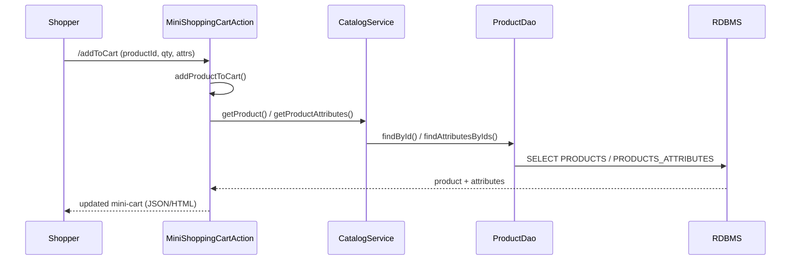
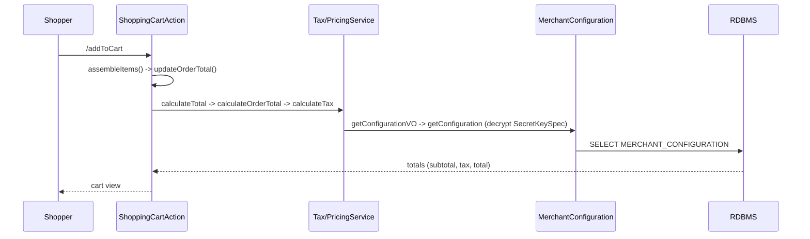
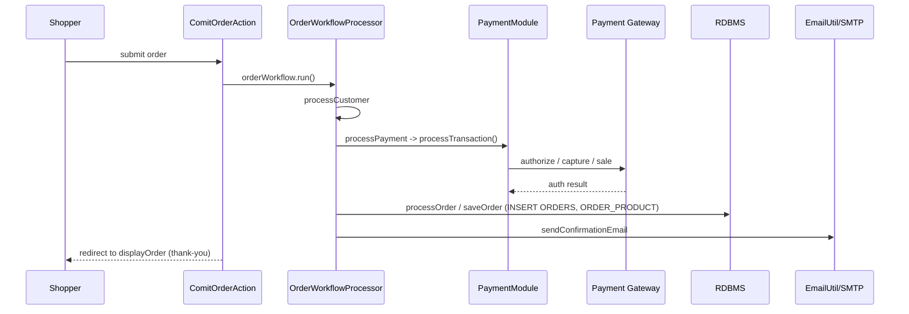
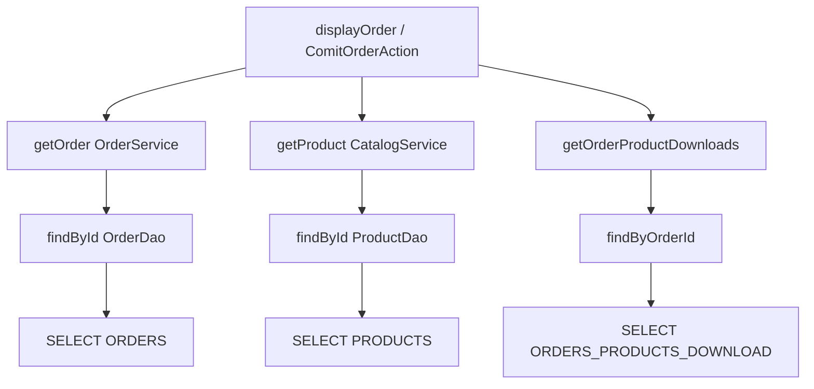
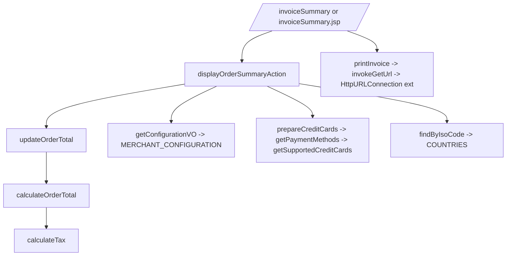
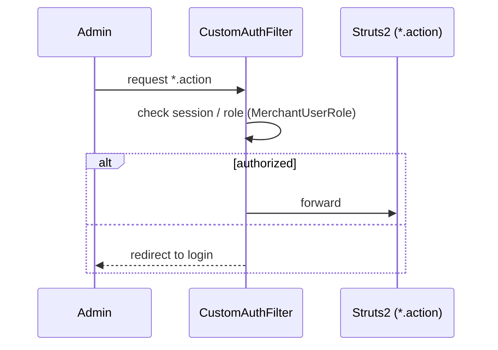

# Data Flows — Shopizer v1.1.5

**Owner:** `software-architect`  **Stage:** 2  **Generated:** 2026-06-06

> Flows reconstructed from local source + CAST transaction traces (`docs/Application
> Architecture (CAST -powered)/Transaction : *.md`). DB table names as reported by
> CAST (MySQL schema names). Each flow carries a `DF-####` id.

## DF-0001 — Add to cart (mini cart)

Source: CAST addToCart §2.1 (Tx 335326); `com.salesmanager.catalog.cart.MiniShoppingCartAction`.

## DF-0002 — Add to cart (checkout cart) + totals

Source: CAST addToCart §2.2 (Tx 335335). Tables: `MERCHANT_CONFIGURATION`, `MERCHANT_STORE`, `PRODUCTS`, `PRODUCT_RELATIONSHIP`, `DYNAMIC_LABEL`. Server recomputes prices (never trusts client) — see RULE-0007.

## DF-0003 — Checkout / place order (workflow)

Source: `sm-core-workflow-beans.xml:21-46`; `PaymentModule.java:38-67`; `ComitOrderAction`.

## DF-0004 — Display order (thank-you / profile)

Source: CAST displayOrder (Tx 335341). Payment/transaction id displayed **masked** (RULE-0014). Auth: customer must own order, or admin (RULE-0013).

## DF-0005 — Invoice summary

Source: CAST invoiceSummary (Tx 335344 Struts; Tx 335621 JSP). External HTTP call on print path. Tables: `MERCHANT_CONFIGURATION`, `MERCHANT_STORE`, `COUNTRIES`, `DYNAMIC_LABEL`.

## DF-0006 — Admin authentication

Source: `sm-central/.../web.xml:11-19`; roles in `MerchantUserRole*.hbm.xml`, `CentralGroup.hbm.xml`.

## Key persistent entities touched

`PRODUCTS`, `PRODUCTS_ATTRIBUTES`, `PRODUCT_RELATIONSHIP`, `ORDERS`, `ORDER_PRODUCT`, `ORDERS_PRODUCTS_DOWNLOAD`, `MERCHANT_CONFIGURATION`, `MERCHANT_STORE`, `MERCHANT_USER_INFORMATION`, `COUNTRIES`, `DYNAMIC_LABEL`, `CUSTOMER`, `CREDIT_CARD`. (CAST traces + `sm-core/conf/hibernate/*.hbm.xml`.)

## Sensitive-data flows (for security/compliance, Stage 3)

- **Card data:** checkout → `CreditCardUtil` → `EncryptionUtil` (JCE `SecretKeySpec`) → gateway (`*TransactionImpl`). Metadata-only in Twin (see `00-twin/redaction-log.md`).
- **PII:** customer registration/profile → `Customer`/`CustomerInfo` tables.
- **Config secrets:** `MERCHANT_CONFIGURATION` stores encrypted gateway credentials (decrypt at use).
