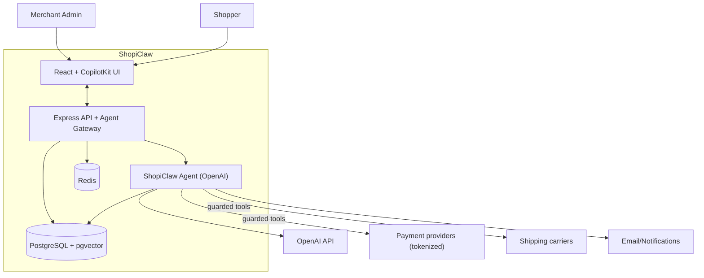
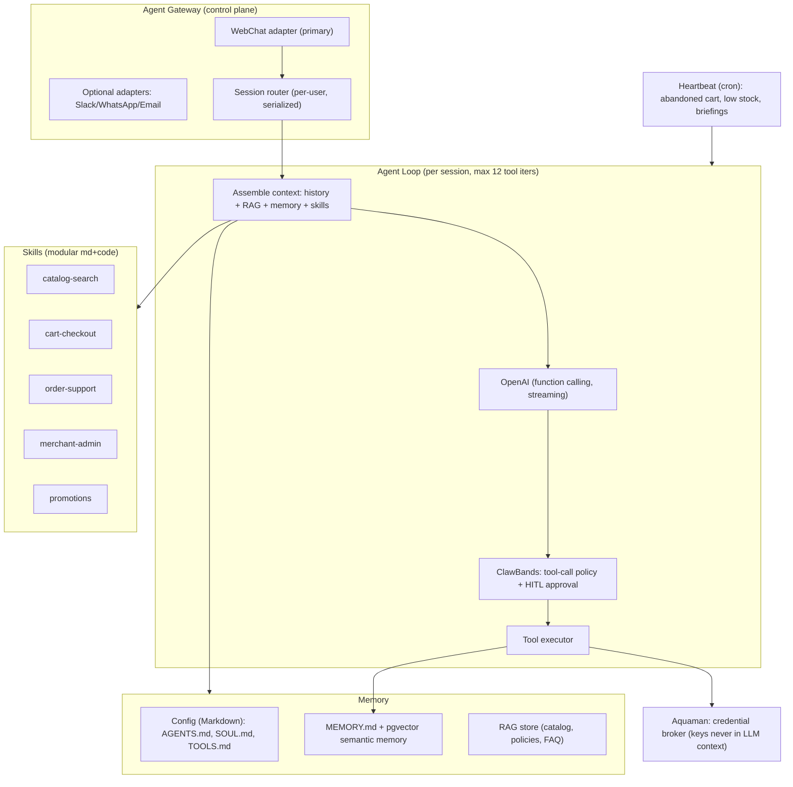

# Target Architecture — **ShopiClaw** (Agentic Commerce App)

**Owner:** `coding-framework`  **Stage:** 3 (Transformation Target)  **Generated:** 2026-06-06
**Gate:** stage-3-approval  **Inputs:** `02-reverse/**`, `example/` stack, OpenClaw model
**LLM provider:** **OpenAI** (per user decision 2026-06-06; not Gemini)

> **What we are building.** ShopiClaw modernizes Shopizer v1.1.5 not as a like-for-like
> Java rewrite but as an **agentic application**: a commerce app built *around* an
> embedded AI agent (the *ShopiClaw* agent) with a web frontend — patterned on
> **OpenClaw** (persistent agent: Gateway + Agent Loop + Memory + Heartbeat + Skills +
> Tools). The stack is inherited from `example/` (the Randstad "cockpit" app):
> React+Vite frontend, Node/Express backend, PostgreSQL+pgvector, RAG pipeline,
> CopilotKit AG-UI runtime, Docker. All legacy commerce capabilities (catalog, cart,
> checkout, orders, admin) are preserved as **agent tools + deterministic services**,
> behavior locked by the Stage 2 golden master.

---

## 1. Target stack (inherited from `example/`)

| Layer | Technology | Source of decision |
|-------|-----------|--------------------|
| Frontend | React 18 + Vite + TypeScript; TailwindCSS + shadcn/ui; Lucide icons | `example/Dockerfile` (client build), look&feel of cockpit |
| Agent UI | **CopilotKit** (AG-UI protocol) — embedded copilot/chat + generative UI | `example/` `/api/copilotkit` |
| Backend | Node.js 20 + Express + TypeScript | `example/` `src/server/index.js` |
| Agent runtime | **OpenAI** (Responses API + function calling/streaming); Vercel AI SDK or CopilotKit runtime adapter | user decision |
| Persistence | PostgreSQL 16 + **pgvector**; ORM **Prisma** (typed) | `example/docker-compose.yml` (pgvector/pg16) |
| RAG | Ingest → embed (OpenAI `text-embedding-3-*`) → pgvector → retriever | `example/` `src/server/rag/` |
| Cache/queue | Redis (sessions, rate-limit, Heartbeat locks, cart cache) | replaces legacy OSCache |
| Scheduler | node-cron (Heartbeat + scheduled jobs) | `example/` `SYNC_CRON` |
| AuthN/Z | Session cookies + RBAC; optional OIDC SSO | `example/` auth block |
| Observability | pino structured logs + OpenTelemetry traces; agent-trace audit log | replaces log4j |
| Deploy | Docker multi-stage (node:20) + docker-compose; container-ready | `example/Dockerfile`, `docker-compose.yml` |

## 2. C4 L1 — System context

## 3. C4 L2 — Containers

| Container | Tech | Responsibility |
|-----------|------|----------------|
| `web` | React+Vite+CopilotKit | Storefront + admin; embedded ShopiClaw copilot; generative UI |
| `api` | Express+TS | REST/RPC, Agent Gateway, session, RBAC, webhooks |
| `agent` | OpenAI runtime (in-process module or worker) | Agent Loop, tools, skills, memory, heartbeat |
| `db` | Postgres16+pgvector | Domain data + vector memory + RAG store |
| `redis` | Redis | Sessions, cart cache, rate limits, heartbeat locks |
| `worker` | node-cron | Heartbeat + scheduled jobs |

## 4. The ShopiClaw Agent (OpenClaw-modeled)

### 4.1 Gateway
Control plane that normalizes channels into a common message structure and routes to a
per-user agent session. **WebChat** (embedded CopilotKit) is the primary channel; other
adapters are pluggable. Agent endpoints bind to the API service behind auth (not public
localhost-only like OpenClaw, but same isolation principle: no direct external exposure).

### 4.2 Agent Loop
Per request: assemble context (conversation history + retrieved RAG + semantic memory +
relevant skills) → call OpenAI with the tool schema → if tool calls requested, pass them
through **ClawBands** policy/approval → execute → feed results back → repeat (**max 12
iterations**) → stream final reply. **Serialized per session** to avoid race conditions
on cart/order writes.

### 4.3 Memory & configuration (Markdown-first, like OpenClaw)
- `agent/AGENTS.md` — agent roster + responsibilities.
- `agent/SOUL.md` — persona/tone for ShopiClaw (brand voice).
- `agent/TOOLS.md` — tool conventions & guardrails.
- `agent/MEMORY.md` — curated long-term notes (git-versioned).
- **Semantic memory:** pgvector table `agent_memory` (embeddings of past turns/decisions);
  retrieval injects relevant context per turn. (Replaces OpenClaw's SQLite vector store.)
- Plain-text config is git-versioned and human-inspectable.

### 4.4 RAG
Ingest catalog (products/categories/attributes), store policies, shipping/returns, FAQ →
chunk → embed (OpenAI `text-embedding-3-large`) → pgvector. Retriever grounds agent
answers ("Do you have X in red under €50?") and reduces hallucination. Reuses `example/`
`rag/` pipeline shape.

### 4.5 Skills
Modular extensions (`agent/skills/<name>/` with `SKILL.md` + optional TS handlers),
installable without restart. Initial set: `catalog-search`, `cart-checkout`,
`order-support`, `merchant-admin`, `promotions`, `shipping-tax`. A private registry
(ClawHub-analogue) is optional/future.

### 4.6 Tools (function-calling) — commerce capability surface
| Tool | Maps to legacy | Sensitivity |
|------|----------------|-------------|
| `searchCatalog`, `getProduct` | CatalogService, ProductDetailsAction | read |
| `getCart`, `addToCart`, `updateCart` | ShoppingCartAction (RULE-0001..0007) | write (cart) |
| `calculateShipping`, `calculateTax` | Shipping/Tax services (RULE-0019) | read |
| `createOrder`, `placeOrder` | OrderWorkflowProcessor (RULE-0008..0012) | **guarded** |
| `payOrder` | PaymentModule (RULE-0009..0011) | **guarded + tokenized** |
| `getOrderStatus`, `listMyOrders` | OrdersAction (RULE-0013/0014) | read (owner) |
| `requestRefund` | admin/order mgmt | **guarded + approval** |
| `manageCatalog`, `manageInventory` | sm-central catalog/admin | **guarded (admin role)** |
| `applyPromotion` | promotions | write |
| `ragSearch` | n/a (new) | read |
| `twinKnowledgeSearch` | n/a (new) — Digital Twin Q&A | read |
| `getSystemHealth` | n/a (new) — ops/health | read |
| `getBusinessMetrics` | n/a (new) — functional analytics | read (scoped) |

### 4.7 Heartbeat (proactive)
node-cron wakes the agent on schedule; runs **cheap deterministic checks first**
(SQL queries, thresholds) and escalates to OpenAI only when action is warranted:
abandoned-cart nudges, low-stock alerts, order-status notifications, daily merchant
briefing. Locked via Redis to avoid duplicate runs.

### 4.8 Safety architecture (critical — agentic + PCI)
- **ClawBands (tool gateway):** every tool call passes a policy engine; sensitive tools
  (`payOrder`, `requestRefund`, `manageCatalog/Inventory`, data export) require **HITL
  approval** or signed automated policy. Enforces per-role/per-skill allow-lists.
- **Aquaman (credential isolation):** payment/carrier API keys live in a credential broker
  (env/secret manager); **never enter the LLM prompt/context**; tools fetch+use server-side.
- **Payment tokenization:** PAN never touches ShopiClaw; use provider tokenization/hosted
  fields → **PCI scope reduction** (resolves legacy DEBT-0016).
- **Prompt-injection defenses:** content provenance tagging, instruction/`data` separation,
  output schema validation, deny tool calls from untrusted content, RAG source allow-list.
- **Least privilege:** agent runs with scoped DB role; admin tools require admin session.

## 4.9 Digital Twin Knowledge (embedded self-knowledge)

ShopiClaw **embeds the Digital Knowledge** produced by the pipeline so the agent can reason
about its own architecture, rules, and provenance.

- **Corpus:** `randstad/output/00-twin/**` (glossary, traceability-matrix) and
  `02-reverse/**` (architecture-as-is, data-flows, functional-specifications,
  business-rules, user-stories, tech-debt) + `03-target/**` (target design, ADRs).
- **Pipeline:** chunk → embed (OpenAI `text-embedding-3-large`) → dedicated pgvector
  collection `twin_knowledge` (separate namespace from commerce RAG).
- **Tool:** `twinKnowledgeSearch` retrieves grounded answers with **traceability citations**
  (REQ/RULE/SPEC/FS/TEST/ADR ids + source path) — no fabrication (traceability rule).
- **Governance:** redaction applied at ingest (DPR-0009); twin docs are non-PII; refreshed
  whenever artifacts change (re-index hook).
- **Use cases:** "Which business rule governs cart merging?" → RULE-0005 + source; "Why
  Prisma over Hibernate?" → ADR-0010; "What did checkout do in the legacy app?" → FS-0003.

## 4.10 Health & Functional Analytics (self-reporting)

ShopiClaw can answer questions about **its own health** and **functional/business data**.

- **`getSystemHealth`** (ops): liveness/readiness of API, Postgres, Redis, OpenAI
  connectivity, Heartbeat last-run, queue depth, build/version. Backed by
  `/health` + `/ready` endpoints and OpenTelemetry metrics.
- **`getBusinessMetrics`** (functional analytics): parameterized, **read-only, allow-listed**
  aggregations over the domain DB — e.g., "how many orders processed today/this month",
  revenue, AOV, cart abandonment, top products, low-stock count, new customers.
  - Implemented as **named, validated queries** (no free-form SQL from the LLM) to prevent
    injection (LLM02) and enforce tenant/role scoping (a shopper cannot read store-wide KPIs).
  - Results grounded in data (LLM09); the agent narrates, the query computes.
- **Dashboards:** the same metrics power a React/CopilotKit admin analytics view.

## 4.11 MCP Server (interoperability with other agents)

ShopiClaw **exposes an MCP (Model Context Protocol) server** so external agents can use its
capabilities as standardized tools/resources.

- **Transport:** MCP over HTTP (streamable) at `/mcp`, plus optional stdio for local agents.
- **Exposed tools:** the read/safe commerce + knowledge tools — `searchCatalog`,
  `getProduct`, `ragSearch`, `twinKnowledgeSearch`, `getSystemHealth`, `getBusinessMetrics`
  (scoped). **Guarded/money-path tools** (`payOrder`, `requestRefund`, admin) are
  **NOT exposed by default**; if enabled they require ClawBands approval + scoped tokens.
- **Exposed resources:** read-only twin-knowledge documents and OpenAPI schema, as MCP
  resources (with redaction).
- **AuthN/Z:** per-client API keys/OAuth client-credentials via the Gateway; **Aquaman**
  ensures no internal secrets are exposed; per-client tool allow-lists + rate limits.
- **Auditing:** every external MCP call recorded in `tool_audit` (client id, tool, outcome).
- **Symmetry:** ShopiClaw is also an MCP *client* (it can consume external MCP servers as
  skills), mirroring OpenClaw's extensibility.

## 5. Domain & data model (target)

Postgres schema (Prisma) derived from the 81 Hibernate entities (Stage 2 glossary):
`Product`, `Category`, `Manufacturer`, `Customer`, `Address`, `Cart`, `CartItem`,
`Order`, `OrderItem`, `Payment` (token ref only), `MerchantStore`, `MerchantConfig`
(secrets via broker, not plaintext), `Country`, `Currency`, `GeoZone`, `TaxRate`,
`Role`/`Permission`, plus agentic tables `agent_session`, `agent_message`,
`agent_memory(vector)`, `rag_document(vector)`, `tool_audit`.

## 6. Architecture Decision Records (ADRs)

| ADR | Decision | Rationale | Alternatives | Status |
|-----|----------|-----------|--------------|--------|
| ADR-0001 | Agentic app (OpenClaw-style) as the target paradigm | User directive; differentiates UX; embeds AI-driven commerce | classic SSR webapp; headless+SPA | accepted |
| ADR-0002 | Stack = `example/` (React+Vite, Node/Express, Postgres+pgvector, CopilotKit) | Reuse approved internal foundation; consistent look&feel | Spring Boot Java rewrite; Next.js | accepted |
| ADR-0003 | **OpenAI** as LLM/embeddings provider | Explicit user decision | Gemini (rejected), Anthropic | accepted |
| ADR-0004 | Full rewrite (not Java→Java) | Legacy stack EOL (Stage 2 debt); agentic paradigm needs JS/TS ecosystem | strangler on Java | accepted (high effort — wave plan in Stage 4) |
| ADR-0005 | Commerce logic as deterministic services exposed via agent **tools** | Keep money-path deterministic & testable; agent orchestrates, doesn't improvise | agent free-form actions | accepted |
| ADR-0006 | Payment via tokenization/hosted fields; no PAN in app/agent | PCI scope reduction; resolves DEBT-0016 | store encrypted PAN (legacy) | accepted |
| ADR-0007 | ClawBands tool-approval + Aquaman credential isolation | Mitigate excessive agency / prompt injection / key leakage | trust-the-model | accepted |
| ADR-0008 | Markdown-first agent config + pgvector memory | Inspectable, git-versioned (OpenClaw model); pgvector reuses example | DB-only config | accepted |
| ADR-0009 | REST + OpenAPI (drop SOAP/JAX-WS) | Modern, documented, agent-tool friendly | keep SOAP | accepted |
| ADR-0010 | Prisma ORM + migrations (drop Hibernate XML) | Type-safe, JS-native; annotations-era parity | Drizzle; raw SQL | accepted |
| ADR-0011 | Embed Digital Twin knowledge in a dedicated pgvector corpus with cited retrieval | Agent self-knowledge + provenance; honors traceability rule | external wiki; no self-knowledge | accepted |
| ADR-0012 | Health/analytics via named allow-listed queries + `/health` endpoints (no LLM free-form SQL) | Self-reporting without injection risk; role-scoped | LLM-generated SQL (rejected) | accepted |
| ADR-0013 | Expose an MCP server (read/safe tools only by default; guarded tools gated) | Interop with other agents; least-privilege exposure | proprietary API only; expose all tools (rejected) | accepted |

## 7. Legacy → target traceability (no orphans)

Every legacy capability (FS-0001..FS-0015, RULE-0001..0022) maps to a target tool/service
(see `conversion-patterns.md`). Golden-master TESTs (TEST-0001..0028) become the acceptance
gate for the migrated behavior. Mapping recorded in `00-twin/traceability-matrix.md`.

## 8. Non-functional targets

- **Security:** OWASP ASVS L2 + OWASP LLM Top-10 controls (see `security-baseline.md`).
- **Compliance:** GDPR + PCI-DSS SAQ-A via tokenization (see `compliance-matrix.md`).
- **Scalability:** stateless API + Redis sessions + container scaling (resolves legacy
  DEBT-0019); agent loop horizontally scalable with per-session locks.
- **Observability:** full agent-trace audit (prompt, tools, approvals) for compliance.
- **Cost control:** Heartbeat deterministic-first; embeddings cache; model tiering.
